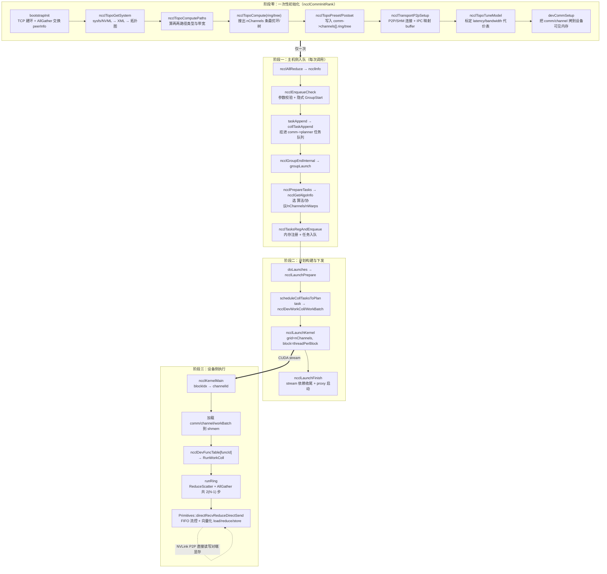
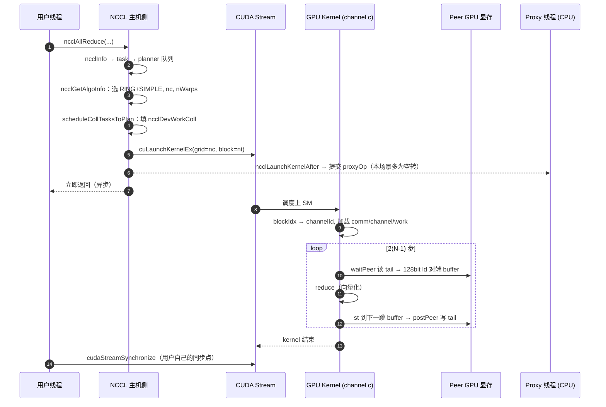

# 00 · 一次 `ncclAllReduce` 的完整生命周期（全链路主线）

> 本文是整个 `feature_docs` 的**脊椎**：只讲主线，每一跳都给出可跳转的源码位置。
> 各站点的细节展开在对应分章（文末有跳转表）。
>
> 场景固定为本仓库的实测配置：**单机 2×GPU（NVLink 直连）+ AllReduce + float + Sum**。

---

## 本文覆盖的源文件

| 文件 | 一句话职责 |
|---|---|
| [src/collectives.cc](../src/collectives.cc) | 公共 API 入口，把调用打包成 `ncclInfo` |
| [src/enqueue.cc](../src/enqueue.cc) | 任务→计划(plan)→kernel 参数，算法/协议/并行度决策，kernel 启动 |
| [src/group.cc](../src/group.cc) | group 语义、异步 job 调度、`doLaunches` 主循环 |
| [src/init.cc](../src/init.cc) | comm 从无到有：bootstrap→拓扑→建环→建连→tuning→devComm |
| [src/device/common.h](../src/device/common.h) | 设备侧 kernel 入口 `ncclKernelMain`，blockIdx→channelId 映射 |
| [src/device/all_reduce.h](../src/device/all_reduce.h) | AllReduce 设备算法：`runRing` / `runTree*` |
| [src/device/prims_simple.h](../src/device/prims_simple.h) | Simple 协议通信原语（真正搬字节的地方） |
| [src/transport/p2p.cc](../src/transport/p2p.cc) | NVLink P2P 连接与 IPC 显存映射 |
| [src/proxy.cc](../src/proxy.cc) | CPU 侧进度引擎（本场景多数路径不参与数据面） |

---

## 0. 一张图看全链路



---

## 1. 阶段零：`ncclCommInitRank` —— 通信域从无到有

这一段每个进程只跑一次，但**它决定了后面每一次 AllReduce 的上限**。
主流程集中在 [init.cc:L994 `initTransportsRank`](../src/init.cc#L994)，被 [init.cc:L1950](../src/init.cc#L1950) 调用。

| # | 干什么 | 源码位置 | 产物 |
|---|---|---|---|
| 1 | TCP 建环、交换 busId/IP/peerInfo | [init.cc:L1945 `bootstrapInit`](../src/init.cc#L1945) → [bootstrap.cc](../src/bootstrap.cc) | 每个 rank 知道所有 peer 的信息 |
| 2 | 探测硬件拓扑 | [init.cc:L1170 `ncclTopoGetSystem`](../src/init.cc#L1170) | `ncclTopoSystem`（GPU/PCI/NVS/CPU/NIC 节点图） |
| 3 | 算路径与带宽 | [init.cc:L1172 `ncclTopoComputePaths`](../src/init.cc#L1172) | 任意两节点的 `PATH_NVL/PIX/PHB/SYS` + 带宽 |
| 4 | 搜索 ring 图 | [init.cc:L1207 `ncclTopoCompute(ringGraph)`](../src/init.cc#L1207) | `nChannels` 条带宽最大的环 |
| 5 | 搜索 tree 图 | [init.cc:L1215 `ncclTopoCompute(treeGraph)`](../src/init.cc#L1215) | double binary tree |
| 6 | 图 → 每 rank 邻居 | [init.cc:L1310 `ncclTopoPreset`](../src/init.cc#L1310) / [init.cc:L1509 `ncclTopoPostset`](../src/init.cc#L1509) | `comm->channels[c].ring.prev/next`、`tree.up/down` |
| 7 | 建立传输连接 | [init.cc:L1660 `ncclTransportP2pSetup`](../src/init.cc#L1660) → [transport/p2p.cc](../src/transport/p2p.cc) | 对端 buffer 的 IPC 映射指针、`head/tail` 共享变量 |
| 8 | 标定性能模型 | [init.cc:L1673 `ncclTopoTuneModel`](../src/init.cc#L1673) → [graph/tuning.cc](../src/graph/tuning.cc) | `comm->latencies[][]`、`bandwidths[][]`、`maxThreads[][]` |
| 9 | 下发设备侧 comm | [init.cc:L1719 `devCommSetup`](../src/init.cc#L1719) | `ncclKernelCommAndChannels`（kernel 能直接读的结构） |

> **面试要点**：NCCL 把"贵"的事情（探测、搜索、建连、标定）全部前置到 init，
> 让运行期的 `ncclAllReduce` 只剩"查表 + 填参数 + launch"。这是它能做到微秒级
> 小消息延迟的前提。

细节展开 → [01-bootstrap-and-comm-init.md](./01-bootstrap-and-comm-init.md)、
[02-topology-detection.md](./02-topology-detection.md)、
[03-channel-ring-tree.md](./03-channel-ring-tree.md)、
[06-transport-p2p-shm.md](./06-transport-p2p-shm.md)。

---

## 2. 阶段一：API 调用 → 任务队列

### 2.1 API 只做打包

[collectives.cc:L176-L186](../src/collectives.cc#L176)：

```c
ncclResult_t ncclAllReduce(const void* sendbuff, void* recvbuff, size_t count,
                           ncclDataType_t datatype, ncclRedOp_t op,
                           ncclComm* comm, cudaStream_t stream) {
  NVTX3_FUNC_WITH_PARAMS(AllReduce, NcclNvtxParamsAllReduce, ...);
  struct ncclInfo info = {
    ncclFuncAllReduce, "AllReduce", sendbuff, recvbuff, count, datatype, op, 0,
    comm, stream, /* Args */ ALLREDUCE_CHUNKSTEPS, ALLREDUCE_SLICESTEPS
  };
  return ncclEnqueueCheck(&info);
}
```

注意最后两个参数 `ALLREDUCE_CHUNKSTEPS / ALLREDUCE_SLICESTEPS`：**算子的流水线粒度在
API 层就定死了**，它决定了后面 chunk 与 slice 的换算关系（见
[09-primitives-simple.md](./09-primitives-simple.md)）。

### 2.2 入队：隐式 group + 任务挂载

[enqueue.cc:L3209 `ncclEnqueueCheck`](../src/enqueue.cc#L3209) 的骨架很干净：

```c
ncclResult_t ncclEnqueueCheck(struct ncclInfo* info) {
  ret = CommCheck(info->comm, info->opName, "comm");   // comm 合法性
  ...
  NCCLCHECK(ncclGroupStartInternal());                 // ★ 隐式开 group
  NCCLCHECKGOTO(ncclCommEnsureReady(info->comm), ret, fail);
  NCCLCHECKGOTO(ArgsCheck(info), ret, fail);           // 参数校验
  NCCLCHECKGOTO(taskAppend(info->comm, info), ret, fail); // ★ 只入队，不执行
exit:
  ...
  NCCLCHECK(ncclGroupEndInternal());  // ★ 深度回到 1 时才真正 launch
  ...
}
```

三个关键设计：

1. **任何单独的 collective 调用都被包在一个隐式 group 里**。用户显式
   `ncclGroupStart/End` 时深度 >1，`ncclGroupEndInternal` 不触发 launch，
   于是多个 collective 能合并成**同一个 plan、同一次 kernel launch**。
2. `taskAppend` 只把请求变成 task 挂到 `comm->planner` 队列
   （[enqueue.cc:L3094](../src/enqueue.cc#L3094)，AllReduce 走
   [L3195 `collTaskAppend`](../src/enqueue.cc#L3195)）。
3. **`nRanks == 1` 是特殊快路径**：直接退化成一次
   [`ncclLaunchOneRank`](../src/enqueue.cc#L3120)（等价 device-to-device memcpy），
   不走任何通信逻辑。

### 2.3 决策：算法 / 协议 / channel 数 / 线程数

`ncclGroupEndInternal`（[group.cc:L773](../src/group.cc#L773)）→
`groupLaunch`（[group.cc:L605](../src/group.cc#L605)）→
`ncclPrepareTasksAndCollPreconnect`（[group.cc:L560](../src/group.cc#L560)）→
[`ncclPrepareTasks`](../src/enqueue.cc#L388) → [`ncclGetAlgoInfo`](../src/enqueue.cc#L2195)。

核心是一张 `[算法][协议]` 的**代价表**，取最小值：

[enqueue.cc:L2079-L2097](../src/enqueue.cc#L2079)

```c
  float minTime = FLT_MAX;
  int algorithm = info->algorithm = NCCL_ALGO_UNDEF;
  int protocol = info->protocol = NCCL_PROTO_UNDEF;
  for (int a = 0; a < NCCL_NUM_ALGORITHMS; a++) {
    for (int p = 0; p < NCCL_NUM_PROTOCOLS; p++) {
      if (table[a][p] == NCCL_ALGO_PROTO_IGNORE) continue;   // 被 NCCL_ALGO/PROTO 屏蔽
      if (table[a][p] >= 0.0 && table[a][p] < minTime) {     // 负值=不可用
        algorithm = a; protocol = p; minTime = table[a][p];
      }
    }
  }
  info->algorithm = algorithm;
  info->protocol = protocol;
```

选完算法后再定**并行度**，这是"打满带宽"与"低延迟"之间的核心权衡点
（[enqueue.cc:L2120-L2181](../src/enqueue.cc#L2120)）：

```c
  int nc = comm->nChannels;                              // 先给满
  int nt = comm->maxThreads[info->algorithm][info->protocol];
  int threadThreshold = comm->threadThresholds[info->algorithm][info->protocol];
  ...
  } else {
    // Ring/Tree：数据量喂不饱就逐个减 channel，至少留 1 个
    while (nBytes < nc * nt * threadThreshold) { if (nc >= 2) nc--; else break; }
  }
  ...
  while (nBytes < nc * nt * threadThreshold) {            // channel 减到头再折半减线程
    if (nt % 128 == 0) nt /= 2; else break;               // 保持 128 的倍数 = warp 对齐
  }
  if (info->protocol == NCCL_PROTO_SIMPLE) {
    if (info->algorithm == NCCL_ALGO_RING) nt += WARP_SIZE;      // ★ 多加 1 个同步 warp
    if (info->algorithm == NCCL_ALGO_TREE) nt += 4 * WARP_SIZE;  // ★ Tree 分组同步
  }
  nt = nt / WARP_SIZE < 3 ? 3 * WARP_SIZE : nt;           // 兜底至少 3 warp
  info->nMaxChannels = nc;
  info->nWarps = nt / WARP_SIZE;
```

判据 `nBytes < nc * nt * threadThreshold` 读法：右边是"要喂饱当前并行度所需的最小字节数"。
喂不饱就**降并行度**，因为此时启动/同步开销会盖过传输收益。

`nt += WARP_SIZE` 是 NCCL 的标志性设计：**Simple 协议下额外加一个 warp 专职做
FIFO 的 head/tail 同步**，其余 warp 全力搬数据 —— 详见
[09-primitives-simple.md](./09-primitives-simple.md)。

细节展开 → [04-algo-protocol-tuning.md](./04-algo-protocol-tuning.md)、
[05-enqueue-plan-launch.md](./05-enqueue-plan-launch.md)。

---

## 3. 阶段二：plan 构建与 kernel 下发

`groupLaunch` 末尾调用 [`doLaunches`](../src/group.cc#L317)，它是**多 comm/多 plan 的
launch 主循环**：

[group.cc:L345-L386](../src/group.cc#L345)

```c
    while (true) {
      bool moreRounds = false;
      comm = cliqueHead;
      do {
        ...
        moreRounds |= comm->planner.unlaunchedPlansHead != nullptr;
        if (moreRounds) {
          struct ncclKernelPlan* plan = comm->planner.unlaunchedPlansHead;
          if (plan != nullptr) {
            comm->planner.unlaunchedPlansHead = plan->next;
            CUDACHECKGOTO(cudaSetDevice(comm->cudaDev), result, failure);
            NCCLCHECKGOTO(ncclLaunchKernelBefore_NoUncapturedCuda(comm, plan), ...);
            ...
            NCCLCHECKGOTO(ncclLaunchKernel(comm, plan), result, failure);
          }
          ...
        } else {
          NCCLCHECKGOTO(ncclLaunchFinish(comm), result, failure);   // 最后一轮收尾
        }
        comm = next;
      } while (comm != cliqueNextHead);
      if (!moreRounds) break;
    }
```

要点：

- **clique 概念**：同一进程内共享 `intraComm0` 的 comm 归为一组，按组推进，
  避免多 comm 之间死锁。
- **一个 group 可能产生多个 plan**（任务太多装不进一次 kernel 参数），
  用 `unlaunchedPlansHead` 链表轮询下发。
- **capture 一致性检查**：同一 group 内的 comm 必须全部 capture 或全部不 capture
  （[group.cc:L337-L343](../src/group.cc#L337)），否则 comm 直接被判为不可用。

真正的 launch 在 [enqueue.cc:L1784 `ncclLaunchKernel`](../src/enqueue.cc#L1784)：

```c
ncclResult_t ncclLaunchKernel(struct ncclComm* comm, struct ncclKernelPlan* plan) {
  int nChannels = countOneBits(plan->channelMask);
  void* sym = plan->kernelFn;
  dim3 grid  = {(unsigned)nChannels, 1, 1};          // ★ 1 个 channel = 1 个 block
  dim3 block = {(unsigned)plan->threadPerBlock, 1, 1};
  int smem = plan->isSymColl ? plan->kernelDynSmem : ncclShmemDynamicSize(comm->cudaArch);
  cudaStream_t launchStream = planner->streams->stream;
  void* extra[] = {CU_LAUNCH_PARAM_BUFFER_POINTER, plan->kernelArgs,
                   CU_LAUNCH_PARAM_BUFFER_SIZE, &plan->kernelArgsSize, CU_LAUNCH_PARAM_END};
  ...
  CUCHECKGOTO(cuLaunchKernelEx(&launchConfig, fn, nullptr, extra), ret, do_return);
}
```

这里有三条值得背下来的结论：

1. **`gridDim.x == nChannels`**。channel 不是抽象概念，它**一对一映射到一个 CUDA
   block**。"加 channel 打满带宽"本质上就是"加 block，让更多 SM 同时对 NVLink
   发起 load/store"。
2. **kernel 参数走 `CU_LAUNCH_PARAM_BUFFER_POINTER`**，plan 把 work 描述直接内联进
   参数缓冲（最大 4KB，见 `ncclDevKernelArgs4K`），小规模任务连一次 device 内存
   读都省了。
3. **sm90+ 启用 Thread Block Cluster**（[L1808-L1830](../src/enqueue.cc#L1808)）：
   `cgaClusterSize` 让若干 block 保证并发调度在相邻 SM 上，
   配合 `CU_CLUSTER_SCHEDULING_POLICY_SPREAD` 把 block 摊开到更多 SM，
   避免多个 channel 挤在同一 GPC 里争抢带宽。

launch 之后还有两步：
[`ncclLaunchKernelAfter_NoCuda`](../src/enqueue.cc#L1884)（提交 proxy 操作与回收任务）
和 [`ncclLaunchFinish`](../src/enqueue.cc#L1907)（stream 依赖收尾）。

细节展开 → [05-enqueue-plan-launch.md](./05-enqueue-plan-launch.md)、
[07-proxy-progress-engine.md](./07-proxy-progress-engine.md)。

---

## 4. 阶段三：设备侧 —— 从 block 到字节

### 4.1 kernel 入口：blockIdx → channelId

[device/common.h:L364-L423](../src/device/common.h#L364)

```c
template <int SpecializedFnId, typename SpecializedRunWorkBatch>
__device__ __forceinline__ void ncclKernelMain(struct ncclDevKernelArgs const* args) {
  int tid = threadIdx.x, tn = blockDim.x;
  // 把 kernel args 搬进 shmem，避免编译器把它放到线程本地栈
  if (tid < sizeof(ncclDevKernelArgs)/sizeof(uint32_t))
    ((uint32_t*)&ncclShmem.args)[tid] = ((uint32_t*)args)[tid];

  // blockIdx.x -> channelMask 中第 blockIdx.x 个置位的位号
  if (tid < MAXCHANNELS && (args->channelMask & (1ull << tid))) {
    int n = __popcll(args->channelMask & ((1ull << tid) - 1));
    if (blockIdx.x == n) ncclShmem.channelId = tid;
  }
  __syncthreads();
  ...
  switch (tid / WARP_SIZE) {          // ★ 按 warp 分工做加载
  case 0: copyToShmem16(tid, &ncclShmem.comm, ncclShmem.args.comm, sizeof(ncclKernelComm)); break;
  case 1: copyToShmem16(tid-WARP_SIZE, &ncclShmem.channel, &(...)->channels[ncclShmem.channelId],
                        sizeof(ncclDevChannel)); break;
  default: loadWorkBatchToShmem(tid-2*WARP_SIZE, tn-2*WARP_SIZE, args, /*batchIx=*/blockIdx.x); break;
  }
  __syncthreads();

  while (ncclShmem.aborted == 0) {
    if (0 <= SpecializedFnId && ncclShmem.funcId == (unsigned)SpecializedFnId)
      SpecializedRunWorkBatch().run();      // 编译期特化，零间接跳转
    else
      ncclDevFuncTable[ncclShmem.funcId](); // 通用路径，查函数表
    if (ncclShmem.nextBatchIx == -1) break;
    ...
  }
}
```

四个可直接拿去回答面试的细节：

| 细节 | 为什么这么写 |
|---|---|
| `channelMask` 用位图 + `__popcll` 反查 | plan 可能只用部分 channel（非连续），需要把稠密的 `blockIdx` 映射回稀疏的 `channelId`。PTX 的 `fns` 指令很慢，这里用"所有线程查同一个 bitmask"的性质并行化掉了 |
| args 先拷进 shmem 再读 | 否则编译器会把 4KB 参数落到 local memory（实际在显存），每次访问都是一次全局访存 |
| warp0 load comm / warp1 load channel / 其余 load workBatch | **三路并行加载**，把 kernel 启动后的"冷启动"开销压到一次 `__syncthreads` 内 |
| `SpecializedFnId` 编译期分支 | 命中特化时完全没有函数指针间接调用，寄存器分配与常量传播都能做到最优 |

### 4.2 分派到 AllReduce Ring/Simple

模板特化表在 [all_reduce.h:L348-L356](../src/device/all_reduce.h#L348)：

```c
template <typename T, typename RedOp>
struct RunWorkColl<ncclFuncAllReduce, T, RedOp, NCCL_ALGO_RING, NCCL_PROTO_SIMPLE> {
  __device__ __forceinline__ void run(int tid, int nthreads, struct ncclDevWorkColl* work) {
    using Proto = ProtoSimple<ALLREDUCE_CHUNKSTEPS/ALLREDUCE_SLICESTEPS, ALLREDUCE_SLICESTEPS>;
    runRing<T, RedOp, Proto>(tid, nthreads, work);
  }
};
```

`(func, algo, proto, redop, dtype)` 的每一种组合都在编译期被实例化成一个独立
kernel（生成器见 [device/generate.py](../src/device/generate.py)），
运行期只用 `funcId` 索引 `ncclDevFuncTable`。**用代码体积换零运行期分支**。

把常量代进去看具体数值（[collectives.h:L27-L28](../src/include/collectives.h#L27)、
[device.h:L36](../src/include/device.h#L36)）：

| 常量 | 值 | 含义 |
|---|---|---|
| `NCCL_STEPS` | `8` | 每个 channel 的环形 FIFO 有 8 个 slot（流水线深度） |
| `ALLREDUCE_SLICESTEPS` | `NCCL_STEPS/4 = 2` | 1 个 slice 占 2 个 step |
| `ALLREDUCE_CHUNKSTEPS` | `NCCL_STEPS/2 = 4` | 1 个 chunk 占 4 个 step |
| ⇒ `ProtoSimple<2, 2>` | `SlicePerChunk=4/2=2`, `StepPerSlice=2` | 1 个 chunk 切成 2 个 slice 做流水重叠 |
| `NCCL_MAX_NTHREADS` | `640` | 每 block 线程上限（[device.h:L103](../src/include/device.h#L103)） |
| `NCCL_SIMPLE_MAX_NTHREADS` | `512` | Simple 协议每 block 线程上限（[device.h:L105](../src/include/device.h#L105)） |

`SlicePerChunk=2` 就是"边收边发"能重叠起来的原因：chunk 内的第 2 个 slice 在收的时候，
第 1 个 slice 已经在往下一跳发了。

> ⚠️ 注意 TREE/SIMPLE 的正常路径实际调用的是 `runTreeSplit`（线程分组并行版），
> `runTreeUpDown` 只在 CUDA 11.2~11.3 + sm_80 上作为编译器 bug 的规避分支
> （[all_reduce.h:L359-L370](../src/device/all_reduce.h#L359)）。

### 4.3 Ring AllReduce 的 2(N-1) 步

[all_reduce.h:L36-L145 `runRing`](../src/device/all_reduce.h#L36)。数据流骨架：

```c
  ncclCollCbdPart(work, ncclShmem.channelId, Proto::Id, sizeof(T),
                  nullptr, &gridOffset, &channelCount, &chunkCount);   // 按 channel 切数据
  const ssize_t loopCount = nranks * chunkCount;
  Primitives<T, RedOp, FanSymmetric<1>, /*Direct=*/1, Proto, 0>
    prims(tid, nthreads, &ring->prev, &ring->next, work->sendbuff, work->recvbuff, ...);

  for (ssize_t elemOffset = 0; elemOffset < channelCount; elemOffset += loopCount) {
    if (remCount < loopCount) chunkCount = alignUp(divUp(remCount, nranks), 16/sizeof(T)); // ★16B 对齐

    chunk = modRanks(ringIx + nranks - 1);
    prims.directSend(offset, offset, nelem);                       // 步 0：注水，只发

    for (int j = 2; j < nranks; ++j)                               // 步 1..N-2：收+加+转发
      prims.directRecvReduceDirectSend(offset, offset, nelem);

    chunk = ringIx;
    prims.directRecvReduceCopyDirectSend(offset, offset, nelem, /*postOp=*/true); // 步 N-1：收官+落地+开启 AllGather

    for (int j = 1; j < nranks - 1; ++j)                           // AllGather：收+落地+转发
      prims.directRecvCopyDirectSend(offset, offset, nelem);

    prims.directRecv(offset, nelem);                               // 最后一步：只收不发
  }
```

四个高频考点：

1. **为什么是 `2(N-1)` 步而不是 `2N`**：最后一步用 `directRecv` 只收不发，
   因为该 chunk 的下一站正是它的"归属 rank"，那里早就有结果，再转发是纯浪费带宽
   （[L135-L143 注释](../src/device/all_reduce.h#L135)）。
2. **每 rank 收发总量 = `2(N-1)/N × S`**，与 N 几乎无关 → 这就是
   `busbw = algbw × 2(N-1)/N` 公式的来源，也是 Ring 逼近理论下界的原因。
3. **`chunkCount` 的 `alignUp(..., 16/sizeof(T))`**：尾部数据不足一轮时缩小 chunk，
   但必须保持 **16 字节对齐**，否则设备侧的 128-bit 向量化 load/store 会退化
   （见 [11-reduce-and-vectorization.md](./11-reduce-and-vectorization.md)）。
4. **`postOp=true` 只在第 N-1 步出现**：像 `Avg` 这种需要"除以 N"的后处理，
   必须在累加完全部 rank 之后、且只执行一次。

### 4.4 最后一层：Primitives 真正搬字节

`prims.directRecvReduceDirectSend` 展开到
[prims_simple.h](../src/device/prims_simple.h) 的 `genericOp<...>` 模板：
等待对端 FIFO 可用（`waitPeer`）→ 128-bit 向量化读入 → 归约 → 写出 → 更新
`head/tail`（`postPeer`）。这里才是 NVLink 上真正发生 load/store 的地方，
**没有任何 CPU 参与，也没有 memcpy**。

细节展开 → [08-device-kernel-allreduce.md](./08-device-kernel-allreduce.md)、
[09-primitives-simple.md](./09-primitives-simple.md)、
[10-primitives-ll-ll128.md](./10-primitives-ll-ll128.md)、
[11-reduce-and-vectorization.md](./11-reduce-and-vectorization.md)。

---

## 5. 主机侧 / 设备侧的职责边界（最容易被追问的地方）



关键结论：

- **`ncclAllReduce` 是异步的**，它只做"填参数 + launch"，返回时数据一个字节都没动。
- **单机 NVLink 场景下，数据面完全在 GPU 内闭环**：GPU SM 直接 load/store 对端显存，
  同步靠共享的 `head/tail` 计数器。Proxy 线程主要服务网络/异步传输路径，
  在本仓库多数路径上不参与数据搬运 —— 这是"少一次 CPU-GPU 往返"的延迟优势来源。
- **正确性靠两层**：kernel 内的 `barrier()` + FIFO 的 `head/tail` 单调递增计数器
  （不是环形指针比较，避免 ABA），跨设备可见性靠 `volatile` 访存与
  `__threadfence_system`。

---

## 6. 把主线映射到分章

| 阶段 | 分章 |
|---|---|
| 建联、comm 初始化 | [01-bootstrap-and-comm-init.md](./01-bootstrap-and-comm-init.md) |
| 拓扑探测与路径带宽 | [02-topology-detection.md](./02-topology-detection.md) |
| channel / ring / tree 构建 | [03-channel-ring-tree.md](./03-channel-ring-tree.md) |
| 算法/协议选择与代价模型 | [04-algo-protocol-tuning.md](./04-algo-protocol-tuning.md) |
| 入队、plan、kernel 下发 | [05-enqueue-plan-launch.md](./05-enqueue-plan-launch.md) |
| 传输层与 P2P/IPC | [06-transport-p2p-shm.md](./06-transport-p2p-shm.md) |
| Proxy 进度引擎 | [07-proxy-progress-engine.md](./07-proxy-progress-engine.md) |
| 设备侧 AllReduce kernel | [08-device-kernel-allreduce.md](./08-device-kernel-allreduce.md) |
| Simple 协议原语 | [09-primitives-simple.md](./09-primitives-simple.md) |
| LL / LL128 协议 | [10-primitives-ll-ll128.md](./10-primitives-ll-ll128.md) |
| 归约与向量化访存 | [11-reduce-and-vectorization.md](./11-reduce-and-vectorization.md) |
| 内存管理与 buffer 注册 | [12-memory-and-registration.md](./12-memory-and-registration.md) |
| 专题：怎么打满带宽 | [13-bandwidth-saturation.md](./13-bandwidth-saturation.md) |
| 专题：小消息延迟优化 | [14-latency-optimization.md](./14-latency-optimization.md) |
| 面试速查 | [99-interview-qa.md](./99-interview-qa.md) |

---

## 7. 亲手验证这条链路

```bash
cd /home/leo/mini-nccl
make -j$(nproc) lib CUDA_HOME=/usr/local/cuda \
     NVCC_GENCODE="-gencode=arch=compute_90,code=sm_90"
make -C tests

# 看建联 / 拓扑 / 算法选择的每一步决策
NCCL_DEBUG=INFO NCCL_DEBUG_SUBSYS=INIT,GRAPH,COLL,TUNING \
  LD_LIBRARY_PATH=build/lib ./tests/build/all_reduce_perf -b 64M -e 64M -g 2

# 强制换算法/协议，观察 busbw 变化，反推各杠杆的贡献
NCCL_ALGO=Ring  NCCL_PROTO=Simple LD_LIBRARY_PATH=build/lib ./tests/build/all_reduce_perf -b 8 -e 128M -f 2 -g 2
NCCL_ALGO=Tree  NCCL_PROTO=LL     LD_LIBRARY_PATH=build/lib ./tests/build/all_reduce_perf -b 8 -e 128M -f 2 -g 2
NCCL_MIN_NCHANNELS=1 NCCL_MAX_NCHANNELS=1 LD_LIBRARY_PATH=build/lib ./tests/build/all_reduce_perf -b 128M -e 128M -g 2
```

最后一条命令把 channel 压到 1，是理解"为什么需要多 channel 才能打满带宽"最直观的实验
（预期 busbw 大幅下降）—— 详见 [13-bandwidth-saturation.md](./13-bandwidth-saturation.md)。

---

**下一篇** → [01-bootstrap-and-comm-init.md](./01-bootstrap-and-comm-init.md)
