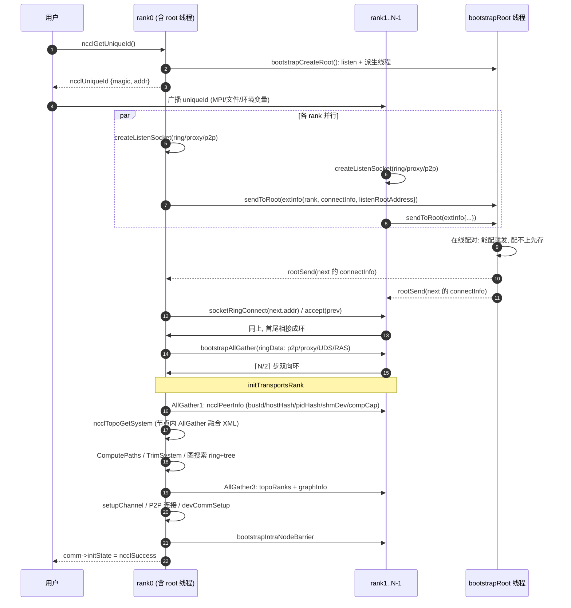
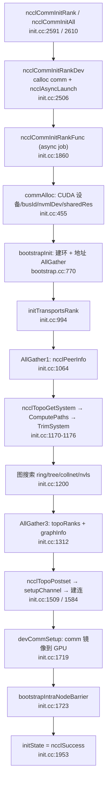

# 01 建联与 Comm 初始化（bootstrap + ncclCommInitRank）

> 本文覆盖 `ncclGetUniqueId` → `ncclCommInitRank/All` → `bootstrapInit` → `initTransportsRank` 的完整控制面链路。
> 所有行号均基于本仓库当前源码逐行核对。

## 本文覆盖的源文件

| 文件 | 一句话职责 | 链接 |
|---|---|---|
| `src/init.cc` | comm 初始化主流程：异步 job、commAlloc、三次 AllGather、拓扑接入、连接建立 | [init.cc](../src/init.cc) |
| `src/bootstrap.cc` | 控制面核心：uniqueId、root 线程、建环、AllGather/Barrier/广播 | [bootstrap.cc](../src/bootstrap.cc) |
| `src/include/bootstrap.h` | `ncclBootstrapHandle` 与各 bootstrap 接口声明 | [bootstrap.h](../src/include/bootstrap.h) |
| `src/misc/socket.cc` | TCP socket 抽象：listen/connect/accept、握手 magic 校验、收发与重试 | [socket.cc](../src/misc/socket.cc) |
| `src/include/socket.h` | `ncclSocket` 结构、socket 状态机、地址与类型枚举 | [socket.h](../src/include/socket.h) |
| `src/include/comm.h` | `ncclComm` 定义（rank/nRanks/peerInfo/topo/bootstrap/magic 等） | [comm.h](../src/include/comm.h) |
| `src/include/transport.h` | `ncclPeerInfo`（AllGather1 交换的对端描述） | [transport.h](../src/include/transport.h) |
| `src/include/info.h` | `ncclInfo`：一次集合通信调用的描述（建联阶段不直接使用，仅作上下文） | [info.h](../src/include/info.h) |
| `src/os/linux.cc` | connect 重试/退避的 OS 实现（`errorRetries` 与 `NCCL_SOCKET_RETRY_CNT`） | [linux.cc](../src/os/linux.cc) |

---

## 主题一：uniqueId 与 bootstrapRoot —— 素不相识的进程如何汇聚到同一点

### ① 解决什么问题

一次 AllReduce 往往由 `N` 个进程（本仓库单机场景下是 1 进程 × N 张卡，也可能 N 进程 × 1 卡）共同发起。发起之前它们**彼此不知道对方是谁、在哪台机器、哪个端口**。如果什么都不做：

- 没人监听，谁来都连不上；
- 即便都监听，也没人知道该连谁；
- 多机场景下还可能是两个不相关的训练任务同时在跑，必须防止互相串连。

这就是"带外（Out-Of-Band, OOB）汇聚点"问题。NCCL 的做法是：**由用户侧先产生一个 `ncclUniqueId`，通过 MPI/文件/环境变量等任意方式广播给所有进程**，所有人靠它找到同一个 root。

### ② 一句话本质

`ncclUniqueId` 就是"**一个随机 magic + 一个 root 监听地址**"；拿到它的进程都能拨号到同一个 root，root 负责把所有报到者串成一个环。

### ③ 代码链路

1. `ncclGetUniqueId` —— [init.cc:L197-L210](../src/init.cc#L197)
2. `bootstrapGetUniqueId` —— [bootstrap.cc:L526-L556](../src/bootstrap.cc#L526)
3. `bootstrapCreateRoot` —— [bootstrap.cc:L501-L524](../src/bootstrap.cc#L501)（`ncclSocketListen` + 派生 `bootstrapRoot` 线程）
4. `bootstrapRoot` 线程主循环 —— [bootstrap.cc:L374-L499](../src/bootstrap.cc#L374)
5. `rootSend` 回信给某个 rank —— [bootstrap.cc:L339-L351](../src/bootstrap.cc#L339)
6. rank 侧拨号：`sendToRoot` —— [bootstrap.cc:L752-L763](../src/bootstrap.cc#L752)
7. `ncclCommInitRankDev` 里若设了 `NCCL_COMM_ID` 则提前起 root —— [init.cc:L2562-L2571](../src/init.cc#L2562)

### ④ 关键代码逐行解读

[bootstrap.cc:L441-L465](../src/bootstrap.cc#L441)

```c
    /* --- 配对方向①：把"我的连接信息"交给我的前驱，让前驱能连上我 --- */
    // 计算前驱的局部编号：
    //   - 单 根 时环是闭合的，localId=0 的前驱要绕回最后一个，因此用周期化取模；
    //   - 多 根 时 localId=0 的前驱属于上一个 根 管辖，不归我管，所以直接减 1
    //     得到 -1，随后被 prev >= 0 的条件过滤掉。
    int prev = (nroots > 1) ? (localId - 1) : BOOTSTRAP_PID(localId - 1, nrecv);
    // 条件：前驱合法(在我管辖范围内)且它已经报到并在等待回信 -> 立即把我的信息发给它
    if (prev >= 0 && prev < n2send &&
        memcmp(&zeroAddress, &rankAddressesRoot[prev], sizeof(union ncclSocketAddress)) != 0) {
      NCCLCHECKGOTO(rootSend(&rankAddressesRoot[prev], magic, &info.connectInfo), res, out);
    } else {
      // 前驱还没来报到 -> 先把我的连接信息存起来，等前驱来了再发给它
      memcpy(&rankInfo[localId], &info.connectInfo, sizeof(union ringConnectInfo));
    }

    /* --- 配对方向②：把"我的后继的连接信息"发给我，让我能连上后继 --- */
    // 后继一定用周期化取模：因为多收的那 1 个信息正好补上跨 根 的环闭合点。
    int next = BOOTSTRAP_PID(localId + 1, nrecv);
    // 条件：我在本 根 管辖范围内 [0, n2send)，且后继的信息已经存在表里 -> 立即回信给我
    if (localId >= 0 && localId < n2send && memcmp(&zeroInfo, &rankInfo[next], sizeof(union ringConnectInfo)) != 0) {
      NCCLCHECKGOTO(rootSend(&info.listenRootAddress, magic, &rankInfo[next]), res, out);
    } else {
      // 后继还没报到 -> 把我的等待地址记下来，等后继报到时再由方向①触发发送
      memcpy(rankAddressesRoot + localId, &info.listenRootAddress, sizeof(union ncclSocketAddress));
    }
```

逐段解释：

- **为什么是"在线配对"而不是"收齐再发"**：各 rank 的到达顺序完全随机。若等收齐 `nranks` 份再统一分发，root 的关键路径 = 最慢那个 rank 的到达时间 + N 次回信；而"能配就立刻配"让大部分回信与后续 accept 重叠，把 root 的墙钟时间从 `O(N) 串行` 压到接近 `O(1) 摊还`。
- **两张表**：`rankInfo[localId]` 存"别人怎么连我"，`rankAddressesRoot[localId]` 存"我在哪等回信"。**全零 == 该槽位还没报到**（[bootstrap.cc:L386-L392](../src/bootstrap.cc#L386)），用 `memcmp` 与零值比较做"是否已填充"判断，省掉一个 bool 数组。
- **方向①和方向②互为触发**：A 报到时若它的后继 B 已报到，则立刻拿到 B 的地址回信（方向②命中）；否则登记自己的等待地址，等 B 报到时由 B 的方向①补发。任意顺序下都能配平，这是一个**无锁、单线程、事件驱动**的串环算法。
- **`prev` 的不对称处理是刻意的多根设计**：单根时环必须闭合（0 的前驱是 N-1，用 `BOOTSTRAP_PID` 取模）；多根时本 root 只负责自己那一段，0 号的前驱在**上一个 root** 手里，所以算出 -1 被过滤。为了让跨 root 的那一环也能闭合，root 会**多收 1 份**报到（`nrecv = n2send + 1`，[bootstrap.cc:L419](../src/bootstrap.cc#L419)）。
- **短连接**：`rootSend` 每次都 `ncclSocketInit → Connect → Send → Close`（[bootstrap.cc:L339-L351](../src/bootstrap.cc#L339)）。root 不需要长期持有 N 个 fd，避免 fd 耗尽（配合 `ncclOsSetFilesLimit()`，[bootstrap.cc:L393](../src/bootstrap.cc#L393)）。

### ⑤ 收益

- **root 交互次数 O(N) 而非 O(N²)**：全连接需要每对 rank 交换地址 = N(N-1)/2 次握手；串环只需 N 次报到 + 至多 2N 次回信。N=1024 时从 ~52 万次降到 ~3 千次，量级差异。
- **不阻塞**：root 是 `detach` 的独立线程（[bootstrap.cc:L515-L517](../src/bootstrap.cc#L515)），rank 侧可乱序并发报到。
- **大规模抗连接风暴**：`NCCL_UID_STAGGER_THRESHOLD=256` / `NCCL_UID_STAGGER_RATE=7000`（[bootstrap.cc:L765-L766](../src/bootstrap.cc#L765)）——当单个 root 名下 rank 数 > 256 时，按 `localId / (7000/1e6)` 微秒错开连接，即每个 rank 约延迟 143 µs × localId，把瞬时连接速率限制在 ~7000 条/秒。
- **防串扰**：每条 TCP 连接都要过 magic 握手校验（[socket.cc:L366-L373](../src/misc/socket.cc#L366)），magic 不匹配直接 `ncclOsSocketResetAccept` 丢弃，不会误连到别的通信域。

### ⑥ 面试考点

**Q1：`ncclUniqueId` 里到底装了什么？**
A：`struct ncclBootstrapHandle { uint64_t magic; union ncclSocketAddress addr; int nRanks; }`（[bootstrap.h:L22-L28](../src/include/bootstrap.h#L22)），`memcpy` 进 `ncclUniqueId`（[init.cc:L205-L207](../src/init.cc#L205)）。本质 = 随机校验码 + root 的 (IP, port) + 已有 rank 数（扩容用）。它**不是安全密钥**，只用于检测不匹配。

**Q2：rank 0 一定要是 root 吗？root 挂了怎么办？**
A：root 是"**创建 uniqueId 的那个进程**"，通常是 rank 0，但 `NCCL_COMM_ID=<ip>:<port>` 可以指定外部地址（[bootstrap.cc:L529-L542](../src/bootstrap.cc#L529)）。root 只是建环期的临时交换机，环建好后它就退出（[bootstrap.cc:L488-L498](../src/bootstrap.cc#L488)），后续 AllGather 走环、不再经过 root，所以 root 线程本身不是长期单点。

**Q3：为什么不直接全连接？**
A：全连接是 O(N²) 握手，N 上千时 root 和网卡都会被打爆；环是 O(N)，且环本身就是后续 AllGather 的现成拓扑。

**Q4：多 root 是怎么分的？**
A：把 `N = nRanks - offset` 个 rank 尽量均分给 `R` 个 root：前 `N%R` 个 root 各带 `N/R + 1` 个，其余各带 `N/R` 个（[bootstrap.cc:L96-L130](../src/bootstrap.cc#L96)）。每个 root 额外多收 1 份报到用于跨 root 闭合环。

---

## 主题二：bootstrapInit —— 从"报到"到"我该连谁"

### ① 解决什么问题

root 只解决了"大家找到组织"。每个 rank 还需要：

1. 告诉别人"怎么连我"（监听地址）；
2. 知道"我的环上后继是谁、怎么连它"；
3. 交换后续要用的一堆地址：P2P 监听地址、proxy 监听地址、proxy 的 UDS（Unix Domain Socket）标识、RAS 信息。

没有这些，后面的 `ncclTopoGetSystem`（需要节点内 AllGather 融合 XML）、`initTransportsRank`（需要 `peerInfo` 全收集）都无从谈起。

### ② 一句话本质

`bootstrapInit` = **"开三个监听 socket → 向 root 报到 → 收回后继地址 → 与前后邻居建环 → 沿环做一次 AllGather 把全体地址表同步到每张卡"**。

### ③ 代码链路

1. `bootstrapInit` 入口 —— [bootstrap.cc:L770](../src/bootstrap.cc#L770)
2. 建环监听 socket —— [bootstrap.cc:L820-L824](../src/bootstrap.cc#L820)（`createListenSocket`，[bootstrap.cc:L628-L634](../src/bootstrap.cc#L628)）
3. 建 root 回信监听 socket —— [bootstrap.cc:L841-L845](../src/bootstrap.cc#L841)
4. 错开连接（stagger） —— [bootstrap.cc:L849-L858](../src/bootstrap.cc#L849)
5. 向 root 报到 —— [bootstrap.cc:L866](../src/bootstrap.cc#L866) → `sendToRoot`（[bootstrap.cc:L752](../src/bootstrap.cc#L752)）
6. 收 root 回信拿到 `nextPeer` —— [bootstrap.cc:L886-L892](../src/bootstrap.cc#L886)
7. 与后继/前驱真正建环 —— [bootstrap.cc:L907-L908](../src/bootstrap.cc#L907)（`socketRingConnect`，[bootstrap.cc:L707-L715](../src/bootstrap.cc#L707)）
8. proxy 监听 socket + UDS 随机数 —— [bootstrap.cc:L913-L920](../src/bootstrap.cc#L913)
9. P2P 监听 socket —— [bootstrap.cc:L923-L928](../src/bootstrap.cc#L923)
10. `ringAllInfo` 沿环全收集 —— [bootstrap.cc:L950](../src/bootstrap.cc#L950) → [bootstrap.cc:L716-L750](../src/bootstrap.cc#L716)
11. `ncclProxyInit` 起 proxy 服务线程 —— [bootstrap.cc:L956](../src/bootstrap.cc#L956)

### ④ 关键代码逐行解读

[bootstrap.cc:L861-L892](../src/bootstrap.cc#L861)

```c
  BOOTSTRAP_PROF_OPEN(timers[BOOTSTRAP_INIT_TIME_SEND]);
  // 把联系方式发送给我所属的 根
  info.rank = rank;
  info.iroot = curr_root;
  info.offset = offset;
  if (curr_root >= 0) NCCLCHECK(sendToRoot(BOOTSTRAP_HANDLE(handles, curr_root), comm, &info));
  if (parent && comm->isGrow && rank != 0) {
    // Grow: ranks 1 to N-1 使用 the 父 bootstrap to 发送 连接 information to 上一个 rank
    NCCLCHECK(bootstrapSend(parent->bootstrap, rank - 1, 0, &info.connectInfo, sizeof(info.connectInfo)));
  }
  // 如有需要, 发送 连接 信息 to 上一个 根
  // commGrow with more than = 1 rank 在 ... 中 父 通信域 is a 特殊的 情形 of multiroot
  if (((comm->isGrow && parent && (parent->nRanks > 1)) || nHandles > 1) &&
      isFirstFromRoot(rank, curr_root, nranks, nHandles, offset)) {
    int prev_rank = BOOTSTRAP_PID(rank - 1, nranks);
    int prev_root = rootIdFromRank(prev_rank, nranks, nHandles, offset);
    info.rank = prev_rank + 1; // my rank as seen by the previous root
    info.iroot = prev_root;
    // 仅 发送 若 根 is 合法的, existing rank N-1 will 使用 the bootstrapSend 仅 上方
    if (prev_root >= 0) NCCLCHECK(sendToRoot(BOOTSTRAP_HANDLE(handles, prev_root), comm, &info));
  }
  BOOTSTRAP_PROF_CLOSE(timers[BOOTSTRAP_INIT_TIME_SEND]);

  // 获取 信息 on my "下一个" rank 在 ... 中 bootstrap 环 from 根
  BOOTSTRAP_PROF_OPEN(timers[BOOTSTRAP_INIT_TIME_RECV]);
  if (curr_root >= 0) {
    NCCLCHECK(ncclSocketInit(&sock));
    NCCLCHECK(ncclSocketAccept(&sock, &listenSockRoot));
    NCCLCHECK(socketRecv(&sock, &nextPeer, sizeof(nextPeer)));
    NCCLCHECK(ncclSocketClose(&sock));
    NCCLCHECK(ncclSocketClose(&listenSockRoot));
  }
```

逐段解释：

- **报到包 `extInfo`**（[bootstrap.cc:L325-L333](../src/bootstrap.cc#L325)）只有 7 个字段：`rank / nranks / iroot / nroots / offset / listenRootAddress / connectInfo`。**刻意做小**——报到是 N 个进程同时打向 root 的高并发路径，包越小 root 越快。
- **`info.connectInfo` 是 union**（[bootstrap.cc:L318-L321](../src/bootstrap.cc#L318)）：走普通 TCP 时是 `union ncclSocketAddress`；走 OOB 网络插件（`NCCL_OOB_NET_ENABLE=1`）时是 `char handle[NCCL_NET_HANDLE_MAXSIZE]` 的不透明句柄。**同一套算法支持两种底层**，这是 union 存在的原因。
- **多 root 的"补报"**：如果我是本 root 的第一个 rank，我还要给**上一个 root** 也报一份，且报的 `rank` 是 `prev_rank + 1`（在上一个 root 眼里我是"它的下一个"）。这样上一个 root 才知道它的最后一名该连谁，环才跨 root 闭合。
- **收信即关**：`ncclSocketAccept → socketRecv → ncclSocketClose`（[bootstrap.cc:L887-L891](../src/bootstrap.cc#L887)），root 回信的 socket 用完立即关闭，`listenSockRoot` 也一并关掉，不长期占 fd。
- **整个流程被 7 个 timer 分段打点**（`create/send/recv/ring/total/delay`，[bootstrap.cc:L55-L61](../src/bootstrap.cc#L55)），`NCCL_DEBUG=INFO` 下会打印 `Bootstrap timings total ... (create ..., send ..., recv ..., ring ..., delay ...)`，这是定位建联慢的第一手数据。

### ⑤ 收益

- **每个 rank 只需 2 次与 root 的往返**（报到 + 收信），建环总握手数 ≈ 3N。
- **fd 占用恒定**：每个 rank 常驻 3 个监听 fd（ring / proxy / P2P）+ 2 个环连接 fd，与 N 无关。
- **一次 AllGather 拿到全部地址表**：`ringAllInfo`（[bootstrap.cc:L716-L750](../src/bootstrap.cc#L716)）把 4 类数据（P2P 地址、proxy 地址、proxy UDS、RAS 信息）**打包成一个结构体数组**做一次 AllGather，而不是做 4 次；N=8 时从 4×7 步降到 7 步（双向后 4 步）。
- **UDS 随机数**（`getPidHash() + randId`，[bootstrap.cc:L635-L640](../src/bootstrap.cc#L635)）保证同机多通信域的 proxy socket 路径不冲突。

### ⑥ 面试考点

**Q1：bootstrap 阶段每个 rank 开了几个监听 socket，分别干什么？**
A：3 个。①ring 监听（给环上前驱连我）；②proxy 监听（`ncclSocketTypeProxy`，给 proxy 线程用）；③P2P 监听（给后续任意点对点控制消息用，`bootstrapSend/Recv` 走它）。另外还有一个**临时的** root 回信监听 socket，用完即关。

**Q2：`bootstrapSend(rank-1)` 和 `sendToRoot` 有什么区别？**
A：`sendToRoot` 是**向 root 拨号**（地址来自 uniqueId）；`bootstrapSend` 是**向另一个 rank 拨号**（地址来自 AllGather 得到的 `peerP2pAddresses`），每次都新建短连接（[bootstrap.cc:L1095-L1107](../src/bootstrap.cc#L1095)）。前者只在建环期用，后者贯穿整个初始化。

**Q3：为什么 P2P 收发需要 "unexpected connection" 队列？**
A：`bootstrapRecv(peer, tag)` 时可能**还不知道谁会发来**（`peer < 0` 表示通配）。所以 `socketAccept` 先 Accept 一个连接、读出 `{rank, tag}` 的 ack（[bootstrap.cc:L1176-L1183](../src/bootstrap.cc#L1176)），不匹配就挂进 `unexpectedConnections` 链表留给后续 `bootstrapRecv` 消费（[bootstrap.cc:L1109-L1149](../src/bootstrap.cc#L1109)）。这是典型的"乱序到达 + 按需匹配"。

**Q4：`NCCL_OOB_NET_ENABLE` 打开后 bootstrap 走什么？**
A：走网络插件（IB/RoCE 等）的 `listen/connect/accept/isend/irecv`，AllGather 用 `netRingAllGather`（[bootstrap.cc:L1203-L1239](../src/bootstrap.cc#L1203)）。默认值为 0（[bootstrap.cc:L159](../src/bootstrap.cc#L159)），**本仓库单机场景默认走 socket 路径**。

---

## 主题三：控制面集合通信 —— AllGather / Barrier / IntraNodeAllGather

### ① 解决什么问题

初始化过程中有三次"全员同步"：

1. `ringAllInfo` —— 同步地址表；
2. AllGather1 —— 同步 `ncclPeerInfo`（busId / GPU UUID / hostHash / pidHash / shmDev / cudaCompCap / GDR 支持 …）；
3. AllGather3 —— 同步 `topoRanks` + 各算法图参数（nChannels / bwIntra / bwInter / typeIntra / typeInter）。

外加若干同步点（barrier）。这些操作**必须在 GPU 通道就绪之前**完成，所以不能用 NCCL 自己的 CUDA kernel，只能用 CPU 上的 socket 实现。

### ② 一句话本质

**双向（bidirectional）环形 AllGather**：把数据切成 N 片，每个 rank 同时向 next 和 prev 各推一片，⌈N/2⌉ 步完成；Barrier 用 dissemination 算法 ⌈log₂N⌉ 轮。

### ③ 代码链路

1. `bootstrapAllGather` —— [bootstrap.cc:L1290-L1315](../src/bootstrap.cc#L1290)
2. `socketRingAllGather` —— [bootstrap.cc:L1240-L1289](../src/bootstrap.cc#L1240)
3. `socketDoubleSendRecv`（先同步长度、再并发收发数据）—— [bootstrap.cc:L299-L313](../src/bootstrap.cc#L299)
4. `ncclSocketMultiOp`（4 路轮询推进）—— [socket.cc:L676-L698](../src/misc/socket.cc#L676)
5. `bootstrapBarrier` / `bootstrapIntraNodeBarrier` → `bootstrapP2PBarrier` —— [bootstrap.cc:L1317-L1350](../src/bootstrap.cc#L1317)
6. `bootstrapIntraNodeAllGather` —— [bootstrap.cc:L1352-L1370](../src/bootstrap.cc#L1352)
7. `bootstrapSend` / `bootstrapRecv` —— [bootstrap.cc:L1095 / L1190](../src/bootstrap.cc#L1095)
8. 长度前缀协议 `socketSend/socketRecv` —— [bootstrap.cc:L271-L286](../src/bootstrap.cc#L271)

### ④ 关键代码逐行解读

[bootstrap.cc:L1252-L1283](../src/bootstrap.cc#L1252)

```c
  for (int step = 0; step < totalSteps; step++) {
    // N ranks requires (N-1)/2 步骤 为了 双精度 环  算法.
    // 若 N is 甚至, 最后一个 步骤 is requires a 单个 发送/接收
    bool isFinalUnidirectional = (step == totalSteps - 1) && (nranks % 2 == 0);
    // Ring0: 环 from 前一个 to 下一个
    int sendSliceRing0 = (rank - step + nranks) % nranks;      // Send this slice to next neighbor
    int recvSliceRing0 = (rank - step - 1 + nranks) % nranks;  // Receive this slice from prev neighbor
    // Ring1: 环 from 下一个 to 前一个
    int sendSliceRing1 = (rank + step) % nranks;               // Send this slice to prev neighbor
    int recvSliceRing1 = (rank + step + 1) % nranks;           // Receive this slice from next neighbor
    if (isFinalUnidirectional) {
      // 最终的 unidirectional 步骤, 仅 Ring0 用于
      NCCLCHECKGOTO(socketSendRecv(nextSock, data + sendSliceRing0 * size, size, prevSock, data + recvSliceRing0 * size,
                                   size),
                    res, exit);
    } else {
      // Bidirectional 步骤: Ring0 并且 Ring1 用于 simultaneously
      struct ncclSocketOp ops[4] = {
        {NCCL_SOCKET_SEND, nextSock, data + sendSliceRing0 * size, size, 0},  // Ring0: send to next
        {NCCL_SOCKET_RECV, prevSock, data + recvSliceRing0 * size, size, 0},  // Ring0: recv from prev
        {NCCL_SOCKET_SEND, prevSock, data + sendSliceRing1 * size, size, 0},  // Ring1: send to prev
        {NCCL_SOCKET_RECV, nextSock, data + recvSliceRing1 * size, size, 0}   // Ring1: recv from next
      };
      NCCLCHECKGOTO(socketDoubleSendRecv(ops), res, exit);
    }
```

逐段解释：

- **为什么是双向**：单向环 AllGather 需要 N-1 步。同时维护"顺时针环"（Ring0）和"逆时针环"（Ring1），每步各推一片，**步数减半到 ⌈N/2⌉**（`totalSteps = nranks / 2`，[bootstrap.cc:L1249](../src/bootstrap.cc#L1249)）。N=8 时 4 步 vs 7 步。
- **N 为偶数时的收尾**：最后一步两个环会推出同一个 slice（重复），所以 `isFinalUnidirectional` 退化成单向一次 `socketSendRecv`，避免重复传输与自锁。
- **为什么先同步长度再发数据**：TCP 是字节流，没有消息边界。`socketDoubleSendRecv` 先用 2 次同步的 `ncclSocketSendRecv` 交换两个方向的 `int size`（[bootstrap.cc:L302-L303](../src/bootstrap.cc#L302)），并对"收到的比预期大"报 `Message truncated`，再用 `ncclSocketMultiOp` 并发推进 4 路数据。这是**典型的 length-prefix 分帧**。
- **4 路并发怎么实现**：`ncclSocketMultiOp` 用 round-robin 轮询 4 个 op 的 `offset`（[socket.cc:L690-L696](../src/misc/socket.cc#L690)），非阻塞推进，避免"先发完再收"造成的死锁（对端也在等）。
- **Barrier 用 dissemination**：`for (mask = 1; mask < nranks; mask <<= 1)`（[bootstrap.cc:L1325-L1330](../src/bootstrap.cc#L1325)），第 k 轮与 `rank ± 2^k` 配对，⌈log₂N⌉ 轮后全员同步——比"全员上报 root 再广播"的 O(N) 轮更少。
- **`bootstrapIntraNodeAllGather` 是临时环**（[bootstrap.cc:L1352-L1370](../src/bootstrap.cc#L1352)）：它不复用常驻环，而是用 `bootstrapSend/Recv` 的语义临时 `socketConnect` 到 next、`socketAccept` 从 prev，然后**复用同一个 `socketRingAllGather`**，用完关闭。因为节点内融合 XML 只需在 local ranks 子集内做，不能污染全局环。

### ⑤ 收益

| 指标 | 数值 | 出处 |
|---|---|---|
| AllGather 步数 | ⌈N/2⌉（N 偶数时最后 1 步单向） | [bootstrap.cc:L1249](../src/bootstrap.cc#L1249) |
| 单向环 AllGather 步数（对照） | N-1 | `netRingAllGather`，[bootstrap.cc:L1217](../src/bootstrap.cc#L1217) |
| Barrier 轮数 | ⌈log₂N⌉，每轮 1 send + 1 recv | [bootstrap.cc:L1325](../src/bootstrap.cc#L1325) |
| 每步并发路数 | 4（Ring0 send/recv + Ring1 send/recv） | [bootstrap.cc:L1270-L1275](../src/bootstrap.cc#L1270) |
| 初始化期 AllGather 次数 | ≥3（`ringAllInfo` / `peerInfo` / `allGather3Data`），节点内另有 1 次 XML 融合 | [init.cc:L1066](../src/init.cc#L1066)、[init.cc:L1312](../src/init.cc#L1312)、[topo.cc:L1927](../src/graph/topo.cc#L1927) |

`socketRingAllGather` 的 `size` 只有几十到几百字节（4 类地址 + `ncclPeerInfo`），所以瓶颈是**往返延迟而非带宽**——这正是要把步数从 N-1 减半到 ⌈N/2⌉ 的原因。

### ⑥ 面试考点

**Q1：为什么 bootstrap AllGather 不用树形而用环形？**
A：树形需要 O(N) 个连接且根节点带宽成瓶颈；环形每个 rank 只需 2 个常驻连接、总连接数 O(N)，且每步每个 rank 都在收发，带宽利用率均衡。控制面数据量小、延迟敏感，**步数最小化 > 带宽最大化**，所以选环（并进一步做双向优化）。

**Q2：dissemination barrier 的复杂度是多少？为什么不用简单的 N 路汇聚？**
A：⌈log₂N⌉ 轮，每轮每个 rank 恰好 1 收 1 发；N 路汇聚是 O(N) 轮且 root 成热点。N=1024 时 10 轮 vs 1024 轮。

**Q3：`bootstrapIntraNodeAllGather` 和 `bootstrapAllGather` 差别在哪？**
A：前者只覆盖**同一节点内的 local ranks 子集**（参数 `ranks[]` 把局部编号映射回全局 rank），用于 `ncclTopoGetSystem` 融合各 rank 探测到的 XML（[topo.cc:L1927](../src/graph/topo.cc#L1927)）；后者覆盖全部 `nranks`。前者临时建 socket 后关闭，后者复用常驻环。

**Q4：控制面收发如何处理"对端关了"？**
A：`socketProgress` 检测到 close 且调用方未传 `pclosed` 时返回 `ncclRemoteError`（[socket.cc:L55-L71](../src/misc/socket.cc#L55)）；`bootstrapClose` 会检查 `unexpectedConnections` 是否非空，非空且未 abort 则报 `Unexpected connections are not empty`（[bootstrap.cc:L1412-L1418](../src/bootstrap.cc#L1412)），用于发现"有人提前退出了集合操作"。

---

## 主题四：ncclCommInitRank / ncclCommInitAll —— 从 API 到可用 comm

### ① 解决什么问题

用户只写一行 `ncclCommInitRank(&comm, nranks, id, myrank)`，但背后要做：分配 comm、绑定 CUDA 设备、建 bootstrap 环、全收集 peerInfo、探测硬件拓扑、搜索 ring/tree 图、建立 P2P/SHM 连接、把 comm 镜像到 GPU、同步所有 rank。任何一步失败都要能异步回传错误码（因为初始化可能是非阻塞的）。

### ② 一句话本质

**把初始化包装成一个 async job 扔进 group 机制执行**；job 内部严格按"bootstrap → AllGather1 → 拓扑 → 图搜索 → AllGather3 → 建连 → 设备镜像 → barrier"的顺序推进。

### ③ 代码链路

1. `ncclCommInitRank` —— [init.cc:L2591-L2607](../src/init.cc#L2591)
2. `ncclCommInitRankDev` —— [init.cc:L2506-L2588](../src/init.cc#L2506)（calloc comm / abortFlag、解析 config、拷贝 commId、`ncclAsyncLaunch`）
3. `ncclCommInitAll` —— [init.cc:L2610-L2672](../src/init.cc#L2610)（自己 `ncclGetUniqueId` + `ncclGroupStart/End` 批量提交）
4. `ncclCommInitRankFunc`（job 体）—— [init.cc:L1860-L1997](../src/init.cc#L1860)
   - `commAlloc` —— [init.cc:L455-L586](../src/init.cc#L455)
   - `bootstrapInit` —— [init.cc:L1945](../src/init.cc#L1945)
   - `initTransportsRank` —— [init.cc:L1950](../src/init.cc#L1950) → [init.cc:L994](../src/init.cc#L994)
5. `initTransportsRank` 内部顺序：
   - AllGather1 `ncclPeerInfo` —— [init.cc:L1064-L1095](../src/init.cc#L1064)
   - 拓扑：GetSystem / ComputePaths / TrimSystem / ComputePaths / SearchInit / Print —— [init.cc:L1170-L1182](../src/init.cc#L1170)
   - 图搜索 ring/tree/collnet/nvls —— [init.cc:L1200-L1247](../src/init.cc#L1200)
   - AllGather3 `allGather3Data` —— [init.cc:L1270-L1312](../src/init.cc#L1270)
   - `ncclTopoPostset` 落地 channel —— [init.cc:L1509](../src/init.cc#L1509)
   - `devCommSetup`（comm 镜像到 GPU）—— [init.cc:L1719](../src/init.cc#L1719)
   - `bootstrapIntraNodeBarrier` —— [init.cc:L1723](../src/init.cc#L1723)
6. `fillInfo` 填充自己的 peerInfo —— [init.cc:L725-L803](../src/init.cc#L725)

### ④ 关键代码逐行解读

[init.cc:L1062-L1097](../src/init.cc#L1062)

```c
  timers[TIMER_INIT_ALLGATHER] = clockNano();
  // AllGather1 —— 开始
  NCCLCHECKGOTO(ncclCalloc(&comm->peerInfo, nranks + 1), ret, fail); // Extra rank to represent CollNet root
  NCCLCHECKGOTO(fillInfo(comm, comm->peerInfo + rank, comm->commHash), ret, fail);
  NCCLCHECKGOTO(bootstrapAllGather(comm->bootstrap, comm->peerInfo, sizeof(struct ncclPeerInfo)), ret, fail);
  COMPILER_ATOMIC_STORE(&comm->peerInfoValid, true, std::memory_order_release);

  comm->cuMemSupport = 1;
  for (int i = 0; i < nranks; i++) {
    if (comm->peerInfo[i].version != comm->peerInfo[rank].version) {
      WARN("Mismatched NCCL version detected : rank %d version %d rank %d version %d", i, comm->peerInfo[i].version,
           rank, comm->peerInfo[rank].version);
      ret = ncclInvalidUsage;
      goto fail;
    }
    if (comm->peerInfo[i].hostHash != comm->peerInfo[rank].hostHash) nNodes++;
    if (!comm->peerInfo[i].cuMemSupport) comm->cuMemSupport = 0;
    if (comm->peerInfo[i].mloPart != -1) comm->hasMloPart = true;
    for (int j = 0; j < i; j++) {
      // NVML 设备号与是否使用 MloPart 无关。启用 MloPart 后，每个分区拥有不同的 GPU UUID。
      comm->hasMultiRankNvml = (comm->peerInfo[i].hostHash == comm->peerInfo[j].hostHash) &&
                               (comm->peerInfo[i].nvmlDev == comm->peerInfo[j].nvmlDev);
      if (!ncclParamMultiRankGpuEnable() && (comm->peerInfo[i].hostHash == comm->peerInfo[j].hostHash) &&
          memcmp(&comm->peerInfo[i].gpuUuid, &comm->peerInfo[j].gpuUuid, sizeof(cudaUUID_t)) == 0) {
        WARN("Multiple Ranks are using the same GPU/Partition. Set NCCL_MULTI_RANK_GPU_ENABLE=1 to enable this "
             "configuration.");
        return ncclInvalidUsage;
      }
    }
    globalGinSupport &= (comm->peerInfo[i].supportedGinType == comm->sharedRes->ginState.ginType);
    globalCrossNicSupport &= comm->peerInfo[i].crossNicSupport;
    globalRmaPluginSupport &= comm->peerInfo[i].rmaPluginAvailable;
    globalCuMemGdrSupport &= comm->peerInfo[i].cuMemGdrSupport;
  }
  // AllGather1 —— 结束
  timers[TIMER_INIT_ALLGATHER] = clockNano() - timers[TIMER_INIT_ALLGATHER];
```

逐段解释：

- **为什么 calloc `nranks + 1`**：多出的 1 个槽位给 **CollNet root** 这个"虚拟 rank"用（CollNet 场景下需要描述一个不属于任何 GPU 的根）。本仓库单机 CollNet 被禁用，但槽位保留。
- **先填自己的再 AllGather**：`fillInfo` 写 `peerInfo[rank]`（[init.cc:L1065](../src/init.cc#L1065)），然后一次 `bootstrapAllGather` 让每张卡都拿到**全表**。这就是为什么后面 `ncclTopoCheckP2p` 能直接 `comm->peerInfo + rank1` 查任意 rank 的 busId/hostHash。
- **`hostHash` 加了 `commHash`**（[init.cc:L731](../src/init.cc#L731)）：`info->hostHash = getHostHash() + commHash`。这样**同一台机器上两个不同的通信域**算出的 hostHash 也不同，避免跨通信域误判"我们在同一节点"。`pidHash` 同样处理。
- **`nNodes` 是本地数出来的**：`hostHash` 不同的个数 +1 即节点数（[init.cc:L1077](../src/init.cc#L1077)）。此时 `comm->nNodes` 还不可信，真正的 `comm->nNodes` 在 AllGather3 之后由 `topoRanks.ringRecv[0]` 分组得到（[init.cc:L1320-L1330](../src/init.cc#L1320)）。
- **`shmDev` 决定能不能用 SHM**：`fillInfo` 里 `stat("/dev/shm")` 取 `st_dev`（[init.cc:L747-L749](../src/init.cc#L747)）。两个 rank 的 `shmDev` 不同（常见于不同容器各自挂载 /dev/shm）就**不能**用共享内存传输，只能退回 P2P 或网络（[paths.cc:L333-L335](../src/graph/paths.cc#L333)）。
- **版本/重复 GPU 检查是"最早的失败点"**：与其等到建连时才发现 rank 3 用的 NCCL 版本不同，不如在 AllGather1 后立刻 `ncclInvalidUsage` 返回——这也解释了为什么 AllGather1 必须排在拓扑之前。
- **`busId` 是跨进程稳定的唯一标识**：`cudaDev` 序号受 `CUDA_VISIBLE_DEVICES` 影响，每个进程可能不同；`busId`（PCIe BDF）全局唯一，所以 `peerInfo` 里存 `busId`（[init.cc:L751](../src/init.cc#L751)），传输层再用 `busIdToCudaDev` 转回本地序号（[p2p.cc:L179-L180](../src/transport/p2p.cc#L179)）。

### ⑤ 收益

- **非阻塞初始化**：`ncclCommInitRankDev` 只做参数校验和内存分配，真正的活交给 `ncclAsyncLaunch`（[init.cc:L2573](../src/init.cc#L2573)）；`comm->initState` 从 `ncclInProgress` 开始（[init.cc:L2543](../src/init.cc#L2543)），成功后置 `ncclSuccess`（[init.cc:L1953](../src/init.cc#L1953)），失败置具体错误码（[init.cc:L1994-L1995](../src/init.cc#L1994)）。用户可以 `ncclCommGetAsyncError` 轮询。
- **`ncclCommInitAll` 用 group 批量提交**：`ncclGroupStartInternal` → N 次 `ncclCommInitRankDev` → `ncclGroupEndInternal`（[init.cc:L2655-L2662](../src/init.cc#L2655)），N 个 rank 的初始化**并发执行**而非串行，N=8 时把初始化墙钟时间从 8×T 压到约 T（被最慢者决定）。
- **三次 AllGather 是最小信息集**：注释明确写"我们使用 2 次全收集"（[init.cc:L996-L998](../src/init.cc#L996)），分别承载 `{peerInfo, comm, compCap}` 和 `{nChannels, graphInfo, topoRanks}`，加上 bootstrap 内部的 `ringAllInfo` 共 3 次。
- **CPU 亲和性绑定**：拓扑出来后立刻把线程绑到与本 GPU 同 NUMA 的 CPU（[init.cc:L1187-L1191](../src/init.cc#L1187)），保证初始化期间分配的 host 内存是本地内存，避免跨 NUMA 访问。
- **可观测**：`Init timings - ...: total X (kernels, alloc, bootstrap, allgathers, topo, graphs, connections, rest)`（[init.cc:L1979-L1986](../src/init.cc#L1979)）把初始化拆成 7 段计时，是性能分析的标准入口。

### ⑥ 面试考点

**Q1：`ncclCommInitRank` 和 `ncclCommInitAll` 有什么本质区别？**
A：`ncclCommInitAll` 是**单进程多卡**的便捷封装：内部自己调 `ncclGetUniqueId`（[init.cc:L2654](../src/init.cc#L2654)），然后用 `ncclGroupStart/End` 把 N 个 `ncclCommInitRankDev` 包起来并发执行，并且逐个 `cudaSetDevice(dev)`（[init.cc:L2659](../src/init.cc#L2659)）。`ncclCommInitRank` 是**多进程**用法，每进程 1 卡，uniqueId 由用户广播。

**Q2：为什么初始化要异步？同步会怎样？**
A：多进程初始化必然涉及跨进程等待（AllGather/barrier）。若同步阻塞，用户线程会被最慢的 rank 卡死且无法超时/放弃。NCCL 的做法是 `initState = ncclInProgress` + 后台 job + `ncclCommGetAsyncError` 轮询（[init.cc:L2542-L2543](../src/init.cc#L2542)），配合 `abortFlag` 可做中断。

**Q3：`peerInfo` 里最关键的几个字段是哪些，各自决定什么？**
A：`busId`（决定 GPU 身份与传输层映射）、`hostHash`（决定是否同节点 → 能否 P2P/SHM）、`pidHash`（决定是否同进程 → 能否直接指针访问）、`shmDev`（决定能否 SHM）、`cudaCompCap`（决定 NVLink 带宽档位与是否启用 P2P read）、`gpuUuid`（检测多 rank 共用同一张卡）。定义在 [transport.h:L52-L74](../src/include/transport.h#L52)。

**Q4：`devCommSetup` 为什么放在最后一个 barrier 之前？**
A：注释写得很清楚（[init.cc:L1717-L1718](../src/init.cc#L1717)）：必须确保所有 CUDA 显存分配完成后线程才去启动 NCCL kernel，否则可能在分配未完成时启动 kernel 而死锁。

---

## 主题五：为什么建联要单独一套 TCP，而不用 CUDA

### ① 解决什么问题

直觉上"GPU 通信库应该用 GPU 通信来建联"，但这条路走不通。

### ② 一句话本质

**鸡生蛋问题**：CUDA P2P / IPC 传输所需的全部元数据（对端 busId、GPU UUID、IPC 句柄、hostHash）**正是建联阶段要交换的东西**；在它们到手之前，GPU 通道根本不存在。

### ③ 代码链路与事实依据

- `bootstrapInit` 在 `initTransportsRank` **之前**执行 —— [init.cc:L1945](../src/init.cc#L1945) → [init.cc:L1950](../src/init.cc#L1950)
- 此时 `comm->topo` 还是 NULL —— 拓扑在 [init.cc:L1170](../src/init.cc#L1170) 才创建
- 此时 `comm->peerInfo` 还没收集 —— 在 [init.cc:L1066](../src/init.cc#L1066)
- 传输层要拿 `peerInfo` 才能判断 P2P —— [p2p.cc:L148-L199](../src/transport/p2p.cc#L148)
- socket 是唯一不依赖 GPU 的通道 —— [socket.cc:L117](../src/misc/socket.cc#L117)

### ④ 关键设计点

| 维度 | TCP socket 方案 | 若用 CUDA |
|---|---|---|
| 前置依赖 | 无（OS 自带） | 需要已知道对端 GPU 的 busId / IPC 句柄 |
| 跨节点 | 天然支持 | CUDA IPC 只能同机；跨节点仍需网络 |
| 错误处理 | 重试 + 指数退避（`NCCL_SOCKET_RETRY_CNT=34`，[socket.cc:L26-L27](../src/misc/socket.cc#L26)，退避逻辑 [linux.cc:L293-L303](../src/os/linux.cc#L293)） | GPU 侧无重试语义，出错即 hang |
| 中断 | `abortFlag` 每 10000 次循环检查一次（[bootstrap.cc:L48](../src/bootstrap.cc#L48)、[L203-L212](../src/bootstrap.cc#L203)） | 无 |
| 数据量 | 几十～几百字节 × N | 同上，用 GPU 是杀鸡用牛刀 |
| 启动成本 | 一个 listen fd | 每个 rank 都要建 CUDA 上下文 |

补充事实：

- **socket 握手带 magic + type 双重校验**（[socket.cc:L366-L392](../src/misc/socket.cc#L366)）：magic 不匹配或 `ncclSocketType` 不匹配（例如连到了 proxy socket 而不是 bootstrap socket）一律丢弃并重试 accept。这是纯 TCP 方案能安全复用端口的前提。
- **NCCL 也允许换成网络插件做 OOB**：`NCCL_OOB_NET_ENABLE`（[bootstrap.cc:L159](../src/bootstrap.cc#L159)）默认 0。打开后走 `netRingAllGather`（[bootstrap.cc:L1203](../src/bootstrap.cc#L1203)），说明"控制面介质是可替换的，但必须是 GPU 无关的"。
- **一旦 GPU 通道建立，bootstrap 就退居二线**：只剩 `bootstrapSend/Recv` 用于后续控制消息（如 commSplit 期间），数据路径完全不经过它。

### ⑤ 收益

- 初始化路径 **零 GPU 依赖**，在有 GPU 故障/驱动异常的机器上仍能报出有意义的错误而不是直接 hang。
- 可预测的超时行为：最坏退避 ≈ `NCCL_SOCKET_RETRY_SLEEP_MSEC × (1+2+…+34)` = 100ms × 595 ≈ **59.5 秒**后放弃（[linux.cc:L299-L303](../src/os/linux.cc#L299)）。
- 控制面与数据面解耦，数据面（P2P / SHM / NET）可以独立替换与调优。

### ⑥ 面试考点

**Q1：一句话说清为什么建联不用 CUDA？**
A：因为 CUDA P2P 需要的 busId / IPC 句柄 / hostHash 正是建联要交换的内容——在 bootstrap 完成时 `comm->topo == NULL`、`comm->peerInfo` 尚未收集（[init.cc:L1945](../src/init.cc#L1945) 早于 [init.cc:L1066](../src/init.cc#L1066)），GPU 通道不存在，只能用 OS 自带的 TCP 做带外通道。

**Q2：TCP 建连失败会怎样？**
A：`ncclOsSocketStartConnect` 会遇到 `ECONNREFUSED/EHOSTUNREACH/ETIMEDOUT` 等进入重试：每重试一次 sleep `errorRetries × NCCL_SOCKET_RETRY_SLEEP_MSEC`（[linux.cc:L293-L303](../src/os/linux.cc#L293)），超过 `NCCL_SOCKET_RETRY_CNT=34` 次返回 `ncclRemoteError`。

**Q3：magic 是干什么用的？和 `comm->magic` 一样吗？**
A：socket 层默认 magic 是常量 `NCCL_SOCKET_MAGIC = 0x564ab9f2fc4b9d6c`（[socket.h:L47](../src/include/socket.h#L47)），可用 `NCCL_SOCKET_MAGIC` 覆盖；而 bootstrap 传给 socket 的是 **`comm->magic`**（[bootstrap.cc:L797](../src/bootstrap.cc#L797)、[bootstrap.cc:L822](../src/bootstrap.cc#L822)），它来自 uniqueId 的随机数（或 grow 场景下 `hashCombine(parent->magic, childCount)`），用于区分不同通信域。

**Q4：单机多卡时 bootstrap 真的走 TCP 吗？**
A：是。即使所有 rank 在同一台机器，bootstrap 仍然走 TCP loopback（默认 `NCCL_OOB_NET_ENABLE=0`）。只有 GPU 之间的**数据**传输才走 NVLink P2P / SHM。

---

## 全链路时序图



## 初始化阶段结构图



---

## 与其他章节的衔接

- **← [00-overview-allreduce-lifecycle.md](./00-overview-allreduce-lifecycle.md)**：本文讲的"一次性初始化"正是总览图里 `INIT` 子图的第 1 环（bootstrap.cc → graph/topo.cc → search → transport → tuning）。
- **→ [02-topology-detection.md](./02-topology-detection.md)**：本文主题四的 H 步（`ncclTopoGetSystem` / `ncclTopoComputePaths` / `ncclTopoTrimSystem`）在 02 中展开，包括 XML 构建、`PATH_*` 等级与带宽常量表。注意 `ncclTopoGetSystem` 内部会**反向调用**本文的 `bootstrapIntraNodeAllGather` 做节点内 XML 融合（[topo.cc:L1927](../src/graph/topo.cc#L1927)）。
- **→ [03-channel-ring-tree.md](./03-channel-ring-tree.md)**：本文 I/K 两步（图搜索与 `setupChannel`）产出的 ring/tree 拓扑与 `nChannels`，是 03 的主题。
- **→ [06-transport-p2p-shm.md](./06-transport-p2p-shm.md)**：本文 K 步建立的连接，其握手与 IPC 显存映射在 06 中展开；它依赖本文 AllGather1 的 `peerInfo`（busId/hostHash/pidHash/shmDev）与 02 的拓扑判定。
- **→ [05-enqueue-plan-launch.md](./05-enqueue-plan-launch.md)**：本文结束时 `comm` 才可用，此后 `ncclAllReduce` 才进入入队/计划/kernel 启动流程（[init.cc](../src/init.cc) 中初始化的 `comm->planner`、`comm->workFifoBuf` 在 05 中被使用）。
