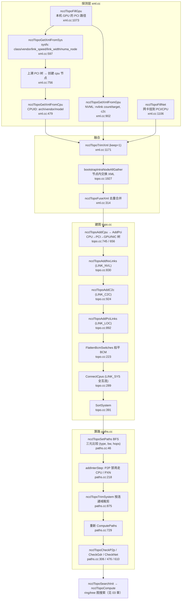
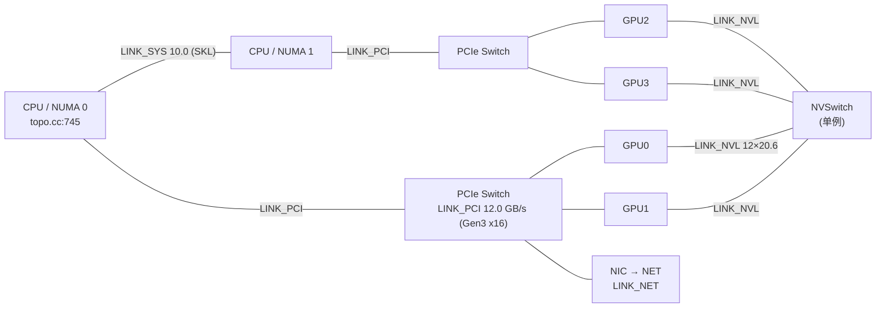

# 02 拓扑检测（sysfs/NVML → XML → 图 → 路径）

> 本文覆盖 `ncclTopoGetSystem` 到 `ncclTopoCheckP2p` 的完整链路：硬件是怎么被"看见"的、看见之后怎么变成一张带带宽的图、图上怎么算出任意两点的最优路径。
> 所有行号均基于本仓库当前源码逐行核对。

## 本文覆盖的源文件

| 文件 | 一句话职责 | 链接 |
|---|---|---|
| `src/graph/xml.cc` | **探测层**：从 `/sys` sysfs、NVML、CPUID 读取硬件信息，填出一棵 XML 树 | [xml.cc](../src/graph/xml.cc) |
| `src/graph/xml.h` | XML 节点/属性结构与存取辅助函数（含 `MAX_SUBS`、`PCI_NVSWITCH_CLASS`） | [xml.h](../src/graph/xml.h) |
| `src/graph/topo.cc` | **建图层**：CPU → PCI 树 → GPU/DEV/NIC/NET 节点，NVLink/C2C/PCI/SYS 链路 | [topo.cc](../src/graph/topo.cc) |
| `src/graph/topo.h` | 节点/链路/路径枚举、带宽常量、`ncclTopoNode/ncclTopoLink/ncclTopoSystem` 结构 | [topo.h](../src/graph/topo.h) |
| `src/graph/paths.cc` | **算路层**：BFS 求最优路径与瓶颈带宽、裁剪、P2P/GDR/NET 判定 | [paths.cc](../src/graph/paths.cc) |
| `src/include/graph.h` | `PATH_*` 等级常量、`NCCL_TOPO_MAX_NODES`、对外拓扑 API 声明 | [graph.h](../src/include/graph.h) |
| `src/init.cc` | 调用方：`GetSystem → ComputePaths → TrimSystem → ComputePaths → SearchInit` | [init.cc](../src/init.cc) |

---

## 主题一：ncclTopoGetSystem —— 从 /sys sysfs + NVML 构建 XML

### ① 解决什么问题

NCCL 要在**没有用户任何输入**的情况下回答这些问题：这台机器有几张 GPU？它们挂在哪个 NUMA 节点的哪条 PCIe 树下？两两之间有几条 NVLink 还是只能走 PCIe？网卡离哪张 GPU 最近？

如果不知道这些：

- ring 的顺序可能让相邻两卡走 PCIe 而不是 NVLink，带宽差 10 倍以上；
- 跨 NUMA 的两张卡被安排成邻居，还要额外穿越 QPI/UPI；
- 多机时不知道该让哪张 GPU 负责哪个网卡，PCIe 成为瓶颈。

硬件拓扑无法靠 CUDA API 获得（CUDA 只给设备序号和 P2P 能力，不给 PCIe 树和 NVLink 连接关系），必须自己去 sysfs 和 NVML 里挖。

### ② 一句话本质

**每个 rank 只探测自己管的那张 GPU 及其上溯的 PCI 路径，生成一棵局部 XML；然后用节点内 AllGather 把所有人的 XML 融合成一棵完整树。**

### ③ 代码链路

1. `ncclTopoGetSystem` —— [topo.cc:L1784-L1960](../src/graph/topo.cc#L1784)
2. 优先读 `NCCL_TOPO_FILE` / `/var/run/nvidia-topologyd/virtualTopology.xml` —— [topo.cc:L1793-L1800](../src/graph/topo.cc#L1793)
3. 只探测本 rank 的 GPU：`ncclTopoFillGpu` —— [topo.cc:L1822](../src/graph/topo.cc#L1822) → [xml.cc:L1073-L1084](../src/graph/xml.cc#L1073)
4. `ncclTopoGetXmlFromSys`：读 sysfs —— [xml.cc:L597-L900](../src/graph/xml.cc#L597)
   - `ncclTopoSetAttrFromSys`（class/vendor/device/…）—— [xml.cc:L447-L454](../src/graph/xml.cc#L447)
   - `ncclTopoSetAttrFromNvml`（GPU 的 PCI 四元组）—— [xml.cc:L456-L477](../src/graph/xml.cc#L456)
   - `link_speed` / `link_width` —— [xml.cc:L671-L736](../src/graph/xml.cc#L671)
   - 上溯 PCI 树、创建 `cpu` 节点 —— [xml.cc:L756-L891](../src/graph/xml.cc#L756)
5. `ncclTopoGetXmlFromGpu`：NVML 探测 NVLink 与 C2C —— [xml.cc:L902-L1071](../src/graph/xml.cc#L902)
6. `ncclTopoGetXmlFromCpu`：CPUID 填 arch/vendor/model —— [xml.cc:L479-L570](../src/graph/xml.cc#L479)
7. `ncclTopoTrimXml`：剪掉与本次通信域无关的分支 —— [xml.cc:L1171-L1215](../src/graph/xml.cc#L1171)
8. **节点内 AllGather 融合 XML** —— [topo.cc:L1921-L1943](../src/graph/topo.cc#L1921)
9. XML → 图：`ncclTopoGetSystemFromXml` —— [topo.cc:L977-L1009](../src/graph/topo.cc#L977)

### ④ 关键代码逐行解读

[xml.cc:L671-L698](../src/graph/xml.cc#L671)

```c
  NCCLCHECKGOTO(xmlGetAttrIndex(pciNode, "link_speed", &index), ret, exit);
  if (index == -1) {
    if (nvmlDeviceFound) {
      unsigned int linkGen = 0;
      if (ncclNvmlDeviceGetCurrPcieLinkGeneration(device, &linkGen) == ncclSuccess && linkGen > 0) {
        const char* speeds[] = {
          "", "2.5 GT/s PCIe", "5.0 GT/s PCIe", "8.0 GT/s PCIe", "16.0 GT/s PCIe", "32.0 GT/s PCIe", "64.0 GT/s PCIe"
        };
        if (linkGen <= 6) {
          NCCLCHECKGOTO(xmlSetAttr(pciNode, "link_speed", speeds[linkGen]), ret, exit);
        }
      } else {
        NCCLCHECKGOTO(xmlSetAttr(pciNode, "link_speed", "16.0 GT/s"), ret, exit);
      }
    }
#if NCCL_OS_LINUX
    else if (path) {
      char deviceSpeedStr[MAX_STR_LEN];
      float deviceSpeed = FLT_MAX;
      NCCLCHECKGOTO(ncclOsTopoGetStrFromSys(path, "max_link_speed", deviceSpeedStr, sizeof(deviceSpeedStr)), ret, exit);
      sscanf(deviceSpeedStr, "%f GT/s", &deviceSpeed);
      char portSpeedStr[MAX_STR_LEN];
      float portSpeed = FLT_MAX;
      NCCLCHECKGOTO(ncclOsTopoGetStrFromSys(path, "../max_link_speed", portSpeedStr, sizeof(portSpeedStr)), ret, exit);
      sscanf(portSpeedStr, "%f GT/s", &portSpeed);
      NCCLCHECKGOTO(xmlSetAttr(pciNode, "link_speed", portSpeed < deviceSpeed ? portSpeedStr : deviceSpeedStr), ret,
                    exit);
    }
#endif
```

逐段解释：

- **三级降级策略**：NVML（`GetCurrPcieLinkGeneration`）→ sysfs（`max_link_speed`）→ 默认值。GPU 用 NVML 更准（NVML 报的是**当前协商速率**，sysfs 报的是**设备能力上限**）；非 GPU 的 PCI 桥只能走 sysfs。
- **为什么要读 `../max_link_speed`**：PCIe 链路速率由**两端能力的较小值**决定。`path` 是设备自身目录，`../` 是上游端口目录，取 `min(deviceSpeed, portSpeed)` 才是对的（[xml.cc:L696](../src/graph/xml.cc#L696)）。`link_width` 同样取 `min(deviceWidth, portWidth)`（[xml.cc:L720-L726](../src/graph/xml.cc#L720)）。
- **字符串而非数字**：XML 里存的是 `"8.0 GT/s PCIe"` 这样的字符串（与 `NCCL_TOPO_FILE` 手写的拓扑文件格式统一），后面在 `ncclTopoAddPci` 里用 `kvDictPciGen` 字典翻译成整数（[topo.cc:L564-L575](../src/graph/topo.cc#L564)）。
- **"先填自己再填父节点"的递归**：`ncclTopoGetXmlFromSys` 末尾判断父节点是 `pci` 就递归、是 `cpu` 就转 `ncclTopoGetXmlFromCpu`（[xml.cc:L887-L891](../src/graph/xml.cc#L887)），从而从一张 GPU 一路把整条 PCIe 链上溯到根复合体。
- **父节点识别靠 BDF 格式**：从 path 末尾往前数两个 `/`，如果剩下的是 `BBBB:BB:DD.F` 就是上级 PCI 交换机，否则是 CPU 根复合体（[xml.cc:L766-L797](../src/graph/xml.cc#L766)，`checkBDFFormat` 在 [xml.cc:L587-L595](../src/graph/xml.cc#L587)）。这是"不依赖 libpci"的纯路径解析。
- **子节点按 busid 排序插入**（[xml.cc:L867-L885](../src/graph/xml.cc#L867)）：保证不同 rank 生成的 XML 结构顺序一致，融合时才能正确去重（对应注释里的 issue #820）。

### ⑤ 收益

- **探测范围最小化**：每个 rank 只探自己那张 GPU（`ncclTopoFillGpu(xml, busId, ...)`，[topo.cc:L1822](../src/graph/topo.cc#L1822)），N 张卡的探测**并行**完成在 N 个进程里，而不是一个进程串行探 N 张卡。
- **融合走节点内 AllGather**：`bootstrapIntraNodeAllGather(..., mem, xmlMemSize(NCCL_TOPO_XML_MAX_NODES))`（[topo.cc:L1927](../src/graph/topo.cc#L1927)）——注意 XML 里**存的是指针**，跨进程传前必须先 `ncclTopoConvertXml(peerXml, base, 1)` 把指针换成偏移（[topo.cc:L1924](../src/graph/topo.cc#L1924)、[xml.cc:L264-L282](../src/graph/xml.cc#L264)），收到后再换回（[topo.cc:L1941](../src/graph/topo.cc#L1941)）。这是序列化/反序列化的教科书式处理。
- **XML 作为中间表示的价值**：可被 `NCCL_TOPO_FILE` 覆盖（容器/云场景常因 sysfs 受限需要手工提供），可被 `NCCL_TOPO_DUMP_FILE` 导出调试（[topo.cc:L1945-L1948](../src/graph/topo.cc#L1945)）。
- **规模上限**：`NCCL_TOPO_XML_MAX_NODES = 256`（[topo.h:L220](../src/graph/topo.h#L220)），每个节点最多 `MAX_SUBS = 640` 个子节点（[xml.h:L24](../src/graph/xml.h#L24)）。

### ⑥ 面试考点

**Q1：NCCL 从哪些来源获取拓扑信息？**
A：三类——①`/sys/bus/pci/...` sysfs（`class`/`vendor`/`device`/`max_link_speed`/`max_link_width`/`numa_node`）；②NVML（GPU 的 PCI 四元组、当前 PCIe 代次与宽度、NVLink 条数与对端 busId、C2C 链路数与带宽）；③CPUID（CPU arch/vendor/family/model，用于 SYS 带宽档位）。

**Q2：为什么每个 rank 只探自己的 GPU，最后还要融合？**
A：单机多进程下每个进程只有自己的 GPU "keep=1"，且 `CUDA_VISIBLE_DEVICES` 会让别的进程看不见别人的卡。各自探测 + 节点内 AllGather 融合（[topo.cc:L1927](../src/graph/topo.cc#L1927)）既并行又能拿到全局视野。`ncclTopoTrimXml` 靠 `keep="1"` 标记剪掉无关分支（[xml.cc:L1171-L1210](../src/graph/xml.cc#L1171)）。

**Q3：XML 跨进程传递时为什么要 `ncclTopoConvertXml`？**
A：因为 `ncclXmlNode` 里的 `parent` 和 `subs[]` 都是**指针**，直接 memcpy 到另一个进程地址空间就是野指针。传前 `exp=1` 把指针转成相对 `base` 的偏移，收后 `exp=0` 转回（[xml.cc:L264-L282](../src/graph/xml.cc#L264)）。

**Q4：`link_speed` 为什么要取设备和上游端口的较小值？**
A：PCIe 链路的实际速率/宽度由两端能力协商决定，取 min 才是真实可用值（[xml.cc:L696](../src/graph/xml.cc#L696)、[xml.cc:L726](../src/graph/xml.cc#L726)）。只看设备侧会高估。

---

## 主题二：XML → ncclTopoSystem 图 —— 节点与链路的构造

### ① 解决什么问题

XML 是一棵**树**（CPU → PCI → GPU），但真实的硬件连接是**图**：NVLink 让 GPU 直连 GPU 或 NVSwitch，BCM PCIe 交换机有 P2P 交叉链路，多个 NUMA 节点之间有 QPI/UPI。搜索算法（ring/tree）需要在图上跑，必须先把树补成图。

### ② 一句话本质

**先按 PCI 树建节点（CPU→PCI→GPU/NIC），再补三类"横边"：NVLink、C2C、PCI 交叉链路；最后把同机的 CPU 用 SYS 链路全互连。**

### ③ 代码链路

1. `ncclTopoGetSystemFromXml` —— [topo.cc:L977-L1009](../src/graph/topo.cc#L977)
   - 先建所有 CPU —— [topo.cc:L987-L990](../src/graph/topo.cc#L987)
   - `ncclTopoAddNvLinks` —— [topo.cc:L830-L890](../src/graph/topo.cc#L830)
   - `ncclTopoAddC2c` —— [topo.cc:L924-L975](../src/graph/topo.cc#L924)
   - `ncclTopoAddPciLinks` —— [topo.cc:L892-L922](../src/graph/topo.cc#L892)
   - `ncclTopoFlattenBcmSwitches` —— [topo.cc:L223-L287](../src/graph/topo.cc#L223)
   - `ncclTopoConnectCpus` —— [topo.cc:L289-L302](../src/graph/topo.cc#L289)
   - `ncclTopoSortSystem` —— [topo.cc:L391](../src/graph/topo.cc#L391)
2. 节点构造：`ncclTopoCreateNode` —— [topo.cc:L121-L152](../src/graph/topo.cc#L121)
3. PCI 带宽换算：`ncclTopoAddPci` —— [topo.cc:L656-L721](../src/graph/topo.cc#L656)
4. NVLink 带宽换算：`ncclTopoNVLinkBw` —— [topo.h:L283-L291](../src/graph/topo.h#L283)
5. 网卡：`ncclTopoAddNic` → `ncclTopoAddNet` —— [topo.cc:L507-L528](../src/graph/topo.cc#L507)、[topo.cc:L420-L465](../src/graph/topo.cc#L420)
6. 链路聚合与排序：`ncclTopoConnectNodes` —— [topo.cc:L187-L212](../src/graph/topo.cc#L187)

### ④ 关键代码逐行解读

（a）PCI 链路带宽换算 —— [topo.cc:L660-L677](../src/graph/topo.cc#L660)

```c
  int type;
  NCCLCHECK(xmlGetAttrStr(xmlPci, "class", &str));
  NCCLCHECK(kvConvertToInt(str, &type, kvDictPciClass));

  int64_t busId;
  NCCLCHECK(xmlGetAttrStr(xmlPci, "busid", &str));
  NCCLCHECK(busIdToInt64(str, &busId));

  float bw;
  {
    int width, speed;
    NCCLCHECK(xmlGetAttrInt(xmlPci, "link_width", &width));
    NCCLCHECK(xmlGetAttrStr(xmlPci, "link_speed", &str));
    // 处理 /sys 中没有给出速率信息的情形
    if (width == 0) width = 16;
    NCCLCHECK(kvConvertToInt(str, &speed, kvDictPciGen)); // Values in 100Mbps, per lane (we want GB/s in the end)
    bw = width * speed / 80.0;
  }
```

- `kvDictPciGen` 的值是**每 lane 的 100 Mbps 数**：Gen3 = 60（即 6 Gbps/lane）。`bw = width × speed / 80.0` 中除以 80 = 先 ×100Mbps→Mbps，再 ÷8→MB/s，再 ÷1000→GB/s，即 `100/8/1000 = 1/80`。
- 校验：Gen3 x16 → `16 × 60 / 80 = 12.0 GB/s`，与 `#define PCI_BW 12.0 /* PCI Gen3 x16 */`（[topo.h:L34](../src/graph/topo.h#L34)）完全吻合。
- `class` 决定节点类型：`0x03`→GPU、`0x02`→NIC、`0x068000`→NVSwitch、bridge→PCI（[topo.cc:L557-L563](../src/graph/topo.cc#L557)）。NVSwitch 的 class 常量在 [xml.h:L19](../src/graph/xml.h#L19)。

（b）NVLink 带宽聚合 —— [topo.cc:L849-L877](../src/graph/topo.cc#L849)

```c
    float nvlBw = ncclTopoNVLinkBw(devNode->dev.cudaCompCap);

    if (targetType == GPU) {
      const char* target;
      NCCLCHECK(xmlGetAttrStr(node, "target", &target));
      int64_t busId;
      NCCLCHECK(busIdToInt64(target, &busId));
      int remDevsCount = 0;
      struct ncclTopoNode* remDevs[NCCL_TOPO_MLOPART_DEV_MAX];
      NCCLCHECK(ncclTopoGetDevNodes(system, NCCL_TOPO_ID(systemId, busId), remDevs, &remDevsCount));
      // 带宽在源端和目的端都会在不同设备之间被分摊。
      for (int j = 0; j < remDevsCount; j++) {
        NCCLCHECK(ncclTopoConnectNodes(devNode, remDevs[j], LINK_NVL, count * nvlBw / remDevsCount / localDevsCount));
      }
    } else {
      struct ncclTopoNode* remote = NULL;
      if (targetType == CPU) {
        NCCLCHECK(findLocalCpu(devNode, &remote, NULL));
      } else {
        if (system->nodes[NVS].count == 0) {
          NCCLCHECK(ncclTopoCreateNode(system, &remote, NVS, 0));
        } else {
          remote = system->nodes[NVS].nodes;
        }
      }
      if (remote) {
        NCCLCHECK(ncclTopoConnectNodes(devNode, remote, LINK_NVL, count * nvlBw / localDevsCount));
        NCCLCHECK(ncclTopoConnectNodes(remote, devNode, LINK_NVL, count * nvlBw / localDevsCount));
      }
    }
```

- **总带宽 = 条数 × 单条带宽**：`count` 来自 XML 的 `nvlink count` 属性（NVML 逐条扫描累加，[xml.cc:L997-L1006](../src/graph/xml.cc#L997)）。
- **MLOPart 分摊**：一张物理 GPU 切成多个分区时，同一条 NVLink 被多个 DEV 共享，所以要 `/ remDevsCount / localDevsCount` 双向分摊。
- **NVSwitch 是单例**：`system->nodes[NVS].count == 0` 时才创建，之后所有不可见/未知对端的 NVLink 都连到这**一个** NVS 节点（[topo.cc:L868-L873](../src/graph/topo.cc#L868)）。这是一个刻意做的"粗粒度"建模——NCCL 不关心 NVSwitch 内部拓扑，只关心"经 NVSwitch 的一跳"。
- **NVLink 也连 CPU**：Grace-Hopper 等 C2C 场景下 NVLink 目标 class 是 `0x068001`（CPU），此时用 `findLocalCpu` 沿 PCI 树找到 CPU 节点（[topo.cc:L59-L74](../src/graph/topo.cc#L59)）。

（c）BCM 交换机拍平 —— [topo.cc:L214-L222, L223-L287](../src/graph/topo.cc#L214)

Broadcom Gen4/Gen5 PEX 交换机在 sysfs 里呈现为**两级**层级，但物理上所有端口间都是满带宽。多出来的一级会让 BFS 的跳数失真，导致 NCCL 把 PIX 误判成 PXB。所以 `ncclTopoFlattenBcmSwitches` 把同代的子交换机删掉、把它的所有子设备直接挂到父交换机上，并把 `pci.device |= 0xffff` 防止二次合并（[topo.cc:L276](../src/graph/topo.cc#L276)）。

（d）CPU 全互连 —— [topo.cc:L289-L302](../src/graph/topo.cc#L289)

同一 systemId（同一主机）下所有 CPU 两两连 `LINK_SYS`，带宽由 `ncclTopoGetInterCpuBw` 按 CPU 型号给出（[topo.cc:L79-L102](../src/graph/topo.cc#L79)）。这就是 PATH_SYS 的带宽来源。

### ⑤ 关键常量表（全部抄自源码）

**链路带宽常量** —— [topo.h:L26-L48](../src/graph/topo.h#L26)

| 常量名 | 值 (GB/s) | 含义 | 行号 |
|---|---|---|---|
| `LOC_BW` | 5000.0 | 本地/同设备（PCI 枝叶内部） | [L26](../src/graph/topo.h#L26) |
| `MLOPART_LOC_BW` | 2618.0 | MLOPart 分区内部 | [L27](../src/graph/topo.h#L27) |
| `SM60_NVLINK_BW` | 18.0 | Pascal 每条 NVLink | [L28](../src/graph/topo.h#L28) |
| `SM70_NVLINK_BW` | 20.0 | Volta 每条 NVLink | [L29](../src/graph/topo.h#L29) |
| `SM80_NVLINK_BW` | 20.0 | Ampere(A100) 每条 NVLink | [L30](../src/graph/topo.h#L30) |
| `SM90_NVLINK_BW` | 20.6 | Hopper(H100) 每条 NVLink | [L31](../src/graph/topo.h#L31) |
| `SM86_NVLINK_BW` | 12.0 | SM86 每条 NVLink | [L32](../src/graph/topo.h#L32) |
| `SM100_NVLINK_BW` | 40.1 | Blackwell 每条 NVLink | [L33](../src/graph/topo.h#L33) |
| `PCI_BW` | 12.0 | PCIe Gen3 x16 参考值 | [L34](../src/graph/topo.h#L34) |
| `AMD_BW` | 16.0 | AMD CPU 间 | [L35](../src/graph/topo.h#L35) |
| `BDW_QPI_BW` | 6.0 | Intel Broadwell QPI | [L36](../src/graph/topo.h#L36) |
| `SKL_QPI_BW` | 10.0 | Intel Skylake UPI | [L37](../src/graph/topo.h#L37) |
| `SRP_QPI_BW` | 22.0 | Intel Skylake-RP UPI | [L38](../src/graph/topo.h#L38) |
| `ERP_QPI_BW` | 40.0 | Intel Eagle-RP UPI | [L39](../src/graph/topo.h#L39) |
| `ZPI_BW` | 6.0 | 兆芯 ZPI | [L40](../src/graph/topo.h#L40) |
| `YONGFENG_ZPI_BW` | 9.0 | 兆芯永丰 ZPI | [L41](../src/graph/topo.h#L41) |
| `P9_BW` | 32.0 | IBM POWER9 | [L42](../src/graph/topo.h#L42) |
| `ARM_BW` | 6.0 | ARM CPU 间 | [L43](../src/graph/topo.h#L43) |
| `NET_BW` | 12.0 | 100 Gbit 网卡参考值 | [L44](../src/graph/topo.h#L44) |
| `INTEL_P2P_OVERHEAD(bw)` | `bw * 6 / 5` | Intel CPU 把 GPU P2P 转换成 64B TLP 的开销 | [L48](../src/graph/topo.h#L48) |

**NVLink 单卡总带宽（条数 × 单条带宽）**

| 架构 | 最大条数 | 单条 (GB/s) | 全卡合计 (GB/s) | 条数出处 |
|---|---|---|---|---|
| sm < 60 | 0 | — | — | [xml.cc:L942](../src/graph/xml.cc#L942) |
| sm 60 | 4 | 18.0 | 72.0 | 同上 |
| sm 70 | 6 | 20.0 | 120.0 | 同上 |
| sm 80/90 之前的 80+ | 12 | 20.0 | 240.0 | 同上 |
| sm 90 (H100) | 18 | 20.6 | 370.8 | 同上 |
| sm 100 (B200) | 18 | 40.1 | 721.8 | 同上 |

> 条数上限表达式：`(sm < 60) ? 0 : (sm < 70) ? 4 : (sm < 80) ? 6 : (sm < 90) ? 12 : 18`（[xml.cc:L942](../src/graph/xml.cc#L942)）；实际条数由 NVML 逐条 `NVML_NVLINK_CAP_P2P_SUPPORTED` + `NVLinkState` 过滤后累加（[xml.cc:L949-L1007](../src/graph/xml.cc#L949)）。

**PCIe 每 lane 速率字典与 x16 带宽** —— [topo.cc:L564-L575](../src/graph/topo.cc#L564)

| 速率字符串 | 字典值（×100 Mbps/lane） | x16 带宽 = `16×v/80` (GB/s) |
|---|---|---|
| `2.5 GT/s` / `2.5 GT/s PCIe` | 15 | 3.0 |
| `5 GT/s` / `5.0 GT/s PCIe` | 30 | 6.0 |
| `8 GT/s` / `8.0 GT/s PCIe` | 60 | **12.0** |
| `16 GT/s` / `16.0 GT/s PCIe` | 120 | 24.0 |
| `32 GT/s` / `32.0 GT/s PCIe` | 240 | 48.0 |
| `64.0 GT/s PCIe` | 480 | 96.0 |
| 未匹配（兜底） | 60 | 12.0 |

**节点类型** —— [topo.h:L50-L60](../src/graph/topo.h#L50)，字符串表 [topo.cc:L51](../src/graph/topo.cc#L51)

| 值 | 名 | 含义 |
|---|---|---|
| 0 | `GPU` | GPU（rank 绑定的那个） |
| 1 | `PCI` | PCIe 交换机 / 桥 |
| 2 | `NVS` | NVSwitch |
| 3 | `CPU` | 实际是 NUMA 域 |
| 4 | `NIC` | 网卡物理设备 |
| 5 | `NET` | 网卡上的网络逻辑设备 |
| 6 | `GIN` | GIN 设备（本仓库未启用） |
| 7 | `RMA` | RMA 设备（本仓库未启用） |
| 8 | `DEV` | 物理 GPU 设备（MLOPart 拆分时与 GPU 分离） |
| 9 | `CXB` | C2C Cross-Bridge |

**链路类型** —— [topo.h:L64-L74](../src/graph/topo.h#L64)，字符串表 [topo.cc:L52](../src/graph/topo.cc#L52)

| 值 | 名 | 说明 |
|---|---|---|
| 0 | `LINK_LOC` | 本地（同设备内、PCI 枝叶） |
| 1 | `LINK_NVL` | NVLink |
| 3 | `LINK_C2C` | C2C（Grace-Hopper 等） |
| 4 | `LINK_PCI` | PCIe |
| 9 | `LINK_SYS` | 跨 NUMA（QPI/UPI） |
| 10 | `LINK_NET` | 网络 |

> 注意 2/5/6/7/8 被刻意跳过，为的是**让 `LINK_*` 与 `PATH_*` 的数值尽量对齐**（[topo.h:L63](../src/graph/topo.h#L63)）。

**规模上限**

| 常量 | 值 | 出处 |
|---|---|---|
| `NCCL_TOPO_MAX_NODES` | 640（每类型最多 640 个节点） | [graph.h:L121](../src/include/graph.h#L121) |
| `NCCL_TOPO_MAX_LINKS` | 576（每节点最多 576 条链路，对应 GB200-NVL72 的 32 NIC） | [topo.h:L86](../src/graph/topo.h#L86) |
| `NCCL_TOPO_MAX_HOPS` | `640 × 10 = 6400` | [topo.h:L87](../src/graph/topo.h#L87) |
| `NCCL_TOPO_XML_MAX_NODES` | 256 | [topo.h:L220](../src/graph/topo.h#L220) |
| `MAX_SUBS` | 640（每个 XML 节点的子节点上限） | [xml.h:L24](../src/graph/xml.h#L24) |

### ⑥ 面试考点

**Q1：`GPU` 节点和 `DEV` 节点有什么区别？**
A：`DEV` 是**物理 GPU 设备**，`GPU` 是**一个 rank 绑定的逻辑 GPU**。未启用 MLOPart 时一一对应；启用 MLOPart（一张卡切多个分区）后一个 `DEV` 下挂多个 `GPU`（[topo.h:L106-L110](../src/graph/topo.h#L106)、[topo.cc:L797-L808](../src/graph/topo.cc#L797)）。NVLink 是挂在 `DEV` 上的，所以带宽要按 DEV 数量分摊。

**Q2：为什么 NVSwitch 只建一个节点？**
A：NCCL 只关心"经 NVSwitch 中转一跳"这个事实和总带宽，不建模 NVSwitch 内部的交换网络。所有目标不可见/未知的 NVLink 都连到同一个 NVS 单例（[topo.cc:L868-L873](../src/graph/topo.cc#L868)），把 N² 的 NVSwitch 网格简化成一个星型，BFS 复杂度大幅下降。

**Q3：为什么要拍平 BCM 交换机？**
A：Broadcom Gen4 PEX 在 sysfs 里是两级层级，但物理上端口间满带宽。多出的一级会让 BFS 多算一跳，把本该是 `PATH_PIX` 的判成 `PATH_PXB`，影响 P2P 与 GDR 决策。拍平后跳数才是真实的（[topo.cc:L214-L222](../src/graph/topo.cc#L214)）。

**Q4：`ncclTopoConnectNodes` 为什么要"累加带宽并排序"？**
A：多条同类型链路（比如 18 条 NVLink）要聚合成一条高带宽的边（`link->bw += bw`，[topo.cc:L200](../src/graph/topo.cc#L200)）；按带宽降序排序（[topo.cc:L202-L210](../src/graph/topo.cc#L202)）则让后续的 BFS/搜索优先走高速链路。

---

## 主题三：ncclTopoComputePaths / TrimSystem —— BFS 与带宽估算

### ① 解决什么问题

图建好了，但搜索算法每次都问"GPU3 到 GPU7 怎么走、有多少带宽"。如果每次都跑一遍最短路，代价太高。而"最优"在 NCCL 里不是简单的跳数最少，而是**先比路径类型（越快越好），同级再比带宽，同带宽再比跳数**。

另外：本次通信域可能只用 8 张卡中的 4 张，剩下 4 张和其他网卡不该参与搜索。

### ② 一句话本质

**对每个"重要"节点跑一次 BFS，把到所有同类节点的最优路径（链路列表 + 类型 + 瓶颈带宽）预计算并缓存；然后按连通域裁剪掉与本次通信域无关的 GPU。**

### ③ 代码链路

1. `ncclTopoComputePaths` —— [paths.cc:L729-L873](../src/graph/paths.cc#L729)
   - 清空旧路径：`ncclTopoRemovePaths` —— [paths.cc:L239-L249](../src/graph/paths.cc#L239)
   - 对 CPU / DEV / GPU / NET / GIN / RMA / NVS 每一类每个节点跑 BFS：`ncclTopoSetPaths` —— [paths.cc:L46-L138](../src/graph/paths.cc#L46)
   - P2P 不可用时改道经 CPU：`addInterStep` —— [paths.cc:L218-L236](../src/graph/paths.cc#L218)
   - PXN：`addInterStep(system, GPU, localGpuIndex, GPU, g, NET, n)` —— [paths.cc:L848](../src/graph/paths.cc#L848)
2. `ncclTopoTrimSystem` —— [paths.cc:L875-L919](../src/graph/paths.cc#L875)
3. `initTransportsRank` 中的**两次** ComputePaths —— [init.cc:L1172](../src/init.cc#L1172)、[init.cc:L1176](../src/init.cc#L1176)
4. 路径类型合并：`mergePathType` —— [paths.cc:L211-L216](../src/graph/paths.cc#L211)
5. 由路径推 channel 数：`ncclTopoGetNchannels` —— [paths.cc:L928-L963](../src/graph/paths.cc#L928)

### ④ 关键代码逐行解读

[paths.cc:L92-L124](../src/graph/paths.cc#L92)

```c
        // 初始路径类型 = 链路类型。路径 与 链路 类型应当一致。
        // 不考虑 LINK_NET，因为我们只关心 网卡->GPU 的路径。
        int newType = link->type == LINK_NET ? LINK_LOC : link->type;
        // 区分经过一个还是多个 PCI 交换机的情况
        if (node->type == PCI && remNode->type == PCI) newType = PATH_PXB;
        // 把经过 CPU 的路径视为 PATH_PHB
        if (link->type == LINK_PCI && (node->type == CPU || link->remNode->type == CPU)) newType = PATH_PHB;
        // 把单跳 NVLink 设为 NVB。
        if (node->type == DEV && path->type == PATH_NVL && newType == PATH_NVL && path->count == pathMaxLength)
          newType = PATH_NVB;
        newType = std::max(path->type, newType);

        // 若以下任一成立则更新：路径类型更优、或同类型但带宽更高、或同类型同带宽但跳数严格更少。
        // 注意：路径->计数 +1 是为了计入已有路径加上当前候选，详见 remPath->计数 的更新。
        if (newType < remPath->type || (newType == remPath->type && remPath->bw < bw) ||
            (newType == remPath->type && remPath->bw == bw && remPath->count > (path->count + 1))) {
          // 找到反向链路
          for (int l = 0; l < remNode->nlinks; l++) {
            if (remNode->links[l].remNode == node && remNode->links[l].type == link->type) {
              remPath->list[0] = remNode->links + l;
              break;
            }
          }
          ...
          // 拷贝路径的其余部分
          for (int i = 0; i < path->count; i++) remPath->list[i + 1] = path->list[i];
          remPath->count = path->count + 1;
          remPath->bw = bw;
          remPath->type = newType;
```

逐段解释：

- **这不是 Dijkstra，是 BFS + 三元比较**。比较键是 `(type, bw, count)`，优先级递减：**路径类型数字越小越好 → 同类型带宽越大越好 → 同带宽跳数越少越好**（[paths.cc:L106-L107](../src/graph/paths.cc#L106)）。因为 `PATH_*` 的编号本身就是按"速度从快到慢"排的（LOC=0 … SYS=9 … DIS=11），所以"类型优先"就是"延迟/质量优先"。
- **瓶颈带宽**：`float bw = std::min(path->bw, link->bw);`（[paths.cc:L79](../src/graph/paths.cc#L79)）——路径带宽 = 沿途最小链路带宽，典型的**最大瓶颈路径（widest path）**而非最短路径。
- **路径类型的修正规则**（三级）：
  - `PCI → PCI` ⇒ `PATH_PXB`（跨了多个交换机，[paths.cc:L96](../src/graph/paths.cc#L96)）；只跨一个的就是 `PATH_PIX`（= `LINK_PCI` = 4）。
  - 经过 CPU ⇒ `PATH_PHB`（[paths.cc:L98](../src/graph/paths.cc#L98)）。
  - `DEV → DEV` 且前一段已是 `PATH_NVL`、且跳数等于上限（GPU 为 2）⇒ `PATH_NVB`（经中间 GPU 中转的 2 跳 NVLink，[paths.cc:L99-L101](../src/graph/paths.cc#L99)）。
- **单调性**：`newType = std::max(path->type, newType)` 保证路径类型一旦变差就不会再变好——路径的"等级"由它最差的一段决定。这与瓶颈带宽的 `min` 是对偶关系。
- **路径存的是反向链表**：`remPath->list[0]` 是 remNode 回看 node 的**反向链路**（[paths.cc:L109-L114](../src/graph/paths.cc#L109)），后面依次拼上 `path->list[]`。所以 `paths[t][n]` 是从**目标节点往回**看的链路序列。
- **DEV 节点的准入控制**（[paths.cc:L85-L90](../src/graph/paths.cc#L85)）：只有"远端是 GPU 且是 LOC 链路"或"NVB 合法路径"才允许经过 DEV，避免 MLOPart 场景下路径穿越不存在的物理连接。
- **预计算规模**：对 7 类节点各跑一遍 BFS，每个 base 节点 `O(V + E)`。单机 8 卡规模下 V≈几十、E≈几百，单次 BFS 微秒级；这就是为什么可以"暴力全算"而不需要增量更新。
- **`ncclTopoTrimSystem` 用并查集思路**（[paths.cc:L883-L893](../src/graph/paths.cc#L883)）：`domains[g]` 用 `min` 做连通域合并（`paths[GPU][p].type < PATH_NET` 视为连通），最后删掉不属于"我的域"的 GPU（[paths.cc:L895-L910](../src/graph/paths.cc#L895)）。`system->inter = (剩余 GPU 数 == comm->nRanks) ? 0 : 1`（[paths.cc:L912](../src/graph/paths.cc#L912)）**决定是否启用网络路径**。
- **为什么要算两次**：裁剪删节点后 `remNode` 指针会失效（`ncclTopoRemoveNode` 里有 `node->links[l].remNode--` 的指针修正，[topo.cc:L166-L168](../src/graph/topo.cc#L166)），所以 `init.cc` 是 `ComputePaths → TrimSystem → ComputePaths`（[init.cc:L1172-L1176](../src/init.cc#L1172)）。

### ⑤ `PATH_*` 等级表与对应带宽

常量定义 —— [graph.h:L128-L165](../src/include/graph.h#L128)，字符串表 [topo.cc:L53](../src/graph/topo.cc#L53)

| 值 | 名 | 含义 | 典型带宽来源 |
|---|---|---|---|
| 0 | `PATH_LOC` | 自己 / 同设备内 | `LOC_BW` = 5000.0 GB/s（[topo.h:L26](../src/graph/topo.h#L26)） |
| 1 | `PATH_NVL` | 直连 NVLink（含经 NVSwitch） | `count × ncclTopoNVLinkBw(sm)`（[topo.cc:L861](../src/graph/topo.cc#L861)），sm90 全链路 370.8 GB/s |
| 2 | `PATH_NVB` | 经一块中间 GPU 的 2 跳 NVLink | 同上（[topo.cc:L875](../src/graph/topo.cc#L875)） |
| 3 | `PATH_C2C` | C2C 互连 | `(bw × linkCount)/1000`（[topo.cc:L942](../src/graph/topo.cc#L942)） |
| 4 | `PATH_PIX` | 最多跨 1 个 PCIe 交换机 | PCI: `width × speed / 80.0`（[topo.cc:L676](../src/graph/topo.cc#L676)） |
| 5 | `PATH_PXB` | 跨多个 PCIe 交换机（未过主机桥） | 同上 |
| 6 | `PATH_P2C` | GPU↔NIC：C2C 到 CPU + PCIe 到 NIC | `mergePathType(PHB, C2C)`（[paths.cc:L214](../src/graph/paths.cc#L214)），带宽取 min |
| 7 | `PATH_PXN` | GPU↔NIC 经另一块 GPU 中转（PCIe+NVLink） | `addInterStep` 取两端 min（[paths.cc:L234](../src/graph/paths.cc#L234)） |
| 8 | `PATH_PHB` | 过 PCIe 主机桥（通常即 CPU） | 同 PCI |
| 9 | `PATH_SYS` | 跨 NUMA（QPI/UPI） | `ncclTopoGetInterCpuBw`（[topo.cc:L79-L102](../src/graph/topo.cc#L79)），6.0 ~ 40.0 GB/s |
| 10 | `PATH_NET` | 走网络 | `net->net.bw = mbps/8000`（[topo.cc:L437](../src/graph/topo.cc#L437)），兜底 `NET_BW` 12.0 |
| 11 | `PATH_DIS` | 不可达（BFS 初始值） | —— |

**关键阈值（都是"小于等于"才算近）**：

| 判定 | 阈值 | 出处 |
|---|---|---|
| P2P 默认允许的最远距离 | `PATH_PXB`（≤5） | [paths.cc:L364](../src/graph/paths.cc#L364) |
| AMD x86 且 DEV≤2 时放宽到 | `PATH_SYS`（≤9） | [paths.cc:L369-L370](../src/graph/paths.cc#L369) |
| 用户可用 `NCCL_P2P_LEVEL` / `NCCL_P2P_DISABLE` 覆盖 | —— | [paths.cc:L292-L300](../src/graph/paths.cc#L292) |
| GDR 默认允许的最远距离 | `PATH_P2C`（≤6，C2C 开时）否则 `PATH_PXB` | [paths.cc:L519](../src/graph/paths.cc#L519) |
| PXN 判定阈值 | `PATH_P2C`（`NCCL_PXN_C2C=1` 时）否则 `PATH_PXB` | [paths.cc:L836](../src/graph/paths.cc#L836) |
| 网卡比 GPU-GPU 快才走网络 | 比较 `path->type <= PATH_PXB` 的 bw | [paths.cc:L631-L636](../src/graph/paths.cc#L631) |
| `isAllNvlink` | 最差 GPU-GPU 路径 `< PATH_PIX` | [paths.cc:L1070](../src/graph/paths.cc#L1070) |
| `isAllDirectNvlink` | 最差 GPU-GPU 路径 `<= PATH_NVL` | [paths.cc:L1078](../src/graph/paths.cc#L1078) |

### ⑥ 面试考点

**Q1：NCCL 的路径选的是"最短"还是"最宽"？**
A：**先按路径类型（质量等级）再按瓶颈带宽**的多目标最优，不是单纯的跳数最短也不是单纯的带宽最大。`newType < remPath->type || (同类型 && 带宽更大) || (同类型同带宽 && 跳数更少)`（[paths.cc:L106-L107](../src/graph/paths.cc#L106)）。瓶颈带宽取 `min(path->bw, link->bw)`，路径类型取 `max(path->type, newType)`。

**Q2：为什么 `initTransportsRank` 里 `ncclTopoComputePaths` 被调用了两次？**
A：中间夹着 `ncclTopoTrimSystem`（[init.cc:L1172-L1176](../src/init.cc#L1172)）。裁剪会删除 GPU 节点并让存量 `remNode` 指针整体移位，第一次算出的路径全部失效，必须重算。

**Q3：`PATH_PIX` 和 `PATH_PXB` 是怎么区分出来的？**
A：BFS 扩展时如果发现 `node->type == PCI && remNode->type == PCI`（即连续两个 PCIe 交换机），就升级为 `PATH_PXB`（[paths.cc:L96](../src/graph/paths.cc#L96)）；只跨一个交换机时类型保持 `LINK_PCI`(=4)，即 `PATH_PIX`。

**Q4：路径怎么转成 channel 数？**
A：`ncclTopoGetNchannels`（[paths.cc:L928-L963](../src/graph/paths.cc#L928)）：NVLink/NVB 路径用 `2 × max(1, path->bw / nvlBw)`（按"有几个 NVLink 单条带宽"折算，再乘 2）；PCIe 路径固定 2；跨节点路径按网卡数与 `NCCL_P2P_PER_CHANNEL_NET_BW=14 GB/s`（[paths.cc:L926](../src/graph/paths.cc#L926)）折算。

**Q5：`system->inter` 是什么？**
A：裁剪后剩余 GPU 数是否等于 `comm->nRanks`（[paths.cc:L912](../src/graph/paths.cc#L912)）。相等说明**所有卡都在本通信域内、不需要走网络**，`inter=0`；否则 `inter=1`，PXN/GDR/跨节点路径才会被启用（[paths.cc:L701](../src/graph/paths.cc#L701)）。**本仓库单机场景 inter=0**。

---

## 主题四：P2P 可用性与 GPU-NIC 亲和

### ① 解决什么问题

知道"GPU0 和 GPU1 之间有 12 条 NVLink"还不够——还要知道它们**真的能 P2P 吗**？NVML 可能报告 P2P 被 BIOS/IOMMU 禁掉；两张卡可能在不同 NUMA；也可能经 SHM 更快。另外，多机时哪张 GPU 该用哪张网卡（亲和），直接决定 PCIe 是否成为瓶颈。

### ② 一句话本质

**P2P = 拓扑距离达标（默认 ≤ PATH_PXB） AND NVML 报告该 GPU 对的 P2P 读写状态均为 OK AND 走网络不比走 P2P/SHM 更快**；GPU-NIC 亲和 = 按路径类型与带宽给每个 channel 挑"最近的网卡"。

### ③ 代码链路

1. `ncclTopoCheckP2p` —— [paths.cc:L306-L442](../src/graph/paths.cc#L306)
   - 前置排除：不同 hostHash / 不同 shmDev —— [paths.cc:L317-L335](../src/graph/paths.cc#L317)
   - 取 GPU 节点与路径 —— [paths.cc:L339-L349](../src/graph/paths.cc#L339)
   - 中间 GPU（NVB 场景，path->count == 4）—— [paths.cc:L350-L361](../src/graph/paths.cc#L350)
   - 默认 `p2pLevel = PATH_PXB`，AMD 特例放宽到 `PATH_SYS` —— [paths.cc:L364-L370](../src/graph/paths.cc#L364)
   - `if (path->type <= p2pLevel) *p2p = 1;` —— [paths.cc:L376](../src/graph/paths.cc#L376)
   - NVML `nvmlGpuP2PStatus_t` 校验 —— [paths.cc:L385-L420](../src/graph/paths.cc#L385)
   - Ampere + NVLink 才启用 P2P read —— [paths.cc:L422-L426](../src/graph/paths.cc#L422)
2. `p2pCanConnect`（传输层调用 CheckP2p + CheckNet）—— [p2p.cc:L148-L199](../src/transport/p2p.cc#L148)
3. `ncclTopoCheckNet`（网络是否更快）—— [paths.cc:L610-L639](../src/graph/paths.cc#L610)
4. GPU-NIC 亲和：`ncclTopoGetLocalGpu` —— [topo.cc:L2129-L2154](../src/graph/topo.cc#L2129)、`net->net.localGpu` 预计算 —— [paths.cc:L868-L871](../src/graph/paths.cc#L868)
5. `ncclTopoGetLocalNetCountByBw`（按带宽决定用几张网卡）—— [topo.cc:L1993-L2019](../src/graph/topo.cc#L1993)
6. GDR 判定：`ncclTopoCheckGdr` —— [paths.cc:L476-L557](../src/graph/paths.cc#L476)

### ④ 关键代码逐行解读

[paths.cc:L347-L376](../src/graph/paths.cc#L347)

```c
  int intermediateIndex = -1;
  // 若要经过中间 GPU 转发，则设置中间 GPU 的 rank。
  struct ncclTopoLinkList* path = gpu1->paths[GPU] + g2;
  if (path->count == 4) {
    // 中间路径经过 DEV 而非 GPU。
    // 路径形如 GPU1 - DEV1 - DEV2 - DEV3 - GPU2，因此中间 DEV 位于 路径->列表[1]->remNode
    struct ncclTopoNode* intermediateNode = path->list[1]->remNode;
    if (intermediateNode->type == DEV) {
      int interRank;
      NCCLCHECK(ncclTopoDevToRank(system, NCCL_TOPO_ID_SYSTEM_ID(intermediateNode->id), intermediateNode->dev.dev,
                                  /*warn=*/true, &interRank));
      NCCLCHECK(ncclTopoRankToIndex(system, interRank, &intermediateIndex, true));
      if (intermediateRank) *intermediateRank = interRank;
    }
  }

  // 默认不在跨 CPU 主桥(主机 Bridge)以及更远的距离上使用 P2P
  int p2pLevel = PATH_PXB;

  int arch, vendor, model;
  NCCLCHECK(ncclTopoCpuType(system, &arch, &vendor, &model));
  // 允许 AMD 系统上成对的 GPU 设备之间使用 P2P
  if ((arch == NCCL_TOPO_CPU_ARCH_X86 && vendor == NCCL_TOPO_CPU_VENDOR_AMD) && system->nodes[DEV].count <= 2)
    p2pLevel = PATH_SYS;

  // 用户覆盖设置
  NCCLCHECK(ncclGetUserP2pLevel(&p2pLevel));

  // 计算 PCI 距离并与 p2pLevel 比较。
  if (path->type <= p2pLevel) *p2p = 1;
```

逐段解释：

- **`path->count == 4` 就是 NVB**：路径形如 `GPU1-DEV1-DEV2-DEV3-GPU2`（4 条链路），中间那个 DEV 就是要借道的那张卡。把它转成 rank 返回给上层，上层据此决定"这个 P2P 需要中转"（[p2p.cc:L156-L159](../src/transport/p2p.cc#L156)）。
- **默认只到 `PATH_PXB`**：意味着跨 NUMA（`PATH_SYS`）默认**不用 P2P**。原因很实在——跨 CPU socket 的 GPU P2P 往往要穿越 UPI，实测不如走 SHM/网络，而且容易触发一致性问题。
- **AMD 特例**：AMD CPU 上"成对的 GPU"（DEV ≤ 2）之间即使 `PATH_SYS` 也允许 P2P，因为 AMD 平台上这通常是直连 Infinity Fabric 而非跨路（[paths.cc:L369-L370](../src/graph/paths.cc#L369)）。
- **`NCCL_P2P_LEVEL` / `NCCL_P2P_DISABLE` 可覆盖**：`ncclGetUserP2pLevel`（[paths.cc:L296-L300](../src/graph/paths.cc#L296)）支持字符串（`LOC/NVL/PIX/PXB/PHB/SYS`）和旧式数字（0~5，映射表 `levelsOldToNew`，[paths.cc:L251](../src/graph/paths.cc#L251)）。
- **NVML 二次校验是必要的**：拓扑说近不代表驱动允许。真正的判定在 [paths.cc:L385-L420](../src/graph/paths.cc#L385)：查 `ncclNvmlDevicePairs[i][j].p2pStatusRead/Write`，两者都 `NVML_P2P_STATUS_OK` 才算通过；否则 `*p2p = 0`，并且——**如果拓扑说是 NVLink 直连却被禁，直接返回 `ncclUnhandledCudaError`**（[paths.cc:L403-L408](../src/graph/paths.cc#L403)），因为这种情况几乎一定是硬件/BIOS 故障，不该静默降级。`NCCL_IGNORE_DISABLED_P2P=1` 可强制忽略。
- **P2P read 只给 Ampere + NVLink**：`cudaCompCap == 80` 且两端相同且 `path->type == PATH_NVL`（[paths.cc:L422-L426](../src/graph/paths.cc#L422)）。注释说明是因为该组合下"读"比"写"更能压满 NVLink。

### ⑤ GPU-NIC 亲和机制（本仓库单机不走网络，但机制保留）

1. **预计算"网卡本地 GPU"**：ComputePaths 末尾为每个 NET 节点缓存 `net->net.localGpu = ncclTopoGetLocalGpu(...)`（[paths.cc:L868-L871](../src/graph/paths.cc#L868)），避免搜索时反复算。
2. **`ncclTopoGetLocalGpu` 的选法**（[topo.cc:L2129-L2154](../src/graph/topo.cc#L2129)）：先取该 NET 的"本地 GPU 集合"（路径类型最优且带宽最大者，`ncclTopoGetLocal`，[topo.cc:L1962](../src/graph/topo.cc#L1962)），再按 channel 轮转从中挑一个，使得**多个 channel 分摊到不同的近端 GPU**上。
3. **PXN（PCIe × NVLink）**：当我的 GPU 离网卡远、但另一块 GPU 离网卡近且通过 NVLink 连着我时，就借那块 GPU 中转（[paths.cc:L836-L849](../src/graph/paths.cc#L836)）。四个条件必须同时满足：①那块 GPU 到网卡 ≤ `PATH_P2C`/`PXB` 且 GDR 可用；②它到我是 `PATH_NVL`；③同 systemId（同机）；④它到网卡的带宽更高、或我能避开 CPU。
4. **`ncclTopoGetLocalNetCountByBw`**（[topo.cc:L1993-L2019](../src/graph/topo.cc#L1993)）：按 channel 逐个累加网卡带宽，**累加到超过 GPU→CPU 的带宽就停**。即"够用就别多占网卡"，避免网卡争抢。
5. **GDR 判定**（[paths.cc:L476-L557](../src/graph/paths.cc#L476)）：GPU 与 NIC 都支持 + 距离 ≤ `netGdrLevel` + （若为 PXN 改用中间 GPU 的距离）+ C2C 平台强制 PCIe 映射模式。
6. **本仓库说明**：单机场景下 `system->inter == 0`（[paths.cc:L912](../src/graph/paths.cc#L912)），`ncclTopoGetPxnRanks` 直接返回 0 个（[paths.cc:L701](../src/graph/paths.cc#L701)），`initTransportsRank` 里 PXN 分支不会真正连到远端代理。**PXN / Cross-NIC / GDR 的代码路径仍在，但实际数据面不经过网络。**

### ⑥ 面试考点

**Q1：NCCL 判定两个 rank 能 P2P，要看哪几件事？**
A：①同 hostHash 且同 shmDev（[paths.cc:L320-L335](../src/graph/paths.cc#L320)）；②拓扑路径类型 ≤ `PATH_PXB`（AMD 成对 GPU 可放宽到 `PATH_SYS`），可被 `NCCL_P2P_LEVEL` 覆盖（[paths.cc:L364-L376](../src/graph/paths.cc#L364)）；③NVML 的 `p2pStatusRead` 与 `p2pStatusWrite` 均为 OK（[paths.cc:L395-L400](../src/graph/paths.cc#L395)）；④走网络不比走 P2P/SHM 更快（`ncclTopoCheckNet`，[p2p.cc:L162-L167](../src/transport/p2p.cc#L162)）。

**Q2：为什么默认不允许 `PATH_SYS`（跨 NUMA）的 P2P？**
A：跨 NUMA 的 GPU P2P 往往要穿越 UPI/QPI，带宽低（6~40 GB/s）且延迟高，通常不如 SHM 或网络；同时易引入一致性问题。所以默认只到 `PATH_PXB`（[paths.cc:L363-L364](../src/graph/paths.cc#L363)）。

**Q3：NVLink 直连却报 P2P 被禁用，NCCL 怎么处理？**
A：直接 `return ncclUnhandledCudaError`（[paths.cc:L403-L408](../src/graph/paths.cc#L403)）——这几乎肯定是硬件/BIOS/IOMMU 故障，静默降级会掩盖问题。可设 `NCCL_IGNORE_DISABLED_P2P=1` 忽略。

**Q4：GPU-NIC 亲和是怎么定的？PXN 又是什么？**
A：为每个 NET 预计算"本地 GPU 集合"（路径类型最优 + 带宽最大），按 channel 轮转分配（[topo.cc:L2129-L2154](../src/graph/topo.cc#L2129)）。当本 GPU 离网卡远，但同机另一块 GPU 离网卡近且与本卡 NVLink 直连时，借它中转，这就是 PXN（[paths.cc:L836-L849](../src/graph/paths.cc#L836)）。**本仓库单机场景 `system->inter == 0`，PXN 不参与实际数据面。**

**Q5：`isAllNvlink` 和 `isAllDirectNvlink` 有什么区别？用什么算的？**
A：都基于所有 GPU 两两路径类型的最大值（[paths.cc:L1051-L1063](../src/graph/paths.cc#L1051)）。`isAllNvlink` = 最差路径 `< PATH_PIX`（[paths.cc:L1070](../src/graph/paths.cc#L1070)），允许经 NVSwitch 或 C2C；`isAllDirectNvlink` = 最差路径 `<= PATH_NVL`（[paths.cc:L1078](../src/graph/paths.cc#L1078)），必须是直连 NVLink。前者用于选择 P2P chunk size（[init.cc:L849-L850](../src/init.cc#L849)），后者用于 NVLS/GIN 能力判定（[init.cc:L1696](../src/init.cc#L1696)）。

---

## 拓扑构建流程图



## 单机 8 卡典型拓扑结构图



> 上图中 GPU0↔GPU1 的路径类型是 `PATH_NVL`（经 NVSwitch 一跳），GPU0↔GPU2 是 `PATH_PHB`（过主机桥，可能再叠加 `PATH_SYS`），PCIe 链路上才可能出现 `PATH_PIX`（1 个交换机）与 `PATH_PXB`（跨交换机）。

---

## 与其他章节的衔接

- **← [01-bootstrap-and-comm-init.md](./01-bootstrap-and-comm-init.md)**：`ncclTopoGetSystem` 依赖 01 建立的控制面——节点内 XML 融合用的是 `bootstrapIntraNodeAllGather`（[topo.cc:L1927](../src/graph/topo.cc#L1927)），而 `ncclTopoCheckP2p` 依赖 AllGather1 拿到的 `comm->peerInfo`（[paths.cc:L318-L319](../src/graph/paths.cc#L318)）。
- **→ [03-channel-ring-tree.md](./03-channel-ring-tree.md)**：本文终点 `ncclTopoSearchInit` + `ncclTopoCompute`（[init.cc:L1178](../src/init.cc#L1178)、[init.cc:L1207](../src/init.cc#L1207)）产出的 `ncclTopoGraph{ring/tree}`，正是 03 的输入；`ncclTopoGetNchannels`（[paths.cc:L928](../src/graph/paths.cc#L928)）决定的 channel 数也在 03 落地。
- **→ [04-algo-protocol-tuning.md](./04-algo-protocol-tuning.md)**：`ncclTopoTuneModel` / `ncclTopoGetAlgoTime`（[init.cc:L1673](../src/init.cc#L1673)）用本文的路径带宽（`bwIntra` / `bwInter` / `typeIntra` / `typeInter`）搭建"算法 × 协议"的时间模型，04 的 Ring/Tree 选择直接消费它。
- **→ [06-transport-p2p-shm.md](./06-transport-p2p-shm.md)**：`ncclTopoCheckP2p` / `ncclTopoCheckNet` / `ncclTopoCheckGdr` 是 `transport/p2p.cc`、`transport/shm.cc`、`transport/net.cc` 的 `canConnect` 判定基础（[p2p.cc:L148](../src/transport/p2p.cc#L148)）。
- **→ [13-bandwidth-saturation.md](./13-bandwidth-saturation.md)**：本文的 `PATH_NVL` 带宽（sm90 全链路 370.8 GB/s）与 channel 数折算规则，是"如何把带宽打满"那条链路的硬件上限依据。
