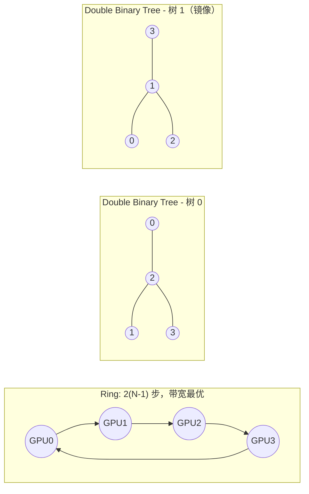
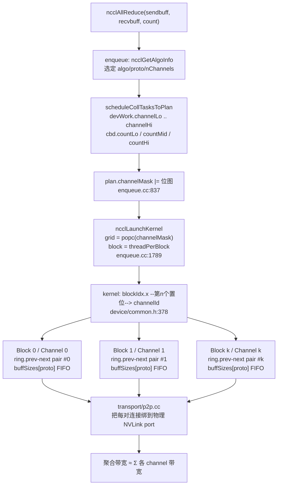

# 03 — Channel 与 Ring/Tree 构建

> 目标读者：已经看过 [02 拓扑检测](./02-topology-detection.md)，想搞清楚"NCCL 到底凭什么把 NVLink 打满"的人。
> 本文所有结论均来自本仓库源码（NCCL 2.30.7 抽取版），行号已逐条 `read_file` 核对。

## 本文覆盖的源文件

| 文件 | 行数 | 在本文中的角色 |
|---|---|---|
| [`src/include/device.h`](../src/include/device.h) | `NCCL_STEPS`=8、`MAXCHANNELS`=64、LL/LL128 常量、`ncclRing`/`ncclTree` | channel 相关的所有硬上限 |
| [`src/include/comm.h`](../src/include/comm.h) | `struct ncclChannel` L160-182、`threadThresholds` L59-61 | channel 的 host 侧结构 |
| [`src/include/graph.h`](../src/include/graph.h) | `PATH_*` L128-165、`NCCL_TOPO_PATTERN_*` L171-180、`ncclTopoGraph` L181-200、`ncclTopoRanks` L206-217 | 搜索结果的载体 |
| [`src/channel.cc`](../src/channel.cc) | `initChannel` L21-76、`freeChannel` L162-192 | 每个 channel 的设备侧资源 |
| [`src/graph/search.cc`](../src/graph/search.cc) | `ncclTopoCompute` L1083-1322、`ncclTopoSearchRec*` L630-890、`ncclTopoDupChannels` L1045-1058 | channel 数 + 环排列的搜索 |
| [`src/graph/rings.cc`](../src/graph/rings.cc) | `ncclBuildRings` L53-102 | 把 prev/next 摊平成线性环 |
| [`src/graph/trees.cc`](../src/graph/trees.cc) | `ncclGetBtree` L54-89、`ncclGetDtree` L116-138 | 二叉树 / 双二叉树 |
| [`src/graph/connect.cc`](../src/graph/connect.cc) | `ncclTopoPreset` L48-129、`ncclTopoPostset` L443-601、`copyChannels` L420-429 | 把图写进 `comm->channels[]` |
| [`src/init.cc`](../src/init.cc) | 各 graph 初始化 L1201-1246、`nChannels` 收敛 L1488-1495、`computeBuffSizes` L836-868 | 串起整条链路 |
| [`src/enqueue.cc`](../src/enqueue.cc) | `ncclLaunchKernel` L1784-1795 | channel → CUDA block 的最终映射 |
| [`src/device/common.h`](../src/device/common.h) | L374-381 | `blockIdx.x` → `channelId` 的反向映射 |

> 说明：NCCL 2.2x 及更早版本里的 `ncclChannelCompute()` 在 2.30.7（本仓库）中**已不存在**，channel 的并行度推导被搬到了 `enqueue.cc` 的 `topoGetAlgoInfo()`（见 [04](./04-algo-protocol-tuning.md)）。读旧博客时要注意这个差异。

---

## 主题一：Channel 是什么、为什么要"多" channel

### ① 解决什么问题

两卡（或八卡）之间插着 NVLink，硬件告诉你"我有几百 GB/s"。但你写一个 kernel，只让 **一个 CUDA block** 去 `ld.global` 对端显存再 `st.global` 回来，实测往往只有几十 GB/s——**单个 block 的 MSHR/ outstanding load 数量有限，无法让一条 NVLink 的流水线保持填满**；而且所有流量都挤在同一条 link 上，其它 link 闲着。

### ② 一句话本质

> **一个 channel = 一条逻辑通信流水线 = { 一组 ring/tree 邻居 } + { 一份独立的 FIFO buffer } + { 一个 CUDA block }。**
> NCCL 把大消息切成 `nChannels` 份，让 `nChannels` 个 block 同时搬运，每个 block 走自己的那份 buffer 和（在 NVSwitch/多 link 拓扑下）不同的物理路径，从而用**并行度**去逼近聚合带宽。

### ③ 代码链路

| 跳 | 位置 | 做了什么 |
|---|---|---|
| 1 | [`comm.h:L160-L182`](../src/include/comm.h#L160) `struct ncclChannel` | 定义一条流水线：`ring`(prev/next)、`tree`(up/down[3])、`peers[]`、`devPeers[]` |
| 2 | [`search.cc:L1083`](../src/graph/search.cc#L1083) `ncclTopoCompute` | 决定 `nChannels` 和每 channel 的 `intra[]` 排列 |
| 3 | [`connect.cc:L48`](../src/graph/connect.cc#L48) `ncclTopoPreset` | 排列 → 本 rank 的 `ring.prev/next`、`tree.up/down` |
| 4 | [`channel.cc:L21`](../src/channel.cc#L21) `initChannel` | 为这条流水线分配 `peers[]`/`devPeers[]`/`devRingUserRanks` |
| 5 | [`enqueue.cc:L837`](../src/enqueue.cc#L837) | `plan->channelMask |= ...` 把参与本次 coll 的 channel 记成位图 |
| 6 | [`enqueue.cc:L1787-L1790`](../src/enqueue.cc#L1787) | `nChannels = popc(channelMask)`，`grid = {nChannels,1,1}` |
| 7 | [`device/common.h:L378-L380`](../src/device/common.h#L378) | kernel 内 `blockIdx.x` → `channelId`（第 n 个置位） |

### ④ 关键代码逐行解读

channel 的"一份流水线"到底装了什么：

```c
// src/include/comm.h:160-182
struct ncclChannel {
  struct ncclChannelPeer** peers;      // host 侧：本 channel 对每个 rank 的连接
  struct ncclDevChannelPeer** devPeers;// device 侧指针数组（显存）
  struct ncclDevChannelPeer** devPeersHostPtr;
  struct ncclRing ring;                // prev / next + userRanks + rankToIndex
  int* devRingUserRanks;
  struct ncclTree tree;                // up / down[3] / depth
  struct ncclTree collnetChain;        // 已裁剪路径，保留字段
  struct ncclDirect collnetDirect;
  struct ncclNvls nvls;
  int id;
  uint32_t workFifoProduced;
  struct ncclChannelPeer* collnetPeers;
  struct ncclDevChannelPeer* collnetDevPeers;
  struct ncclChannelPeer* nvlsPeers;
  struct ncclDevChannelPeer* nvlsDevPeers;
};
```

- `ring` / `tree` 是**同一个 channel 的两套邻居视图**：同一个 channel 既能当 ring 用（AllReduce 走 `ncclPatternRingTwice`），也能当 tree 用（`ncclPatternTreeUpDown`）。选哪个由 04 章的 tuning 模型决定，不需要重建连接。
- `peers[]` 的长度是 `nRanks + 1(collnet) + localRanks(nvls)`（[`channel.cc:L27`](../src/channel.cc#L27)），也就是说 **channel 的 peer 表是按 rank 全量建的**，与这个 channel 实际连了谁无关；实际"发给谁"由 `ring.next` / `tree.down[]` 里的 rank 号去索引这张表。

kernel 启动时的 block↔channel 映射：

```c
// src/enqueue.cc:1784-1795
ncclResult_t ncclLaunchKernel(struct ncclComm* comm, struct ncclKernelPlan* plan) {
  int nChannels = countOneBits(plan->channelMask);
  void* sym = plan->kernelFn;
  dim3 grid = {(unsigned)nChannels, 1, 1};          // <-- 一个 channel 一个 block
  dim3 block = {(unsigned)plan->threadPerBlock, 1, 1};
  int smem = plan->isSymColl ? plan->kernelDynSmem : ncclShmemDynamicSize(comm->cudaArch);
  cudaStream_t launchStream = planner->streams->stream;
  ...
```

以及 kernel 里的反向查表（注意这里不是恒等映射，而是"第 n 个置位"）：

```c
// src/device/common.h:374-381
  // 要把 blockId 映射到 channelId，需要取 channelMask 的第 n 个置位，
  // 也就是"统计前 n 位里有多少个 1"的逆运算。
  if (tid < MAXCHANNELS && (args->channelMask & (1ull << tid))) {
    int n = __popcll(args->channelMask & ((1ull << tid) - 1));
    if (blockIdx.x == n) ncclShmem.channelId = tid;
  }
```

- 用位图而不是 `channelId = blockIdx.x`，是因为一次 kernel 可能只启用 channel 的一个**子集**（比如数据量小只开 2 个 channel，或者多个 coll 聚合后各自占用不同区间）。
- `channelMask` 由 `devWork->channelLo..channelHi` 推出（[`enqueue.cc:L837`](../src/enqueue.cc#L837)），`devWork->cbd.countLo/Mid/Hi` 记录了数据在这段 channel 区间上怎么切分（[`device.h:L310-L323`](../src/include/device.h#L310)）。

### ⑤ 收益（定量）

- 单个 block 即便用满 512 线程、每个线程挂 8 条 outstanding load，也远不足以填满一条 NVLink；`nChannels` 个 block 并行后，总 outstanding 请求数 ×`nChannels`。
- `MAXCHANNELS = 64`（[`device.h:L101`](../src/include/device.h#L101)），实际受 kernel 参数体积限制（[`connect.cc:L409`](../src/graph/connect.cc#L409) `ncclDevMaxChannelsForArgsBytes`）。
- 本仓库 2×H20 实测（README）：128 MB AllReduce busbw ≈ **281 GB/s**。对 2 卡而言 `busbw = algbw × 2(N-1)/N = algbw`，即算法带宽本身就 ≈281 GB/s。

### ⑥ 面试考点

1. **Q：channel 是硬件概念还是软件概念？** A：纯软件抽象。硬件上只有 link / NVSwitch port。channel 是"邻居表 + 一份 FIFO + 一个 block"的组合；真正把 channel 的收发绑到物理 port 上的是 transport 层（p2p.cc）。
2. **Q：channelId 等于 blockIdx.x 吗？** A：不一定。`channelMask` 的第 `blockIdx.x` 个置位才是 `channelId`（[`device/common.h:L378`](../src/device/common.h#L378)）。
3. **Q：同一个 channel 能同时跑 ring 和 tree 吗？** A：结构上能（`ncclChannel` 同时有 `ring` 和 `tree`），一次 kernel 只用其中一个，由 tuning 决定。
4. **Q：channel 多了有什么代价？** A：每 channel 一份 `buffSizes[proto]` 显存（见主题六），且每个 block 都要付一次启动/同步开销；所以数据量小时要降档（[`enqueue.cc:L2151-L2168`](../src/enqueue.cc#L2151)）。
5. **Q：channel 和 CUDA stream 一一对应吗？** A：不对应。所有 channel 的 block 在**同一个** CUDA stream 的同一次 kernel launch 里（[`enqueue.cc:L1789`](../src/enqueue.cc#L1789)）。

---

## 主题二：nChannels 怎么定（含复制/翻倍机制）

### ① 解决什么问题

channel 太少 → 打不满带宽；channel 太多 → buffer 显存暴涨、每个 block 分到的数据太少、同步开销盖过传输收益。需要一个**在硬件带宽约束下的自动档位**，同时允许用户手动钉死上下限。

### ② 一句话本质

> `nChannels` 不是公式算出来的，而是**在拓扑图上做带带宽预算的 DFS 搜出来的**：先假设一个"每 channel 目标带宽"，试着在图上走一圈，走得通就 channel +1 继续，走不通就降带宽重来；最后再**复制翻倍**成偶数份，让奇偶 channel 在不同物理链路上错开。

### ③ 代码链路

| 跳 | 位置 | 做了什么 |
|---|---|---|
| 1 | [`init.cc:L1201-L1216`](../src/init.cc#L1201) | ringGraph：`pattern=RING`，`minChannels=1`，`maxChannels=MAXCHANNELS/2`（=32） |
| 2 | [`init.cc:L1210-L1216`](../src/init.cc#L1210) | treeGraph：`pattern=BALANCED_TREE`，`min=max=ringGraph->nChannels`（**强制 tree/ring channel 数一致**） |
| 3 | [`search.cc:L1083`](../src/graph/search.cc#L1083) | `ncclTopoCompute` 主循环 |
| 4 | [`search.cc:L1045`](../src/graph/search.cc#L1045) | `ncclTopoDupChannels`：搜到 k 个后复制成 2k 个 |
| 5 | [`init.cc:L1309`](../src/init.cc#L1309) | `comm->nChannels = min(treeGraph, ringGraph).nChannels` |
| 6 | [`init.cc:L1488`](../src/init.cc#L1488) | allGather 后与所有 rank 取 min，保证一致 |
| 7 | [`connect.cc:L525`](../src/graph/connect.cc#L525) | `nChannels = min(MAXCHANNELS, nChannels*2)` 再翻倍 |
| 8 | [`connect.cc:L559-L571`](../src/graph/connect.cc#L559) | 应用 `NCCL_MIN_NCHANNELS` / `NCCL_MAX_NCHANNELS` / `maxCTAs` |

### ④ 关键代码逐行解读

**搜索的入口与主循环**：

```c
// src/graph/search.cc:1161-1193
  // 先尝试 crossnic，然后降低带宽(bw)，最后再提高节点内带宽(bwIntra)。
  int nspeeds = 0;
  float* speedArray = NULL;
  if (system->inter == 0) {
    nspeeds = ccMin >= 100 ? NSPEEDSINTRA_SM100 : (ccMin >= 90 ? NSPEEDSINTRA_SM90 : NSPEEDSINTRA);
    speedArray = ccMin >= 100 ? sm100SpeedArrayIntra : (ccMin >= 90 ? sm90SpeedArrayIntra : speedArrayIntra);
  } else {
    nspeeds = ccMin >= 100 ? NSPEEDSINTER_SM100 : (ccMin >= 90 ? NSPEEDSINTER_SM90 : NSPEEDSINTER);
    speedArray = ccMin >= 100 ? sm100SpeedArrayInter : (ccMin >= 90 ? sm90SpeedArrayInter : speedArrayInter);
  }
  int pass = 1;
  int speedIndex = 0;
  float maxBw = system->maxBw;
  float totalBw = system->totalBw;

  // 非 环 算法不要求回到起始网卡，因此可以人为提高 NVLink 带宽以放宽约束
  if (ndevs > 1 && graph->pattern != NCCL_TOPO_PATTERN_RING) totalBw *= ndevs * 1.0 / (ndevs - 1);

  while ((speedArray[speedIndex] > maxBw || speedArray[speedIndex] * graph->minChannels > totalBw) &&
         speedIndex < nspeeds - 1) {
    speedIndex++;
  }
  tmpGraph.bwIntra = tmpGraph.bwInter = speedArray[speedIndex];
  int64_t globalTimeout = NCCL_SEARCH_GLOBAL_TIMEOUT;

search:
  int time = tmpGraph.sameChannels                      ? NCCL_SEARCH_TIMEOUT_SAMECHANNELS :
             tmpGraph.pattern == NCCL_TOPO_PATTERN_TREE ? NCCL_SEARCH_TIMEOUT_TREE :
                                                          NCCL_SEARCH_TIMEOUT;
  tmpGraph.nChannels = 0;
  globalTimeout -= time;

  NCCLCHECK(ncclTopoSearchRec(system, &tmpGraph, graph, &time));
```

- `speedArray` 是**候选"每 channel 目标带宽"表**，按架构分三档（[`search.cc:L1060-L1076`](../src/graph/search.cc#L1060)）：
  - 通用 intra：`{40,30,20,18,15,12,10,9,7,6,5,4,3}`
  - sm90 intra：`{60,50,40,30,24,20,15,12,11,6,3}`
  - sm100 intra：`{90,80,70,60,50,45,40,30,24,20,19,18}`
- `maxBw`（[`search.cc:L29-L38`](../src/graph/search.cc#L29)）= 单 GPU 到任意其它 GPU 的**单条路径最大带宽**；`totalBw`（[`search.cc:L39-L47`](../src/graph/search.cc#L39)）= 该 GPU 所有 NVLink 之和 与 PCIe 带宽取 max。
- 起手策略：从表里**从大到小**挑第一个满足 `speed ≤ maxBw` 且 `speed × minChannels ≤ totalBw` 的值。这就是"先贪心要最多带宽、不行再降档"。
- `time` 是搜索步数预算（`1<<14`、`1<<8`、`1<<19` 三档，[`search.cc:L341-L344`](../src/graph/search.cc#L341)），**NCCL 明确接受"搜到超时就收工"**，靠 `ncclTopoSearchNextGpuSort` 的启发式排序（[`search.cc:L262`](../src/graph/search.cc#L262)）保证超时前大概率已找到好解。

**递归主体**：

```c
// src/graph/search.cc:636-655
  int ngpus = system->nodes[GPU].count;
  if (step == ngpus) {
    // 判断本次是否找到了更优的方案
    int copy = 0;
    graph->nChannels++;
    NCCLCHECK(ncclTopoCompareGraphs(system, graph, saveGraph, &copy));
    if (copy) {
      memcpy(saveGraph, graph, sizeof(struct ncclTopoGraph));
      if (graph->nChannels == graph->maxChannels) *time = -1;
    }
    if (graph->nChannels < graph->maxChannels) {
      NCCLCHECK(ncclTopoSearchRec(system, graph, saveGraph, time));
    }
    graph->nChannels--;
    return ncclSuccess;
  }
  graph->intra[graph->nChannels * ngpus + step] = gpu->gpu.rank;
  int g = gpu - system->nodes[GPU].nodes;
```

- `graph->intra[c * ngpus + step]` 就是**第 c 个 channel 的环上第 step 个位置的 rank**——二维表拍成一维。
- 每走满一圈（`step == ngpus`）就 `nChannels++` 并再递归，直到 `maxChannels` 或带宽预算耗尽。
- `ncclTopoCompareGraphs`（[`search.cc:L454-L477`](../src/graph/search.cc#L454)）的判优顺序：先比 `nChannels × bwIntra`（总带宽），再比 `nHops`（跳数更少）。

**复制/翻倍**：

```c
// src/graph/search.cc:1045-1058
ncclResult_t ncclTopoDupChannels(struct ncclTopoGraph* graph, int ccMin, int ngpus) {
  if (graph->nChannels == 0) return ncclSuccess;
  if (graph->pattern == NCCL_TOPO_PATTERN_NVLS) return ncclSuccess;
  if (graph->bwIntra < 25.0) return ncclSuccess;
  if (ccMin > 80 && graph->bwIntra < 50.0 && graph->nChannels > 4) return ncclSuccess;

  int dupChannels = std::min(graph->nChannels * 2, graph->maxChannels);
  memcpy(graph->intra + graph->nChannels * ngpus, graph->intra,
         (dupChannels - graph->nChannels) * ngpus * sizeof(int));
  memcpy(graph->inter + graph->nChannels * 2, graph->inter,
         (dupChannels - graph->nChannels) * 2 * sizeof(int64_t));
  graph->bwIntra /= DIVUP(dupChannels, graph->nChannels);
  graph->bwInter /= DIVUP(dupChannels, graph->nChannels);
  graph->nChannels = dupChannels;
  return ncclSuccess;
}
```

- 复制后 `nChannels` 翻倍，但**每 channel 带宽 `bwIntra` 相应减半**——总量守恒，只是把同一条逻辑环拆成两份并行跑，用于增加 outstanding 请求、隐藏延迟。
- `bwIntra < 25.0` 时不复制（带宽本来就低，翻倍没意义）。

**用户覆盖**：

```c
// src/graph/connect.cc:383-416
NCCL_PARAM(MinNrings, "MIN_NRINGS", -2);      // 遗留命名
NCCL_PARAM(MaxNrings, "MAX_NRINGS", -2);
NCCL_PARAM(MinNchannels, "MIN_NCHANNELS", -2); // 新命名
NCCL_PARAM(MaxNchannels, "MAX_NCHANNELS", -2);

int ncclMaxNchannels() {
  int maxNchannels = MAXCHANNELS;                                   // 64
  if (ncclParamMaxNrings() != -2) maxNchannels = ncclParamMaxNrings();
  if (ncclParamMaxNchannels() != -2) maxNchannels = ncclParamMaxNchannels();
  maxNchannels = std::min(maxNchannels, ncclDevMaxChannelsForArgsBytes(ncclParamWorkArgsBytes()));
  if (maxNchannels > MAXCHANNELS) maxNchannels = MAXCHANNELS;
  if (maxNchannels < 1) { ...; maxNchannels = 1; }
  return maxNchannels;
}
```

- 新/旧两套名字都保留，后写的 `NCHANNELS` 覆盖 `NRINGS`。默认值 `-2` 表示"用户没设"。
- 生效顺序（[`connect.cc:L559-L571`](../src/graph/connect.cc#L559)）：**先用 `maxNchannels` 截断，再用 `minNchannels` 通过 `copyChannels` 补齐**——不足时不是新增搜索，而是复制已有 channel。

### ⑤ 收益（定量）

| 参数 | 值 | 来源 |
|---|---|---|
| `MAXCHANNELS` | 64 | [`device.h:L101`](../src/include/device.h#L101) |
| ring 搜索上限 | `MAXCHANNELS/2` = 32 | [`init.cc:L1206`](../src/init.cc#L1206) |
| tree 搜索上限 | = ring 搜出来的 `nChannels` | [`init.cc:L1213-L1214`](../src/init.cc#L1213) |
| 最终翻倍 | `min(MAXCHANNELS, nChannels*2)` | [`connect.cc:L525`](../src/graph/connect.cc#L525) |
| `NCCL_MIN_NCHANNELS` 默认 | -2（未设） | [`connect.cc:L386`](../src/graph/connect.cc#L386) |
| `NCCL_MAX_NCHANNELS` 默认 | -2（未设） | [`connect.cc:L387`](../src/graph/connect.cc#L387) |
| 搜索步数预算 | `1<<14` / `1<<8`(sameChannels) / `1<<19`(global) | [`search.cc:L341-L344`](../src/graph/search.cc#L341) |

### ⑥ 面试考点

1. **Q：为什么 tree 的 channel 数必须等于 ring？** A：[`init.cc:L1213-L1214`](../src/init.cc#L1213) 把 `treeGraph->minChannels = maxChannels = ringGraph->nChannels`。因为 `ncclTopoPreset` 会按同一套 channel 索引同时填 ring 和 tree 邻居（[`connect.cc:L72-L97`](../src/graph/connect.cc#L72)），两者必须对齐。
2. **Q：`bwIntra` 翻倍后为什么除以 2？** A：`ncclTopoDupChannels` 复制的是**同一条逻辑环**，物理总带宽没变，只是拆成两份并行；模型里必须保持 `nChannels × bwIntra` 守恒（[`search.cc:L1054`](../src/graph/search.cc#L1054)）。
3. **Q：搜索超时了会怎样？** A：返回一个"够用但不保证最优"的图；`ncclTopoSearchNextGpuSort` 的启发式排序（先按 interBw、再 intraBw、再跳数，[`search.cc:L210-L220`](../src/graph/search.cc#L210)）保证先试的分支大概率就是好分支。
4. **Q：`NCCL_MAX_NCHANNELS` 设了 100 会怎样？** A：被 `MAXCHANNELS=64` 夹回去（[`connect.cc:L410`](../src/graph/connect.cc#L410)）；而且要过 `ncclDevMaxChannelsForArgsBytes` 的 kernel 参数体积上限。
5. **Q：什么情况下会再翻倍？** A：三类：① `connect.cc:L525` 无条件 ×2；② collnet 且节点内带宽>节点间时 ×1.5（[`connect.cc:L531-L534`](../src/graph/connect.cc#L531)）；③ Hopper+ 多节点且 `bwIntra>45` 且 `nChannels<16` 时 ×2（[`connect.cc:L547-L549`](../src/graph/connect.cc#L547)）。**本仓库单节点 2 卡只触发第 ① 类。**

---

## 主题三：通道搜索 —— `ncclTopoCompute` / `ncclTopoSearchRec`

### ① 解决什么问题

给定一张带带宽标注的拓扑图（`ncclTopoSystem`），要回答：

- 该用几条 channel？
- 每条 channel 上 GPU 的先后顺序是什么（才能让跨 GPU 的每一跳都尽量是 NVLink 而不是 PCIe）？
- 跨节点时每条 channel 该用哪张网卡？

### ② 一句话本质

> 把问题建模成"**在完全图上找若干条边不相交（带宽预算意义上）的哈密顿回路**"，用 DFS + 带宽记账 + 剪枝在 1 秒内求一个高质量可行解。

### ③ 代码链路

| 跳 | 位置 | 做了什么 |
|---|---|---|
| 1 | [`search.cc:L48`](../src/graph/search.cc#L48) `ncclTopoSearchInit` | 预计算 `system->maxBw` / `totalBw` |
| 2 | [`search.cc:L1083`](../src/graph/search.cc#L1083) `ncclTopoCompute` | 选 `pattern`/`typeIntra`/`typeInter`/speed，驱动搜索 |
| 3 | [`search.cc:L858`](../src/graph/search.cc#L858) `ncclTopoSearchRec` | 分派：有网卡 → `SearchRecNet`；纯节点内 → 直接试 GPU |
| 4 | [`search.cc:L630`](../src/graph/search.cc#L630) `ncclTopoSearchRecGpu` | DFS 逐"步"走 GPU，走满一圈 → channel+1 |
| 5 | [`search.cc:L136`](../src/graph/search.cc#L136) `ncclTopoFollowPath` | 尝试占据/释放一条路径的带宽 |
| 6 | [`search.cc:L90`](../src/graph/search.cc#L90) `followPath` | 沿路径扣减带宽，不够就回退 |
| 7 | [`search.cc:L262`](../src/graph/search.cc#L262) `ncclTopoSearchNextGpuSort` | 下一个 GPU 的候选排序（启发式核心） |
| 8 | [`search.cc:L1327`](../src/graph/search.cc#L1327) `ncclTopoPrintGraph` | `NCCL_DEBUG_SUBSYS=GRAPH` 下打印结果 |

### ④ 关键代码逐行解读

**pattern 与 backToNet/backToFirstRank**：

```c
// src/graph/search.cc:844-856
ncclResult_t ncclTopoSearchParams(struct ncclTopoSystem* system, int pattern, int* backToNet, int* backToFirstRank) {
  if (system->inter) {
    if (pattern == NCCL_TOPO_PATTERN_RING) *backToNet = system->nodes[GPU].count - 1;
    else if (pattern == NCCL_TOPO_PATTERN_SPLIT_TREE) *backToNet = 1;
    else *backToNet = 0;
    *backToFirstRank = -1;
  } else {
    *backToNet = -1;
    if (pattern == NCCL_TOPO_PATTERN_RING) *backToFirstRank = system->nodes[GPU].count - 1;
    else *backToFirstRank = -1;
  }
  return ncclSuccess;
}
```

配合 [`search.cc:L827-L843`](../src/graph/search.cc#L827) 的注释图，四种 pattern 的语义是：

| pattern | 值 | 形状 | 用途 |
|---|---|---|---|
| `BALANCED_TREE` | 1 | `NET n → GPU a → … → GPU x`，NIC 流量在两 GPU 间摊 | tree 的默认（[`init.cc:L1212`](../src/init.cc#L1212)） |
| `SPLIT_TREE` | 2 | 父在 GPU a、子在 GPU b，各挂一张 NIC | 多节点 tree 备选 |
| `TREE` | 3 | 所有 NIC 流量都走同一张 GPU | collnet chain（[`init.cc:L1220`](../src/init.cc#L1220)） |
| `RING` | 4 | `GPU a → … → GPU x → GPU a`（闭环） | AllReduce 主力 |
| `NVLS` / `COLLNET_DIRECT` | 5 / 6 | NVSwitch 多播 / 网内聚合 | 本仓库裁剪 |

- 节点内（`system->inter == 0`）只有 `RING` 会 `backToFirstRank = ngpus-1`，即**最后一步必须绕回起点闭合成环**；tree 不闭合（`backToFirstRank = -1`）。这也是为什么 `ncclTopoCompute` 里对非 RING pattern 可以把 `totalBw` 人为放大 `ndevs/(ndevs-1)`（[`search.cc:L1177`](../src/graph/search.cc#L1177)）——它不需要最后那条回边。

**带宽记账**：

```c
// src/graph/search.cc:136-181（节选）
static ncclResult_t ncclTopoFollowPath(struct ncclTopoSystem* system, struct ncclTopoGraph* graph, int type1,
                                       int index1, int type2, int index2, float mult, struct ncclTopoNode** node) {
  *node = system->nodes[type2].nodes + index2;
  if (type1 == -1) return ncclSuccess;                    // 起点，无路可占
  struct ncclTopoNode* node1 = system->nodes[type1].nodes + index1;
  struct ncclTopoLinkList* path = node1->paths[type2] + index2;
  struct ncclTopoNode* node2  = system->nodes[type2].nodes + index2;
  struct ncclTopoLinkList* revPath = node2->paths[type1] + index1;
  ...
  int intra = (type1 == GPU || type1 == NVS) && (type2 == GPU || type2 == NVS);
  float bw   = intra ? graph->bwIntra : graph->bwInter;
  int type   = intra ? graph->typeIntra : graph->typeInter;

  if (path->type >= PATH_DIS) return ncclSuccess;         // 不连通
  if (mult == 1 && (path->type > type)) return ncclSuccess;  // 路径类型劣于允许上限 → 剪枝
  if (mult == 1 && (pattern is TREE-like) && (revPath->type > type)) return ncclSuccess;

  bw *= mult;                                             // mult=1 占用，-1 释放
  int step = 0;
  NCCLCHECK(followPath(path, node1, path->count, bw, &step));
  if (step < path->count) goto rewind;                    // 走到一半带宽不够
  graph->nHops += mult * path->count;
  *node = system->nodes[type2].nodes + index2;
  return ncclSuccess;
rewind:
  NCCLCHECK(followPath(path, node1, step, -bw, &step));   // 回退已扣的带宽
  return ncclSuccess;
}
```

- `typeIntra` / `typeInter` 是**路径质量上限**（`PATH_LOC=0 … PATH_SYS=9`，[`graph.h:L128-L165`](../src/include/graph.h#L128)）。比如 `typeIntra = PATH_NVL(1)` 意味着"同一节点内的两 GPU 之间只允许走 NVLink，不允许走 PCIe"。搜不出解时 `ncclTopoCompute` 会**逐级放宽** `typeIntra`（[`search.cc:L1231-L1236`](../src/graph/search.cc#L1231)）。
- `graph->nHops` 用于同带宽时的 tie-break（跳数少者优，[`search.cc:L473`](../src/graph/search.cc#L473)）。

### ⑤ 收益（定量）

- 搜索总预算 `NCCL_SEARCH_GLOBAL_TIMEOUT = 1<<19 = 524288` 步（[`search.cc:L341`](../src/graph/search.cc#L341)），单次 `1<<14 = 16384` 步——**初始化时间可控在亚秒级**，这是 NCCL 敢在 `ncclCommInitRank` 里做暴力搜索的前提。
- 单个 GPU 对的路径带宽在 `topo.h` 里硬编码：`SM90_NVLINK_BW = 20.6`、`PCI_BW = 12.0`（[`graph/topo.h:L31,L34`](../src/graph/topo.h#L31)），是 `speedArray` 选档的物理依据。
- `NCCL_DEBUG=INFO NCCL_DEBUG_SUBSYS=GRAPH` 可看到最终每个 channel 的 GPU 排列（`ncclTopoPrintGraph`，[`search.cc:L1327`](../src/graph/search.cc#L1327)）。

### ⑥ 面试考点

1. **Q：`bwIntra` 和 `bwInter` 的单位是什么？** A：`GB/s`（每 channel 的**目标**带宽，不是实测值），取自 `speedArray`；它同时是搜索时的"带宽预算"。
2. **Q：`typeIntra` 为什么既能是输入又能是输出？** A：输入是"允许的最差路径类型"，输出是"实际搜出来的解所用的路径类型"，[`graph.h:L194`](../src/include/graph.h#L194) 把它标成输出参数；`ncclTopoCompareGraphs` 不再比它，只比 `nHops`。
3. **Q：`sameChannels` 是什么？** A：搜索第 2 条及以后的 channel 时，先尝试复用第 1 条的 GPU 顺序（`FORCED_ORDER_REPLAY`，[`search.cc:L875-L881`](../src/graph/search.cc#L875)）。能找到解就用（更快），找不到就关掉重搜（[`search.cc:L1213-L1218`](../src/graph/search.cc#L1213)）。AMD CPU + `PATH_SYS` 时禁用。
4. **Q：`crossNic` 是干嘛的？** A：多网卡时是否允许一条 channel 首尾用**不同**网卡（`NCCL_CROSS_NIC`，[`search.cc:L25`](../src/graph/search.cc#L25)）。单节点无网卡，恒为 0。
5. **Q：搜不出来怎么办？** A：`ncclTopoCompute` 最后有兜底（[`search.cc:L1298-L1320`](../src/graph/search.cc#L1298)）：按 PCI 顺序硬排一条，`bwIntra = 0.1`，`typeIntra = PATH_SYS`，`nChannels = 1`——功能正确但性能很差。

---

## 主题四：建环（rings.cc）与建树（trees.cc）

### ① 解决什么问题

搜索阶段给出的是"每条 channel 的 GPU 排列"；但 kernel 需要的是**每个 rank 视角的"我发给谁 / 我从谁收"**。而且 tree 还需要"父/子"关系。这两件事分别由 rings.cc 和 trees.cc 完成。

### ② 一句话本质

> ring：把排列里"我"的前后邻居抽出来，并从"我"出发沿 `next` 走一圈**摊平成线性数组**（供 kernel 算 offset）+ **校验闭环**。
> tree：用**位运算**在 O(1) 内算出任意 rank 的父/子（`up = (rank^lowbit) | (lowbit<<1)`）；double binary tree = 一棵 btree + 一棵镜像树（偶数 rank）/ 平移树（奇数 rank），两棵树各承担一半数据，从而**同时打满上行和下行**。

### ③ 代码链路

| 跳 | 位置 | 做了什么 |
|---|---|---|
| 1 | [`connect.cc:L77-L84`](../src/graph/connect.cc#L77) | 从 `ringIntra[]` 里找到本 rank 位置 i，填 `ringPrev/ringNext` |
| 2 | [`connect.cc:L85-L97`](../src/graph/connect.cc#L85) | 从 `treeIntra[]` 填 `treeToParent/Child0/Child1` 和 `channel->tree.up/down[0]` |
| 3 | [`rings.cc:L53`](../src/graph/rings.cc#L53) `ncclBuildRings` | 沿 `next` 走一圈生成 `rings[c*nranks + i]` |
| 4 | [`init.cc:L805`](../src/init.cc#L805) `setupChannel` | 把 `rings[]` 写进 `ring.userRanks` / `rankToIndex` / `ring.index` |
| 5 | [`trees.cc:L54`](../src/graph/trees.cc#L54) `ncclGetBtree` | 单棵二叉树 |
| 6 | [`trees.cc:L116`](../src/graph/trees.cc#L116) `ncclGetDtree` | 双二叉树 |
| 7 | [`connect.cc:L182`](../src/graph/connect.cc#L182) `connectTrees` | 跨节点时用 dtree 补 `up/down` |

### ④ 关键代码逐行解读

**建环的校验逻辑**：

```c
// src/graph/rings.cc:59-98（节选）
  for (int r = 0; r < nrings; r++) {
    int current = rank;
    for (int i = 0; i < nranks; i++) {
      rankFound[current / 64] |= (1ULL << (current % 64));   // 位图标记已访问
      rings[r * nranks + i] = current;                        // 第 r 条环第 i 个位置
      current = next[r * nranks + current];                   // 沿 next 前进
    }
    snprintf(prefix, sizeof(prefix), "Channel %02d/%02d :", r, nrings);
    if (rank == 0) dumpLine(rings + r * nranks, nranks, prefix);
    if (current != rank) {                                    // 必须回到起点
      WARN("Error : ring %d does not loop back to start (%d != %d)", r, current, rank);
      ret = ncclInternalError; goto end;
    }
    for (int i = 0; i < nranks; i++) {                        // 必须覆盖全部 rank
      uint64_t bits = rankFound[i / 64], mask = 1ULL << (i % 64);
      if (mask == 1 && bits == 0xffffffffffffffff) { i += 63; continue; }  // 快速跳过整字
      if ((bits & mask) == 0) {
        WARN("Error : ring %d does not contain rank %d", r, i);
        ret = ncclInternalError; goto end;
      }
    }
    memset(rankFound, 0, rankFoundSize * sizeof(uint64_t));
  }
```

- `rings[]` 是**线性化的环序**：`rings[c][0]` 是本 rank，`rings[c][i]` 是沿发送方向第 i 跳。kernel 里 `ring.userRanks` 就是它（经 `setupChannel` 重排成"从本 rank 开始"，[`init.cc:L812-L820`](../src/init.cc#L812)）。
- 两条不变式：**闭合**（走 n 步回到自己）+ **覆盖**（不漏不重）。位图用 64 位字，整字全 1 时一次跳 63 个，避免 O(n²)。

**双二叉树**：

```c
// src/graph/trees.cc:116-138
ncclResult_t ncclGetDtree(int nranks, int rank, int* s0, int* d0_0, int* d0_1, int* parentChildType0, int* s1,
                          int* d1_0, int* d1_1, int* parentChildType1) {
  // 第一棵树：直接用 btree
  ncclGetBtree(nranks, rank, s0, d0_0, d0_1, parentChildType0);
  // 第二棵树：mirror 或者 shift
  if (nranks % 2 == 1) {
    // 移位
    int shiftrank = (rank - 1 + nranks) % nranks;
    int u, d0, d1;
    ncclGetBtree(nranks, shiftrank, &u, &d0, &d1, parentChildType1);
    *s1   = u  == -1 ? -1 : (u  + 1) % nranks;
    *d1_0 = d0 == -1 ? -1 : (d0 + 1) % nranks;
    *d1_1 = d1 == -1 ? -1 : (d1 + 1) % nranks;
  } else {
    // 镜像
    int u, d0, d1;
    ncclGetBtree(nranks, nranks - 1 - rank, &u, &d0, &d1, parentChildType1);
    *s1   = u  == -1 ? -1 : nranks - 1 - u;
    *d1_0 = d0 == -1 ? -1 : nranks - 1 - d0;
    *d1_1 = d1 == -1 ? -1 : nranks - 1 - d1;
  }
  return ncclSuccess;
}
```

**为什么 double binary tree 能"同时打满上下行"**：

- 单棵二叉树的 AllReduce = 上行 reduce（叶子→根，只用了每个节点**上行**方向的带宽）+ 下行 broadcast（根→叶子，只用**下行**）。任一时刻**只有一半链路在干活**，而且根节点的上下行都是瓶颈。
- 双树把数据分成两半：**树 0 的前半 + 树 1 的后半**并行做 reduce/broadcast。关键在于镜像/平移变换保证了：
  - **除少数节点外，一个节点在树 0 里是叶子（无子），在树 1 里就是内部节点（有子）**——于是它的上行带宽和下行带宽被**同时**利用；
  - 两个根不同，消除了单根瓶颈。
- 代价：每个节点在两棵树上的角色不同，`parentChildType` 需要记录"我相对父是第 0 还是第 1 个子"（[`trees.cc:L72`](../src/graph/trees.cc#L72)），kernel 据此决定数据拼接顺序。

### ⑤ 收益（定量）

- ring AllReduce：**每个 rank 每轮发送 `S/N`，共 `2(N-1)` 步**，每步都能跑满本 rank 的全部出口带宽 → 单步时间 `S/(N·B)`，总时间 `2(N-1)·S/(N·B)`，即 `busbw = algbw × 2(N-1)/N`，**N 越大越接近 2×algbw**（详见 [04 的推导](./04-algo-protocol-tuning.md)）。
- tree AllReduce：步数是 `O(log N)`，延迟从 `2(N-1)` 次串行跳降为 `2·log N` 次；但根节点/中间节点的扇入扇出导致**有效带宽打折**（本仓库模型里 tree 的算法带宽直接 ×0.5，再叠 0.92，见 04）。
- ring 是**带宽最优**（`2(N-1)/N` 是 AllReduce 的下界可渐近达到），tree 是**延迟最优**。

### ⑥ 面试考点

1. **Q：ring 的 `2(N-1)` 步是怎么来的？** A：`N-1` 步 ReduceScatter（每步传 `S/N`）+ `N-1` 步 AllGather。
2. **Q：`ncclBuildRings` 为什么要用 64 位位图而不是 bool 数组？** A：`nranks` 可到数百，位图把校验从 O(n) 内存降到 n/64，且整字全 1 时可一次跳 63（[`rings.cc:L87`](../src/graph/rings.cc#L87)）。
3. **Q：double binary tree 的第二棵树为什么偶数 rank 用镜像、奇数用平移？** A：镜像需要 rank 两两配对，`nranks` 为奇数时会有一个 rank 映射到自己（自环），所以改用整体平移 1 位（[`trees.cc:L121-L129`](../src/graph/trees.cc#L121)）。
4. **Q：btree 里 `up` 为什么可能越界？** A：`up = (rank ^ bit) | (bit << 1)` 在靠近 nranks 上界时会 ≥ nranks，此时回退成 `up = rank ^ bit`（[`trees.cc:L71`](../src/graph/trees.cc#L71)）——这正是 ASCII 图里 rank 13 挂在 12（而不是 14）下面的原因。
5. **Q：单节点 2 卡时 tree 长什么样？** A：退化为 `0 ↔ 1` 一条边（up/down 各一个），此时 tree 相比 ring 没有任何优势（详见 04 的结论）。

---

## 主题五：连接落地 —— `ncclTopoPreset` / `ncclTopoPostset`

### ① 解决什么问题

搜索出来的 `ncclTopoGraph` 是"全局视角的排列"。每个 rank 只关心"我在哪、我邻居是谁"。而且跨节点时还要把各节点的局部环**首尾相接**成一条大环。

### ② 一句话本质

> `Preset` 做**本地翻译**（排列 → 本 rank 的 prev/next/up/down，并预先复制一份 channel）；`Postset` 做**全局汇总 + 拼接**（AllGather 所有 rank 的 topoRanks → `connectRings`/`connectTrees` → 翻倍 → 夹到 MIN/MAX 之间 → `ncclBuildRings` 校验）。

### ③ 代码链路

| 跳 | 位置 | 做了什么 |
|---|---|---|
| 1 | [`init.cc:L1310`](../src/init.cc#L1310) | 调 `ncclTopoPreset(comm, graphs, &allGather3Data[rank].topoRanks)` |
| 2 | [`connect.cc:L55-L103`](../src/graph/connect.cc#L55) | 清零所有连接字段 → 扫 `intra[]` 找本 rank → 填 prev/next/up/down |
| 3 | [`connect.cc:L107-L109`](../src/graph/connect.cc#L107) | `memcpy(channel1, channel0, nChannels * sizeof(ncclChannel))` 预复制 |
| 4 | [`init.cc:L1312`](../src/init.cc#L1312) | `bootstrapAllGather` 交换所有 rank 的 topoRanks |
| 5 | [`init.cc:L1509`](../src/init.cc#L1509) | 调 `ncclTopoPostset` |
| 6 | [`connect.cc:L134`](../src/graph/connect.cc#L134) `connectRings` | 节点间首尾相接 |
| 7 | [`connect.cc:L182`](../src/graph/connect.cc#L182) `connectTrees` | dtree 补跨节点 up/down |
| 8 | [`connect.cc:L587`](../src/graph/connect.cc#L587) | `ncclBuildRings` 最终校验 |

### ④ 关键代码逐行解读

**Preset：本地翻译**

```c
// src/graph/connect.cc:71-103（节选）
    int* ringIntra = graphs[NCCL_ALGO_RING]->intra + c * localRanks;
    int* treeIntra = graphs[NCCL_ALGO_TREE]->intra + c * localRanks;
    int* collNetIntra = graphs[NCCL_ALGO_COLLNET_CHAIN]->intra + c * localRanks;

    for (int i = 0; i < localRanks; i++) {
      if (ringIntra[i] == rank) {
        // 环：首尾相连。本 rank 是排列第 i 个，prev=前一个，next=后一个
        topoRanks->ringRecv[c] = ringIntra[0];
        topoRanks->ringSend[c] = ringIntra[localRanks - 1];
        topoRanks->ringPrev[c] = (i == 0) ? -1 : ringIntra[i - 1];
        topoRanks->ringNext[c] = (i == localRanks - 1) ? -1 : ringIntra[i + 1];
      }
      if (treeIntra[i] == rank) {
        int parentIndex = 0;
        int child0Index = graphs[NCCL_ALGO_TREE]->pattern == NCCL_TOPO_PATTERN_TREE ? 0 : 1;
        int child1Index = graphs[NCCL_ALGO_TREE]->pattern == NCCL_TOPO_PATTERN_SPLIT_TREE ? 1 : 0;

        topoRanks->treeToParent[c] = treeIntra[parentIndex];
        topoRanks->treeToChild0[c] = treeIntra[child0Index];
        topoRanks->treeToChild1[c] = treeIntra[child1Index];
        channel->tree.up      = i == 0 ? -1 : treeIntra[i - 1];
        channel->tree.down[0] = i == localRanks - 1 ? -1 : treeIntra[i + 1];
      }
      ...
```

- **注意 `ringPrev/ringNext` 在"节点内最后一个/第一个"位置会被置 `-1`**——这是节点内的**开链**，等待 `connectRings` 在节点间把首尾接起来。
- `ringRecv` / `ringSend` 记录的是**本节点在环上的首尾 rank**，是跨节点拼接的锚点。
- tree 的 `child0Index/child1Index` 随 pattern 变化：`BALANCED_TREE`(1) → child0=1、child1=0；`SPLIT_TREE`(2) → child0=1、child1=1；`TREE`(3) → child0=0、child1=0。这就是"NIC 流量摊在几个 GPU 上"的具体落地。

**Postset：全局拼接 + 翻倍 + 夹逼**

```c
// src/graph/connect.cc:516-549（节选）
  for (int c = 0; c < nChannels; c++) {
    struct ncclChannel* channel0 = comm->channels + c;
    struct ncclChannel* channel1 = channel0 + nChannels;
    channel0->ring.prev = channel1->ring.prev = ringPrev[c * nranks + comm->rank];
    channel0->ring.next = channel1->ring.next = ringNext[c * nranks + comm->rank];
  }

  // 翻倍完成：nChannels 变为原来的 2 倍（受 MAXCHANNELS 限制）
  nChannels = comm->nChannels = std::min(MAXCHANNELS, nChannels * 2);

  if (comm->config.collnetEnable) { ... }

  // Hopper+ 多节点、bwIntra>45、nChannels<16 时再翻倍
  if (comm->minCompCap >= 90 && comm->nNodes > 1 && graphs[NCCL_ALGO_RING]->bwIntra > 45.0 && nChannels < 16) {
    nChannels = comm->nChannels = copyChannels(comm, nChannels, 2 * nChannels, ringPrev, ringNext);
  }
  ...
```

- `channel0` 和 `channel1 = channel0 + nChannels` **共用同一对 prev/next**——这正是 `ncclTopoDupChannels` "复制同一条逻辑环"的落地：两个 block 在同一条环上并行搬不同的数据块。
- `copyChannels`（[`connect.cc:L420-L429`](../src/graph/connect.cc#L420)）做的是"把 `[start,end)` 区间复制成前 `end-start` 个的副本"，用于把 channel 数**补齐到** `NCCL_MIN_NCHANNELS`。

### ⑤ 收益（定量）

- `NCCL_DEBUG=INFO NCCL_DEBUG_SUBSYS=INIT,GRAPH` 下可见（[`init.cc:L1516-L1526`](../src/init.cc#L1516)）：
  ```
  Ring 00 : 1 -> 0 -> 1        // prev -> me -> next
  Trees [0] -1/-1/-1->0->1     // down0/down1/down2 -> me -> up
  ```
  2 卡场景下 `ring.prev == ring.next == 对端 rank`。
- 树深估计（[`connect.cc:L187`](../src/graph/connect.cc#L187)）：`depth = nRanks/nNodes - 1 + log2i(nNodes)`，2 卡单节点 → `depth = 1`。

### ⑥ 面试考点

1. **Q：为什么 `Preset` 在 `AllGather` 之前、`Postset` 在之后？** A：`Preset` 只需要本 rank 的图（各 rank 算出的图已经一致），结果要 AllGather 给所有人；`Postset` 需要看到所有 rank 的 `topoRanks` 才能做跨 rank 拼接。
2. **Q：`ringPrev/ringNext` 里的 `-1` 是什么意思？** A：节点内环的端点，等待 `connectRings`（[`connect.cc:L142-L149`](../src/graph/connect.cc#L142)）用 `prev[recvRank] = 上一节点的 sendRank` 补上。
3. **Q：翻倍出来的 channel 和原 channel 数据一样吗？** A：连接关系（prev/next）完全一样，但**搬运的数据区间不同**——由 `devWork->cbd.countLo/Mid/Hi` 分配（[`device.h:L310-L323`](../src/include/device.h#L310)）。
4. **Q：`connectTrees` 在单节点时有用吗？** A：只在多节点时补跨节点的 up/down；单节点的 tree 关系在 `Preset` 里就填好了。
5. **Q：`ncclTopoPostset` 会改变 `nChannels` 吗？** A：会，而且可能改 3 次以上（×2 → collnet ×1.5 → Hopper ×2 → MIN/MAX 夹逼）。最终值存回 `comm->nChannels`。

---

## 主题六：channel 的资源 —— buffer、NCCL_STEPS、peer 表

### ① 解决什么问题

每个 channel 都是一条独立流水线，就必须有**独立的 FIFO**，否则 channel 之间会互相踩。FIFO 多大、切几片（step），直接决定了流水线的深度和显存占用。

### ② 一句话本质

> 每个 channel 的每对 (peer, protocol) 都有一份 `buffSizes[proto]` 的环形缓冲，切成 `NCCL_STEPS = 8` 个 slot；发送方写满一个 slot 就推进 `tail`，接收方看到 `tail` 前移就消费并推进 `head`——**8 个 slot 就是流水线的深度**，允许 8 个 chunk 同时在飞。

### ③ 代码链路

| 跳 | 位置 | 做了什么 |
|---|---|---|
| 1 | [`init.cc:L824-L830`](../src/init.cc#L824) | 三个协议的默认 buffer 大小宏 + `NCCL_BUFFSIZE` 等环境变量 |
| 2 | [`init.cc:L836-L842`](../src/init.cc#L836) `computeBuffSizes` | 环境变量覆盖默认值，写入 `comm->buffSizes[]` |
| 3 | [`init.cc:L617-L619`](../src/init.cc#L617) | 拷进 device 侧 `ncclKernelComm::buffSizes[]` |
| 4 | [`channel.cc:L21-L76`](../src/channel.cc#L21) `initChannel` | 分配 `peers[]` / `devPeers[]` / `devRingUserRanks` |
| 5 | [`transport/p2p.cc:L610`](../src/transport/p2p.cc#L610) | `conn.stepSize = buffSizes[SIMPLE] / NCCL_STEPS` |
| 6 | [`enqueue.cc:L2294`](../src/enqueue.cc#L2294) | `stepSize = buffSizes[proto] / NCCL_STEPS` → `chunkSize` |

### ④ 关键代码逐行解读

**buffer 大小的确定**：

```c
// src/init.cc:824-842
#define DEFAULT_LL_BUFFSIZE \
  (NCCL_LL_LINES_PER_THREAD * NCCL_LL_MAX_NTHREADS * NCCL_STEPS * sizeof(union ncclLLFifoLine))
#define DEFAULT_LL128_BUFFSIZE (NCCL_LL128_ELEMS_PER_THREAD * NCCL_LL128_MAX_NTHREADS * NCCL_STEPS * sizeof(uint64_t))
#define DEFAULT_BUFFSIZE (1 << 22) /* 4MiB */
NCCL_PARAM(BuffSize, "BUFFSIZE", -2);
NCCL_PARAM(LlBuffSize, "LL_BUFFSIZE", -2);
NCCL_PARAM(Ll128BuffSize, "LL128_BUFFSIZE", -2);
...
static ncclResult_t computeBuffSizes(struct ncclComm* comm) {
  int64_t envs[NCCL_NUM_PROTOCOLS]     = {ncclParamLlBuffSize(), ncclParamLl128BuffSize(), ncclParamBuffSize()};
  int defaults[NCCL_NUM_PROTOCOLS]     = {DEFAULT_LL_BUFFSIZE, DEFAULT_LL128_BUFFSIZE, DEFAULT_BUFFSIZE};
  for (int p = 0; p < NCCL_NUM_PROTOCOLS; p++) {
    comm->buffSizes[p] = envs[p] != -2 ? envs[p] : defaults[p];
  }
  ...
```

代入常量（[`device.h:L36,L107,L108,L125`](../src/include/device.h#L36)）：

| 协议 | 公式 | 数值 |
|---|---|---|
| LL | `8 × 512 × 8 × 16 B` | **512 KiB** |
| LL128 | `120 × 640 × 8 × 8 B` | **4,915,200 B ≈ 4.69 MiB** |
| SIMPLE | `1 << 22` | **4 MiB** |
| SIMPLE 的 `stepSize` | `4 MiB / 8` | **512 KiB** |

- 环境变量名是 `NCCL_BUFFSIZE` / `NCCL_LL_BUFFSIZE` / `NCCL_LL128_BUFFSIZE`（注意：源码里的宏名是 `DEFAULT_BUFFSIZE`，对应环境变量 `NCCL_BUFFSIZE`）。
- LL128 的 buffer 故意按 `ELEMS_PER_THREAD × MAX_NTHREADS × STEPS` 设计：保证 640 线程 × 8 个 slot 全部同时有活干。

**channel 的 peer 表**：

```c
// src/channel.cc:21-48（节选）
ncclResult_t initChannel(struct ncclComm* comm, int channelId) {
  struct ncclChannel* channel = &comm->channels[channelId];
  if (channel->id != -1) return ncclSuccess;

  int nRanks = comm->nRanks;
  int nvlsRanks = comm->localRanks;
  int nPeers = nRanks + 1 /* Collnet */ + nvlsRanks /* NVLS */;
  channel->id = channelId;
  channel->workFifoProduced = 0;
  ...
  if (channel->peers == NULL) {
    if (sharedRes->peers[channelId] == NULL) {
      NCCLCHECK(ncclCalloc(sharedRes->peers + channelId, sharedRes->tpNRanks));
    }
    channel->peers = ncclMemoryStackAlloc<struct ncclChannelPeer*>(&comm->memPermanent, nPeers);
    for (int r = 0; r < nRanks; r++) {
      channel->peers[r] = comm->sharedRes->peers[channelId] + comm->topParentRanks[r];
      ncclAtomicRefCountIncrement(&channel->peers[r]->refCount);
    }
  }
```

- `peers` 用 **memory stack**（`memPermanent`）分配，随 comm 生命周期一次性分配，不单 free。
- `sharedRes->peers[channelId]` 是**跨 comm 共享**的（comm split 时多个子 comm 复用同一份 transport 连接），用原子引用计数管理（[`channel.cc:L46`](../src/channel.cc#L46)、`L174`）。
- `devPeers` 是显存上的指针数组，需要一次 `ncclCudaMemcpyAsync` 把每个 peer 的地址拷进去（[`channel.cc:L59-L63`](../src/channel.cc#L59)），拷完必须 `ncclStrongStreamSynchronize`（[`channel.cc:L72-L74`](../src/channel.cc#L72)），否则 kernel 会读到未初始化的指针。

### ⑤ 收益（定量）

- 显存占用粗算（2 卡、SIMPLE）：每个连接方向一份 4 MiB，每 channel 每 peer 收/发各一份 → `nChannels × nPeers × 2 × 4 MiB`。这也是 channel 数不能无限涨的硬约束之一。
- `NCCL_STEPS = 8`（[`device.h:L36`](../src/include/device.h#L36)）意味着流水线深度 8：发送方可以在接收方还在消费第 1 个 slot 时写第 2~8 个 slot，**把"发完等回执"的串行延迟隐藏掉 8 倍**。
- `NCCL_LL_CLEAN_MASK` 有 `static_assert(NCCL_LL_CLEAN_MASK % NCCL_STEPS == 0)`（[`device.h:L118`](../src/include/device.h#L118)）——LL 的 flag 清理掩码必须和 STEPS 对齐，否则 slot 复用会出错。

### ⑥ 面试考点

1. **Q：`NCCL_STEPS` 为什么是 8 不是更大？** A：深度 8 已足够隐藏 NVLink 延迟（~1 µs），再大只是白吃显存；buffer 大小也随之线性增长。
2. **Q：`buffSizes` 是每个 channel 一份还是全局一份？** A：**每个连接的每个方向一份**。全局只有"大小"这个数（`comm->buffSizes[p]`），实际内存由 transport 层按 `nChannels × nPeers` 分配（如 [`p2p.cc:L539`](../src/transport/p2p.cc#L539) 累加 `recvSize`）。
3. **Q：LL 的 buffer 为什么只有 512 KiB 而 LL128 有 4.69 MiB？** A：LL 每 16 B 里只有 8 B 是数据（`ncclLLFifoLine`，[`device.h:L85-L98`](../src/include/device.h#L85)），同样"逻辑数据量"需要 2 倍空间，但 LL 只用于小消息，绝对容量不需要大。
4. **Q：`initChannel` 为什么要 `ncclStrongStreamSynchronize`？** A：`devPeers` 里存的是**地址**，靠异步 memcpy 写入；不 synchronize 的话 kernel 启动后可能读到旧值 → 野指针。
5. **Q：`sharedRes->peers` 为什么要引用计数？** A：`ncclCommSplit` 产生的子 comm 共享父 comm 的 transport 连接（[`channel.cc:L40-L47`](../src/channel.cc#L40)），最后一个使用者才能 free（[`channel.cc:L174`](../src/channel.cc#L174)）。

---

## 结构图

### 6.1 Ring vs Double Binary Tree（4 rank 示意）



> 4 rank 时 `ncclGetDtree` 走"镜像"分支（`nranks % 2 == 0`）：树 1 的 rank 是 `3 - rank`。
> 可见：GPU1 在树 0 里是**叶子**（无子），在树 1 里是**内部节点**（有 2 个子）——上下行带宽被同时利用。

### 6.2 多 channel → 多 block → 多 link



---

## 与其他章节的衔接

| 章节 | 关系 |
|---|---|
| [02-topology-detection.md](./02-topology-detection.md) | 本文的**输入**。`ncclTopoSystem`（GPU/NVS/NIC 节点 + `ncclTopoLinkList` 路径带宽）在 02 里构建；本文的 `ncclTopoCompute` 直接消费它。`maxBw`/`totalBw` 也来自 02 的 `ncclTopoSearchInit`。 |
| [04-algo-protocol-tuning.md](./04-algo-protocol-tuning.md) | 本文的**下游**。本文决定"有几条 channel、每条 channel 连谁"；04 决定"这次 AllReduce 用 ring 还是 tree、用 Simple/LL/LL128、开几条 channel、每 block 多少线程"。`comm->bandwidths[][][]` 的计算依赖本文的 `nChannels` 和 `bwIntra`。 |
| [05-enqueue-plan-launch.md](./05-enqueue-plan-launch.md) | 本文主题一的"channel → block"映射在 05 里展开为完整的 `ncclKernelPlan` 构建：`workFifo`、`ncclDevWorkColl::cbd` 三档切分、`channelMask` 的聚合规则。 |
| [08-device-kernel-allreduce.md](./08-device-kernel-allreduce.md) | 本文产出的 `ring.prev/next`、`tree.up/down`、`ring.userRanks` 是 08 中 `ncclKernelAllReduce` / `runRing` / `runTree` 直接读取的字段；`NCCL_STEPS` 的 head/tail 生产者-消费者循环也在 08 详述。 |
| [13-bandwidth-saturation.md](./13-bandwidth-saturation.md) | 本文解释的是"**并行度从哪来**"；13 解释"**还差什么才打满**"：`NCCL_BUFFSIZE`/`NCCL_STEPS` 调优、`NCCL_MIN/MAX_NCHANNELS` 手动钉档、chunk/slice 大小、P2P `NCCL_P2P_NVL_CHUNKSIZE` 等。 |
