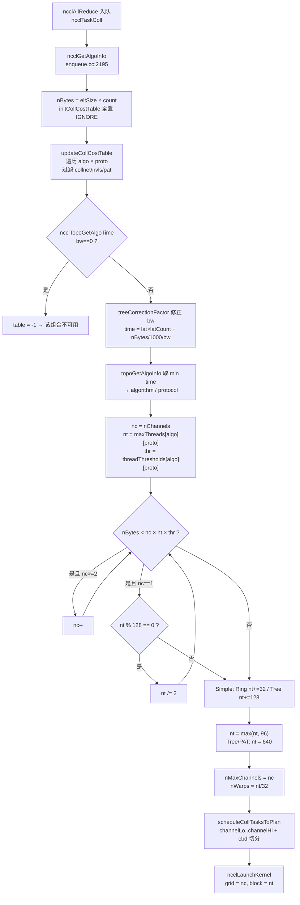

# 04 — 算法 / 协议选择与 Tuning 模型

> 前置：[03-channel-ring-tree.md](./03-channel-ring-tree.md)（channel 与 ring/tree 是怎么建出来的）。
> 本文回答一次 `ncclAllReduce` 进来后，NCCL **凭什么**选 `Ring` 还是 `Tree`、选 `Simple`/`LL`/`LL128`、开几个 channel、每 block 多少线程。
> 所有常量与行号均来自本仓库源码（NCCL 2.30.7 抽取版），已逐条 `read_file` 核对。

## 本文覆盖的源文件

| 文件 | 关键位置 | 在本文中的角色 |
|---|---|---|
| [`src/graph/tuning.cc`](../src/graph/tuning.cc) | 常量表 L156-229、`ncclTopoTuneModel` L260-635、`treeCorrectionFactor` L640-644、`ncclTopoGetAlgoTime` L647-672 | **本文主角**：所有带宽/延迟常量 + 时间模型 |
| [`src/enqueue.cc`](../src/enqueue.cc) | `initCollCostTable` L2010、`updateCollCostTable` L2020-2057、`topoGetAlgoInfo` L2074-2182、`ncclGetAlgoInfo` L2195-2252、`calcCollChunking` L2254+ | 代价表 → 选优 → 并行度降档 |
| [`src/include/plugin/nccl_tuner.h`](../src/include/plugin/nccl_tuner.h) | 算法/协议枚举 L33-49 | `NCCL_ALGO_*` / `NCCL_PROTO_*` 的编号 |
| [`src/include/comm.h`](../src/include/comm.h) | `threadThresholds` 默认值 L59-61、`ncclTaskColl` L203+ | 单线程工作量阈值 |
| [`src/include/device.h`](../src/include/device.h) | L100-128 各协议最大线程数、`ncclProtoGrainSize` L338-344 | nThreads 上限、协议粒度 |
| [`src/init.cc`](../src/init.cc) | `ncclAlgoStr`/`ncclProtoStr` L67-69、`computeBuffSizes` L836-868 | 算法/协议名字、buffer 大小 |
| [`src/device/generate.py`](../src/device/generate.py) + [`src/device/Makefile`](../src/device/Makefile) | `ONLY_FUNCS ?= AllReduce * * (RING\|TREE) *`（Makefile L24） | **决定哪些算法真的编出了 kernel** |
| [`src/include/param/`](../src/include/param) | 参数注册表 | `NCCL_ALGO`/`NCCL_PROTO` 等环境变量 |
| [`src/graph/connect.cc`](../src/graph/connect.cc) | `NCCL_MIN/MAX_NCHANNELS` L383-416 | channel 数的人工覆盖 |

---

## 主题一：算法空间 —— 哪些真的能用，哪些只是残留分支

### ① 解决什么问题

NCCL 源码里到处是 `NCCL_ALGO_COLLNET_DIRECT`、`NCCL_ALGO_NVLS`、`NCCL_ALGO_PAT` 的分支。读者很容易误以为它们都在参与决策。必须先划清边界，否则读 tuning 表会被一堆 0 搞晕。

### ② 一句话本质

> **本仓库（mini-nccl，单机多卡、只保留 AllReduce）实际只有 `RING` 和 `TREE` 两个算法参与竞争**；`COLLNET_*` / `NVLS` / `NVLS_TREE` / `PAT` 的代码分支保留但**在本场景恒被禁用**。

### ③ 代码链路

| 跳 | 位置 | 结论 |
|---|---|---|
| 1 | [`plugin/nccl_tuner.h:L33-L41`](../src/include/plugin/nccl_tuner.h#L33) | 7 个算法：`TREE`(0) `RING`(1) `COLLNET_DIRECT`(2) `COLLNET_CHAIN`(3) `NVLS`(4) `NVLS_TREE`(5) `PAT`(6) |
| 2 | [`init.cc:L67-L69`](../src/init.cc#L67) | 字符串表：`{"Tree","Ring","CollNetDirect","CollNetChain","NVLS","NVLSTree","PAT"}` / `{"LL","LL128","Simple"}` |
| 3 | [`src/device/Makefile:L24`](../src/device/Makefile#L24) | `ONLY_FUNCS ?= AllReduce * * (RING\|TREE) *` —— **只生成 RING/TREE 的 AllReduce kernel** |
| 4 | [`tuning.cc:L315`](../src/graph/tuning.cc#L315) | `if (coll == AllReduce && a == PAT) continue;` → PAT 带宽恒 0 |
| 5 | [`tuning.cc:L519`](../src/graph/tuning.cc#L519) | `nNodes == 1 && a == NVLS_TREE` → 禁用 |
| 6 | [`tuning.cc:L521-L524`](../src/graph/tuning.cc#L521) | `collnetEnable == 0` → `COLLNET_DIRECT` / `COLLNET_CHAIN` / (多节点时 `NVLS`) 禁用 |
| 7 | [`tuning.cc:L554-L555`](../src/graph/tuning.cc#L554) | `bandwidths = 0` 的组合在 `ncclTopoGetAlgoTime` 返回 `-1`，被 `topoGetAlgoInfo` 过滤 |
| 8 | [`enqueue.cc:L2035-L2039`](../src/enqueue.cc#L2035) | `!nvlsSupport` → 干脆不进代价表 |

### ④ 关键代码逐行解读

**构建期裁剪**（决定性证据）：

```python
# src/device/generate.py:84-90
algos_of_coll = {
  "AllGather":     ["RING","COLLNET_DIRECT","NVLS","PAT"],
  "AllGatherV":    ["RING"],
  "AllReduce":     ["TREE","RING","COLLNET_DIRECT","COLLNET_CHAIN","NVLS","NVLS_TREE"],
  ...
```
```make
# src/device/Makefile:22-24
# Only build AllReduce kernels (all redops/types) for RING/TREE algorithms
# with all protocols (SIMPLE, LL, LL128).
ONLY_FUNCS ?= AllReduce * * (RING|TREE) *
```

于是实际生成的 kernel 只有 6 个（以 sum_f32 为例，见 `build/obj/device/gensrc/all_reduce_sum_f32.cu`）：

```c
DEFINE_ncclDevFunc(AllReduce_Sum_f32_RING_LL,     ..., NCCL_ALGO_RING, NCCL_PROTO_LL)
DEFINE_ncclDevFunc(AllReduce_Sum_f32_RING_LL128,  ..., NCCL_ALGO_RING, NCCL_PROTO_LL128)
DEFINE_ncclDevFunc(AllReduce_Sum_f32_RING_SIMPLE, ..., NCCL_ALGO_RING, NCCL_PROTO_SIMPLE)
DEFINE_ncclDevFunc(AllReduce_Sum_f32_TREE_LL,     ..., NCCL_ALGO_TREE, NCCL_PROTO_LL)
DEFINE_ncclDevFunc(AllReduce_Sum_f32_TREE_LL128,  ..., NCCL_ALGO_TREE, NCCL_PROTO_LL128)
DEFINE_ncclDevFunc(AllReduce_Sum_f32_TREE_SIMPLE, ..., NCCL_ALGO_TREE, NCCL_PROTO_SIMPLE)
```

**运行期裁剪**：

```c
// src/graph/tuning.cc:515-529
  for (int f = 0; f < NCCL_NUM_FUNCTIONS; f++) {
    for (int a = 0; a < NCCL_NUM_ALGORITHMS; a++) {
      int disable = 0;
      // Disable NVLS 树 on a 单个 节点
      if (comm->nNodes == 1 && a == NCCL_ALGO_NVLS_TREE) disable = 1;
      // 若不支持 collnet，则一并禁用 Collnet+Direct、Collnet+Chain 与 Collnet+NVLS。
      if (comm->config.collnetEnable == 0 &&
          (a == NCCL_ALGO_COLLNET_DIRECT || a == NCCL_ALGO_COLLNET_CHAIN || (a == NCCL_ALGO_NVLS && comm->nNodes > 1)))
        disable = 1;
      if (comm->config.collnetEnable && a == NCCL_ALGO_COLLNET_CHAIN && comm->collNetChainSupport == 0) disable = 1;
      // Disable CollNet+Direct 否则 on an NVSwitch 系统
      if (nvsCount == 0 && a == NCCL_ALGO_COLLNET_DIRECT) disable = 1;
      if (disable) algoEnable[f * NCCL_NUM_ALGORITHMS + a] = 0;
    }
  }
```

- `collnetEnable` 默认在 `init.cc:L1481`（`COLLNET_CHAIN` 搜出 0 channel）和 `L1498-L1504`（节点数 < `NCCL_COLLNET_NODE_THRESHOLD`）被关掉 → 本仓库恒为 0。
- `nvlsSupport` 在 `init.cc:L1482`（`nvlsGraph->nChannels == 0`）被清零 → 无 NVSwitch 的 2 卡机器恒为 0。
- `PAT` 要求 "每节点 1 GPU"（[`tuning.cc:L237`](../src/graph/tuning.cc#L237) `if (comm->nNodes != comm->nRanks) return 0;`），2 卡 1 节点 → `nNodes=1 != nRanks=2` → 禁用。

### ⑤ 收益（定量）

| 算法 | 本仓库 2 卡 NVLink 单机 | 原因 |
|---|---|---|
| `RING` | ✅ 可用 | 有 kernel，带宽表非零 |
| `TREE` | ✅ 可用（但见主题五：模型上永不中选） | 有 kernel，带宽表非零 |
| `COLLNET_DIRECT` | ❌ | 无 kernel + `collnetEnable=0` + 无 NVSwitch |
| `COLLNET_CHAIN` | ❌ | 无 kernel + `collnetEnable=0` |
| `NVLS` | ❌ | 无 kernel + `nvlsSupport=0`（无 NVSwitch） |
| `NVLS_TREE` | ❌ | 无 kernel + 单节点直接禁用 |
| `PAT` | ❌ | 无 kernel + 要求 1 GPU/节点 |

### ⑥ 面试考点

1. **Q：源码里有 NVLS 分支，是不是说明单机也能用 NVLS？** A：不能。NVLS 需要 NVSwitch 硬件 + `cuMulticast` 支持；本仓库 2 卡直连场景 `nvlsSupport=0`（[`init.cc:L1482`](../src/init.cc#L1482)），且 `ONLY_FUNCS` 根本没生成 NVLS kernel。
2. **Q：怎么快速判断某个算法是否启用？** A：`NCCL_DEBUG=INFO NCCL_DEBUG_SUBSYS=ENV`，rank 0 会打印 "Enabled NCCL Func/Proto/Algo Matrix"（[`tuning.cc:L481-L510`](../src/graph/tuning.cc#L481)）。
3. **Q：`bandwidths[][][] == 0` 意味着什么？** A：该 (func, algo, proto) 组合不可用，`ncclTopoGetAlgoTime` 返回 `-1`（[`tuning.cc:L652-L655`](../src/graph/tuning.cc#L652)），`topoGetAlgoInfo` 里 `table[a][p] >= 0.0` 过滤掉（[`enqueue.cc:L2088`](../src/enqueue.cc#L2088)）。
4. **Q：PAT 是什么？** A：一种针对 AllGather/ReduceScatter 的树形算法（"Parallel Aggregated Tree"），与本仓库的 AllReduce 无关（`tuning.cc:L315` 直接 continue）。
5. **Q：为什么 CollNet 在没有 NVSwitch 时也被禁？** A：[`tuning.cc:L526`](../src/graph/tuning.cc#L526)：`nvsCount == 0 && a == COLLNET_DIRECT` → disable。CollNet Direct 依赖交换机侧聚合能力。

---

## 主题二：Ring AllReduce 为什么是"带宽最优"——通信量推导

### ① 解决什么问题

要判断"Ring 快还是 Tree 快"，必须先有各自的**理论时间下界**。这不是经验公式，是可以严格推导的。

### ② 一句话本质

> AllReduce 语义上需要 `2(N-1)` 次"每元素跨节点搬运"（`N-1` 次 reduce-scatter + `N-1` 次 all-gather），而系统有 `N` 条出口链路并行 → 下界时间 `T = 2(N-1)/N · S/B`。Ring 恰好达到这个下界，因此 **bus bandwidth = algbw × 2(N-1)/N，N→∞ 时 busbw → algbw**，且这个系数与 N 无关地"满血"。

### ③ 代码链路

| 跳 | 位置 | 内容 |
|---|---|---|
| 1 | [`tests/doc/PERFORMANCE.md:L49-L63`](../tests/doc/PERFORMANCE.md#L49) | 官方 busbw 系数推导 |
| 2 | [`enqueue.cc:L2279-L2285`](../src/enqueue.cc#L2279) | `AllReduce` + 非 NVLS/CollNet/Tree → `ncclPatternRingTwice` |
| 3 | [`enqueue.cc:L2419-L2422`](../src/enqueue.cc#L2419) | `ncclPatternRingTwice`：`nstepsPerLoop = 2*(nRanks-1)`，`nchunksPerLoop = nRanks` |
| 4 | [`tuning.cc:L306-L308`](../src/graph/tuning.cc#L306) | `nsteps = 2*(nRanks-1)`（AllReduce） |
| 5 | [`tuning.cc:L394-L399`](../src/graph/tuning.cc#L394) | `busBw ×= nRanks/nsteps` —— bus 带宽 ↔ 算法带宽的换算 |

### ④ 推导

**符号**：`N` = rank 数，`S` = 每个 rank 上的数据字节数（nccl-tests 里的 "size"），`B` = 每个 rank 的**出口带宽**（GB/s）。

**Step 1 — AllReduce 的固有通信量下界**

AllReduce = ReduceScatter + AllGather。

- ReduceScatter：每个 rank 最终持有 `S/N` 的规约结果。用树形/环形归约，总共需要把 `(N-1)·S/N` 字节汇聚到每个 rank 的对应分片 → **全系统共需 `(N-1)·S` 字节的跨 rank 传输**。
- AllGather：每个 rank 要拿到其它 `N-1` 份 `S/N` → **同样 `(N-1)·S` 字节**。

合计 `2(N-1)·S` 字节，而且这 `2(N-1)·S` 字节**必须**经过 rank 间的链路（不可能是本地的）。

**Step 2 — 系统能提供的并行带宽**

`N` 个 rank，每个 rank 出口带宽 `B`，若流量均匀分布 → 系统聚合出口带宽 `N·B`。

**Step 3 — 下界**

```
T_min = 2(N-1)·S / (N·B) = (S/B) · 2(N-1)/N
```

**Step 4 — Ring 如何达到下界**

Ring 把 `S` 切成 `N` 个 chunk（每 chunk `S/N`）：

- **ReduceScatter 阶段**：`N-1` 步，第 `k` 步每个 rank 把 `S/N` 发给 `next`、从 `prev` 收 `S/N` 并累加。每一步**所有 N 条链路同时满载**，每步耗时 `(S/N)/B`。
- **AllGather 阶段**：再 `N-1` 步，只转发不计算，同样每步 `(S/N)/B`。

```
T_ring = 2(N-1) · (S/N)/B = (S/B) · 2(N-1)/N = T_min   ✅
```

**Step 5 — bus bandwidth 的定义**

```
algbw = S / T
busbw = algbw · 2(N-1)/N          <-- nccl-tests 用的换算
```
代入 `T_ring`：`busbw = S / ((S/B)·2(N-1)/N) · 2(N-1)/N = B`。
**即 Ring AllReduce 的 busbw 恰好等于硬件单 rank 出口带宽 B**——这就是"打满"的定义。

**Step 6 — 代码里的对应**

```c
// src/graph/tuning.cc:306-308
    int nsteps = coll == ncclFuncAllReduce                                  ? 2 * (nRanks - 1) :
                 coll == ncclFuncReduceScatter || coll == ncclFuncAllGather ? nRanks - 1 :
                                                                              nRanks;
```
```c
// src/graph/tuning.cc:394-399
        if (!(a != NCCL_ALGO_RING && (coll == ncclFuncAllGather || coll == ncclFuncReduceScatter))) {
          float ratio = 1.0f;
          if (a == NCCL_ALGO_RING || a == NCCL_ALGO_NVLS || a == NCCL_ALGO_NVLS_TREE) ratio *= (1.0 * nRanks) / nsteps;
          else ratio *= .5;
          busBw *= ratio;
        }
```
`busBw`（硬件视角）`× nRanks/nsteps = busBw × N/(2(N-1))` 得到 `algbw`（算法视角，即 `S/T`）。对 N=2，`ratio = 2/2 = 1`，**algbw == busbw**。

### ⑤ 收益（定量）

| N | `2(N-1)/N` | 含义 |
|---|---|---|
| 2 | 1.000 | N=2 时 busbw = algbw |
| 4 | 1.500 | |
| 8 | 1.750 | |
| 16 | 1.875 | |
| ∞ | 2.000 | 渐近上界 |

- 对 **N=2**：Ring AllReduce 的 `busbw = algbw`。本仓库 README 报的 "128MB 档 busbw ≈ 281 GB/s" 也就是 algbw ≈ 281 GB/s。
- Ring 的**时间随 N 线性增长**（`2(N-1)` 步串行），这是它"延迟差"的根源。

### ⑥ 面试考点

1. **Q：`2(N-1)/N` 这个系数为什么小于 2？** A：因为最后一跳的数据其实不需要再"发一次"（reduce 的最后一步和 broadcast 的第一步可以重叠在同一个 rank 上），少了一次全量传输。
2. **Q：Ring 的延迟为什么是 `O(N)`？** A：`2(N-1)` 步是**串行依赖**的，每步至少付一次链路延迟 `≈1 µs`；N=1024 时就是 ~2000 µs。
3. **Q：`nchunksPerLoop = nRanks` 是什么意思？** A：Ring 把数据切成 `nRanks` 个 chunk（[`enqueue.cc:L2421`](../src/enqueue.cc#L2421)），每个 chunk 独立地在环上走 `2(N-1)` 步；不同 chunk 之间可以流水。
4. **Q：为什么 Ring 对**小**消息不好？** A：消息小于 `nChunks × 每个 chunk 的最小粒度` 时，切不出足够的 chunk 来流水，`2(N-1)` 步的延迟全部暴露。
5. **Q：Ring 的带宽模型里 `busBw = nChannels × bwIntra` 为什么没有 `2(N-1)/N` 项？** A：因为那个除法在 L396-398 由 `ratio` 完成（把 bus 带宽换算成算法带宽），两步是分开的。

---

## 主题三：Tree AllReduce —— 为什么延迟 `O(log N)` 但带宽打折

### ① 解决什么问题

Ring 的 `2(N-1)` 步串行在大 N 时延迟爆炸。Tree 用层次结构把步数压到 `2·log N`。

### ② 一句话本质

> Tree 的**步数是 `O(log N)`**（上行 reduce `log N` 跳 + 下行 broadcast `log N` 跳），但每一步只有部分节点参与、且靠近根的链路要承载不成比例的数据量 → **有效带宽只有硬件带宽的一个固定折扣**。double binary tree 通过"两棵树各背一半数据 + 角色互换"把上行/下行**同时**用起来，把折扣从 ~1/2 挽回一些。

### ③ 代码链路

| 跳 | 位置 | 内容 |
|---|---|---|
| 1 | [`enqueue.cc:L2284`](../src/enqueue.cc#L2284) | `AllReduce` + `TREE` → `ncclPatternTreeUpDown` |
| 2 | [`enqueue.cc:L2395-L2403`](../src/enqueue.cc#L2395) | `ncclPatternTreeUpDown`：`nstepsPerLoop = nchunksPerLoop = 1` |
| 3 | [`tuning.cc:L431-L434`](../src/graph/tuning.cc#L431) | Tree 的延迟模型 `2·((ppn-1)·intraLat + log2(nNodes)·interLat)` |
| 4 | [`tuning.cc:L347-L353`](../src/graph/tuning.cc#L347) | Tree 的带宽折扣：×0.92、`/3.8`(LL)、`×7/9`(LL128,单节点)、`×0.85`(pattern==TREE) |
| 5 | [`tuning.cc:L397`](../src/graph/tuning.cc#L397) | `else ratio *= .5` —— Tree 的 bus→algo 换算系数是 **0.5** |
| 6 | [`trees.cc:L116`](../src/graph/trees.cc#L116) | 双二叉树的构造 |

### ④ 关键代码逐行解读

```c
// src/graph/tuning.cc:341-353
        float busBw = graphs[a]->nChannels * bw;
        // 各种 model refinements
        if (a == NCCL_ALGO_RING && p == NCCL_PROTO_LL) busBw = std::min(llMaxBw, busBw * .5);
        if (a == NCCL_ALGO_RING && p == NCCL_PROTO_LL128)
          busBw = std::min(busBw * (0.92 /*120.0/128.0*/), graphs[a]->nChannels * perChMaxRingLL128Bw);
        if (a == NCCL_ALGO_TREE && coll == ncclFuncAllReduce)
          busBw = std::min(busBw * .92, graphs[a]->nChannels * perChMaxTreeBw);
        if (a == NCCL_ALGO_TREE && p == NCCL_PROTO_LL) busBw = std::min(busBw * 1.0 / 3.8, llMaxBw);
        if (a == NCCL_ALGO_TREE && p == NCCL_PROTO_LL128)
          busBw =
            std::min(busBw * (nNodes == 1 ? 7.0 / 9.0 : 120.0 / 128.0), graphs[a]->nChannels * perChMaxTreeLL128Bw);
        if (a == NCCL_ALGO_TREE && comm->maxTreePattern == NCCL_TOPO_PATTERN_TREE) busBw *= .85;
```

Tree 相对 Ring 的**复合折扣**（AllReduce，单节点，`maxTreePattern != TREE`）：

| 协议 | Tree 折扣 | Ring 折扣 | Tree/Ring |
|---|---|---|---|
| LL | `0.92 × (1/3.8) × 0.5` = **0.121** | `0.5` | **0.242** |
| LL128 | `0.92 × (7/9) × 0.5` = **0.358** | `0.92` | **0.389** |
| Simple | `0.92 × 0.5` = **0.46** | `1.0` | **0.46** |

（最后一步的 `×0.5` 来自 L397 `ratio *= .5`。）

**为什么是 0.5**：Tree AllReduce 一次通信里，每个"元素"在 reduce 阶段上行、在 broadcast 阶段下行，**同一条链路在任一时刻只朝一个方向传**，而 Ring 是收发同时满载（全双工）。NCCL 的 bus-bw 口径把 Ring 的双向计成一份，Tree 只能计一半。

**延迟模型**：

```c
// src/graph/tuning.cc:431-434
        } else if (a == NCCL_ALGO_TREE) {
          if (coll == ncclFuncAllReduce) {
            comm->latencies[coll][a][p] += 2 * ((nRanks / nNodes - 1) * intraLat + log2i(nNodes) * interLat);
          }
        }
```
- 单节点时 `nRanks/nNodes - 1 = ppn - 1`，`log2i(1) = 0` → `lat = 2·(ppn-1)·intraLat`。
- 对 **ppn=2**：`lat = 2·intraLat`，即**只有 2 跳**（上行 1 跳 + 下行 1 跳）。而 Ring 的 `2(N-1) = 2` 也是 2 跳 —— **2 卡时 Tree 的延迟优势完全消失**。

### ⑤ 收益（定量）

| 指标 | Ring | Tree（单节点，ppn=P） |
|---|---|---|
| 步数（延迟项） | `2(N-1)` | `2·(P-1)`（节点内）+ `2·log2(nNodes)`（跨节点） |
| N=2 单节点 | 2 跳 | **2 跳**（相等） |
| N=8 单节点 | 14 跳 | **14 跳**（相等！） |
| N=8，跨 8 节点（1 GPU/节点） | 14 跳 | **6 跳**（`2·log2(8)`） |
| AllReduce 有效带宽系数 | 1.0 | **0.46**（Simple） |

> 关键洞察：**单节点内（nNodes=1）Tree 的延迟根本不是 `O(log N)`**，因为节点内 tree 是按 `intra[]` 线性排列的一条链（`ppn-1` 跳），`log2i(1)=0`。`O(log N)` 的优势只在**跨节点**时体现。这直接导致本仓库 2 卡场景下 Tree 没有任何胜算（见主题五）。

### ⑥ 面试考点

1. **Q：Tree 的延迟为什么是 `O(log N)`？** A：严格说是 `2·log2(nNodes) + 2·(ppn-1)`（[`tuning.cc:L433`](../src/graph/tuning.cc#L433)）。只有跨节点部分是对数；节点内是线性链。
2. **Q：Tree 带宽打折的两个来源？** A：① 单工（上行/下行不能同时用）→ `×0.5`；② 中间节点扇入扇出和 pattern 限制 → `×0.92`，`TREE` pattern 再 `×0.85`。
3. **Q：double binary tree 解决什么问题？** A：让一个节点在树 0 里是叶子（无子）时在树 1 里是内部节点（有子），从而**上行和下行带宽同时被占用**，且消除单根瓶颈（[`trees.cc:L116-L138`](../src/graph/trees.cc#L116)）。
4. **Q：`ncclPatternTreeUpDown` 的 `nstepsPerLoop = 1` 说明什么？** A：Tree 一个"loop"就完成一次完整的 up+down，chunk 切分与 Ring 不同（[`enqueue.cc:L2402`](../src/enqueue.cc#L2402)）。
5. **Q：什么时候 Tree 真的比 Ring 快？** A：多节点、中等消息、且节点间网络延迟主导时（此时 `2·log2(nNodes) << 2(N-1)`）。

---

## 主题四：协议 SIMPLE / LL / LL128 —— 数据通路与开销模型

### ① 解决什么问题

同一条 NVLink 上，怎么把"数据"和"数据就绪"这个信号一起传过去？

- 用 **flag 与数据分离**（SIMPLE）：需要额外的内存屏障（`__threadfence`）+ 独立的 flag 写，延迟高但数据 100% 是有效载荷。
- 用 **flag 内联在数据里**（LL/LL128）：一次原子写同时带上数据和 flag，延迟低，但要牺牲一部分带宽放 flag。

### ② 一句话本质

> **LL**：每 16 B 的 FIFO line 里 8 B 数据 + 8 B flag → **有效载荷 50%**，换极低延迟（无 fence、单条 8B 原子写）。
> **LL128**：每 128 B 的 line 里 120 B 数据 + 8 B flag → **有效载荷 15/16 = 93.75%**，用 128 B 的向量化 store 换"接近 Simple 的带宽 + 接近 LL 的延迟"。
> **SIMPLE**：数据满带宽，但要 `__threadfence_system()` 保证可见性 + 独立的 head/tail 推进 → 延迟最高。

### ③ 代码链路

| 跳 | 位置 | 内容 |
|---|---|---|
| 1 | [`device.h:L85-L98`](../src/include/device.h#L85) | `union ncclLLFifoLine`：4B data + 4B flag ×2 = 16 B 装 8 B 数据 |
| 2 | [`device.h:L120-L122`](../src/include/device.h#L120) | `NCCL_LL128_LINESIZE 128`、`LINEELEMS 16`、`DATAELEMS 15` |
| 3 | [`device.h:L338-L344`](../src/include/device.h#L338) | `ncclProtoGrainSize`：LL=16 B、SIMPLE=512 B、LL128=`32*8/16*15*8`=1920 B |
| 4 | [`init.cc:L824-L830`](../src/init.cc#L824) | 三协议 buffer 大小（LL 512 KiB / LL128 4.69 MiB / SIMPLE 4 MiB） |
| 5 | [`tuning.cc:L344-L352`](../src/graph/tuning.cc#L344) | 带宽折扣：Ring LL ×0.5、Ring LL128 ×0.92、Tree LL /3.8、Tree LL128 ×7/9 |
| 6 | [`tuning.cc:L176-L192`](../src/graph/tuning.cc#L176) | 三协议的 `hwLatencies`：LL 最小、LL128 居中、Simple 最大 |
| 7 | [`tuning.cc:L531-L553`](../src/graph/tuning.cc#L531) | LL128 的启用门槛（`typeIntra <= PATH_NVB`、`typeInter <= PATH_PXB/PXN`、compCap 等） |

### ④ 关键代码逐行解读

**LL 的 50% 编码**（这就是"用一半带宽换低延迟"的物理来源）：

```c
// src/include/device.h:85-98
union ncclLLFifoLine {
  /* Flags 必须放在数据之后，否则一次不完整的网络接收可能只收到 flag 而没收到数据。
     这里假设：要么收到连续的数据块(sockets)，要么以 8 字节原子性写入(IB/RDMA)。 */
  struct {
    uint32_t data1;
    uint32_t flag1;
    uint32_t data2;
    uint32_t flag2;
  };
  uint64_t v[2];
  int4 i4;
};
```
- 一条 16 B 的 line，载荷是 `data1(4B) + data2(4B) = 8 B` → **50%**。
- 发送方一次 `st.global.v2.u64`（写 `v[0]`,`v[1]`）就把 data+flag 一起原子地送出去，接收方 poll flag 即可，**不需要 `__threadfence_system()`**。

**LL128 的 15/16 编码**：

```c
// src/include/device.h:120-128
#define NCCL_LL128_LINESIZE 128
#define NCCL_LL128_LINEELEMS (NCCL_LL128_LINESIZE / sizeof(uint64_t))   // 16
#define NCCL_LL128_DATAELEMS (NCCL_LL128_LINEELEMS - 1)                 // 15

#define NCCL_LL128_MAX_NTHREADS 640
#define NCCL_LL128_ELEMS_PER_THREAD 120
```
- 一条 128 B 的 line = 16 个 `uint64`，其中 1 个当 flag，15 个（120 B）装数据 → **93.75%**。
- 一次 128 B 的向量化 store（`int4` ×2 或 `st.global.v4`）送 120 B 数据 + flag，兼具 LL 的"无 fence"和接近 Simple 的粒度。

**模型里的开销系数**：

```c
// src/graph/tuning.cc:344-352
        if (a == NCCL_ALGO_RING && p == NCCL_PROTO_LL) busBw = std::min(llMaxBw, busBw * .5);
        if (a == NCCL_ALGO_RING && p == NCCL_PROTO_LL128)
          busBw = std::min(busBw * (0.92 /*120.0/128.0*/), graphs[a]->nChannels * perChMaxRingLL128Bw);
        if (a == NCCL_ALGO_TREE && coll == ncclFuncAllReduce)
          busBw = std::min(busBw * .92, graphs[a]->nChannels * perChMaxTreeBw);
        if (a == NCCL_ALGO_TREE && p == NCCL_PROTO_LL) busBw = std::min(busBw * 1.0 / 3.8, llMaxBw);
        if (a == NCCL_ALGO_TREE && p == NCCL_PROTO_LL128)
          busBw =
            std::min(busBw * (nNodes == 1 ? 7.0 / 9.0 : 120.0 / 128.0), graphs[a]->nChannels * perChMaxTreeLL128Bw);
```
- Ring/LL：`×0.5`（正好对应 8/16），且**有绝对上限 `llMaxBw`**（Hopper 单节点 = 141 GB/s）。
- Ring/LL128：`×0.92`（比理论的 0.9375 略保守），且有**每 channel 上限 `perChMaxRingLL128Bw`**（Hopper = 36.7 GB/s/channel）。
- Tree/LL：`/3.8`（0.92/3.8 ≈ 0.242，再乘 0.5 的 ratio → 0.121），是三者里最狠的折扣。
- Tree/LL128（单节点）：`×7/9 ≈ 0.778`（比 Ring 的 0.92 更保守，因为 tree 的 128B line 利用率更差）。

**延迟（每跳）**，以 NVLink 为例（[`tuning.cc:L176`](../src/graph/tuning.cc#L176)）：

| 协议 | Tree 每跳 | Ring 每跳 | 说明 |
|---|---|---|---|
| LL | 0.6 µs | 0.6 µs | 最小 |
| LL128 | 1.25 µs | 1.9 µs | |
| Simple | 4.0 µs | 3.4 µs | 含 fence 开销 |

**而 baseLatencies（[`tuning.cc:L166-L172`](../src/graph/tuning.cc#L166)）却是反直觉的**：

| 算法 | LL | LL128 | Simple |
|---|---|---|---|
| Tree | 6.8 | **14.0** | 8.4 |
| Ring | 6.6 | **14.0** | 8.4 |

**LL128 的固定延迟（14.0）比 Simple（8.4）还高**——这是理解"LL128 什么时候赢"的关键。LL128 赢在**斜率**（带宽）而不在固定延迟；它只有在"每跳延迟 × 步数"这一项 Simple 明显吃亏（大 N / 多节点）时才能胜出。

**LL128 的启用门槛**（不是所有机器都开）：

```c
// src/graph/tuning.cc:531-553
        int pEnable = protoEnable[c * NCCL_NUM_PROTOCOLS + p];
        if (pEnable == 2 && p == NCCL_PROTO_LL128) {
          pEnable = 1;
          if (ncclParamLl128C2c() && minCompCap >= 90) {
            // 仅在 Hopper/Blackwell 架构上默认启用 LL128，且连接类型不超过 P2C 与 PXN。
            pEnable &= (graphs[a]->typeInter <= PATH_PXN);
          } else {
            // 只在 PXB 及以内启用 LL128。不要在 PxN 上启用
            pEnable &= (graphs[a]->typeInter <= PATH_PXB);
          }
          pEnable &= (graphs[a]->typeIntra <= PATH_NVB);
          pEnable &= (minCompCap == maxCompCap || minCompCap >= 90);
          pEnable &= !(minCompCap < 70 || (minCompCap == 90 && CUDART_VERSION == 11080 && c == ncclFuncAllReduce &&
                                           a == NCCL_ALGO_RING && comm->nRanks == 2));
        }
```
默认 `protoEnable[LL128] = 2`（"条件启用"，[`tuning.cc:L463`](../src/graph/tuning.cc#L463)），其余协议 = 1（直接启用）。

### ⑤ 收益（定量）

| 协议 | payload 效率 | 每跳延迟(NVLink, Ring) | 固定延迟(Ring) | 适用 |
|---|---|---|---|---|
| LL | **50%** | 0.6 µs | 6.6 µs | 小消息（延迟主导） |
| LL128 | **93.75%**（模型取 92%） | 1.9 µs | 14.0 µs | 中等消息（大 N/多节点时） |
| SIMPLE | **100%** | 3.4 µs | 8.4 µs | 大消息（带宽主导） |

- `ncclProtoGrainSize`：LL=16 B、SIMPLE=512 B、LL128=1920 B（[`device.h:L338-L344`](../src/include/device.h#L338)）——**chunk 必须是 grain 的整数倍**，这限制了小消息能切多细。
- LL 的 flag 清理掩码 `NCCL_LL_CLEAN_MASK = 0x7ffffff8`，有 `static_assert(NCCL_LL_CLEAN_MASK % NCCL_STEPS == 0)`（[`device.h:L118`](../src/include/device.h#L118)）。

### ⑥ 面试考点

1. **Q：LL 为什么能省掉 fence？** A：flag 和数据在**同一个 8 字节原子写**里，接收方看到 flag 就必然看到数据（[`device.h:L86-L89`](../src/include/device.h#L86) 的注释专门解释了这个顺序）。
2. **Q：LL 为什么只有 50% 带宽？** A：`ncclLLFifoLine` 16 B 里 8 B 是 flag。
3. **Q：LL128 的"128"指什么？** A：FIFO line 是 128 B（`NCCL_LL128_LINESIZE`），其中 120 B 是数据。
4. **Q：LL128 一定比 Simple 好吗？** A：不一定。LL128 的固定延迟（14.0 µs）比 Simple（8.4 µs）高，带宽（92%）比 Simple（100%）低；**只有在跳数很多（Simple 的每跳延迟累加起来超过差额）时 LL128 才赢**。
5. **Q：LL128 在哪些机器上被关掉？** A：`minCompCap < 70`、或异构 compCap 且最小 < 90、或 `typeIntra > PATH_NVB`（即路径经 PCIe bridge 以上）、或 `typeInter > PATH_PXB/PXN`（[`tuning.cc:L537-L552`](../src/graph/tuning.cc#L537)）。
6. **Q：`NCCL_PROTO=^LL128` 会怎样？** A：`parseList` 解析 `^` 前缀为"取反"，把 LL128 置 0（[`tuning.cc:L99-L106`](../src/graph/tuning.cc#L99)）→ `bandwidths[...][LL128] = 0`。

---

## 主题五：Tuning 模型 —— `ncclTopoTuneModel` 的常量表与时间公式

### ① 解决什么问题

有了 7 种算法 × 3 种协议 = 21 个候选，怎么在不实际跑的前提下预判"哪个最快"？

### ② 一句话本质

> NCCL 用一个**极简的两参数线性模型**给每个 (func, algo, proto) 组合打分：
> **`time = latency + nBytes / bandwidth`**（单位 µs）。
> `latency` 和 `bandwidth` 两张三维表（`comm->latencies[coll][algo][proto]` / `comm->bandwidths[coll][algo][proto]`）在 `ncclCommInitRank` 阶段由 `ncclTopoTuneModel` 一次性算好，之后每次 AllReduce 只是查表 + 一次除法。

### ③ 代码链路

| 跳 | 位置 | 内容 |
|---|---|---|
| 1 | [`tuning.cc:L254-L258`](../src/graph/tuning.cc#L254) | `ncclTopoInitTunerConstants`：拷贝默认常量到 `comm->tunerConstants` |
| 2 | [`tuning.cc:L260`](../src/graph/tuning.cc#L260) | `ncclTopoTuneModel` 主体 |
| 3 | [`tuning.cc:L261-L274`](../src/graph/tuning.cc#L261) | 先算 `maxThreads[algo][proto]` |
| 4 | [`tuning.cc:L280-L293`](../src/graph/tuning.cc#L280) | 选索引：`compCapIndex`、`index1`、`index2` |
| 5 | [`tuning.cc:L300-L303`](../src/graph/tuning.cc#L300) | `intraHw[]` / `hw[]`：NVLink or PCI or NET |
| 6 | [`tuning.cc:L323-L356`](../src/graph/tuning.cc#L323) | 算 `busBw`（带宽表） |
| 7 | [`tuning.cc:L400-L452`](../src/graph/tuning.cc#L400) | 算 `latencies`（延迟表） |
| 8 | [`tuning.cc:L560-L602`](../src/graph/tuning.cc#L560) | rank 0 打印整张表（`NCCL_DEBUG_SUBSYS=TUNING`） |

### ④ 常量表（全部抄录，带源码链接）

**A. `baseLatencies[algo][proto]`**（µs，固定开销）—— [`tuning.cc:L166-L172`](../src/graph/tuning.cc#L166)

| 算法 | LL | LL128 | Simple |
|---|---|---|---|
| Tree | 6.8 | 14.0 | 8.4 |
| Ring | 6.6 | 14.0 | 8.4 |
| CollNetDirect / CollNetChain / NVLS / NVLSTree | 0 | 0 | 0 |
| PAT | 8.0 | 8.0 | 8.0 |

**B. `hwLatencies[hw][algo][proto]`**（µs，**每跳**延迟）—— [`tuning.cc:L173-L193`](../src/graph/tuning.cc#L173)

| 链路 | 算法 | LL | LL128 | Simple |
|---|---|---|---|---|
| **NVLINK** | Tree | 0.6 | 1.25 | 4.0 |
| | Ring | 0.6 | 1.9 | 3.4 |
| | CollNetDirect | 0 | 0 | 3.7 |
| | CollNetChain | 0 | 0 | 2.8 |
| | NVLS / NVLSTree | 0 | 0 | 25 |
| | PAT | 0 | 0 | 4.0 |
| **PCI** | Tree | 1.0 | 1.9 | 4.0 |
| | Ring | 1.0 | 2.5 | 5.7 |
| | CollNetDirect | 0 | 0 | 3.7 |
| | CollNetChain | 0 | 0 | 2.8 |
| | PAT | 0 | 0 | 4.0 |
| **NET** | Tree | 5.0 | 8.5 | 14 |
| | Ring | 2.7 | 4.0 | 14.0 |
| | CollNetDirect | 0 | 0 | 31 |
| | CollNetChain | 0 | 0 | 30 |
| | NVLS | 0 | 0 | 18 |
| | NVLSTree | 0 | 0 | 20.9 |
| | PAT | 0 | 0 | 14 |

**C. `llMaxBws[index1][index2]`**（GB/s，LL 协议的绝对带宽上限）—— [`tuning.cc:L194-L200`](../src/graph/tuning.cc#L194)

| | N1 | N2 | N4 |
|---|---|---|---|
| Volta | 39.0 | 39.0 | 20.4 |
| Ampere | 87.7 | 22.5 | 19.0 |
| **Hopper** | **141.0** | **45.0** | **35.0** |
| Blackwell | 2×141.0 | 2×45.0 | 2×35.0 |

**D. `perChMaxRingLL128Bws[compCap][index2]`**（GB/s，**每 channel** Ring/LL128 上限）—— [`tuning.cc:L201-L207`](../src/graph/tuning.cc#L201)

| Volta | Ampere | **Hopper** | Blackwell |
|---|---|---|---|
| 20.0 | 20.0 | **36.7** | 40.0 |

**E. `perChMaxTreeLL128Bws`** —— [`tuning.cc:L208-L214`](../src/graph/tuning.cc#L208)

| | N1 | N2 | N4 |
|---|---|---|---|
| Volta | 20.0 | 20.0 | 20.0 |
| Ampere | 20.0 | 20.0 | 20.0 |
| **Hopper** | **36.7** | **36.7** | **29.0** |
| Blackwell | 55.6 | 31.67 | 20.0 |

**F. `perChMaxTreeBws`** —— [`tuning.cc:L215-L221`](../src/graph/tuning.cc#L215)

| | N1 | N2 | N4 |
|---|---|---|---|
| Volta | 26.5 | 18.5 | 10.0 |
| Ampere | 24.0 | 23.6 | 17.8 |
| **Hopper** | **38.7** | **41.4** | **36.0** |
| Blackwell | 70.0 | 42.8 | 24.0 |

**G. `perChMaxNVLSTreeBws`** —— [`tuning.cc:L222-L228`](../src/graph/tuning.cc#L222)

| | N1 | N2 | N4 |
|---|---|---|---|
| Hopper | 0.0 | 57.7 | 45.5 |
| Blackwell | 0.0 | 96.0 | 80.0 |

**H. `nvlsEfficiency`** — `{0.0(Volta), 0.0(Ampere), 0.85(Hopper), 0.74(Blackwell)}` —— [`tuning.cc:L156-L161`](../src/graph/tuning.cc#L156)

**I. 索引选择规则**（[`tuning.cc:L280-L288`](../src/graph/tuning.cc#L280)）：

```c
  int compCapIndex = minCompCap >= 100 ? NCCL_BLACKWELL_COMPCAP_IDX :
                                         (minCompCap >= 90 ? NCCL_HOPPER_COMPCAP_IDX :
                                          minCompCap >= 80 ? NCCL_AMPERE_COMPCAP_IDX :
                                                             NCCL_VOLTA_COMPCAP_IDX);
  int index2 = nNodes <= 2 ? nNodes - 1 : 2;
  // LL 协议：单节点场景看 GPU 型号，多节点场景看 CPU 型号(因为瓶颈位置不同)
  int index1 = nNodes == 1 ? compCapIndex :
               (comm->cpuVendor == NCCL_TOPO_CPU_VENDOR_AMD || comm->cpuVendor == NCCL_TOPO_CPU_VENDOR_MIXED) ? 1 : 0;
```

**J. `treeCorrectionFactor[proto][logSize]`**（经验修正，24 档，`logSize = log2(nBytes/64)`，覆盖 64 B ~ 256 MB）—— [`tuning.cc:L640-L644`](../src/graph/tuning.cc#L640)

| 协议 | 0-3 | 4 | 5 | 6 | 7 | 8 | 9 | 10 | 11-14 | 15 | 16 | 17 | 18 | 19 | 20 | 21-23 |
|---|---|---|---|---|---|---|---|---|---|---|---|---|---|---|---|---|
| LL | 1.0 | .9 | .8 | .7 | .7 | .7 | .7 | .6 | .5 | .4 | .5 | .6 | .7 | .8 | .9 | 1.0 |
| LL128 | 1.0 | 1.0 | .9 | .8 | .8 | .8 | .7 | .6 | .6 | .6 | .6 | .8 | .9 | .9 | .9 | 1.0 |
| Simple | .9 | .9 | .9 | .9 | .9 | .9 | .8 | .7 | .6 | .5 | .6 | .7 | .8 | .7 | .8 | .9 |

**K. 时间公式**（[`tuning.cc:L647-L672`](../src/graph/tuning.cc#L647)）：

```c
ncclResult_t ncclTopoGetAlgoTime(struct ncclComm* comm, int coll, int algorithm, int protocol, size_t nBytes,
                                 int numPipeOps, float* time) {
  float bw = comm->bandwidths[coll][algorithm][protocol];
  float lat = comm->latencies[coll][algorithm][protocol];

  if (bw == 0) { *time = -1.0; return ncclSuccess; }
  int logSize = log2i(nBytes >> 6);
  if (algorithm == NCCL_ALGO_TREE && coll == ncclFuncAllReduce && logSize >= 0 && logSize < 23) {
    bw *= treeCorrectionFactor[protocol][logSize];
  }
  ...
  // 树 pipelining saves 延迟 入 aggregation 情形
  int latCount = algorithm == NCCL_ALGO_RING ? numPipeOps : DIVUP(numPipeOps, NCCL_MAX_DEV_WORK_BATCH_COLLS);
  *time = lat * latCount + nBytes / (1000 * bw);
  return ncclSuccess;
}
```

量纲校验：`nBytes [B] / bw [GB/s]` → 单位为 ns；再 `/1000` → **µs**。`lat` 也是 µs。非聚合时 `numPipeOps = 1` → `latCount = 1`。

### ⑤ 收益（定量）

- 一张 `7 × 3 = 21` 项的表在 init 阶段算一次，之后**每次 AllReduce 只花 21 次乘加 + 21 次比较**（`topoGetAlgoInfo`，[`enqueue.cc:L2083-L2094`](../src/enqueue.cc#L2083)）——决策开销可忽略。
- `NCCL_DEBUG=INFO NCCL_DEBUG_SUBSYS=TUNING` 能看到 rank 0 打印的完整表（[`tuning.cc:L560-L602`](../src/graph/tuning.cc#L560)），格式是每格 `lat/bw`，如 `15.2/160.0`。

### ⑥ 面试考点

1. **Q：这个模型有多准？** A：它是**一阶线性模型**，只保证"选出的组合大概率不差"；`treeCorrectionFactor` 本身就是承认"中等数据量下模型的预测与实测有偏差"（[`tuning.cc:L637-L639`](../src/graph/tuning.cc#L637) 的注释原话：*"虽不够优雅但效果相当好"*）。
2. **Q：`busBw` 和 `algbw` 在代码里怎么区分？** A：`comm->bandwidths[][][]` 存的是**算法带宽**（即 `S/T`），由 `busBw × ratio` 得到（[`tuning.cc:L394-L399`](../src/graph/tuning.cc#L394)）。
3. **Q：`index1` 为什么单节点看 GPU、多节点看 CPU？** A：LL 协议的瓶颈位置不同：单节点瓶颈在 GPU/NVLink，多节点瓶颈在网络与 CPU 的 PCIe 拓扑。
4. **Q：`llMaxBw` 为什么是"绝对上限"而不是每 channel 上限？** A：LL 协议依赖全局的 flag 轮询与清理（`NCCL_LL_CLEAN_MASK`），其吞吐不随 channel 数线性增长，所以是全 comm 共享的天花板。
5. **Q：为什么 Hopper 的 `perChMaxRingLL128Bw` 是 36.7 而 Blackwell 是 40.0？** A：这两个数是实测拟合出来的每 channel 上限（注释里写 `avg of ring & tree` 的是 llMaxBws 那张表），反映的是该架构下单 channel 能压出的 LL128 吞吐。

---

## 主题六：最终决策 —— 阈值、并行度降档、环境变量与"2 卡实际选中什么"

### ① 解决什么问题

模型给了时间，还要回答：选完之后开几条 channel、每 block 多少线程？以及——**在本仓库 2 卡 H20 NVLink 上，最终到底选了什么？**

### ② 一句话本质

> 决策三步：① 查代价表选 **min(time)** 的 (algo, proto)；② 用 `nBytes < nc × nt × threadThreshold` 逐步**降 nc**（到 1 为止）；③ nc 降到底还不够就**把 nt 折半**（要求 `nt % 128 == 0`）。最后 Simple 协议补同步线程、Tree 固定 640 线程。

### ③ 代码链路

| 跳 | 位置 | 内容 |
|---|---|---|
| 1 | [`enqueue.cc:L466`](../src/enqueue.cc#L466) | `ncclGetAlgoInfo(comm, &agg, collNetSupport, nvlsSupport, nTasksPerChannel, simInfo)` |
| 2 | [`enqueue.cc:L2210-L2211`](../src/enqueue.cc#L2210) | 建代价表 + 用 `ncclTopoGetAlgoTime` 填表 |
| 3 | [`enqueue.cc:L2074`](../src/enqueue.cc#L2074) | `topoGetAlgoInfo`：选优 |
| 4 | [`enqueue.cc:L2151-L2168`](../src/enqueue.cc#L2151) | nc / nt 降档 |
| 5 | [`enqueue.cc:L2169-L2181`](../src/enqueue.cc#L2169) | Simple 补线程、Tree 钉 640、下限 96 |
| 6 | [`tuning.cc:L605-L625`](../src/graph/tuning.cc#L605) | `threadThresholds` 的默认值与环境变量覆盖 |
| 7 | [`tuning.cc:L470-L479`](../src/graph/tuning.cc#L470) | `NCCL_PROTO` / `NCCL_ALGO` 解析 |
| 8 | [`enqueue.cc:L846-L849`](../src/enqueue.cc#L846) | 打印最终选择（`NCCL_DEBUG_SUBSYS=TUNING`） |

### ④ 关键代码逐行解读

**第一步：选 (algo, proto)**

```c
// src/enqueue.cc:2079-2098
  float minTime = FLT_MAX;
  int algorithm = info->algorithm = NCCL_ALGO_UNDEF;
  int protocol = info->protocol = NCCL_PROTO_UNDEF;
  for (int a = 0; a < NCCL_NUM_ALGORITHMS; a++) {
    for (int p = 0; p < NCCL_NUM_PROTOCOLS; p++) {
      if (table[a][p] == NCCL_ALGO_PROTO_IGNORE) continue;
      if (table[a][p] >= 0.0 && table[a][p] < minTime) {
        algorithm = a; protocol = p; minTime = table[a][p];
      }
    }
  }
  info->algorithm = algorithm;
  info->protocol = protocol;
```

**第二、三步：并行度降档**

```c
// src/enqueue.cc:2127-2181（节选）
  int nc = comm->nChannels;                                          // 起始 channel 数 = 通信域可用全部 channel
  int nt = comm->maxThreads[info->algorithm][info->protocol];        // 该算法/协议每 block 最大线程数
  int threadThreshold = comm->threadThresholds[info->algorithm][info->protocol];
  ...
  } else {
    // 环/树 的 通道 调优：数据量不够就逐个减少 通道，但至少保留 1 个
    while (nBytes < nc * nt * threadThreshold) {
      if (nc >= 2) nc--;
      else break;
    }
  }

  // 第三步：通道 数减到头之后，如果数据量依然偏小，继续折半减少线程数。
  // 限制 nt % 128 == 0 是为了保证减半后仍是 128 的整数倍(线程束对齐)
  if (info->algorithm != NCCL_ALGO_NVLS && info->algorithm != NCCL_ALGO_NVLS_TREE &&
      info->algorithm != NCCL_ALGO_COLLNET_DIRECT) {
    while (nBytes < nc * nt * threadThreshold) {
      if (nt % 128 == 0) nt /= 2;
      else break;
    }
  }
  // 第四步：为 Simple 协议追加同步所需的额外线程
  if (info->protocol == NCCL_PROTO_SIMPLE) {
    if (info->algorithm == NCCL_ALGO_RING) nt += WARP_SIZE;      // 额外一个 warp 专门负责同步
    if (info->algorithm == NCCL_ALGO_TREE) nt += 4 * WARP_SIZE;  // 上行组 + 下行组各自需要同步 warp
  }
  // 兜底：至少保证 3 个 线程束
  nt = nt / WARP_SIZE < 3 ? 3 * WARP_SIZE : nt;
  if (info->algorithm == NCCL_ALGO_TREE) nt = NCCL_MAX_NTHREADS;   // Tree 恒定使用全部线程(640)
  if (info->algorithm == NCCL_ALGO_PAT)  nt = NCCL_MAX_NTHREADS;
  info->nMaxChannels = nc;
  info->nWarps = nt / WARP_SIZE;
```

**nThreads 的默认值**（[`tuning.cc:L261-L274`](../src/graph/tuning.cc#L261)）：

```c
  int simpleDefaultThreads =
    (graphs[NCCL_ALGO_RING]->bwIntra * graphs[NCCL_ALGO_RING]->nChannels <= PCI_BW) ? 256 : NCCL_SIMPLE_MAX_NTHREADS;
  comm->maxThreads[NCCL_ALGO_RING][NCCL_PROTO_SIMPLE] =
    getNthreads("NCCL_NTHREADS", ncclParamNthreads(), 2 * WARP_SIZE, NCCL_SIMPLE_MAX_NTHREADS, simpleDefaultThreads);
  comm->maxThreads[NCCL_ALGO_TREE][NCCL_PROTO_SIMPLE] = getNthreads("NCCL_NTHREADS", ncclParamNthreads(), 2 * WARP_SIZE,
                                                                    NCCL_SIMPLE_MAX_NTHREADS, NCCL_SIMPLE_MAX_NTHREADS);
  comm->maxThreads[NCCL_ALGO_RING][NCCL_PROTO_LL] = comm->maxThreads[NCCL_ALGO_TREE][NCCL_PROTO_LL] =
    getNthreads("NCCL_NTHREADS", ncclParamNthreads(), 2 * WARP_SIZE, NCCL_LL_MAX_NTHREADS, NCCL_LL_MAX_NTHREADS);
  comm->maxThreads[NCCL_ALGO_RING][NCCL_PROTO_LL128] = comm->maxThreads[NCCL_ALGO_TREE][NCCL_PROTO_LL128] =
    getNthreads("NCCL_LL128_NTHREADS", ncclParamLl128Nthreads(), NCCL_LL128_MAX_NTHREADS / 4, NCCL_LL128_MAX_NTHREADS,
                NCCL_LL128_MAX_NTHREADS);
```

| 算法/协议 | 上界 | 默认 |
|---|---|---|
| Ring/Simple | `NCCL_SIMPLE_MAX_NTHREADS`=512 | 512（若 `bwIntra×nChannels ≤ PCI_BW=12.0` 则 256） |
| Tree/Simple | 512 | 512 |
| Ring/Tree LL | `NCCL_LL_MAX_NTHREADS`=512 | 512 |
| Ring/Tree LL128 | `NCCL_LL128_MAX_NTHREADS`=640 | 640 |
| 硬上限 | `NCCL_MAX_NTHREADS`=640 | — |

`getNthreads`（[`tuning.cc:L34-L51`](../src/graph/tuning.cc#L34)）要求必须是 `WARP_SIZE`(32) 的整数倍，越界则夹到 max/min。

**threadThresholds**（[`comm.h:L59-L61`](../src/include/comm.h#L59) + [`tuning.cc:L605-L611`](../src/graph/tuning.cc#L605)）：

```c
#define NCCL_LL_THREAD_THRESHOLD 8
#define NCCL_LL128_THREAD_THRESHOLD 8
#define NCCL_SIMPLE_THREAD_THRESHOLD 64
...
  comm->threadThresholds[a][NCCL_PROTO_LL]     = NCCL_LL_THREAD_THRESHOLD;      // 8
  comm->threadThresholds[a][NCCL_PROTO_LL128]  = NCCL_LL128_THREAD_THRESHOLD;   // 8
  comm->threadThresholds[a][NCCL_PROTO_SIMPLE] = NCCL_SIMPLE_THREAD_THRESHOLD;  // 64
  comm->threadThresholds[NCCL_ALGO_RING][NCCL_PROTO_LL] *= nRanks;              // Ring/LL 再乘 nRanks
```

即"每个线程至少该分到 8 B（LL/LL128）或 64 B（Simple）数据"。`NCCL_THREAD_THRESHOLDS="<tree_ll> <tree_ll128> <tree_simple> <ring_ll> <ring_ll128> <ring_simple>"` 可覆盖（[`tuning.cc:L615-L625`](../src/graph/tuning.cc#L615)）。

**环境变量覆盖**（[`tuning.cc:L470-L479`](../src/graph/tuning.cc#L470)）：

```c
  const char* protoStr = ncclGetEnv("NCCL_PROTO");
  if (protoStr) {
    NCCLCHECK(parseList(protoStr, ncclFuncStr, NCCL_NUM_FUNCTIONS, ncclProtoStr, NCCL_NUM_PROTOCOLS, protoEnable));
  }
  const char* algoStr = ncclGetEnv("NCCL_ALGO");
  if (algoStr) {
    NCCLCHECK(parseList(algoStr, ncclFuncStr, NCCL_NUM_FUNCTIONS, ncclAlgoStr, NCCL_NUM_ALGORITHMS, algoEnable));
  }
```

`parseList` 语法（[`tuning.cc:L53-L72`](../src/graph/tuning.cc#L53)）：`<func>:<elem list>[;<func>:<elem list>...]`，第一项可省前缀，`^` 表示取反。

```
NCCL_ALGO="Ring,CollNetDirect;AllReduce:Tree"   # 全局开 Ring+CollNetDirect，AllReduce 只开 Tree
NCCL_PROTO="LL,Simple;AllReduce:^LL"            # 全局开 LL+Simple，AllReduce 开除 LL 外全部
```

### ⑤ 本仓库 2 卡 NVLink（H20, sm_90）最终选中什么 —— 完整推导

**输入**：`nRanks = 2`，`nNodes = 1`，`minCompCap = 90`，`typeIntra == LINK_NVL`。
→ `compCapIndex = NCCL_HOPPER_COMPCAP_IDX = 2`，`index2 = nNodes-1 = 0`，`index1 = compCapIndex = 2`。

**取到的常量**：
`llMaxBw = 141.0`、`perChMaxTreeBw = 38.7`、`perChMaxRingLL128Bw = 36.7`、`perChMaxTreeLL128Bw = 36.7`；
`baseLat`：Tree `{6.8, 14.0, 8.4}`、Ring `{6.6, 14.0, 8.4}`；
`hwLat[NVLINK]`：Tree `{0.6, 1.25, 4.0}`、Ring `{0.6, 1.9, 3.4}`。

**定义** `P = nChannels × bwIntra`（GB/s，ring graph 的总 bus 带宽），`u = nBytes / (1000·P)`。
`nsteps(AllReduce) = 2(N-1) = 2`，`nInterSteps = 0`（单节点），Ring 的 `ratio = N/nsteps = 1`。

**带宽表**（假设 `0.5P ≤ 141` 且 `0.92P ≤ nChannels×36.7`，即 `bwIntra ≲ 39.9`，Hopper 场景成立）：

| 组合 | 算法带宽 | 延迟 (µs) | 时间 = lat + nBytes/(1000·bw) |
|---|---|---|---|
| Ring / LL | `0.5P` | `6.6 + 2×0.6 = 7.8` | `7.8 + 2u` |
| Ring / LL128 | `0.92P` | `14.0 + 2×1.9 = 17.8` | `17.8 + 1.087u` |
| **Ring / Simple** | `P` | `8.4 + 2×3.4 = 15.2` | `15.2 + u` |
| Tree / LL | `0.5 × 0.92P/3.8 = 0.121P` | `6.8 + 2×0.6 = 8.0` | `8.0 + 8.26u` |
| Tree / LL128 | `0.5 × 0.92P×7/9 = 0.358P` | `14.0 + 2×1.25 = 16.5` | `16.5 + 2.80u` |
| Tree / Simple | `0.5 × 0.92P = 0.46P` | `8.4 + 2×4.0 = 16.4` | `16.4 + 2.17u` |

**结论 1：Tree 全区间被 Ring 支配。**
- Tree/LL vs Ring/LL：`8.0 + 8.26u` vs `7.8 + 2u` → Ring 恒优（差 `0.2 + 6.26u > 0`）。
- Tree/Simple vs Ring/Simple：`16.4 + 2.17u` vs `15.2 + u` → Ring 恒优。
- Tree/LL128 只在 `u < 0.76` 时优于 Tree/LL，但那时 Ring/LL 更优。
> 物理直觉：单节点时 tree 的延迟是 `2(ppn-1)` 跳（**不是 log**），2 卡时与 ring 同为 2 跳，延迟优势归零；而带宽却被打了 `0.46` 折。

**结论 2：LL128 全区间被支配。**
- Ring/Simple vs Ring/LL128：`(17.8 + 1.087u) − (15.2 + u) = 2.6 + 0.087u > 0` → **Simple 恒优**（延迟低 2.6 µs，带宽还高 8%）。
> 物理直觉：LL128 的 `baseLatency = 14.0` 是三者最高，它的优势要靠"跳数多、Simple 每跳 3.4 µs 累加"来兑现；**2 卡只有 2 跳，兑现不了**。

**结论 3：只有 Ring/LL 与 Ring/Simple 之间的一次切换。**

```
7.8 + 2u  =  15.2 + u    →    u* = 7.4    →    nBytes* = 7400 × P  字节
```

- `nBytes < 7400·P` → **Ring / LL**
- `nBytes ≥ 7400·P` → **Ring / Simple**

取 `P ≈ 160 GB/s` → `nBytes* ≈ 1.18 MB`；`P ≈ 240` → `≈ 1.78 MB`。**量级在 1~3 MB**。

**结论 4：并行度降档后的实际配置**（以 `nChannels = C`、`nt = 512` 为例）：
- `nBytes ≥ C × 512 × 64 = 32768·C` 时 nc 保持 `C`；Simple 再 `nt += 32` → 544 线程（17 warps）。
- `nBytes` 很小时 nc 逐降到 1，再把 `512 → 256 → 128`，最后 `nt = max(96, nt+32)`。

**验证命令**：

```bash
# 1) 看算法/协议的最终选择（推荐）
NCCL_DEBUG=INFO NCCL_DEBUG_SUBSYS=TUNING,INIT,GRAPH \
  LD_LIBRARY_PATH=build/lib ./tests/build/all_reduce_perf -b 8 -e 128M -f 2 -g 2

# 2) 只跑两个关键档位，观察 LL ↔ Simple 切换
NCCL_DEBUG=INFO NCCL_DEBUG_SUBSYS=TUNING \
  LD_LIBRARY_PATH=build/lib ./tests/build/all_reduce_perf -b 1M -e 4M -f 2 -g 2

# 3) 强制对比：关掉 LL，看小消息是否变慢
NCCL_PROTO="^LL" NCCL_DEBUG=INFO NCCL_DEBUG_SUBSYS=TUNING \
  LD_LIBRARY_PATH=build/lib ./tests/build/all_reduce_perf -b 8 -e 1M -f 2 -g 2

# 4) 强制走 Tree，验证"Tree 不会更快"
NCCL_ALGO=Tree NCCL_DEBUG=INFO NCCL_DEBUG_SUBSYS=TUNING \
  LD_LIBRARY_PATH=build/lib ./tests/build/all_reduce_perf -b 8 -e 128M -f 2 -g 2
```

预期日志片段：

```
# tuning.cc:560-602 打印的表格（每行一格 "lat/bw"）
  Algorithm   |            Tree             |            Ring             | ...
  Protocol    |    LL  |  LL128  |  Simple  |    LL  |  LL128  |  Simple  |
 Max NThreads |   512  |   640   |   512    |   512  |   640   |   512    |
    AllReduce | 8.0/19 | 16.5/57 | 16.4/74  | 7.8/80 | 17.8/147| 15.2/160 |
# enqueue.cc:847 打印的每次选择
AllReduce: 1048576 Bytes -> Algo Ring proto Simple channel{Lo..Hi}={0..7}
```

### ⑥ 面试考点

1. **Q：为什么小消息走 LL 而不是 Simple？** A：LL 的延迟 `7.8 µs` vs Simple `15.2 µs`；小消息时 `nBytes/bw` 项可忽略，延迟主导。
2. **Q：为什么 Tree 在小消息上也没赢 Ring/LL？** A：Tree/LL 的带宽被 `/3.8` 打得只剩 `0.121P`，延迟 `8.0` 还比 Ring/LL 的 `7.8` 高 —— 双重劣势。
3. **Q：`nt` 折半时为什么要求 `nt % 128 == 0`？** A：保证折半后仍是 4 个完整 warp，避免出现不满的 warp 降低执行效率（[`enqueue.cc:L2164-L2166`](../src/enqueue.cc#L2164)）。
4. **Q：为什么 Simple 协议的 Ring 要额外加一个 warp？** A：Simple 需要专门的 warp 做 head/tail 的推进与同步（[`enqueue.cc:L2171`](../src/enqueue.cc#L2171)）；Tree 需要上行组+下行组各同步，加 4 个 warp。
5. **Q：`NCCL_ALGO=Tree` 之后 `nMaxChannels` 还会被降档吗？** A：会。降档逻辑对 Ring/Tree 走同一个分支（[`enqueue.cc:L2151-L2157`](../src/enqueue.cc#L2151)），但 `nt` 会被钉成 `NCCL_MAX_NTHREADS = 640`（[`enqueue.cc:L2177`](../src/enqueue.cc#L2177)）。
6. **Q：怎么知道某个 size 下确切的 `nChannels`？** A：`NCCL_DEBUG=INFO NCCL_DEBUG_SUBSYS=TUNING` 看 `channel{Lo..Hi}={a..b}`（`b-a+1` 即实际 channel 数）。

---

## 决策流程图



---

## 与其他章节的衔接

| 章节 | 关系 |
|---|---|
| [02-topology-detection.md](./02-topology-detection.md) | 提供本文的**输入**：`typeIntra/typeInter`（决定 `NCCL_HW_NVLINK/PCI/NET` 选哪张延迟表）、`bwIntra/bwInter`（决定带宽表）、`minCompCap`（决定 `compCapIndex`）、`cpuArch/cpuVendor`（决定 `index1` 与 `getNetOverhead`）。 |
| [03-channel-ring-tree.md](./03-channel-ring-tree.md) | 提供 `nChannels` 与 `bwIntra`，本文用它们的乘积 `P` 作为带宽基数；本文选出的 `algorithm` 决定 kernel 读 `channel->ring` 还是 `channel->tree`。 |
| [05-enqueue-plan-launch.md](./05-enqueue-plan-launch.md) | 本文产出的 `algorithm/protocol/nMaxChannels/nWarps` 是 05 的输入；05 负责把它们变成 `ncclDevWorkColl`（`cbd.countLo/Mid/Hi`、`chunkGrains*`）并写进 `workFifo`。 |
| [08-device-kernel-allreduce.md](./08-device-kernel-allreduce.md) | 本文解释了**为什么**选 LL/LL128/Simple；08 解释选了之后 **kernel 里怎么跑**——LL 的 8B 原子写、LL128 的 128B line、Simple 的 fence + head/tail，以及 Ring 的 `2(N-1)` 步循环与 Tree 的 up/down 两阶段。 |
| [13-bandwidth-saturation.md](./13-bandwidth-saturation.md) | 本文的 `time = lat + nBytes/bw` 模型是 13 分析"离硬件峰值还差多少"的基线；13 会讲 `NCCL_BUFFSIZE`/`NCCL_STEPS`/`NCCL_MIN_NCHANNELS`/`NCCL_ALGO`/`NCCL_PROTO` 等 knob 怎么把实测值推向模型值。 |
