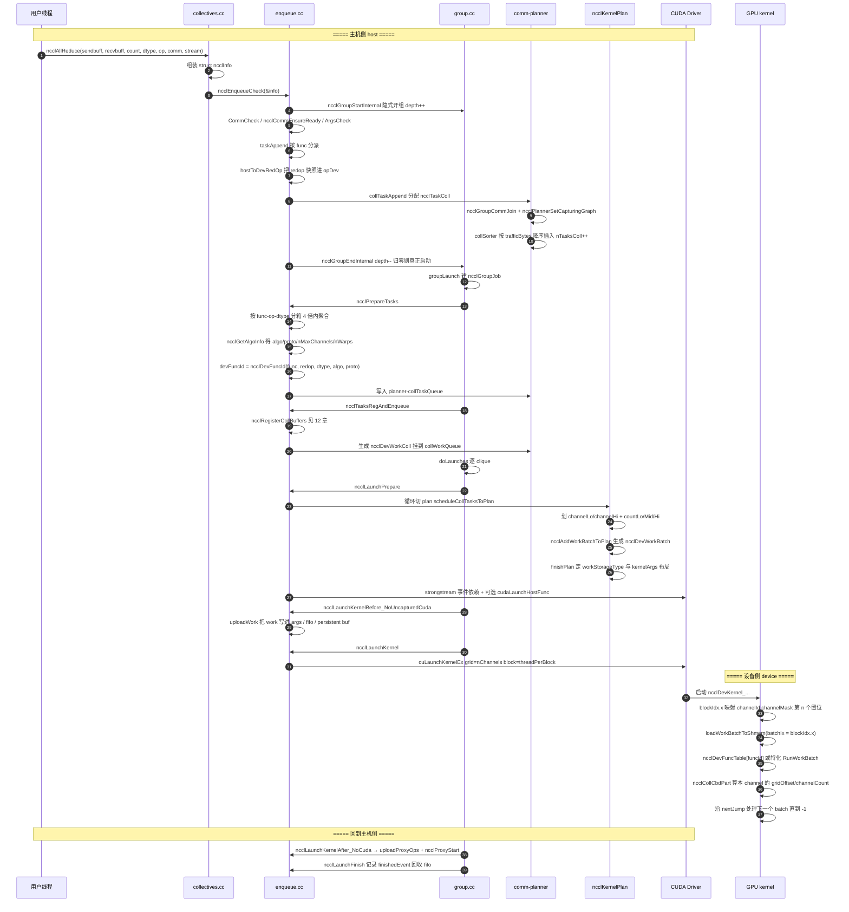

# 05 入队与执行计划（plan）/ kernel 下发

> 这是 mini-nccl 里 **“从 API 调用到 GPU kernel 真正跑起来”** 的那一跳。上游是拓扑与算法选择（03/04 章），下游是设备端 AllReduce 原语（08 章）。本章只讲主机侧：怎么把 `ncclAllReduce(...)` 的一组参数，变成 `cuLaunchKernelEx(gridDim=nChannels, blockDim=threadPerBlock, ...)`。

---

## 本文覆盖的源文件

| 文件 | 在本链路中的职责 |
| --- | --- |
| [src/collectives.cc](../src/collectives.cc) | 对外 API（`ncclAllReduce` 等），把参数打包成 `struct ncclInfo` |
| [src/enqueue.cc](../src/enqueue.cc) | 核心：`ncclEnqueueCheck` → `taskAppend` → `ncclPrepareTasks` → `scheduleCollTasksToPlan` → `finishPlan` → `uploadWork` → `ncclLaunchKernel` |
| [src/include/enqueue.h](../src/include/enqueue.h) | 入队层对外声明与对齐常量 |
| [src/group.cc](../src/group.cc) | group 语义：`ncclGroupStart/End`、`groupLaunch`、`doLaunches` |
| [src/include/group.h](../src/include/group.h) | `ncclGroupStartInternal` / `ncclGroupCommJoin` 等 inline 实现 |
| [src/include/comm.h](../src/include/comm.h) | `ncclTaskColl`、`ncclKernelPlan`、`ncclKernelPlanner`、work fifo 字段 |
| [src/include/device.h](../src/include/device.h) | host/device 契约：`ncclDevWorkColl`、`ncclDevWorkBatch`、`ncclDevKernelArgs`、`ncclDevFuncId` |
| [src/device/generate.py](../src/device/generate.py) | 代码生成器：产出 `ncclDevFuncRowToId[]` / `ncclDevKernelForFunc[]` / `ncclDevKernelList[]` |
| [src/device/Makefile](../src/device/Makefile) | `ONLY_FUNCS` 裁剪规则（本仓库只编 AllReduce × RING/TREE） |
| [src/device/common.h](../src/device/common.h) | 设备侧对称面：`ncclKernelMain`、`loadWorkBatchToShmem`、`DEFINE_ncclDevKernel` |
| [src/misc/strongstream.cc](../src/misc/strongstream.cc) | `ncclStrongStream` / CUDA Graph capture 安全的 stream 与事件管理 |
| [src/init.cc](../src/init.cc) | `workArgsBytes` / `workFifoBytes` 的初始化 |
| [src/dev_runtime.cc](../src/dev_runtime.cc) | `ncclCommWindowRegister` 等 symmetric window（本仓库被裁剪，见 12 章） |

---

## 0. 全景时序图：API → group → task → plan → workBatch → kernel launch



---

## 1. 主题一：API 入口与 group 语义

### ① 解决什么问题（场景）

用户可能这样写：

```c
ncclGroupStart();
ncclAllReduce(a1, b1, n1, ncclFloat, ncclSum, comm, s);
ncclAllReduce(a2, b2, n2, ncclFloat, ncclSum, comm, s);
ncclGroupEnd();
```

也可能只调一次 `ncclAllReduce`。NCCL 希望这两种写法走**同一条路径**：多个小 collective 可以被聚合成更少的 kernel launch（launch 一次 ~5–10 µs，小消息下这是主要开销），而单次调用不应该被迫写 group。于是 NCCL 引入了 group 深度计数，并让每个 collective API 都**隐式**开/闭一个 group。

### ② 一句话本质

**group 是“任务暂存区的作用域”**：`ncclGroupStart` 只做 `depth++`，所有 collective 只往 `comm->planner` 里塞 task；只有 `ncclGroupEnd` 把 depth 减回 0 时，才真正做算法选择、切 plan、launch kernel。

### ③ 代码链路

1. [collectives.cc:L174-L186](../src/collectives.cc#L174) `ncclAllReduce` 组装 `ncclInfo` → `ncclEnqueueCheck`
2. [enqueue.cc:L3209-L3257](../src/enqueue.cc#L3209) `ncclEnqueueCheck`：`CommCheck` → `ncclGroupStartInternal()` → `ncclCommEnsureReady` → `ArgsCheck` → `taskAppend` → `ncclGroupEndInternal()`
3. [group.h:L94-L97](../src/include/group.h#L94) `ncclGroupStartInternal` = `ncclGroupDepth++`
4. [enqueue.cc:L3094-L3202](../src/enqueue.cc#L3094) `taskAppend` 按 `info->coll` 分派
5. [enqueue.cc:L2767-L2829](../src/enqueue.cc#L2767) `collTaskAppend`
6. [group.cc:L773-L894](../src/group.cc#L773) `ncclGroupEndInternal`：`--ncclGroupDepth > 0` 则直接返回；否则建 `ncclGroupJob` 并调 `groupLaunch`
7. [group.cc:L605-L767](../src/group.cc#L605) `groupLaunch`
8. [group.cc:L104-L122](../src/group.cc#L104) 显式 `ncclGroupStart/ncclGroupEnd` 只是这两个 internal 的薄封装

### ④ 关键代码逐行解读

`ncclEnqueueCheck` 的骨架（[enqueue.cc:L3209-L3253](../src/enqueue.cc#L3209)）：

```c
ncclResult_t ncclEnqueueCheck(struct ncclInfo* info) {
  // 对无效或已被撤销的通信域提前返回
  ncclResult_t ret = CommCheck(info->comm, info->opName, "comm");
  if (ret != ncclSuccess) return ncclGroupErrCheck(ret);
  if (info->comm->revokedFlag) {
    WARN("%s: communicator was revoked", info->opName);
    return ncclGroupErrCheck(ncclInvalidUsage);
  }
  ...
  NCCLCHECK(ncclGroupStartInternal());
  ret = ncclSuccess;
  int devOld = -1;
  // 检查通信域是否已就绪、可以通信
  NCCLCHECKGOTO(ncclCommEnsureReady(info->comm), ret, fail);
  ...
  NCCLCHECKGOTO(ArgsCheck(info), ret, fail);
  ...
  NCCLCHECKGOTO(taskAppend(info->comm, info), ret, fail);

exit:
  if (devOld != -1) CUDACHECK(cudaSetDevice(devOld));
  ncclGroupErrCheck(ret);
  NCCLCHECK(ncclGroupEndInternal());
  /* if depth is 1, ncclGroupEndInternal() will trigger group ops. The state can change
   * so we have to check state here. */
  if (info->comm && !info->comm->config.blocking) NCCLCHECK(ncclCommGetAsyncError(info->comm, &ret));
  return ret;
```

- `ncclGroupStartInternal()` / `ncclGroupEndInternal()` **成对**出现：如果用户已经在 group 里（depth≥1），这一对只是把 depth 从 N 变到 N+1 再回到 N，`ncclGroupEndInternal` 早退，什么都不 launch；如果用户没开 group，depth 就是 0→1→0，`ncclGroupEndInternal` 会触发完整的 launch 流程。这是“隐式 group”的全部机制。
- `ncclGroupErrCheck(ret)` 把错误记进 thread-local `ncclGroupError`，保证 group 内某一次调用失败时整个 group 一起失败（[group.h:L103-L108](../src/include/group.h#L103)）。
- 注意 `exit:` 标签在 `fail:` 之前——失败路径 `goto exit` 仍然会走 `ncclGroupEndInternal()`，避免 depth 泄漏导致后续所有调用都不 launch。

`collTaskAppend` 的核心（[enqueue.cc:L2767-L2826](../src/enqueue.cc#L2767)，节选非 Broadcast 分支）：

```c
static ncclResult_t collTaskAppend(struct ncclComm* comm, struct ncclInfo* info, struct ncclDevRedOpFull opDev) {
  struct ncclKernelPlanner* planner = &comm->planner;

  // 在 通信域->memScoped 中分配任务前，必须先进入线程局部 组。
  ncclGroupCommJoin(info->comm, ncclGroupTaskTypeCollective);
  // 设置正在捕获的 图。在此调用，以便 剖析器 能发出带此信息的 组 API 事件
  NCCLCHECK(ncclPlannerSetCapturingGraph(comm, info));
  ...
    struct ncclTaskColl* t = ncclMemoryPoolAlloc<struct ncclTaskColl>(&comm->memPool_ncclTaskColl, &comm->memPermanent);
    t->func = info->coll;
    t->sendbuff = info->sendbuff;
    t->recvbuff = info->recvbuff;
    t->count = info->count;
    t->root = info->root;
    t->datatype = info->datatype;
    size_t elementSize = ncclTypeSize(t->datatype);
    ...
    t->trafficBytes = t->count * elementSize * ncclFuncTrafficPerByte(t->func, comm->nRanks);
    t->opHost = info->op;
    t->opDev = opDev; // C++ struct assignment
    t->chunkSteps = info->chunkSteps;
    t->sliceSteps = info->sliceSteps;
    ...
    planner->nTasksColl += 1;
    ncclTaskCollSorterInsert(&planner->collSorter, t, t->trafficBytes);
```

- `ncclGroupCommJoin` 把本 comm 挂进 thread-local `ncclGroupCommHead[]`，并且**保证同一 `intraComm0` 的兄弟 comm 在链表里连续**——`doLaunches` 依赖这一点来按 clique 分组 launch（[group.h:L111-L117](../src/include/group.h#L111)）。它同时 push `comm->memScoped` 栈帧，所以后面所有 `ncclMemoryStackAlloc` 的临时对象会在 `ncclGroupCommLeave` 里一次性弹掉（[group.h:L158-L162](../src/include/group.h#L158)）。
- `trafficBytes` 是**链路上真实搬运的字节数**，不是消息大小：`ncclFuncTrafficPerByte` 对 AllReduce 返回 2（reduce-scatter + all-gather 各一遍），AllGather/ReduceScatter 返回 `nRanks`（[enqueue.cc:L116-L127](../src/enqueue.cc#L116)）。它是后面 channel 负载均衡的唯一度量。
- `t->opDev = opDev` 是**必须的快照**：用户可能在 `ncclGroupEnd()` 之前就 `ncclRedOpDestroy`，所以 `hostToDevRedOp` 的结果要拷进 task（见 [enqueue.cc:L3114-L3117](../src/enqueue.cc#L3114) 的注释）。
- `ncclTaskCollSorterInsert` 是**桶排序**而非全序排序：桶按 2 的幂划分、每个幂 4 个桶（`BitsPerPow2 = 2`），最坏乱序幅度 25%（[comm.h:L371-L389](../src/include/comm.h#L371)）。这换来 O(1) 插入。

### ⑤ 收益

- 小消息聚合：group 内 N 个 AllReduce 只要能塞进同一个 plan 的 work 预算，就只有 **1 次** kernel launch，省掉 N-1 次 ~5–10 µs 的 launch 开销与 N-1 次 grid 启动同步。
- 排序器 O(1) 插入 + 25% 有界乱序：避免为“按大小聚合”付出 O(N log N) 的主机侧排序代价。
- 隐式 group 让单次调用与 group 调用共用一条代码路径，没有第二套 fast path 需要维护。

### ⑥ 面试考点

**Q1：`ncclGroupStart/End` 到底省了什么？**
A：省 kernel launch 次数与 grid 启动/收尾同步。group 内的 collective 会被 `ncclPrepareTasks` 按 `(func, redop, dtype)` 分箱、按大小 4 倍内聚合，最终多个 `ncclDevWorkColl` 可以打包到同一个 `ncclDevWorkBatch`、同一次 `cuLaunchKernelEx` 里。

**Q2：为什么每个 collective API 内部还要再开一次 group？**
A：让“不写 group”的用户也走同一条路径。depth 计数保证嵌套安全：外层已有 group 时内层的 `ncclGroupEndInternal` 只做 `depth--` 并早退。

**Q3：group 内不同 collective 用了不同 stream 会怎样？**
A：`ncclPlannerSetCapturingGraph` 会把每条新 stream 加入 `planner->streams` 链表；如果这些 stream 的 capture 状态不一致（部分被 graph 捕获、部分没有，或被不同 graph 捕获），直接返回 `ncclInvalidUsage`（[enqueue.cc:L2659-L2682](../src/enqueue.cc#L2659)）。launch 只发生在 `planner->streams->stream`（第一条），其余 stream 通过 event 做前后依赖。

**Q4：group 里某一个调用参数非法会怎样？**
A：`ncclGroupErrCheck` 把错误记进 thread-local `ncclGroupError`；`ncclGroupEndInternal` 在 `if ((ret = ncclGroupError) != ncclSuccess) goto fail;` 处统一失败，并调 `groupCleanup` 回收整组资源（[group.cc:L797](../src/group.cc#L797)、[group.cc:L402-L474](../src/group.cc#L402)）。**整组一起失败**，不会部分执行。

**Q5：`nRanks == 1` 时也走 plan 吗？**
A：不走。`taskAppend` 里 `if (comm->nRanks == 1) { ncclLaunchOneRank(...); return; }`，直接退化成一次设备端 copy/reduce，不生成 task（[enqueue.cc:L3119-L3121](../src/enqueue.cc#L3119)）。

---

## 2. 主题二：从 task 到 plan——planner 的三段状态机

### ① 解决什么问题（场景）

group 里可能有 200 个 collective，但一个 kernel 的参数空间只有 4 KB（`ncclMaxKernelArgsSize` 返回 `4 << 10`，[device.h:L493-L496](../src/include/device.h#L493)），work fifo 只有 1 MB 且非持久 plan 只能用一半。所以必须**分批**：把 task 队列切成若干 `ncclKernelPlan`，每个 plan 对应一次 kernel launch。而且切分点必须**所有 rank 一致**，否则不同 rank 的 channel 分配不同，环上就会死锁。

### ② 一句话本质

`ncclKernelPlanner` 是一个三段状态机：**累积 task（collSorter）→ 排好序的待切队列（collTaskQueue + collWorkQueue）→ 已切好的 plan 队列（planQueue）**；`ncclKernelPlan` 就是“一次 kernel launch 的全部输入”。

### ③ 代码链路

1. [comm.h:L439-L512](../src/include/comm.h#L439) `ncclKernelPlanner` 三段注释就是这个状态机
2. [enqueue.cc:L388-L590](../src/enqueue.cc#L388) `ncclPrepareTasks`：`collSorter` → 分箱 → 聚合 → `ncclGetAlgoInfo` → `collTaskQueue`
3. [enqueue.cc:L327-L384](../src/enqueue.cc#L327) `ncclTasksRegAndEnqueue`：为每个 task 生成 `ncclDevWorkColl` → `collWorkQueue`
4. [group.cc:L668-L727](../src/group.cc#L668) `groupLaunch` 里 preconnect + `ncclTasksRegAndEnqueue` 的调用顺序
5. [enqueue.cc:L1593-L1763](../src/enqueue.cc#L1593) `ncclLaunchPrepare`：`do { ... } while (还有 task)` 循环切 plan
6. [enqueue.cc:L314-L325](../src/enqueue.cc#L314) `ncclKernelPlanBudget` / `ncclTestBudget`

### ④ 关键代码逐行解读

`ncclPrepareTasks` 的聚合与算法决策（[enqueue.cc:L446-L496](../src/enqueue.cc#L446)）：

```c
  struct ncclIntruQueue<struct ncclTaskColl, &ncclTaskColl::next> collBins[2][2] = {};
  for (int cursor = 0; cursor < fnOpTyCount; cursor++) {
    struct ncclTaskColl* aggBeg = tasksByFnOpTy[fnOpTyIndices[cursor]];
    int collNetSupport = 0;
    NCCLCHECK(ncclGetCollNetSupport(comm, aggBeg, &collNetSupport));
    int nvlsSupport = ...;
    // 粗略估算每个 通道 上的任务数量。...
    int nTasksPerChannel = divUp(comm->planner.nTasksColl, comm->nChannels);
    do {
      struct ncclTaskColl* aggEnd = aggBeg->next;
      struct ncclTaskColl agg = *aggBeg;
      // 我们会把大小相差在 4 倍以内的操作聚合到一起。
      while (aggEnd != nullptr && aggEnd->trafficBytes < 4 * aggBeg->trafficBytes) {
        agg.count += aggEnd->count;
        agg.trafficBytes += aggEnd->trafficBytes;
        aggEnd = aggEnd->next;
      }

      NCCLCHECK(ncclGetAlgoInfo(comm, &agg, collNetSupport, nvlsSupport, nTasksPerChannel, simInfo));
      agg.devFuncId = ncclDevFuncId(agg.func, agg.opDev.op, agg.datatype, agg.algorithm, agg.protocol);
      ...
      // 用计算得到的结果更新这些已聚合的任务。
      do {
        struct ncclTaskColl* next = aggBeg->next;
        aggBeg->algorithm = agg.algorithm;
        aggBeg->protocol = agg.protocol;
        if (aggBeg->protocol == NCCL_PROTO_LL) aggBeg->trafficBytes *= 4;
        aggBeg->nMaxChannels = agg.nMaxChannels;
        aggBeg->nWarps = agg.nWarps;
        aggBeg->devFuncId = agg.devFuncId;
        ...
        ncclIntruQueueEnqueue(&collBins[isCollnet][isNvls], aggBeg);
        aggBeg = next;
      } while (aggBeg != aggEnd);
    } while (aggBeg != nullptr);
  }
```

- 先按 `(func, devRedOp, datatype)` 分箱（[enqueue.cc:L431-L441](../src/enqueue.cc#L431)），因为**同一个 kernel 只能跑同一个 `devFuncId`**——`ncclDevWorkBatch` 里只有一个 `funcId` 字段。
- 聚合窗口是“大小在 4 倍以内”：把这一撮 task 的 `count/trafficBytes` 加总成一个虚拟的 `agg`，用它去问算法选择器。这样 8 个 1 MB 的 AllReduce 会按 8 MB 的规模选 algo/proto（更倾向 Simple + 多 channel），而不是按 1 MB 各自选（可能选 LL + 少 channel）。
- `if (protocol == NCCL_PROTO_LL) trafficBytes *= 4`：LL 协议每 8 字节有效数据要带 8 字节 flag，且缓冲区只有一半可用于数据（见 [enqueue.cc:L2298](../src/enqueue.cc#L2298) `chunkSize /= 2`），所以它对链路的实际压力要放大 4 倍再参与 channel 负载均衡。
- `collBins[isCollnet][isNvls]` 二次分箱 + [enqueue.cc:L501-L505](../src/enqueue.cc#L501) 的拼接顺序，保证 collnet 类任务在队列前部集中——因为 `scheduleCollTasksToPlan` 对 collnet 与非 collnet 用**完全不同**的 channel 划分方式，混在一起会让 `trafficPerChannel` 反复重算。**本仓库单机场景下 `isCollnet`/`isNvls` 恒为 0**，这两层分箱等价于恒等变换。

`ncclLaunchPrepare` 的切 plan 主循环（[enqueue.cc:L1608-L1661](../src/enqueue.cc#L1608)，节选）：

```c
    do {
      memset(&planner->wipPlan, 0, sizeof(planner->wipPlan));

      struct ncclKernelPlan* plan =
        ncclMemoryPoolAlloc<struct ncclKernelPlan>(&comm->memPool_ncclKernelPlan, &comm->memPermanent);
      plan->comm = comm;
      plan->reclaimer.fn = reclaimPlan;
      plan->persistent = persistent;
      // 若工作能装下，finishPlan() 会把 ncclDevWorkStorageType[Fifo|Persistent] 提升为 Args 类型。
      plan->workStorageType = persistent ? ncclDevWorkStorageTypePersistent : ncclDevWorkStorageTypeFifo;
      ...
          struct ncclKernelPlanBudget budget;
          budget.inArgsBytes = comm->workArgsBytes - sizeof(struct ncclDevKernelArgs);
          // 非持久的 内核 每次最多只占用 fifo 的一半。
          budget.outArgsBytes = plan->persistent ? (1 << 30) : comm->workFifoBytes / 2;

          // 先排空集合(集合)任务。这一步很关键：因为我们是基于
          // 工作预算来切分任务的，而 p2p 工作不是集合通信。如果先排空 p2p，
          // 各 rank 切分 内核 的位置就可能不一致，进而导致
          // “最短 通道 优先”选择器在不同 rank 上产生不一致的结果。
          if (planner->nTasksColl != 0) {
            NCCLCHECKGOTO(scheduleCollTasksToPlan(comm, plan, &budget), result, failure);
          }
      ...
        finishPlan(comm, plan);
        if (plan->workBytes != 0) {
          ncclIntruQueueEnqueue(&planner->planQueue, plan);
          nPlans += 1;
        }
    } while (planner->nTasksColl + planner->nTasksP2p + planner->nTasksBcast != 0 || ...);
```

- `plan->reclaimer.fn = reclaimPlan` 在**分配时**就设好：`ncclKernelPlan` 的第一个成员是 `ncclCommCallback reclaimer`（[comm.h:L317-L320](../src/include/comm.h#L317)），所以 plan 指针可以直接当回调指针用，回收时 `reinterpret_cast` 回来（[enqueue.cc:L1487-L1488](../src/enqueue.cc#L1487)）。这是省一次分配的经典手法。
- `budget.outArgsBytes = workFifoBytes / 2`：非持久 plan 只允许占 fifo 的一半，留出另一半给“上一批还没被 GPU 消费完”的 work，避免 `waitWorkFifoAvailable` 立刻阻塞主机线程。
- `persistent`（= 正在被 CUDA Graph 捕获）时预算给 `1 << 30`，因为 persistent plan 会自己 `cudaMallocAsync` 一块专属 buffer，不共享 fifo。
- **“先排空 coll 再排空 p2p”** 那段注释是整个切分逻辑里最关键的正确性约束：切分点必须是所有 rank 上的确定性函数。coll 任务在所有 rank 上完全对称（同样的 count、同样的顺序），p2p 不是。

### ⑤ 收益

- 4 KB kernel args + 1 MB fifo 的硬约束下仍能支持任意多的 group 内 collective，代价只是多切几个 plan。
- `workStorageType` 自动升级到 `Args`：小 plan 的 work 直接随 kernel 参数下发，**省掉设备端一次 global memory 读**（fifo 在 host pinned 内存或 GDR 映射显存里，延迟远高于 `ld.param`）。
- plan 从 `memPool_ncclKernelPlan` 分配、work 从 `memScoped` 栈分配：稳态下**零 malloc**。

### ⑥ 面试考点

**Q1：为什么一个 group 可能产生多个 plan？**
A：kernel args（默认 4 KB）与 work fifo（默认 1 MB，非持久只用一半）是硬上限。`ncclTestBudget` 检查 `batchBytes + workBytes` 是否装得下；装不下就 `finishPlan` 收尾、开新 plan。

**Q2：`ncclTestBudget` 为什么有两个 `ok |=`？**
A：两种合法布局：(a) batch 和 work 全塞进 args；(b) batch 塞 args、work 放 fifo/persistent buf。batch 必须在 args 里（设备端靠 `blockIdx.x` 直接索引 `batchZero[]`），work 可以在外面。

**Q3：切 plan 的位置必须所有 rank 一致吗？为什么？**
A：必须。plan 决定了每个 collective 占用哪些 channel（`channelLo..channelHi`）。若 rank A 把某 collective 放在 channel 0-3、rank B 放在 4-7，环上的 prev/next 就对不上，直接挂死。这也是"coll 先于 p2p 排空"的原因。

**Q4：`memScoped` 和 `memPermanent` 的区别？**
A：`memScoped` 是栈式分配器，`ncclGroupCommJoin` push、`ncclGroupCommLeave` pop，用于 group 生命周期内的临时对象（`ncclWorkList`、`ncclWorkBatchList`、`kernelArgs`）。`memPermanent` 支撑 memory pool，用于跨 group 存活的对象（`ncclTaskColl`、`ncclKernelPlan`、`ncclProxyOp`），显式 `ncclMemoryPoolFree` 归还。

---

## 3. 主题三：一个 AllReduce 如何被切到多个 channel

### ① 解决什么问题（场景）

一次 4 MB 的 AllReduce，机器上有 32 个 channel（= 32 个 CUDA block）。怎么分？平均分成 32 份最直观，但：(a) 数据太小时开 32 个 block 反而慢（每个 block 的同步开销盖过收益）；(b) group 内多个 collective 时，希望它们**尽量占不同的 channel** 以并行，而不是全都平摊到所有 channel 上互相排队；(c) 每个 channel 分到的量必须与 chunk 粒度对齐，否则设备端会出现半个 chunk 的尾巴。

### ② 一句话本质

先用 `trafficPerChannel`（= 本轮全部任务的总流量 / 可用 channel 数）确定“一个 channel 应该背多少流量”，然后把每个 task 按 **cell（32 KB 流量为单位）** 贪心地铺到连续的 `channelLo..channelHi` 上，形成 **lo / mid×N / hi** 三段结构，只用 3 个 count + 3 个 chunkGrains 就编码完 64 个 channel 的划分。

### ③ 代码链路

1. [enqueue.cc:L2074-L2182](../src/enqueue.cc#L2074) `topoGetAlgoInfo`：定 `nMaxChannels`（nc）与 `nWarps`（nt/32）
2. [enqueue.cc:L2195-L2252](../src/enqueue.cc#L2195) `ncclGetAlgoInfo`：tuner 插件优先，否则退回 `topoGetAlgoInfo`（算法/协议选择细节见 04 章）
3. [enqueue.cc:L601-L629](../src/enqueue.cc#L601) `scheduleCollTasksToPlan` 第一遍扫描：估 `nPlanColls`、累加 `trafficBytes[kind]` 与 `nChannels[kind]`
4. [enqueue.cc:L641-L647](../src/enqueue.cc#L641) `trafficPerChannel = divUp(trafficBytes[kind] / nChannels[kind], 16) * 16`
5. [enqueue.cc:L680-L740](../src/enqueue.cc#L680) cell 贪心划分 → `channelLo/channelHi/cbd.countLo/Mid/Hi`
6. [enqueue.cc:L2254-L2393](../src/enqueue.cc#L2254) `calcCollChunking`：per-channel 的 `chunkSize`，再换算成 `chunkGrains*`
7. [device.h:L346-L371](../src/include/device.h#L346) `ncclCollCbdPart`：设备端按 `channelId` 反解出 `partOffset/partCount/chunkCount`
8. [all_reduce.h:L47-L48](../src/device/all_reduce.h#L47) `runRing` 调用 `ncclCollCbdPart`

### ④ 关键代码逐行解读

channel 划分主体（[enqueue.cc:L682-L740](../src/enqueue.cc#L682)）：

```c
      int trafficPerByte = ncclFuncTrafficPerByte(task->func, comm->nRanks);
      if (task->protocol == NCCL_PROTO_LL) trafficPerByte *= 4;
      size_t cellSize = divUp(divUp(MinTrafficPerChannel, (size_t)trafficPerByte), 16) * 16;
      int elementsPerCell = cellSize / elementSize;
      size_t cells = divUp(task->count * elementSize, cellSize);
      size_t trafficPerElement = elementSize * trafficPerByte;
      size_t trafficPerCell = cellSize * trafficPerByte;
      size_t cellsPerChannel = std::min(cells, divUp(trafficPerChannel, trafficPerCell));
      size_t cellsLo;
      if (channelId + 1 == nMaxChannels[kind]) {
        // 在最后一个 通道 上，所有内容都归入 lo(低区)
        cellsLo = cells;
      } else {
        cellsLo = std::min(cells, divUp((trafficPerChannel - currentTraffic), trafficPerCell));
      }
      int nMidChannels = (cells - cellsLo) / cellsPerChannel;
      size_t cellsHi = (cells - cellsLo) % cellsPerChannel;
      int nChannels = (cellsLo != 0 ? 1 : 0) + nMidChannels + (cellsHi != 0 ? 1 : 0);
      if (nMaxChannels[kind] < channelId + nChannels) {
        // 已超出可用 通道 的数量
        nMidChannels = nMaxChannels[kind] - channelId - 2;
        cellsPerChannel = (cells - cellsLo) / (nMidChannels + 1);
        cellsHi = cellsPerChannel + (cells - cellsLo) % (nMidChannels + 1);
      }
      ...
      size_t countMid = nMidChannels != 0 ? cellsPerChannel * elementsPerCell : 0;
      size_t countLo = cellsLo * elementsPerCell;
      size_t countHi = cellsHi * elementsPerCell;
      (countHi != 0 ? countHi : countLo) -= cells * elementsPerCell - task->count;
      ...
      devWork->channelLo = channelId;
      devWork->channelHi = channelId + nChannels - 1;
      devWork->cbd.countLo = countLo;
      devWork->cbd.countMid = countMid;
      devWork->cbd.countHi = countHi;
```

- **cell = 32 KB 流量对应的数据量**。`MinTrafficPerChannel = 32 << 10`（[enqueue.cc:L610](../src/enqueue.cc#L610)），对 AllReduce（trafficPerByte=2）就是 16 KB 数据。它是划分的最小粒度，保证不会给某个 channel 只分到几百字节。
- `cellsLo` 用的是 `trafficPerChannel - currentTraffic`，即**当前 channel 的剩余额度**。这样上一个 task 没填满的 channel 会先被这个 task 补满 —— 这就是 group 内多 collective 尽量错开 channel 的机制。
- 三段结构：`lo` 是“接着上个 task 的残余额度”的那个 channel（可能不满），`mid` 是若干个满额 channel，`hi` 是尾巴。**mid 段共享同一个 `countMid`**，所以 `ncclDevWorkColl` 只要 3 个 count 就能描述最多 64 个 channel。
- `(countHi != 0 ? countHi : countLo) -= cells * elementsPerCell - task->count;` —— cell 向上取整会多算，把这个多出来的量从最后一段扣掉。
- `if (nMaxChannels[kind] < channelId + nChannels)` 是**兜底压缩**：channel 不够时把剩余 cell 重新均摊到还剩的 channel 上。

per-channel chunk 大小（[enqueue.cc:L747-L764](../src/enqueue.cc#L747)）：

```c
      uint32_t chunkSize, directFlags = 0;
      size_t grainSize = ncclProtoGrainSize(task->protocol);
      if (countLo != 0) {
        NCCLCHECK(calcCollChunking(comm, task, /*nChannels=*/1, globalBytesPerElement * countLo, &chunkSize,
                                   &directFlags, &proxyOpLo));
        devWork->cbd.chunkGrainsLo = chunkSize / grainSize;
      }
      if (countHi != 0) { ... devWork->cbd.chunkGrainsHi = chunkSize / grainSize; }
      if (nMidChannels != 0) { ... devWork->cbd.chunkGrainsMid = chunkSize / grainSize; }
      devWork->direct = directFlags;
```

- `calcCollChunking` 传 `nChannels=1`，因为它现在算的是**单个 channel 内部**的 chunk 大小。基线是 `stepSize = comm->buffSizes[proto] / NCCL_STEPS`（[enqueue.cc:L2294](../src/enqueue.cc#L2294)），LL 再除 2、LL128 按 `NCCL_LL128_DATAELEMS/NCCL_LL128_LINEELEMS = 15/16` 折算。
- chunk 大小不直接存字节，而是存 **grain 数**：`ncclProtoGrainSize` 对 LL=16、SIMPLE=512、LL128 = `32 * 8 / 16 * 15 * 8` 字节（[device.h:L338-L344](../src/include/device.h#L338)）。这样 `chunkGrainsLo/Mid/Hi` 各 21 bit 就够，三个塞进一个 `uint64_t`（[device.h:L316](../src/include/device.h#L316)）。

`nWarps` / `threadPerBlock` 的确定（[enqueue.cc:L2127-L2180](../src/enqueue.cc#L2127) 节选）：

```c
  int nc = comm->nChannels;                                          // 起始 channel 数
  int nt = comm->maxThreads[info->algorithm][info->protocol];        // 该算法/协议下每个 block 的最大线程数
  int threadThreshold = comm->threadThresholds[info->algorithm][info->protocol];
  ...
  } else {
    // 环/树 的 通道 调优：数据量不够就逐个减少 通道，但至少保留 1 个
    while (nBytes < nc * nt * threadThreshold) {
      if (nc >= 2) nc--;
      else break;
    }
  }
  // 第三步：通道 数减到头之后，如果数据量依然偏小，继续折半减少线程数。
  if (info->algorithm != NCCL_ALGO_NVLS && ...) {
    while (nBytes < nc * nt * threadThreshold) {
      if (nt % 128 == 0) nt /= 2;
      else break;
    }
  }
  // 第四步：为 Simple 协议追加同步所需的额外线程
  if (info->protocol == NCCL_PROTO_SIMPLE) {
    if (info->algorithm == NCCL_ALGO_RING) nt += WARP_SIZE; // 额外增加一个 warp 专门负责同步
    if (info->algorithm == NCCL_ALGO_TREE) nt += 4 * WARP_SIZE;
  }
  nt = nt / WARP_SIZE < 3 ? 3 * WARP_SIZE : nt;
  if (info->algorithm == NCCL_ALGO_TREE) nt = NCCL_MAX_NTHREADS; // Tree 现在恒定使用全部线程
  ...
  info->nMaxChannels = nc;
  info->nWarps = nt / WARP_SIZE;   // 对外以 warp 数为单位记录，而非线程数
```

- 判据 `nBytes < nc * nt * threadThreshold` 的含义：右边是“喂饱当前并行度所需的最小字节数”。不够就**先降 channel（block 数），再降 thread**——因为降 block 省的是整块的启动/同步开销，收益更大。
- `nt % 128 == 0` 的约束保证折半后仍是 4 个 warp 的整数倍。
- Ring+Simple 额外 +1 warp、Tree+Simple +4 warp：这些 warp 专职做 FIFO 的 head/tail 同步，不参与数据搬运。
- 最终 `plan->threadPerBlock = max(所有 task 的 nWarps * 32)`（[enqueue.cc:L838](../src/enqueue.cc#L838)），并在 `finishPlan` 里被 clamp 到至少 `NCCL_MIN_NTHREADS = 4*32 = 128`（[enqueue.cc:L234](../src/enqueue.cc#L234)）。

设备端反解（[device.h:L346-L370](../src/include/device.h#L346)）：

```c
__host__ __device__ inline void ncclCollCbdPart(struct ncclDevWorkColl* work, uint32_t channelId, int proto,
                                                int eltSize, Int* count, Int* partOffset, Int* partCount,
                                                Int* chunkCount) {
  int eltPerGrain = ncclProtoGrainSize(proto) / eltSize;
  int nMidChannels = work->channelHi - work->channelLo - 1;
  if (count != nullptr) {
    *count = work->cbd.countLo + work->cbd.countMid * nMidChannels + work->cbd.countHi;
  }
  if (channelId == work->channelLo) {
    *partOffset = 0;
    *partCount = work->cbd.countLo;
    *chunkCount = work->cbd.chunkGrainsLo * eltPerGrain;
  } else if (channelId == work->channelHi) {
    *partOffset = work->cbd.countLo + nMidChannels * work->cbd.countMid;
    *partCount = work->cbd.countHi;
    *chunkCount = work->cbd.chunkGrainsHi * eltPerGrain;
  } else {
    int mid = channelId - work->channelLo - 1;
    *partOffset = work->cbd.countLo + mid * work->cbd.countMid;
    *partCount = work->cbd.countMid;
    *chunkCount = work->cbd.chunkGrainsMid * eltPerGrain;
  }
}
```

- 三分支完全对应主机侧的 lo/mid/hi。`nMidChannels < 0` 时（只有一个 channel）主机保证 `countMid == 0`，所以 `countMid * nMidChannels == 0` 成立——注释里明确说了这个假设（[device.h:L352-L353](../src/include/device.h#L352)）。
- 这是**唯一**的 host/device 划分契约：主机写 3 个 count + 3 个 chunkGrains，设备按自己的 `channelId` 反解。任何一侧改公式都会静默出错。

### ⑤ 收益

- 划分信息压缩到常数大小：3×`size_t` + 3×21 bit ≈ 32 字节描述最多 64 个 channel 的不等分划分。若改成 per-channel 数组，`MAXCHANNELS = 64` 就要 64×(8+4) = 768 字节，`ncclDevWorkColl` 会从约 128 字节涨到近 900 字节，直接击穿 `NCCL_MAX_DEV_WORK_BATCH_BYTES = 1024` 与 4 KB kernel args。
- 小消息自动降并行度：`nBytes < nc*nt*threshold` 让 64 KB 的 AllReduce 可能只用 1–2 个 channel、几个 warp，避免 64 个 block 各搬 1 KB 的极低效场景。
- group 内多 collective 通过 `currentTraffic` 残余额度自动错开 channel，提高 SM 利用率。

### ⑥ 面试考点

**Q1：为什么是 lo/mid/hi 三段，而不是均分？**
A：均分要求每个 task 独占全部 channel，group 内多个 task 就会在同一批 channel 上串行。三段结构允许 task 从"上一个 task 没填满的那个 channel"接着往下铺，实现跨 task 的 channel 打包。同时三段结构的元数据是常数大小。

**Q2：`gridDim` 是怎么定的？**
A：`ncclLaunchKernel` 里 `grid = {countOneBits(plan->channelMask), 1, 1}`。`channelMask` 是本 plan 内所有 task 的 `channelLo..channelHi` 区间的并集（[enqueue.cc:L837](../src/enqueue.cc#L837)）。注意 **blockIdx.x 不等于 channelId**：设备端通过"`channelMask` 中第 `blockIdx.x` 个置位"来求 channelId（[common.h:L378-L381](../src/device/common.h#L378)）。

**Q3：`blockDim` 呢？为什么一个 plan 里所有 task 共享同一个 blockDim？**
A：`block = {plan->threadPerBlock, 1, 1}`，取 plan 内所有 task 的 `nWarps*32` 的最大值。因为一次 `cuLaunchKernelEx` 只有一个 blockDim。`ncclDevWorkColl.nWarps` 仍然按 task 保留，设备端各 task 只用自己那部分 warp，多出来的 warp 空转。

**Q4：为什么 chunk 大小要存 grain 数而不是字节数？**
A：位宽。`chunkGrainsLo/Mid/Hi` 各 21 bit 共 63 bit，刚好一个 `uint64_t`。若存字节数，SIMPLE 的 chunk 可达 512 KB，需要 20 bit 但 grain=512 让同样范围只需 10 bit，留出余量且天然保证 chunk 是 grain 的整数倍（向量化访存对齐）。

**Q5：`trafficBytes` 为什么要区分 traffic 和 bytes？**
A：channel 负载均衡关心的是**链路压力**。同样 1 MB 的 AllReduce 和 AllGather，AllReduce 在环上搬 2 MB，AllGather 搬 nRanks MB。若按消息大小均衡，8 卡 AllGather 会被严重低估。而 `calcCollChunking` 关心的是**数据量**，所以它用 `globalBytesPerElement = elementSize * ncclFuncMaxSendRecvCount(...)`，不乘 trafficPerByte（[enqueue.cc:L742-L744](../src/enqueue.cc#L742) 的注释说明了这个区别）。

---

## 4. 主题四：workBatch 与三种 workStorageType

### ① 解决什么问题（场景）

设备端 kernel 需要知道“我这个 block（= channel）要干哪些活”。最朴素的做法是给每个 channel 一个 work 数组指针，但：(a) 多个 task 共享同一个 `ncclDevWorkColl`（因为 work 描述的是全局划分，不是 per-channel 的），不该复制 64 份；(b) work 结构体 128 字节量级，channel 数 × task 数很快就撑爆 4 KB 参数空间；(c) 加载 work 时希望 64 个线程一次 `ld.param.v2.u64` 搬 16 字节，需要连续布局。

### ② 一句话本质

`ncclDevWorkBatch` 是**“某个 channel 在某段 work 数组上的稀疏视图”**：`offsetBase` 给基址，64 位 `offsetBitset` 标记“第 i 个 work 属于我”，`nextJump` 把同一 channel 的多个 batch 串成链表；work 本体按 plan 大小自动落在 kernel args / 环形 fifo / persistent buffer 三者之一。

### ③ 代码链路

1. [device.h:L402-L420](../src/include/device.h#L402) `ncclDevWorkBatch` 定义
2. [device.h:L477-L491](../src/include/device.h#L477) `ncclDevWorkStorageType` + `ncclDevKernelArgs`
3. [enqueue.cc:L146-L226](../src/enqueue.cc#L146) `ncclAddWorkBatchToPlan`：决定新建 batch / 扩展 batch / 追加到当前 batch
4. [enqueue.cc:L228-L306](../src/enqueue.cc#L228) `finishPlan`：升级 storage type、布局 kernelArgs、轮转排布 batch、归并 proxyOp
5. [enqueue.cc:L1273-L1395](../src/enqueue.cc#L1273) `uploadWork`：三种 storage 的实际写入
6. [enqueue.cc:L1241-L1257](../src/enqueue.cc#L1241) `waitWorkFifoAvailable`：fifo 反压
7. [common.h:L148-L263](../src/device/common.h#L148) `loadWorkBatchToShmem`：设备端解码

### ④ 关键代码逐行解读

batch 的合并/新建判定（[enqueue.cc:L149-L217](../src/enqueue.cc#L149) 节选）：

```c
  size_t workSize = ncclDevWorkSize(workType);
  ncclKernelPlanner::WipPlan::Channel* chan = &comm->planner.wipPlan.channels[channelId];
  // 以下这些条件会促使我们新建一个空白批次(batch)。
  newBatch = (chan->workBatchQueue.tail == nullptr);
  struct ncclDevWorkBatch* batch = nullptr;
  if (!newBatch) {
    batch = &chan->workBatchQueue.tail->batch;
    // 以下是所有“无法继续追加到当前批次”的判定条件。
    newBatch |= batch->workType != (uint8_t)workType;
    newBatch |= batch->funcId != devFuncId;
    ...
    } else {
      newBatch |= NCCL_MAX_DEV_WORK_BATCH_BYTES < chan->wipBatch.workBytes + workSize;
    }
  }
  // 以下条件会促使我们创建一个扩展批次(prev->nextExtends=1)
  uint32_t offset = newBatch ? 0 : (workOffset - batch->offsetBase);
  bool extendBatch = 63 * workSize < offset;
  extendBatch |= 0 != offset % workSize;
  if (newBatch || extendBatch) {
    if (!newBatch) batch->nextExtends = extendBatch; // Extending the previous batch.
    struct ncclWorkBatchList* batchNode = ncclMemoryStackAlloc<ncclWorkBatchList>(&comm->memScoped);
    ncclIntruQueueEnqueue(&chan->workBatchQueue, batchNode);
    batch = &batchNode->batch;
    batch->nextExtends = 0;
    batch->workType = (uint32_t)workType;
    batch->funcId = devFuncId;
    batch->offsetBase = workOffset;
    batch->offsetBitset = 0;
    offset = 0;
    ...
    plan->nWorkBatches += 1;
  }
  batch->offsetBitset |= 1ull << (offset / workSize);
  chan->wipBatch.workBytes += workSize;
```

- **三种结局**：追加到当前 batch（只置一个 bit）、新建 batch（`newBatch`）、新建“扩展 batch”（`extendBatch`，前一个 batch 置 `nextExtends=1`，设备端会把两者视为同一批一起加载）。
- `newBatch |= batch->funcId != devFuncId`：一个 batch 只能有一个 `funcId`，因为设备端就是靠它做 `ncclDevFuncTable[funcId]()` 分派。
- `extendBatch = 63 * workSize < offset`：bitset 只有 64 位，覆盖不到更远的 work 就必须新开一个 batch。`offset % workSize != 0` 说明中间混入了别的大小的 work，bitset 的“均匀步长”假设不成立，同样要新开。
- `NCCL_MAX_DEV_WORK_BATCH_BYTES = 1024`：一个 batch 最多引用 1 KB 的 work 元数据（对 `ncclDevWorkTypeColl` 即 `NCCL_MAX_DEV_WORK_BATCH_COLLS = 1024 / sizeof(ncclDevWorkColl)` 个）。这个上限来自设备端 `loadWorkBatchToShmem` 的注释：**只保证有 64 个线程**参与加载，一次最多搬 64×16 = 1024 字节（[common.h:L213-L214](../src/device/common.h#L213)）。

`finishPlan` 的两件关键事（[enqueue.cc:L230-L272](../src/enqueue.cc#L230) 节选）：

```c
  size_t workBytes = plan->workBytes;
  size_t batchBytes = plan->nWorkBatches * sizeof(struct ncclDevWorkBatch);
  ...
  plan->threadPerBlock = std::max(plan->threadPerBlock, NCCL_MIN_NTHREADS);

  // 如果全部内容能塞进 内核 参数里，就直接放进去(省去额外的显存访问)。
  if (sizeof(ncclDevKernelArgs) + batchBytes + workBytes <= comm->workArgsBytes) {
    plan->workStorageType = ncclDevWorkStorageTypeArgs;
  }
  plan->kernelArgsSize = sizeof(struct ncclDevKernelArgs) + batchBytes;
  plan->kernelArgsSize += (plan->workStorageType == ncclDevWorkStorageTypeArgs) ? workBytes : 0;
  plan->kernelArgsSize = alignUp(plan->kernelArgsSize, 16);
  plan->kernelArgs =
    (struct ncclDevKernelArgs*)ncclMemoryStackAlloc(&comm->memScoped, plan->kernelArgsSize, /*align=*/16);
  plan->kernelArgs->comm = comm->devComm;
  plan->kernelArgs->channelMask = plan->channelMask;
  plan->kernelArgs->workStorageType = plan->workStorageType;

  // 把各批次放入 内核 参数。每个 通道 的首个批次
  // 必须位于 batchZero[blockIdx.x] 处。为此我们按升序对各 通道
  // 做轮转分配，直到全部处理完毕。
  uint64_t hasBatchMask = plan->channelMask;
  struct ncclDevWorkBatch* batchPrev[MAXCHANNELS] = {}; // {0...}
  struct ncclDevWorkBatch* batchZero = (struct ncclDevWorkBatch*)(plan->kernelArgs + 1);
  int batchIx = 0;
  while (hasBatchMask != 0) {
    uint64_t tmpMask = hasBatchMask; // channels with a batch for this round.
    do {
      int c = popFirstOneBit(&tmpMask);
      if (!ncclIntruQueueEmpty(&wipChannels[c].workBatchQueue)) {
        struct ncclWorkBatchList* batchNode = ncclIntruQueueDequeue(&wipChannels[c].workBatchQueue);
        if (batchPrev[c] != nullptr) {
          batchPrev[c]->nextJump = int(&batchZero[batchIx] - batchPrev[c]);
        }
        batchPrev[c] = &batchZero[batchIx];
        batchZero[batchIx++] = batchNode->batch;
      }
      if (ncclIntruQueueEmpty(&wipChannels[c].workBatchQueue)) {
        hasBatchMask ^= 1ull << c;
      }
    } while (tmpMask != 0);
  }
```

- **轮转（round-robin）排布**是为了满足设备端的一个硬约束：`loadWorkBatchToShmem(..., batchIx = blockIdx.x)`。也就是说 channel（按 `channelMask` 升序编号）的**第一个 batch 必须位于 `batchZero[blockIdx.x]`**。第一轮按 channel 升序各取一个 batch，正好落在下标 0,1,2,...；后续轮次的 batch 通过 `nextJump`（相对位移）挂到同 channel 的上一个 batch 后面。
- `nextJump` 存的是**相对下标差**而不是绝对下标，只需 14 bit（[device.h:L408](../src/include/device.h#L408)）。
- 之后 [enqueue.cc:L274-L305](../src/enqueue.cc#L274) 把各 channel 的 proxyOp 链表按 `opCount` 做 64 路归并，合成 `plan->proxyOpQueue`；`id = (id >> 1 | id << 63)` 把最低位的 tag 旋到最高位，从而让 collective 的 op 排在 p2p 之前。

`uploadWork` 的三条路径（[enqueue.cc:L1281-L1338](../src/enqueue.cc#L1281) 节选）：

```c
  switch (plan->workStorageType) {
  case ncclDevWorkStorageTypeArgs:
    plan->kernelArgs->workBuf = nullptr;
    fifoBufHost = (void*)plan->kernelArgs;
    fifoCursor = sizeof(ncclDevKernelArgs) + batchBytes;
    fifoMask = ~0u;
    break;
  case ncclDevWorkStorageTypeFifo:
    fifoBufHost = comm->workFifoBuf;
    fifoCursor = comm->workFifoProduced;
    fifoMask = comm->workFifoBytes - 1;
    NCCLCHECK(waitWorkFifoAvailable(comm, fifoCursor + workBytes));
    plan->kernelArgs->workBuf = comm->workFifoBufDev;
    break;
  case ncclDevWorkStorageTypePersistent:
    { ... fifoBufHost = ncclOsAlignedAlloc(16, hostAllocBytes); fifoCursor = 0; fifoMask = ~0u; break; }
  }
  plan->kernelArgs->workMask = fifoMask;
  ...
  struct ncclDevWorkBatch* batchZero = (struct ncclDevWorkBatch*)(plan->kernelArgs + 1);
  for (int b = 0; b < plan->nWorkBatches; b++) {
    batchZero[b].offsetBase += fifoCursor;
  }

  // 写入各 通道 共享的工作结构体。
  struct ncclWorkList* workNode = ncclIntruQueueHead(&plan->workQueue);
  while (workNode != nullptr) {
    char* dst = (char*)fifoBufHost;
    char* src = (char*)(workNode + 1);
    for (int n = workNode->size; n != 0; n -= 16) {
      memcpy(COMPILER_ASSUME_ALIGNED(dst + (fifoCursor & fifoMask), 16), COMPILER_ASSUME_ALIGNED(src, 16), 16);
      fifoCursor += 16;
      src += 16;
    }
    workNode = workNode->next;
  }
```

- 三种 storage 被统一成 `(fifoBufHost, fifoCursor, fifoMask)` 三元组：`Args` 与 `Persistent` 用 `mask = ~0u`（线性），`Fifo` 用 `mask = workFifoBytes - 1`（环形，要求 `workFifoBytes` 是 2 的幂，[init.cc:L634-L638](../src/init.cc#L634) 强制检查）。
- `batchZero[b].offsetBase += fifoCursor`：`ncclAddWorkBatchToPlan` 里记的是**plan 内相对偏移**（从 0 开始），到这里才平移成真实基址。这样切 plan 时不需要知道最终 storage 类型。
- 每次搬 16 字节 + `COMPILER_ASSUME_ALIGNED`：让编译器出 `ld/st.v2.u64`，同时保证 `fifoCursor & fifoMask` 的环形回绕永远发生在 16 字节边界（因为所有 work size 都是 16 的倍数、fifo 大小是 2 的幂）。
- `if (comm->workFifoBufGdrHandle != nullptr) wc_store_fence();`（[enqueue.cc:L1343](../src/enqueue.cc#L1343)）：fifo 在 GDR 映射显存里时，主机的 write-combining 写需要显式 fence 才能被 GPU 看到。
- `waitWorkFifoAvailable`（[enqueue.cc:L1241-L1257](../src/enqueue.cc#L1241)）用无符号回绕比较 `(desiredProduced - comm->workFifoConsumed) <= comm->workFifoBytes` 判断空间；不够就轮询 `ncclCommPollEventCallbacks` 并 `yield()`，同时检查 `abortFlag` 防死锁。`workFifoConsumed` 由 `ncclLaunchFinish` 注册的 `KernelFinishCallback` 在 CUDA event 完成后推进（[enqueue.cc:L1894-L1929](../src/enqueue.cc#L1894)）。

设备端解码（[common.h:L152-L172](../src/device/common.h#L152) + [L236-L262](../src/device/common.h#L236) 节选）：

```c
  while (true) {
    struct ncclDevWorkBatch batch = ((struct ncclDevWorkBatch*)(args + 1))[batchIx];

    // fnsOfBitset[n] = 索引 of n'th 设置 位 入 batch.offsetBitset.
    uint8_t* fnsOfBitset = (uint8_t*)ncclScratchForWarp(threadIdx.x / WARP_SIZE);
    __syncwarp();
    if (uint32_t(batch.offsetBitset) & (1u << lane)) {
      int nWorksBelow = __popc(uint32_t(batch.offsetBitset) & ((1u << lane) - 1));
      fnsOfBitset[nWorksBelow] = lane;
    }
    ...
      if (ncclShmem.args.workStorageType == ncclDevWorkStorageTypeArgs) {
        char* src = (char*)args + (batch.offsetBase + srcWork * workSize + packInWork * 16);
        tmp = *(ulonglong2*)src; // becomes ld.param.v2.u64
      } else {
        char* src = (char*)ncclShmem.args.workBuf +
                    ((batch.offsetBase + srcWork * workSize + packInWork * 16) & ncclShmem.args.workMask);
        tmp = *(ulonglong2*)src; // becomes ld.v2.u64
      }
    ...
    if (batch.nextExtends) {
      batchIx += batch.nextJump;
      tid -= 64; // Rotate threads so we use the next two warps for next batch struct.
      if (tid < 0) tid += tn;
    } else {
      if (tid == 0) {
        ncclShmem.batchIx = batchIx;
        ncclShmem.nextBatchIx = (batch.nextJump == 0) ? -1 : (int)(batchIx + batch.nextJump);
        ...
      }
      break;
    }
  }
```

- `fnsOfBitset` 用 shared memory 手工实现 “find n-th set bit”，因为 PTX 的 `fns` 指令展开成很多 SASS；这里所有 lane 查的是同一个 bitmask，用 popcount + scatter 更快。
- **`Args` 与非 `Args` 的两条 load 必须写成两个分支**，不能合并成一个指针变量：参数空间（`.param`）不是通用可寻址的，编译器一旦发现某指针**可能**指向参数空间，就会把整个 4 KB 参数结构体 spill 到每个线程的 local memory（[common.h:L218-L236](../src/device/common.h#L218) 有很长一段注释解释这个坑）。
- `nextExtends` 时 `tid -= 64` 做**线程轮转**：用下两个 warp 去加载下一个扩展 batch，从而让多个扩展 batch 的加载并行起来。

### ⑤ 收益

- `Args` 路径省掉设备端一次 global load：小 plan（例如单个 AllReduce）的 work 随 `cuLaunchKernelEx` 的参数缓冲一起下发，kernel 里是 `ld.param`。
- bitset + `nextJump` 让 batch 元数据只有 16 字节（`flags` 4 + `offsetBase` 4 + `offsetBitset` 8），一个 4 KB 参数空间可容纳 `(4096 - sizeof(ncclDevKernelArgs)) / 16` 个 batch —— 这也正是 `ncclDevMaxChannelsForArgsBytes` 的算法（[device.h:L527-L530](../src/include/device.h#L527)）。
- 多 channel 共享同一份 `ncclDevWorkColl`：N 个 channel 参与同一个 collective 时 work 只存 1 份，而不是 N 份。

### ⑥ 面试考点

**Q1：三种 `workStorageType` 分别什么时候用？**
A：`Args`（0）——`sizeof(args) + batchBytes + workBytes <= workArgsBytes`（默认 4 KB）时由 `finishPlan` 自动升级，最快。`Fifo`（1）——普通大 plan，用 comm 级的 1 MB 环形 buffer，需要 `waitWorkFifoAvailable` 反压。`Persistent`（2）——plan 被 CUDA Graph 捕获时，因为 graph 会被反复重放，work 必须常驻，所以单独 `cudaMallocAsync` 一块并 `cudaMemcpyAsync` 上去。

**Q2：`offsetBitset` 为什么是 64 位？**
A：一个 batch 最多引用 64 个等大 work（`extendBatch` 条件 `63 * workSize < offset` 保证不越界）。同时 64 位刚好可以用一个 warp 的 32 lane 分两轮做 popcount scatter。

**Q3：为什么 channel 的第一个 batch 必须放在 `batchZero[blockIdx.x]`？**
A：设备端 kernel 入口没有别的索引可用。`ncclKernelMain` 直接 `loadWorkBatchToShmem(..., batchIx = blockIdx.x)`。如果不这样安排，就需要额外一个 `batchHead[MAXCHANNELS]` 数组，多占 256 字节参数空间并多一次 load。

**Q4：work fifo 满了会怎样？会死锁吗？**
A：主机线程在 `waitWorkFifoAvailable` 里自旋 `ncclCommPollEventCallbacks(waitSome=true)` + `yield()`。`workFifoConsumed` 由 kernel 完成事件的回调推进。循环里检查 `comm->abortFlag`，被 abort 时返回 `ncclInternalError` 而不是永久卡住。另外 `budget.outArgsBytes = workFifoBytes / 2` 从源头保证单个 plan 不会超过一半，两个 plan 之间必有腾挪空间。

**Q5：`nextExtends` 和 `nextJump` 有什么区别？**
A：都用 `nextJump` 做跳转，但语义不同：`nextExtends=1` 表示"下一个 batch 与我是**同一批**，一起加载到 shmem 后一次性执行"（因为 bitset 装不下或 offset 不规则）；`nextExtends=0` 且 `nextJump != 0` 表示"下一个 batch 是**下一轮**，等这批执行完再加载"。`nextJump == 0` 表示本 channel 的 batch 链表结束（设备端置 `nextBatchIx = -1`）。

---

## 5. 主题五：kernel 选择——devFuncId、函数表与代码生成

### ① 解决什么问题（场景）

AllReduce 的设备端实现要按 `(func, redop, dtype, algo, proto)` 五元组特化：`Sum` vs `MinMax` 是不同的 `__device__` 归约算子，`float` vs `bf16` 是不同的向量化宽度，Ring vs Tree 是完全不同的通信模式，Simple vs LL vs LL128 是不同的同步原语。全组合是 `5 × 12 × 6 × 3 = 1080` 种（仅 AllReduce）。如果每种都编一个 `__global__` kernel，二进制会爆炸；如果只编一个 kernel 里面 switch，会失去内联优化。

### ② 一句话本质

**两级间接**：`ncclDevFuncId()` 把五元组算成一个稠密的 `row`，查 `ncclDevFuncRowToId[]` 得到 `funcId`（去重后的 `__device__` 函数编号）；`ncclDevKernelForFunc[funcId]` 给出**承载它的 `__global__` kernel**——热门组合有专门特化的 kernel（零调用开销），冷门组合共享一个 `Generic` kernel 并在设备端走 `ncclDevFuncTable[funcId]()` 间接调用。

### ③ 代码链路

1. [enqueue.cc:L467](../src/enqueue.cc#L467) `agg.devFuncId = ncclDevFuncId(agg.func, agg.opDev.op, agg.datatype, agg.algorithm, agg.protocol)`
2. [device.h:L615-L675](../src/include/device.h#L615) `ncclDevFuncId`：row 计算 + `ncclDevFuncRowToId[row]`
3. [generate.py:L164-L206](../src/device/generate.py#L164) `enumerate_func_rows` / `equivalent_primary` / `best_kernel`：row 顺序**必须**与 `ncclDevFuncId` 的公式一致
4. [generate.py:L254-L331](../src/device/generate.py#L254) 生成 `host_table.cc`：`ncclDevFuncRowToId[]`、`ncclDevKernelList[]`、`ncclDevKernelForFunc[]`、`ncclDevKernelForFuncIsSpecialized[]`
5. [device.h:L582-L590](../src/include/device.h#L582) 主机侧表的 extern 声明
6. [enqueue.cc:L839-L842](../src/enqueue.cc#L839) `plan->kernelFn = ncclDevKernelForFunc[task->devFuncId]`
7. [common.h:L427-L431](../src/device/common.h#L427) 设备端 `if (SpecializedFnId == ncclShmem.funcId) SpecializedRunWorkBatch().run(); else ncclDevFuncTable[funcId]();`
8. [enqueue.cc:L59-L111](../src/enqueue.cc#L59) `ncclInitKernelsForDevice`：按 driver 版本剔除不可用 kernel、设置 shared memory 属性
9. [device/Makefile:L22-L24](../src/device/Makefile#L22) `ONLY_FUNCS ?= AllReduce * * (RING|TREE) *`

### ④ 关键代码逐行解读

row 编码（[device.h:L615-L675](../src/include/device.h#L615) 节选）：

```c
inline int ncclDevFuncId(int coll, int devRedOp, int type, int algo, int proto) {
  constexpr int NumTypes = ncclNumTypes;
  int row;
  do {
    row = 0; // ncclDevFuncIndex_P2p
    if (coll == ncclFuncSendRecv) break;
    row += 1;

    int nAlgos = 4;
    if (coll == ncclFuncAllGather) {
      int algo1 = algo == NCCL_ALGO_RING ? 0 : algo == NCCL_ALGO_COLLNET_DIRECT ? 1 :
                  algo == NCCL_ALGO_NVLS ? 2 : /*algo == NCCL_ALGO_PAT*/ 3;
      row += algo1 * NCCL_NUM_PROTOCOLS + proto;
      break;
    }
    row += nAlgos * NCCL_NUM_PROTOCOLS;
    ...
    nAlgos = 6; // TREE RING COLLNET_DIRECT COLLNET_CHAIN NVLS NVLS_TREE
    if (coll == ncclFuncAllReduce) {
      row += ((devRedOp * NumTypes + type) * nAlgos + algo) * NCCL_NUM_PROTOCOLS + proto;
      break;
    }
    row += ncclNumDevRedOps * NumTypes * nAlgos * NCCL_NUM_PROTOCOLS;
    ...
  } while (false);

  return ncclDevFuncRowToId[row];
}
```

- 布局是**按 coll 分段的混合基数编码**。AllReduce 段的起点是 `1 + 4*3 + 1*3 + 1*3 = 19`；段内 stride 为 `(devRedOp * 12 + type) * 6 * 3 + algo * 3 + proto`，段长 `5 * 12 * 6 * 3 = 1080`。整张表共 `1 + 12 + 3 + 3 + 1080 + 180 + 720 = 1999` 行（`Reduce` 只有 RING 一种算法所以 180 行，`ReduceScatter` 4 种算法 720 行）。
- AllReduce 直接用**原始 `algo` 值**做下标（`NCCL_ALGO_TREE=0 … NCCL_ALGO_NVLS_TREE=5`，[nccl_tuner.h:L34-L39](../src/include/plugin/nccl_tuner.h#L34)），而 AllGather/ReduceScatter 需要 `algo1` 重映射（它们只支持 RING/COLLNET_DIRECT/NVLS/PAT，编号不连续）。这与 `generate.py` 的 `algos_of_coll` 一一对应（[generate.py:L84-L92](../src/device/generate.py#L84)）——**两处必须同步修改**，头文件里有明确注释提醒（[device.h:L614](../src/include/device.h#L614)）。
- 返回值经过 `ncclDevFuncRowToId[]` 一层间接：这张表把 1999 行压到实际编译出来的 `primary_funcs` 数量。被裁剪掉的组合映射到 `Nop`，非法组合映射到 `-1`。

去重与特化规则（[generate.py:L136-L162](../src/device/generate.py#L136)）：

```python
def equivalent_primary(coll, redop, ty, algo, proto):
  if coll in ("AllReduce", "Reduce", "ReduceScatter"):
    # map signed integer sum/prod to unsigned
    if redop in ("Sum","Prod","PreMulSum","SumPostDiv") and ty[0]=="i":
      return (coll, redop, "u"+ty[1:], algo, proto)
    # map signed integer min/max to unsigned for non-NVLS
    if redop=="MinMax" and ty[0]=="i" and ("NVLS" not in algo):
      return (coll, redop, "u"+ty[1:], algo, proto)
  return (coll, redop, ty, algo, proto)

def best_kernel(coll, redop, ty, algo, proto):
  def best(coll, redop, ty, algo, proto):
    if coll=="Nop": return ("Generic", None, None, None, None)
    if coll=="SendRecv": return ("SendRecv", None, None, None, None)
    if coll in ("AllGather","Broadcast","AllGatherV"): return (coll, None, None, "RING", "LL")
    return (coll, "Sum", ty, ("TREE" if algo=="TREE" else "RING"), "LL")
  kfn = equivalent_primary(*best(coll, redop, ty, algo, proto))
  if not func_filter(*kfn): return ("Generic", None, None, None, None)
  return kfn
```

- `equivalent_primary`：有符号整数的 Sum/Prod 与无符号在二进制补码下**逐位等价**，直接复用同一个 `__device__` 函数，`i8/i32/i64` 折叠到 `u8/u32/u64`。这一步把 AllReduce 的 60 个 `(redop, type)` 组合减少了 3 个类型维度。
- `best_kernel`：决定“为哪些组合生成专门特化的 `__global__` kernel”。当前策略把 AllReduce 的所有 redop/proto 都映射到 `(coll, "Sum", ty, RING|TREE, "LL")`。也就是说 **kernel 是按 (算法族, 类型) 特化的，redop 和 proto 不特化**。
- 结论：本仓库（`ONLY_FUNCS = AllReduce * * (RING|TREE) *`）实际生成的 `__global__` 符号是 `ncclDevKernel_AllReduce_Sum_<ty>_RING_LL` 与 `..._TREE_LL`，`<ty>` 取折叠后的 9 种（`u8/u32/u64/f16/f32/f64/bf16/f8e4m3/f8e5m2`），共 18 个，外加 `ncclDevKernel_Generic`。
- 对每个 `funcId`，`ncclDevKernelForFuncIsSpecialized[funcId]` 告诉主机“这个 kernel 是否正好特化了它”（[generate.py:L324-L331](../src/device/generate.py#L324)）。设备端 `ncclKernelMain` 用它决定走内联的 `SpecializedRunWorkBatch` 还是间接的 `ncclDevFuncTable[funcId]()`。

主机侧取 kernel 指针（[enqueue.cc:L837-L842](../src/enqueue.cc#L837)）：

```c
    plan->channelMask |= (2ull << devWork->channelHi) - (1ull << devWork->channelLo);
    plan->threadPerBlock = std::max(plan->threadPerBlock, task->nWarps * WARP_SIZE);
    if (!plan->kernelSpecialized) {
      plan->kernelFn = ncclDevKernelForFunc[task->devFuncId];
      plan->kernelSpecialized = ncclDevKernelForFuncIsSpecialized[task->devFuncId];
    }
```

- `(2ull << channelHi) - (1ull << channelLo)` 是构造 `[channelLo, channelHi]` 闭区间掩码的位技巧。
- `if (!plan->kernelSpecialized)`：**一旦某个 task 拿到了特化 kernel 就不再替换**。plan 里可能混有多个 `devFuncId`（不同 redop/proto 会落到同一个 kernel），选一个特化的能让至少一部分 work 走内联路径，其余 work 靠 `ncclDevFuncTable` 分派 —— 因为特化 kernel 本身也包含完整的 `ncclDevFuncTable` fallback（`SpecializedFnId` 不匹配就走表）。

### ⑤ 收益

- 二进制规模：AllReduce 全组合 1080 个 `__device__` 函数经 `equivalent_primary` 去重后落到 `primary_funcs`，而 `__global__` kernel 只有 18 + 1 个。若每个组合一个 kernel，仅 AllReduce 就是 1080 个 kernel 符号。
- 热路径零调用开销：`SpecializedRunWorkBatch().run()` 是模板内联，寄存器分配与循环展开都能跨 `Primitives` 边界优化；冷路径 `ncclDevFuncTable[funcId]()` 只多一次间接跳转。
- `ONLY_FUNCS` 让本仓库只编 AllReduce×(RING|TREE)×3 protocol，构建时间与 `libnccl.so` 体积相比上游大幅下降。

### ⑥ 面试考点

**Q1：`devFuncId` 是编译期常量还是运行期算出来的？**
A：运行期。`ncclDevFuncId` 是 host 侧 `inline` 函数，在 `ncclPrepareTasks` 里对聚合后的 `agg` 调用一次，结果存进 `task->devFuncId`（29 bit 位域，[comm.h:L220](../src/include/comm.h#L220)），再写进 `ncclDevWorkBatch.funcId`（15 bit）。

**Q2：`ncclDevFuncRowToId` 为什么需要？为什么不直接用 row 当 funcId？**
A：row 空间是 1999，但实际编译出来的 `__device__` 函数远少于此（去重 + 裁剪 + 非法组合）。`ncclDevFuncRowToId` 是稀疏到稠密的映射，让 `ncclDevFuncTable[]` 保持紧凑（设备端常量内存宝贵），并把"被裁剪"（→ `Nop`）与"非法"（→ `-1`）区分开。

**Q3：`ONLY_FUNCS` 裁剪掉的组合运行时会怎样？**
A：它们的 row 映射到 `Nop` 对应的 funcId，`ncclDevKernelForFunc` 给出 `ncclDevKernel_Generic`，设备端调用 `ncclDevFunc_Nop()`——**什么都不做，静默产生错误结果**。所以裁剪必须与主机侧的算法选择一致：本仓库靠 `ONLY_FUNCS` 覆盖了 RING/TREE × 全 protocol，而 CollNet/NVLS 在单机无 NVSwitch SHARP 的场景下不会被 `updateCollCostTable` 选中。

**Q4：`ncclInitKernelsForDevice` 在启动前做了什么？**
A：遍历 `ncclDevKernelList[]`：driver 版本低于 `ncclDevKernelRequirements[k]` 的 kernel 指针置 `nullptr`；`cudaFuncGetAttributes` 拿静态 shared memory 用量，算出可用的 dynamic shared memory 并 `cudaFuncSetAttribute(cudaFuncAttributeMaxDynamicSharedMemorySize, ...)`；最后校验 `ncclShmemDynamicSize(cudaArch)` 没超限。这是 launch 时 `smem = ncclShmemDynamicSize(comm->cudaArch)` 能成功的前提。

**Q5：为什么 kernel 特化选的是 LL 而不是 SIMPLE？**
A：`best_kernel` 返回 proto="LL"，但注意**特化 kernel 只是"载体"**：它内嵌 `RunWorkBatch<coll, ty, redop, algo, LL>` 作为内联快路径，同时保留完整 `ncclDevFuncTable` 分派。选哪个 proto 做内联是可调策略（`generate.py` 注释写着 "Modify this logic to control how many kernels are specialized"）。SIMPLE 走的是 `ncclDevFuncTable` 间接调用。

---

## 6. 主题六：真正下发——ncclLaunchKernel、CUDA Graph 与 strongstream

### ① 解决什么问题（场景）

launch 一个 NCCL kernel 不只是 `cudaLaunchKernel`，还要处理：(a) 用户可能用多条 stream，NCCL 只在第一条上 launch，其余要建立 before/after 依赖；(b) NCCL 内部有自己的 stream（`deviceStream` 用于内存操作、`hostStream` 用于 `cudaLaunchHostFunc` 推 proxy op），这些 stream 上的操作在 CUDA Graph capture 期间**不能直接用**，因为它们不在被捕获的依赖图里；(c) 同一 device 上多个 comm 的 NCCL kernel 必须有确定的启动顺序，否则不同进程/线程的 rank 会以不同顺序抢占 SM 而死锁。

### ② 一句话本质

`ncclStrongStream` 是“**能被 CUDA Graph 安全捕获的内部 stream**”：非捕获时用一条常驻 `liveStream`；捕获时按 `graphId` 为每个 graph 单独建一条 `captureStream` 并把它挂进 graph 的依赖图，从而让 NCCL 的内部操作成为 graph 的节点而不是逃逸出去。

### ③ 代码链路

1. [group.cc:L317-L391](../src/group.cc#L317) `doLaunches`：按 clique 调 `ncclLaunchPrepare`，然后逐轮 `Before → ncclLaunchKernel → After`，最后 `ncclLaunchFinish`
2. [enqueue.cc:L1668-L1723](../src/enqueue.cc#L1668) `ncclLaunchPrepare` 的事件依赖构建
3. [strongstream.cc:L171-L259](../src/misc/strongstream.cc#L171) `ncclStrongStreamAcquire`
4. [strongstream.cc:L84-L122](../src/misc/strongstream.cc#L84) `ncclCudaGetCapturingGraph`（拿 `graphId` / `graph` / `origin`）
5. [enqueue.cc:L1765-L1771](../src/enqueue.cc#L1765) `ncclLaunchKernelBefore_NoUncapturedCuda` → `uploadWork`
6. [enqueue.cc:L1784-L1882](../src/enqueue.cc#L1784) `ncclLaunchKernel`
7. [enqueue.cc:L1884-L1891](../src/enqueue.cc#L1884) `ncclLaunchKernelAfter_NoCuda` → `hostStreamPlanTask` → `uploadProxyOps` + `ncclProxyStart`
8. [enqueue.cc:L1907-L1985](../src/enqueue.cc#L1907) `ncclLaunchFinish`
9. [strongstream.cc:L384-L427](../src/misc/strongstream.cc#L384) `ncclStreamAdvanceToEvent`（graph 里的“快进”）

### ④ 关键代码逐行解读

`ncclLaunchKernel` 的 grid/block/args（[enqueue.cc:L1784-L1803](../src/enqueue.cc#L1784)）：

```c
ncclResult_t ncclLaunchKernel(struct ncclComm* comm, struct ncclKernelPlan* plan) {
  ncclResult_t ret = ncclSuccess;
  struct ncclKernelPlanner* planner = &comm->planner;
  int nChannels = countOneBits(plan->channelMask);
  void* sym = plan->kernelFn;
  dim3 grid = {(unsigned)nChannels, 1, 1};
  dim3 block = {(unsigned)plan->threadPerBlock, 1, 1};
  int smem = plan->isSymColl ? plan->kernelDynSmem : ncclShmemDynamicSize(comm->cudaArch);
  cudaStream_t launchStream = planner->streams->stream;

  NCCLCHECK(ncclProfilerStartKernelLaunchEvent(plan, launchStream));

  void* extra[] = {CU_LAUNCH_PARAM_BUFFER_POINTER, plan->kernelArgs, CU_LAUNCH_PARAM_BUFFER_SIZE, &plan->kernelArgsSize,
                   CU_LAUNCH_PARAM_END};

  int driverVersion;
  NCCLCHECKGOTO(ncclCudaDriverVersion(&driverVersion), ret, do_return);

  CUfunction fn;
  CUDACHECKGOTO(cudaGetFuncBySymbol(&fn, sym), ret, do_return);
```

- **`gridDim.x = countOneBits(channelMask)`，不是 `MAXCHANNELS`**：只为实际参与的 channel 开 block。
- **`extra[]` 而不是 `void* args[]`**：因为 kernel 形参是一个 4 KB 的 `ncclDevKernelArgs4K` 值传递结构体，且实际有效字节数 `kernelArgsSize` 是运行期变量。`CU_LAUNCH_PARAM_BUFFER_POINTER/SIZE` 允许只拷有效部分，避免每次都搬 4 KB。这也是必须用 driver API `cuLaunchKernelEx` 而不是 runtime `cudaLaunchKernel` 的原因。
- `smem = ncclShmemDynamicSize(comm->cudaArch)`：每个 warp 一块 scratch（LL128 需要 `8 * 32 * 8` 字节、SIMPLE 需要 `(unroll * 32 + 1) * 16` 字节），乘以 `NCCL_MAX_NTHREADS / WARP_SIZE = 20`（[device.h:L562-L580](../src/include/device.h#L562)）。注意它按**最大** warp 数算，与实际 `threadPerBlock` 无关，所以同一 arch 上所有 NCCL kernel 的 dynamic smem 是常数。
- `plan->isSymColl` 分支在本仓库恒为 false（symmetric kernel 被裁剪，`ncclSymkAvailable()` 直接 `return false`，见 [sym_kernels.cc:L598-L600](../src/sym_kernels.cc#L598)）。

launch 属性（[enqueue.cc:L1805-L1870](../src/enqueue.cc#L1805) 节选）：

```c
    int compCap = comm->compCap;
    unsigned int clusterSize = (compCap >= 90) ? comm->config.cgaClusterSize : 0;

    CUlaunchConfig launchConfig = {0};
    CUlaunchAttribute launchAttrs[6] = {};
    int attrs = 0;
    if (clusterSize) {
      // grid 维度必须能被 clusterSize 整除
      if (grid.x % clusterSize) clusterSize = 1;
      launchAttrs[attrs].id = CU_LAUNCH_ATTRIBUTE_CLUSTER_DIMENSION;
      launchAttrs[attrs++].value.clusterDim = {clusterSize, 1, 1};
      launchAttrs[attrs].id = CU_LAUNCH_ATTRIBUTE_CLUSTER_SCHEDULING_POLICY_PREFERENCE;
      launchAttrs[attrs++].value.clusterSchedulingPolicyPreference = CU_CLUSTER_SCHEDULING_POLICY_SPREAD;
    }
    if (compCap >= 90 && driverVersion >= 12000) {
      // 在 CUDA 12.0 及以上(sm90)上，设置 NCCL 的内存同步域
      launchAttrs[attrs].id = CU_LAUNCH_ATTRIBUTE_MEM_SYNC_DOMAIN;
      launchAttrs[attrs++].value.memSyncDomain = (CUlaunchMemSyncDomain)ncclParamMemSyncDomain();
    }
    enum ncclImplicitOrder implicitOrder;
    NCCLCHECKGOTO(getImplicitOrder(&implicitOrder, plan->persistent, driverVersion), ret, do_return);
    if (implicitOrder == ncclImplicitOrderLaunch) {
      launchAttrs[attrs].id = CU_LAUNCH_ATTRIBUTE_LAUNCH_COMPLETION_EVENT;
      launchAttrs[attrs].value.launchCompletionEvent.event = comm->sharedRes->launchEvent;
      launchAttrs[attrs].value.launchCompletionEvent.flags = 0;
      attrs++;
    }
    ...
    launchConfig.hStream = launchStream;
    CUCHECKGOTO(cuLaunchKernelEx(&launchConfig, fn, nullptr, extra), ret, do_return);
```

- **CGA / Thread Block Cluster**（sm90+）：把若干 block 绑成一个 cluster 并保证它们同时驻留在一组 SM 上，允许跨 block 的 distributed shared memory 与更快的同步。`grid.x % clusterSize` 必须整除，否则退化为 1。
- **`CU_LAUNCH_ATTRIBUTE_MEM_SYNC_DOMAIN`**：默认 `cudaLaunchMemSyncDomainRemote`（[enqueue.cc:L1775](../src/enqueue.cc#L1775)）。把 NCCL kernel 放到独立的内存同步域，使它的 memory fence **不必**等待用户计算 kernel 的写回，显著降低通信/计算重叠时的 fence 开销。
- **`CU_LAUNCH_ATTRIBUTE_LAUNCH_COMPLETION_EVENT`**（CUDA ≥ 12.3）：CUDA 在 `cuLaunchKernelEx` 返回时就填充 `launchEvent`，表示"kernel 已经被派发"而不是"已经跑完"。`ncclLaunchFinish` 用它做 `launchOrder` 的顺序依赖——这比等 kernel 完成事件（`finishedEvent`）弱得多，能让多个 comm 的 kernel 真正并发（[enqueue.cc:L1955-L1971](../src/enqueue.cc#L1955) 的注释解释了为什么这个依赖不能交给用户 stream）。

strongstream 的 capture 处理（[strongstream.cc:L181-L255](../src/misc/strongstream.cc#L181) 节选）：

```c
  } else {
    bool firstCapture = !ss->everCaptured;
    COMPILER_ATOMIC_STORE(&ss->everCaptured, true, std::memory_order_relaxed);
    ...
    // Look for capture 入 our 列表 of 活跃的 captures.
    struct ncclStrongStreamCapture** pcap = &ss->captureHead;
    while (*pcap != nullptr) {
      cap = *pcap;
      if (cap->graphId == graph.graphId) {
        // Capture 节点 已经 exists.
        *workStream = cap->captureStream;
        cap->acquiredBy = localThreadId();
        return ncclSuccess;
      } else {
        cudaStreamCaptureStatus status;
        CUDACHECKGOTO(cudaStreamIsCapturing(cap->captureStream, &status), ret, do_unlock);
        if (status == cudaStreamCaptureStatusActive) {
          pcap = &cap->next; // Active capture doesn't match, on to next.
        } else { /* 回收不再活跃的 capture 条目 */ }
      }
    }
    ...
    *workStream = cap->captureStream;

    // Bring captureStream 入到 图 但 在没有 ... 的情况下 任意 dependencies.
    cudaEvent_t scratch;
    CUDACHECK(cudaEventCreateWithFlags(&scratch, cudaEventDisableTiming));
    CUDACHECK(cudaEventRecord(scratch, graph.origin));
    CUDACHECK(cudaStreamWaitEvent(cap->captureStream, scratch, 0));
    CUDACHECK(cudaEventDestroy(scratch));
    CUDACHECK(cudaStreamUpdateCaptureDependencies(cap->captureStream, nullptr, 0, cudaStreamSetCaptureDependencies));
```

- **为什么必须 per-graph 一条 captureStream**：CUDA Graph capture 是“stream 级”的——只有从 `origin` stream 传播过来的 stream 才处于 capture 状态。NCCL 的内部 stream 如果直接用（`liveStream`），上面的操作就不会成为 graph 的节点，重放 graph 时这些操作**根本不会执行**。
- 三步“接入 graph”：在 `graph.origin` 上 record 一个 scratch event → 让 `captureStream` 等它（这一步把 captureStream 拉进 capture 状态）→ 立刻 `cudaStreamSetCaptureDependencies` 清空依赖（因为我们只想“进入图”，不想真的依赖 origin 的当前 frontier）。
- `everCaptured` + `serialEvent` 用于 `graphUsageMode == 2`（混用捕获与非捕获）时在两者之间串行化。
- `acquiredBy != localThreadId()` 时报 `launchRaceFatalMsg`（[strongstream.cc:L163-L164](../src/misc/strongstream.cc#L163)）：多个 host 线程对同一 device 并发 launch NCCL 是未定义行为，这里主动检出。

`ncclLaunchPrepare` 建立的依赖网（[enqueue.cc:L1694-L1752](../src/enqueue.cc#L1694) 节选）：

```c
    // userStream[0] 等待每一个 userStream[i]……
    for (struct ncclCudaStreamList* l = planner->streams->next; l != nullptr; l = l->next) {
      CUDACHECKGOTO(cudaEventRecord(comm->sharedRes->scratchEvent, l->stream), result, failure);
      CUDACHECKGOTO(cudaStreamWaitEvent(launchStream, comm->sharedRes->scratchEvent, 0), result, failure);
    }
    // userStream[0] 等待 deviceStream(若相同则跳过，避免在 CUDA 图 中产生自环)
    if (deviceStream != launchStream) {
      NCCLCHECKGOTO(ncclStreamWaitStream(launchStream, deviceStream, comm->sharedRes->scratchEvent), result, failure);
    }
    ...
    if (persistent || ncclCudaLaunchBlocking || status == cudaErrorNotReady) {
      // 我们必须启动主机(hos)任务来推送 代理 参数。我们只在确有必要时才这么做，
      // 因为主机任务在 CUDA 中开销很高。
      bool acquired = false;
      cudaStream_t hostStream;
      for (struct ncclKernelPlan* plan = planHead; plan != nullptr; plan = plan->next) {
        if (plan->hasProxyOps) {
          if (!acquired) {
            acquired = true;
            NCCLCHECKGOTO(ncclStrongStreamAcquire(planner->capturingGraph, &comm->sharedRes->hostStream,
                                                  /*concurrent=*/false, &hostStream), result, failure);
          }
          plan->isHostCbEnq = true;
          CUDACHECKGOTO(cudaLaunchHostFunc(hostStream, hostStreamPlanCallback, plan), result, failure);
        }
      }
      if (acquired) {
        // 让即将启动的 内核 依赖于刚启动的主机流任务。
        NCCLCHECKGOTO(ncclStreamWaitStream(launchStream, hostStream, comm->sharedRes->scratchEvent), result, failure);
        ...
      }
    }
```

- **launch 只发生在 `planner->streams->stream`**（用户传的第一条 stream）。其他 stream 通过 `scratchEvent` 建立 before 依赖（这里）与 after 依赖（`ncclLaunchFinish` 里 [enqueue.cc:L1950-L1952](../src/enqueue.cc#L1950)），从而语义上等价于“在每条 stream 上都排了这个 collective”。
- `cudaLaunchHostFunc` 只在 **必要时**才用：`persistent`（graph 捕获，主机侧的 `ncclLaunchKernelAfter_NoCuda` 在重放时不会被执行，只能靠 host node）、`ncclCudaLaunchBlocking`、或上一批 host 任务还没跑完（`cudaErrorNotReady`）。否则直接在 `ncclLaunchKernelAfter_NoCuda` 里**同步调用** `hostStreamPlanTask`，省掉 host node 的高昂开销（[enqueue.cc:L1884-L1891](../src/enqueue.cc#L1884)）。
- 收尾时 `ncclStreamAdvanceToEvent(capturingGraph, deviceStream, finishedEvent)` 而不是 `cudaStreamWaitEvent`：后者在 capture 时会给 graph 加一条新边，反复 launch 会让 graph 边数爆炸；`ncclStreamAdvanceToEvent` 直接把 deviceStream 的 capture frontier **替换**成该事件的依赖集合，语义上是“快进”（[enqueue.cc:L1939-L1946](../src/enqueue.cc#L1939) 的注释 + [strongstream.cc:L384-L427](../src/misc/strongstream.cc#L384)）。

### ⑤ 收益

- CUDA Graph 支持：把整个 NCCL launch 序列（包括内部 memcpy、host node）纳入 graph，重放时主机侧开销从 “~10 µs × N 个 collective” 降到一次 `cudaGraphLaunch`。这对每 step 有几十个小 AllReduce 的训练循环收益极大。
- `MEM_SYNC_DOMAIN=Remote` 让通信 kernel 的 fence 与计算 kernel 解耦，提高 overlap 效率。
- `LAUNCH_COMPLETION_EVENT` 让跨 comm 的顺序依赖只等“已派发”而非“已完成”，避免把并发的多 comm 通信串行化。
- `cudaLaunchHostFunc` 按需使用：稳态非 graph 路径下完全不用 host node。

### ⑥ 面试考点

**Q1：为什么 NCCL 需要自己的 stream（`deviceStream` / `hostStream`），不能全用用户 stream？**
A：NCCL 有些操作（persistent work buffer 的 `cudaMallocAsync` + `cudaMemcpyAsync`、proxy op 的 host 回调）不属于用户的计算流水，塞进用户 stream 会污染用户的依赖关系并影响用户的 event 语义。用内部 stream + event 显式建依赖更可控。

**Q2：`ncclStrongStream` 解决的核心问题是什么？**
A：CUDA Graph capture 的 stream 传染性。内部 stream 若不通过 `origin` 传染进 capture 状态，其上的操作就不会成为 graph 节点，重放时缺失。`ncclStrongStreamAcquire` 为每个 `graphId` 维护一条 captureStream 并主动"接入"graph；非捕获时复用 `liveStream`。

**Q3：`ncclGroupEnd` 里的 launch 顺序是什么？为什么要分 clique？**
A：`doLaunches` 外层按 clique（相同 `intraComm0` 的兄弟 comm）迭代。先对 clique 内每个 comm 调 `ncclLaunchPrepare`（把所有 plan 切好），再逐轮对每个 comm launch 一个 plan。这样同一 clique 内不同 comm 的第 k 个 plan 是"交错"launch 的，避免 comm A 的全部 plan 占满 SM 后 comm B 才开始（多 comm 的 rank 会在环上互相等待而死锁）。

**Q4：`ncclLaunchKernelBefore_NoUncapturedCuda` 名字里的 "NoUncapturedCuda" 是什么意思？**
A：它在“进程内 barrier 登记之后、kernel launch 之前”被调用（[enqueue.cc:L1766-L1768](../src/enqueue.cc#L1766)）。此时若发出**未被捕获**的 CUDA 调用，在 graph capture 场景下会破坏 capture 的完整性。所以这个阶段只允许做“要么纯主机、要么必然被捕获”的事——它实际只调 `uploadWork`，而 `uploadWork` 的 persistent 分支会显式 `cudaThreadExchangeStreamCaptureMode(cudaStreamCaptureModeRelaxed)` 来豁免。

**Q5：`workFifoConsumed` 是怎么被推进的？**
A：`ncclLaunchFinish` 在 `launchStream` 上 record `finishedEvent`；当累积生产量超过 `workFifoBytes / 8` 时，注册一个 `KernelFinishCallback`（携带当前 `workFifoProduced`）到 `comm->eventCallbackQueue`，并**换一个新的 scratchEvent**（因为旧的被借走了）。主机侧在 `ncclCommPollEventCallbacks` 里检查 event 完成后执行回调，把 `comm->workFifoConsumed` 推到记录的值（[enqueue.cc:L1917-L1929](../src/enqueue.cc#L1917) + [enqueue.cc:L1898-L1904](../src/enqueue.cc#L1898)）。

---

## 7. proxy 部分（一句话）

`scheduleCollTasksToPlan` 在为每个 channel 生成 workBatch 的同时，会构造 `ncclProxyOp` 并调 `ncclAddProxyOpIfNeeded`（[enqueue.cc:L133-L142](../src/enqueue.cc#L133)、[enqueue.cc:L782-L834](../src/enqueue.cc#L782)），`finishPlan` 把各 channel 的 proxyOp 按 `opCount` 归并进 `plan->proxyOpQueue`，最终由 `hostStreamPlanTask` → `uploadProxyOps` → `ncclProxyStart` 交给后台 proxy 线程；**单机纯 P2P/SHM 场景下 `ncclProxySaveOp` 通常判定 `needed = false`，proxyOp 不会入队**。详见 [07-proxy-progress-engine.md](./07-proxy-progress-engine.md)。

---

## 8. 关键结构体字段表

### 8.1 `ncclDevWorkColl`（[device.h:L294-L326](../src/include/device.h#L294)）

| 字段 | 含义 | 谁写 | 谁读 |
| --- | --- | --- | --- |
| `channelLo:8` / `channelHi:8` | 本 work 占用的 channel 闭区间；`nChannels = channelHi - channelLo + 1` | `scheduleCollTasksToPlan`（[L736-L737](../src/enqueue.cc#L736) 非 collnet / [L661-L662](../src/enqueue.cc#L661) collnet） | 设备 `ncclCollCbdPart` |
| `nWarps:8` | 本 work 使用的 warp 数（可小于 `blockDim.x/32`） | `ncclTasksRegAndEnqueue`（[L352](../src/enqueue.cc#L352)），源自 `topoGetAlgoInfo` | 设备 `RunWorkColl` 分配 warp 角色 |
| `redOpArgIsPtr:1` | `redOpArg` 是标量值还是设备指针（PreMulSum） | `ncclTasksRegAndEnqueue`（[L354](../src/enqueue.cc#L354)） | 设备归约算子 |
| `regUsed:1` | 是否启用 IPC/NVLS 用户 buffer 注册（zero-copy） | `ncclTasksRegAndEnqueue`（[L360](../src/enqueue.cc#L360)） | `prims_simple.h` `setDataPtrs`（[L687](../src/device/prims_simple.h#L687)） |
| `netRegUsed:1` | 是否启用网络端注册 buffer | 同上（[L359](../src/enqueue.cc#L359)） | `all_reduce.h`（[L405](../src/device/all_reduce.h#L405) 等） |
| `oneNode:1` / `isOneRPN:1` | 单节点 / 每节点单 rank 的快捷标志 | 同上（[L355-L356](../src/enqueue.cc#L355)） | 设备端算法分支 |
| `direct:2` | direct read/write 标志（`NCCL_P2P_WRITE` 等） | `scheduleCollTasksToPlan`（[L764](../src/enqueue.cc#L764)），来自 `calcCollChunking` | `loadRecvConn/loadSendConn`（[L693-L698](../src/device/prims_simple.h#L693)） |
| `root` | Broadcast/Reduce 的 root rank | `ncclTasksRegAndEnqueue`（[L351](../src/enqueue.cc#L351)） | 设备端 tree/pipeline |
| `sendbuff` / `recvbuff` | 用户 buffer 的**本地**地址 | `ncclTasksRegAndEnqueue`（[L345-L346](../src/enqueue.cc#L345)） | 设备 `Primitives` 构造 |
| `sendbuffOffset` / `recvbuffOffset` | 用户指针相对注册段基址的偏移 | `ncclRegisterCollBuffers` 写进 task，再拷入 devWork（[L347-L348](../src/enqueue.cc#L347)） | `setDataPtrs`（[L820](../src/device/prims_simple.h#L820)） |
| `sendbuffRmtAddrs` / `recvbuffRmtAddrs` | 设备端数组：各 local peer 上同一 buffer 的远端地址 | 同上（[L349-L350](../src/enqueue.cc#L349)） | `setDataPtrs`（[L820](../src/device/prims_simple.h#L820)、[L859-L862](../src/device/prims_simple.h#L859)） |
| `cbd.countLo/countMid/countHi` | lo / 每个 mid / hi channel 各处理多少元素 | `scheduleCollTasksToPlan`（[L738-L740](../src/enqueue.cc#L738)） | `ncclCollCbdPart` |
| `cbd.chunkGrainsLo/Mid/Hi`（各 21 bit） | 三段各自的 chunk 大小，单位 `ncclProtoGrainSize(proto)` | 同上（[L752/L757/L762](../src/enqueue.cc#L752)） | `ncclCollCbdPart` |
| `collnet.count` / `collnet.chunkCount` | collnet 路径：总元素数与 chunk 元素数（所有 channel 均分） | [L663-L664](../src/enqueue.cc#L663)。**本仓库不启用** | collnet 设备代码（本仓库不编译） |
| `redOpArg` | 归约算子的标量参数（如 PreMulSum 的乘数） | `ncclTasksRegAndEnqueue`（[L353](../src/enqueue.cc#L353)） | 设备归约算子 |

> `cbd` 与 `collnet` 是 union：两者互斥。

### 8.2 `ncclDevWorkBatch`（[device.h:L402-L420](../src/include/device.h#L402)）

| 字段 | 含义 | 谁写 | 谁读 |
| --- | --- | --- | --- |
| `nextJump:14` | 相对下标位移，指向本 channel 的下一个 batch；0 = 链表结束 | `finishPlan`（[L263](../src/enqueue.cc#L263)） | `loadWorkBatchToShmem`（[L251/L257](../src/device/common.h#L251)） |
| `nextExtends:1` | 下一个 batch 是否与我合并成同一批加载 | `ncclAddWorkBatchToPlan`（[L189/L197](../src/enqueue.cc#L189)） | `loadWorkBatchToShmem`（[L250](../src/device/common.h#L250)） |
| `workType:2` | `ncclDevWorkTypeP2p/Coll/CollReg/Bcast`，决定 `workSize` | `ncclAddWorkBatchToPlan`（[L198](../src/enqueue.cc#L198)） | `loadWorkBatchToShmem`（[L186](../src/device/common.h#L186)） |
| `funcId:15` | `ncclDevFuncId()` 的结果；一个 batch 内所有 work 共用 | `ncclAddWorkBatchToPlan`（[L199](../src/enqueue.cc#L199)） | `ncclKernelMain` → `ncclDevFuncTable[funcId]`（[L430](../src/device/common.h#L430)） |
| `offsetBase` | work 数组的基址偏移（plan 内相对 → `uploadWork` 平移为绝对） | `ncclAddWorkBatchToPlan`（[L200](../src/enqueue.cc#L200)）+ `uploadWork`（[L1324](../src/enqueue.cc#L1324)） | `loadWorkBatchToShmem`（[L237/L241](../src/device/common.h#L237)） |
| `offsetBitset` | 64 位：bit i 表示 `offsetBase + i*workSize` 处的 work 属于本 channel | `ncclAddWorkBatchToPlan`（[L217](../src/enqueue.cc#L217)） | `loadWorkBatchToShmem`（[L161-L171](../src/device/common.h#L161)） |

### 8.3 `ncclKernelPlan`（[comm.h:L317-L364](../src/include/comm.h#L317)，仅列关键字段）

| 字段 | 含义 | 谁写 | 谁读 |
| --- | --- | --- | --- |
| `reclaimer`（首成员） | 兼作回收回调；`plan` 指针可直接当 `ncclCommCallback*` | `ncclLaunchPrepare`（[L1614](../src/enqueue.cc#L1614)） | `reclaimPlan`（[L1487-L1488](../src/enqueue.cc#L1487)） |
| `persistent` | 是否被 CUDA Graph 捕获 | `ncclLaunchPrepare`（[L1615](../src/enqueue.cc#L1615)） | `uploadWork` / `reclaimPlan` / `getImplicitOrder` |
| `workStorageType` | Args / Fifo / Persistent | `ncclLaunchPrepare`（[L1617](../src/enqueue.cc#L1617)）→ `finishPlan` 可升级为 Args（[L238](../src/enqueue.cc#L238)） | `uploadWork`（[L1281](../src/enqueue.cc#L1281)）、设备 `loadWorkBatchToShmem`（[L236](../src/device/common.h#L236)） |
| `kernelFn` | `__global__` 函数符号地址 | `scheduleCollTasksToPlan`（[L840](../src/enqueue.cc#L840)） | `ncclLaunchKernel` → `cudaGetFuncBySymbol`（[L1803](../src/enqueue.cc#L1803)） |
| `kernelSpecialized` | `kernelFn` 是否正好为该 funcId 特化 | 同上（[L841](../src/enqueue.cc#L841)） | 仅用于“不要再替换 kernelFn”的判定 |
| `kernelArgs` / `kernelArgsSize` | 参数缓冲及其有效字节数 | `finishPlan`（[L240-L245](../src/enqueue.cc#L240)） | `ncclLaunchKernel` 的 `extra[]`（[L1796](../src/enqueue.cc#L1796)） |
| `channelMask` | 本 plan 涉及的 channel 位图 | `scheduleCollTasksToPlan`（[L837](../src/enqueue.cc#L837)） | `gridDim.x = countOneBits(...)`（[L1787](../src/enqueue.cc#L1787)）；设备 blockIdx→channelId（[L378-L381](../src/device/common.h#L378)） |
| `threadPerBlock` | `blockDim.x`；plan 内所有 task 的 `nWarps*32` 最大值，下限 `NCCL_MIN_NTHREADS` | [L838](../src/enqueue.cc#L838) + `finishPlan` clamp（[L234](../src/enqueue.cc#L234)） | `ncclLaunchKernel`（[L1790](../src/enqueue.cc#L1790)） |
| `nWorkBatches` | batch 总数，用于算 `batchBytes` 与预算 | `ncclAddWorkBatchToPlan`（[L215](../src/enqueue.cc#L215)） | `finishPlan` / `uploadWork` / `ncclTestBudget` |
| `workBytes` | 所有 work 结构体字节数之和 | `scheduleCollTasksToPlan`（[L879](../src/enqueue.cc#L879)） | `finishPlan` / `uploadWork` / `ncclLaunchPrepare` 判空 |
| `workQueue` | `ncclWorkList` 链表（每个节点后紧跟 work 本体） | `scheduleCollTasksToPlan`（[L878](../src/enqueue.cc#L878)） | `uploadWork`（[L1328](../src/enqueue.cc#L1328)） |
| `hasProxyOps` | 是否有 channel 产生了 proxyOp | `finishPlan`（[L283](../src/enqueue.cc#L283)） | `ncclLaunchPrepare` 决定是否 `cudaLaunchHostFunc`（[L1734](../src/enqueue.cc#L1734)） |
| `isHostCbEnq` | 是否已通过 host node 提交 | `ncclLaunchPrepare`（[L1741](../src/enqueue.cc#L1741)） | `ncclLaunchKernelAfter_NoCuda`（[L1885](../src/enqueue.cc#L1885)） |
| `collOpCount` | 本 plan 内 collective 个数，用于 proxyOp 的全局 opCount 平移 | `scheduleCollTasksToPlan`（[L782](../src/enqueue.cc#L782)） | `uploadProxyOps`（[L1422-L1423](../src/enqueue.cc#L1422)） |
| `workBufPersistent` | Persistent 模式下的设备 buffer | `uploadWork`（[L1363](../src/enqueue.cc#L1363)） | `reclaimPlan` 里 `cudaFree`（[L1495](../src/enqueue.cc#L1495)） |
| `isSymColl` / `isCeColl` / `isRma` | 对称 kernel / Copy-Engine / RMA 路径标志 | 各自 scheduler | **本仓库恒 false**（symmetric 与 CE 均被裁剪） |

### 8.4 关键常量

| 常量 | 值 | 定义位置 | 作用 |
| --- | --- | --- | --- |
| `MAXCHANNELS` | 64 | [device.h:L101](../src/include/device.h#L101) | `channelMask` 位宽上限 |
| `WARP_SIZE` | 32 | [device.h:L100](../src/include/device.h#L100) | `nWarps ↔ nThreads` 换算 |
| `NCCL_MAX_NTHREADS` | 640 | [device.h:L103](../src/include/device.h#L103) | Tree/PAT 固定用满；`ncclShmemDynamicSize` 的基数 |
| `NCCL_MIN_NTHREADS` | 128 (`4*WARP_SIZE`) | [device.h:L104](../src/include/device.h#L104) | `finishPlan` 对 `threadPerBlock` 的下限 |
| `NCCL_SIMPLE_MAX_NTHREADS` | 512 | [device.h:L105](../src/include/device.h#L105) | Ring/Tree + Simple 的 `maxThreads` 默认值（[tuning.cc:L261-L266](../src/graph/tuning.cc#L261)） |
| `NCCL_LL_MAX_NTHREADS` | 512 | [device.h:L107](../src/include/device.h#L107) | LL 的 `maxThreads` |
| `NCCL_LL128_MAX_NTHREADS` | 640 | [device.h:L124](../src/include/device.h#L124) | LL128 的 `maxThreads` |
| `NCCL_MAX_DEV_WORK_BATCH_BYTES` | 1024 | [device.h:L399](../src/include/device.h#L399) | 单 batch 引用的 work 元数据上限（= 64 线程 × 16 B） |
| `NCCL_MAX_DEV_WORK_P2P_PER_BATCH` | 8 | [device.h:L401](../src/include/device.h#L401) | 单 batch 内 p2p 操作上限 |
| `ncclMaxKernelArgsSize()` | 4096 | [device.h:L493-L496](../src/include/device.h#L493) | `comm->workArgsBytes` 上限 |
| `NCCL_WORK_FIFO_BYTES_DEFAULT` | 1 MiB (`1<<20`) | [init.cc:L408](../src/init.cc#L408) | `comm->workFifoBytes` 默认值（必须 2 的幂，上限 1 GiB） |
| `MinTrafficPerChannel` | 32 KiB (`32<<10`) | [enqueue.cc:L610](../src/enqueue.cc#L610) | channel 划分的 cell 流量粒度 |
| `ncclProtoGrainSize` | LL=16 / SIMPLE=512 / LL128 计算得出 | [device.h:L338-L344](../src/include/device.h#L338) | `chunkGrains*` 的单位 |
| `NCCL_STEPS` | 8 | [device.h:L36](../src/include/device.h#L36) | `stepSize = buffSizes[proto] / NCCL_STEPS`，见 12 章 |

---

## 9. 与其他章节的衔接

- **[04-algo-protocol-tuning.md](./04-algo-protocol-tuning.md)**：本章的 `ncclGetAlgoInfo` / `topoGetAlgoInfo` 只讲了“并行度（nChannels、nWarps）怎么由 `nBytes` 反推”，而 **algo/proto 的代价模型（`updateCollCostTable`、`comm->bandwidths[][]`、`comm->latencies[][]`）在 04 章**。本章的输入 `task->algorithm / task->protocol` 就是 04 章的输出。
- **[06-transport-p2p-shm.md](./06-transport-p2p-shm.md)**：`ncclDevWorkColl.direct` 的取值、`ptrExchange` 是否可用、`conn.buffs[proto]` 指向哪里，都由 06 章的连接建立决定。本章只负责把“用哪些 channel、每 channel 多少数据”写进 work。
- **[07-proxy-progress-engine.md](./07-proxy-progress-engine.md)**：本章第 7 节的 `ncclProxyOp` 生成、`plan->proxyOpQueue` 归并、`uploadProxyOps` / `ncclProxyStart` 的下游全部在 07 章。
- **[08-device-kernel-allreduce.md](./08-device-kernel-allreduce.md)**：`ncclKernelMain` 之后的一切——`loadWorkBatchToShmem` 加载完 work 后，`RunWorkBatch` 如何用 `ncclCollCbdPart` 的 `gridOffset/channelCount/chunkCount` 驱动 `Primitives` 的 `directSend/recvReduceSend/...`。本章与 08 章的分界线正是 `cuLaunchKernelEx`。
- **[12-memory-and-registration.md](./12-memory-and-registration.md)**：`ncclTasksRegAndEnqueue` 调用的 `ncclRegisterCollBuffers`、以及 `regUsed / sendbuffRmtAddrs / recvbuffOffset` 三个字段的来源。
