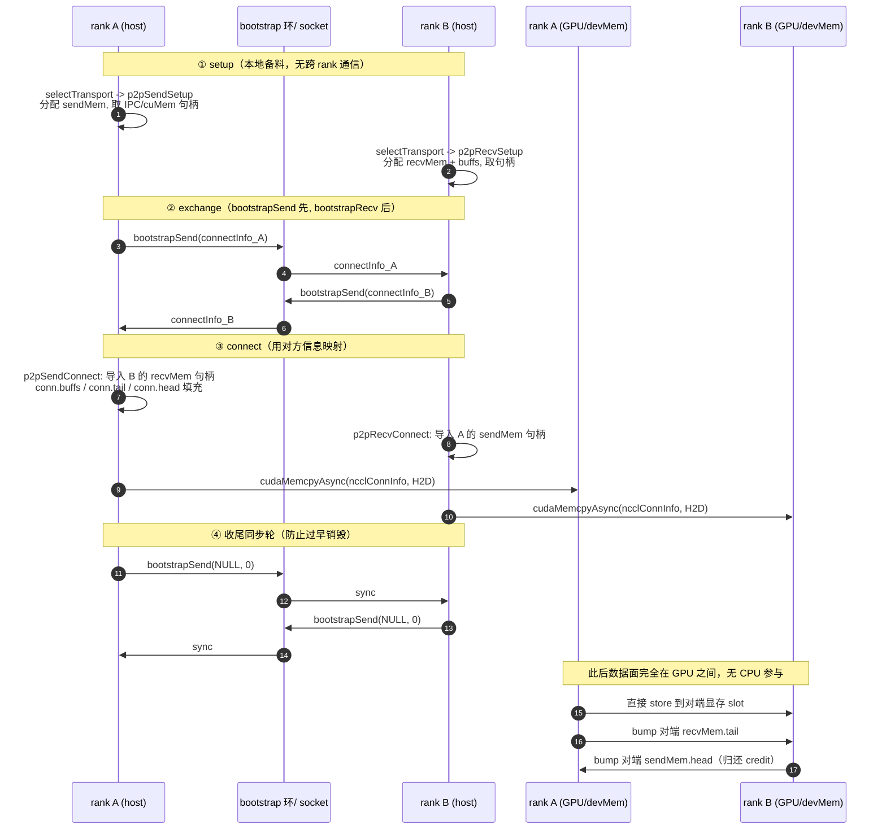
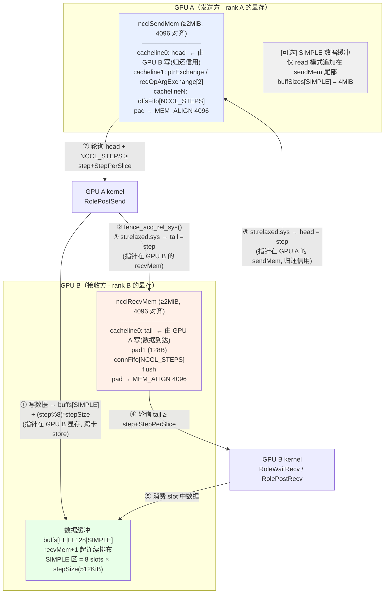

# 06 传输层：字节到底怎么跨 GPU（transport / P2P / SHM）

> 定位：本文回答"一次 AllReduce 里，rank A 的一块显存数据，究竟经过哪些步骤变成 rank B 可见的数据"。
> 上游是 [05-enqueue-plan-launch.md](./05-enqueue-plan-launch.md)（选好算法/协议/通道），下游是
> [09-primitives-simple.md](./09-primitives-simple.md)（GPU kernel 里怎么读写这些 buffer）。

## 本文覆盖的源文件

| 文件 | 职责 | 本仓库状态 |
|---|---|---|
| [src/transport.cc](../src/transport.cc) | `ncclTransports[]` 注册表、`selectTransport`、`ncclTransportP2pSetup` 三段式握手 | 生效 |
| [src/include/transport.h](../src/include/transport.h) | `ncclTransport` / `ncclTransportComm` 接口、`TRANSPORT_*` 枚举、`CONNECT_SIZE` | 生效 |
| [src/include/comm.h](../src/include/comm.h) | `ncclSendMem` / `ncclRecvMem`、`CACHE_LINE_SIZE`/`MEM_ALIGN`/`CUDA_IPC_MIN` | 生效 |
| [src/include/device.h](../src/include/device.h) | `ncclConnInfo` / `ncclConnector`、`NCCL_STEPS`、`NCCL_P2P_READ/WRITE` | 生效 |
| [src/transport/generic.cc](../src/transport/generic.cc) | ring / tree / pat 三种算法的建链入口 | 生效（AllReduce 用 ring/tree） |
| [src/transport/p2p.cc](../src/transport/p2p.cc) | P2P 直连：direct / IPC / CUMEM，read / write 模式 | ✅ 实际走的路径 |
| [src/transport/shm.cc](../src/transport/shm.cc) | 共享内存兜底传输 | 兜底路径 |
| [src/misc/shmutils.cc](../src/misc/shmutils.cc) / [src/os/linux.cc](../src/os/linux.cc) | `/dev/shm` 段创建 + `cudaHostRegister` | 生效 |
| [src/device/prims_simple.h](../src/device/prims_simple.h) | 设备端 head/tail/step 生产者-消费者逻辑 | 生效 |
| [src/device/op128.h](../src/device/op128.h) | `st_relaxed_sys_global` / `fence_acq_rel_sys` 等内存序原语 | 生效 |
| [src/transport/net.cc](../src/transport/net.cc)、[coll_net.cc](../src/transport/coll_net.cc)、[nvls.cc](../src/transport/nvls.cc) | 多机网络 / CollNet / NVLS | **（本仓库未启用 / 仅桩）** |

---

## 主题一：transport 抽象层与选择规则

### ① 解决什么问题（场景）

AllReduce 的算法层（ring / tree）只知道"我要给 rank `next` 发一块数据、从 rank `prev` 收一块数据"，
它不应该关心这两张卡之间是 NVLink 直连、PCIe 同主板、还是要跨机走网卡。
需要一个**可插拔的传输后端抽象**：算法层登记"我和谁在哪条 channel 上要建连接"，
由传输层负责把"连接"变成**一组可以直接被 GPU kernel 读写的指针和计数器**。

### ② 一句话本质

`ncclTransport` 就是一张**函数表 + 一个 `canConnect` 谓词**；
`selectTransport` 按固定优先级 `P2P → SHM → NET → COLLNET` 逐个问"你能不能连"，
第一个回答"能"的传输负责这条连接的 `setup/connect/free`。

### ③ 代码链路

1. [transport.h:L25-L31](../src/include/transport.h#L25) — 定义 `NTRANSPORTS 4` 与四个传输编号。
2. [transport.h:L126-L151](../src/include/transport.h#L126) — `ncclTransportComm`（setup/connect/free + 6 个 proxy 回调）与 `ncclTransport`（name/canConnect/send/recv）。
3. [transport.cc:L23-L26](../src/transport.cc#L23) — 全局注册表 `ncclTransports[]` 的实际内容。
4. [transport.cc:L28-L50](../src/transport.cc#L28) — `selectTransport<type>()` 逐个 `canConnect` 并立即 `setup`。
5. [transport.cc:L146-L252](../src/transport.cc#L146) — `ncclTransportP2pSetup` 在握手循环里调用它。
6. [p2p.cc:L1524-L1529](../src/transport/p2p.cc#L1524) — `p2pTransport` 实例（注意 `proxyProgress` 为 `NULL`）。
7. [shm.cc:L474-L479](../src/transport/shm.cc#L474) — `shmTransport` 实例（同样 `proxyProgress == NULL`）。

### ④ 关键代码逐行解读

```c
// src/include/transport.h
#define NTRANSPORTS 4
#define TRANSPORT_UNDEFINED -1
#define TRANSPORT_P2P 0
#define TRANSPORT_SHM 1
#define TRANSPORT_NET 2
#define TRANSPORT_COLLNET 3
#define TRANSPORT_PROFILER 4
```

- 四个编号就是**优先级顺序**：`P2P` 最快（NVLink 直连），`SHM` 次之（走主机内存），`NET` 最慢（网卡）。
- `TRANSPORT_PROFILER 4` **等于 `NTRANSPORTS`**，见下一条。

```c
// src/transport.cc
struct ncclTransport* ncclTransports[NTRANSPORTS + 1] = {
  &p2pTransport, &shmTransport, &netTransport, &collNetTransport,
  &profilerTransport // Not really used for transport, only to create proxy ops polling on profiler counters.
};
```

- 数组长度是 `NTRANSPORTS + 1 = 5`，第 5 项是 `profilerTransport`。
- **NVLS 不在这个数组里**：[nvls.cc:L54-L57](../src/transport/nvls.cc#L54) 定义了 `nvlsTransport`，
  但从未被登记 → `selectTransport` 永远选不到它（本仓库未启用）。

```c
// src/transport.cc
template <int type>
static ncclResult_t selectTransport(struct ncclComm* comm, struct ncclTopoGraph* graph, struct ncclConnect* connect,
                                    int channelId, int peer, int connIndex, int* transportType) {
  struct ncclPeerInfo* myInfo = comm->peerInfo + comm->rank;
  struct ncclPeerInfo* peerInfo = comm->peerInfo + peer;
  struct ncclConnector* connector = (type == 1) ? comm->channels[channelId].peers[peer]->send + connIndex :
                                                  comm->channels[channelId].peers[peer]->recv + connIndex;
  for (int t = 0; t < NTRANSPORTS; t++) {
    struct ncclTransport* transport = ncclTransports[t];
    struct ncclTransportComm* transportComm = type == 1 ? &transport->send : &transport->recv;
    int ret = 0;
    NCCLCHECK(transport->canConnect(&ret, comm, graph, myInfo, peerInfo));
    if (ret) {
      connector->transportComm = transportComm;
      NCCLCHECK(transportComm->setup(comm, graph, myInfo, peerInfo, connect, connector, channelId, connIndex));
      if (transportType) *transportType = t;
      return ncclSuccess;
    }
  }
  WARN("No transport found for rank %d[%lx] -> rank %d[%lx]", myInfo->rank, myInfo->busId, peerInfo->rank,
       peerInfo->busId);
  return ncclSystemError;
}
```

- `type == 1` 表示 send 方向，`type == 0` 表示 recv 方向；每个方向的 `ncclTransportComm` 是**独立的一套函数**。
- 循环上界是 `NTRANSPORTS`（=4），所以 `profilerTransport` **只用于手工创建 proxy op，不会被自动选中**；
  它自己的 `canConnect` 还是 `NULL`（[profiler.cc:L65-L69](../src/transport/profiler.cc#L65)），这进一步说明它不可能参与选择。
- `canConnect` 与 `setup` 是**紧挨着的两步**：一旦某传输说"我能连"，立刻由它产出 `ncclConnect`（见主题二）。
- `connector->transportComm = transportComm` 这一步把"这条连接以后归谁管"固化下来——后面 `connect()`、`free()` 都从 `conn->transportComm` 取。

### ⑤ 收益

- 算法层与物理链路**完全解耦**：同一份 `all_reduce.h` 代码在 8 卡 NVLink 机器和 2 卡 PCIe 机器上不改一行。
- 优先级遍历保证"能走 NVLink 就一定不走 PCIe"，无需额外配置。
- 每条连接只存一个函数表指针，**运行时没有虚调用/分支预测惩罚**：选择发生在初始化期，数据面是裸指针读写。

### ⑥ 面试考点

**Q1：`ncclTransports[]` 有 5 项，但 `NTRANSPORTS` 是 4，为什么？**
A：第 5 项 `profilerTransport` 只是借用 transport 框架来创建**轮询 profiler 计数器的 proxy op**，
不是真正的传输。`selectTransport` 的循环上界是 `NTRANSPORTS=4`，它永远选不到；
而且它的 `canConnect` 是 `NULL`，真被遍历到会直接崩。

**Q2：NVLS 在本仓库能选中吗？**
A：不能。[nvls.cc:L54](../src/transport/nvls.cc#L54) 有 `nvlsTransport` 定义，但没有登记进 `ncclTransports[]`，
`selectTransport` 无从得知它的存在（本仓库未启用/仅桩）。

**Q3：`selectTransport` 是"先全部 canConnect 再挑最优"吗？**
A：不是，是**短路优先**——按顺序问，第一个回答"能"的直接 `setup` 并返回。
代价是无法做全局最优（比如某条链路走 NET 反而更省），
`canConnect` 内部用 `ncclTopoCheckNet` 做局部兜底（[p2p.cc:L161-L167](../src/transport/p2p.cc#L161)）。

**Q4：`ncclTransportComm` 里 send 和 recv 为什么要分开两套函数？**
A：两端资源不对称：send 方要拿到**对端 recvMem 的可写指针**，recv 方要拿到**对端 sendMem 的可读指针**；
分配大小、IPC 句柄方向、head/tail 归属都不同，拆成两套最清晰。

---

## 主题二：连接建立的三段式握手

### ① 解决什么问题（场景）

两个 rank 要建立一条传输连接，**双方都必须拿到对方的信息**才能完成映射：
- 我要把对端的 `ncclRecvMem` 映射进我的地址空间 → 我需要对端产出的 IPC 句柄；
- 对端同理需要我的句柄。

这是一个"鸡生蛋"问题：任何一方都不能在单步内完成。同时，一次性和所有 rank 握手会让
**临时 buffer 数量与 socket 并发数爆炸**（`nRanks × nChannels × 2` 个 `ncclConnect`）。

### ② 一句话本质

**setup（本地备料，产出 `ncclConnect`）→ bootstrap 交换 → connect（用对方信息完成映射）**，
并且按"距离 i"分成 `nRanks-1` 轮、每轮最多 `NCCL_CONNECT_ROUND_MAX_PEERS=128` 个对端，
用 `rank±i` 的完美配对避免多打一死锁。

### ③ 代码链路

1. [generic.cc:L31-L64](../src/transport/generic.cc#L31) — `ncclTransportRingConnect`：先登记，再统一 setup。
2. [transport.cc:L52-L72](../src/transport.cc#L52) — `ncclTransportP2pConnect` 只做**登记**（置 `connectSend/Recv` 位图）。
3. [transport.cc:L146-L172](../src/transport.cc#L146) — setup 主循环 + `maxPeers`。
4. [transport.cc:L201-L216](../src/transport.cc#L201) — 对每个 channel 调 `selectTransport`（即 setup）。
5. [transport.cc:L218-L252](../src/transport.cc#L218) — **exchange**：`bootstrapSend` / `bootstrapRecv`。
6. [transport.cc:L254-L332](../src/transport.cc#L254) — **connect** 阶段 + 把 `ncclConnInfo` 拷到 device。
7. [transport.cc:L335-L378](../src/transport.cc#L335) — 收尾同步轮（防止对端还没 import 完就销毁）。

### ④ 关键代码逐行解读

```c
// src/transport.cc
NCCL_PARAM(ConnectRoundMaxPeers, "CONNECT_ROUND_MAX_PEERS", 128);
...
  for (int i = 1; i < comm->nRanks; i++) {
    int bootstrapTag = (i << 8) + (graph ? graph->id + 1 : 0);
    int recvPeer = (comm->rank - i + comm->nRanks) % comm->nRanks;
    int sendPeer = (comm->rank + i) % comm->nRanks;
    uint64_t recvMask = comm->connectRecv[recvPeer];
    uint64_t sendMask = comm->connectSend[sendPeer];
    ...
    for (int c = 0; c < MAXCHANNELS; c++) {
      if (recvMask & (1ULL << c)) {
        NCCLCHECKGOTO(selectTransport<0>(comm, graph, recvData[p] + recvChannels++, c, recvPeer, connIndex, &type), ret, fail);
      }
    }
    sendData[p] = recvData[p] + recvChannels;
    for (int c = 0; c < MAXCHANNELS; c++) {
      if (sendMask & (1ULL << c)) {
        NCCLCHECKGOTO(selectTransport<1>(comm, graph, sendData[p] + sendChannels++, c, sendPeer, connIndex, &type), ret, fail);
      }
    }
```

- `recvPeer = rank - i`、`sendPeer = rank + i`：**同一轮里每个 rank 恰好一个发送目标 + 一个接收来源**，
  全局形成完美配对（我发给谁，谁正好在等我），不会多打一，因此不会死锁。
- `bootstrapTag = (i << 8) + (graph->id + 1)`：低 8 位放 graph id、高位放距离 i，
  保证不同轮次/不同拓扑图的握手消息**不会串扰**（bootstrap 是 socket 流，靠 tag 区分消息）。
- `recvData[p]` / `sendData[p]` 是**紧凑打包**的：前 N 项是 recv 连接、后 M 项是 send 连接，
  不同对端的 channel 数可能不同，所以必须靠 `recvChannels`/`sendChannels` 计数定位，不能按固定步长索引。

```c
// src/transport.cc —— exchange：先发后收，顺序刻意错开
    if (sendPeer == recvPeer) {
      if (recvChannels + sendChannels) {
        bootstrapSend(comm->bootstrap, recvPeer, bootstrapTag, data[p], sizeof(ncclConnect) * (recvChannels + sendChannels));
        bootstrapRecv(comm->bootstrap, recvPeer, bootstrapTag, data[p], sizeof(ncclConnect) * (recvChannels + sendChannels));
        sendData[p] = data[p];
        recvData[p] = data[p] + sendChannels;
      }
    } else {
      if (recvChannels) bootstrapSend(comm->bootstrap, recvPeer, bootstrapTag, recvData[p], sizeof(ncclConnect) * recvChannels);
      if (sendChannels) bootstrapSend(comm->bootstrap, sendPeer, bootstrapTag, sendData[p], sizeof(ncclConnect) * sendChannels);
      if (sendChannels) bootstrapRecv(comm->bootstrap, sendPeer, bootstrapTag, sendData[p], sizeof(ncclConnect) * sendChannels);
      if (recvChannels) bootstrapRecv(comm->bootstrap, recvPeer, bootstrapTag, recvData[p], sizeof(ncclConnect) * recvChannels);
    }
```

- **先 Send 后 Recv**：`bootstrapSend` 是阻塞的（要把整块数据推走），如果所有 rank 都先 Recv 就会互相等死；
  先 Send 可以让数据已经在管道里，随后 Recv 立即拿到。
- 注意 `sendData[p]` 是**输入输出复用**的：发出去的是我自己的 connectInfo，收回来的被**原地覆盖**成对方的。
- `sendPeer == recvPeer` 是 `2*i == nRanks` 的退化情形（偶数 rank 数时距离为 `nRanks/2` 的对端），
  此时只需一对收发，且收完之后要**重新切分** buffer（`sendData[p]=data[p]; recvData[p]=data[p]+sendChannels`）。

```c
// src/transport.cc —— connect：用对方信息完成本地映射，并同步到 device
          for (int c = 0; c < MAXCHANNELS; c++) {
            if (sendMask & (1ULL << c)) {
              struct ncclConnector* conn = comm->channels[c].peers[sendPeer]->send + connIndex;
              if (conn->connected == 0) {
                NCCLCHECKGOTO(conn->transportComm->connect(comm, sendData[p] + sendDataOffset, 1, comm->rank, conn), ret, fail);
                if (ret == ncclSuccess) {
                  conn->connected = 1;
                  CUDACHECKGOTO(cudaMemcpyAsync(&comm->channels[c].devPeersHostPtr[sendPeer]->send[connIndex],
                                                &conn->conn, sizeof(struct ncclConnInfo), cudaMemcpyHostToDevice,
                                                hostStream), ret, fail);
                } else if (ret == ncclInProgress) {
                  allChannelsConnected = false;
                }
              }
              sendDataOffset++;
            }
```

- `connect()` 可能返回 `ncclInProgress`（例如网络建链还没完成），所以用 `while(!allChannelsConnected)` **反复重试**。
- **最关键的一行是 `cudaMemcpyAsync(... cudaMemcpyHostToDevice)`**：
  host 侧的 `ncclConnInfo`（含 `buffs[]`/`head`/`tail`/`stepSize`）必须拷到 device 内存，
  GPU kernel 才能读到。这是"主机建链成果 → 设备可用"的唯一通道。
- 内层 `while` 循环在 `i - done == maxPeers || i == nRanks-1` 时才触发（[transport.cc:L254](../src/transport.cc#L254)）：
  这就是**分轮次**——每攒够 128 个对端才做一次批量 connect，把同时存在的临时 `ncclConnect` 数量夹在 128 以内。

### ⑤ 收益

- **无死锁**：`rank±i` 完美配对 + 先 Send 后 Recv。
- **资源峰值可控**：`maxPeers` 默认 128，临时 buffer 数量与 `nRanks` 解耦；
  单个 `ncclConnect` 只有 `CONNECT_SIZE = 256` 字节（[transport.h:L76-L81](../src/include/transport.h#L76)），
  每轮峰值约 `128 × 64(MAXCHANNELS) × 2 × 256B = 4 MiB`。
- **收尾同步**（[transport.cc:L353-L378](../src/transport.cc#L353)）：额外跑一轮空 bootstrap 收发，
  防止"我建完就开始销毁"而"对方还在 import"，导致 shmem/cuda buffer 变成悬空指针。

### ⑥ 面试考点

**Q1：为什么要三段（setup / exchange / connect），两段不行吗？**
A：不行。setup 阶段只能拿到**自己**的资源（IPC 句柄、地址），
而 connect 需要**对方**的句柄才能 `cudaIpcOpenMemHandle` / `cuMemMap`。
双方信息必须互换，物理上不可能一步完成。

**Q2：为什么要分轮次（round）？**
A：控制资源峰值与 socket 并发。一次性与所有 rank 握手会同时持有
`nRanks × nChannels × 2` 个 `ncclConnect`，在大规模场景（上千 rank）会耗尽内存和连接槽位。
`NCCL_CONNECT_ROUND_MAX_PEERS` 默认 128。

**Q3：`recvPeer = rank-i` / `sendPeer = rank+i` 的设计解决了什么？**
A：完美配对。同一轮里每个 rank 既是某个 rank 的发送方、又是另一个 rank 的接收方，
不会有两个 rank 同时给同一个 rank 发握手消息（多打一 → 排队 → 潜在死锁）。

**Q4：GPU kernel 是怎么"知道"连接建好的？**
A：host 在 connect 成功后把整个 `ncclConnInfo` 用 `cudaMemcpyAsync(HostToDevice)` 拷到
`devPeersHostPtr[peer]->send/recv[connIndex]`，kernel 启动时读的就是这块 device 内存。

---

### 三段式握手时序图



---

## 主题三：`ncclConnInfo` / `ncclSendMem` / `ncclRecvMem` 与 head/tail/step 协议

### ① 解决什么问题（场景）

连接建好之后，数据是**流水线**搬运的：发送方一次只能写 `NCCL_STEPS=8` 个 slot 中的一个，
写之前必须确认那个 slot 已经被对端消费掉。需要一套**无需加锁、无需系统调用、
GPU 之间直接可见**的生产者-消费者同步协议。

### ② 一句话本质

**一块共享的环形 FIFO + 两个 64 位单调递增计数器**：
`tail` = "我已经生产到第几步"（生产者写、消费者读），
`head` = "我已经消费到第几步"（消费者写、生产者读，即**信用/credit 归还**）。

### ③ 代码链路

1. [comm.h:L54-L56](../src/include/comm.h#L54) — `CACHE_LINE_SIZE 128` / `MEM_ALIGN 4096` / `CUDA_IPC_MIN 2MiB`。
2. [comm.h:L63-L87](../src/include/comm.h#L63) — `ncclSendMem` / `ncclRecvMem` 定义。
3. [device.h:L143-L161](../src/include/device.h#L143) — `ncclConnInfo`（`buffs[]`/`tail`/`head`/`stepSize`/`step`）。
4. [device.h:L175-L183](../src/include/device.h#L175) — `ncclConnector`（`connected`/`transportComm`/`conn`）。
5. [p2p.cc:L621-L624](../src/transport/p2p.cc#L621) — send 侧 `tail`/`head` 的归属赋值。
6. [p2p.cc:L652-L655](../src/transport/p2p.cc#L652) — recv 侧 `tail`/`head` 的归属赋值。
7. [prims_simple.h:L517-L568](../src/device/prims_simple.h#L517) — 设备端 `loadRecvConn`。
8. [prims_simple.h:L571-L614](../src/device/prims_simple.h#L571) — 设备端 `loadSendConn`。
9. [prims_simple.h:L206-L215](../src/device/prims_simple.h#L206) — `postPeer()`：推进并发布 `step`。
10. [op128.h:L385-L406](../src/device/op128.h#L385) — `st_relaxed_sys_global` / `fence_acq_rel_sys`。

### ④ 关键代码逐行解读

```c
// src/include/comm.h
#define CACHE_LINE_SIZE 128
#define MEM_ALIGN 4096
#define CUDA_IPC_MIN 2097152UL

struct ncclSendMem {
  union {
    struct {
      uint64_t head;
      char pad1[CACHE_LINE_SIZE - sizeof(uint64_t)];
      void* ptrExchange;
      uint64_t redOpArgExchange[2];
      char pad2[CACHE_LINE_SIZE - sizeof(void*) - 2 * sizeof(uint64_t)];
      int offsFifo[NCCL_STEPS];
    };
    char pad3[MEM_ALIGN];
  };
};

struct ncclRecvMem {
  union {
    struct {
      uint64_t tail;
      char pad1[CACHE_LINE_SIZE - sizeof(uint64_t)];
      struct ncclConnFifo connFifo[NCCL_STEPS];
      int flush; // For GDRCopy-based flush
    };
    char pad4[MEM_ALIGN];
  };
};
```

- **`head` 住在 `ncclSendMem`，`tail` 住在 `ncclRecvMem`**，且各自被 `pad1` 撑满一条 cache line（128B）。
  原因：这两个计数器被**两个不同 GPU** 反复读写，如果和别的字段挤在同一条 cache line 上，
  会产生 false sharing → 跨卡 cache line 乒乓，延迟直接翻倍。
- 整个结构体被 `pad3`/`pad4` 撑到 `MEM_ALIGN = 4096`：
  `cudaIpcGetMemHandle` 要求按 **2 MiB（`CUDA_IPC_MIN`）** 对齐的基址（见 [p2p.cc:L460](../src/transport/p2p.cc#L460) 的 `ALIGN_SIZE(sendSize, CUDA_IPC_MIN)`），
  4096 对齐是让"结构体 + 紧随其后的数据 buffer"整体布局规整。
- `flush` 字段是给 GDRCopy 刷盘用的（本仓库单机 P2P 不需要）。

```c
// src/include/device.h
struct ncclConnInfo {
  // Regular 通信域 mechanism
  char* buffs[NCCL_NUM_PROTOCOLS]; // Local for recv, remote for send
  void* mhandles[NCCL_NUM_PROTOCOLS];
  uint64_t* tail;     // Local for recv, remote for send
  uint64_t* head;     // Local for send, remote for recv

  int flags;          // Direct communication / other flags
  int shared;         // Buffers are shared
  int stepSize;       // Step size for the SIMPLE buffer
  void** ptrExchange; // Pointer exchange for direct communication
  uint64_t* redOpArgExchange; // PreOp scaler exchange for direct pull case

  struct ncclConnFifo* connFifo; // Used for GPU - Proxy communication

  uint64_t step;      // Keep where we are
  uint64_t llLastCleaning;
  ncclNetDeviceHandle_t netDeviceHandle;
};
```

- 注释里的 **"Local for recv, remote for send"** 是全文最关键的一句，展开讲：
  - 对 **recv connector**：`tail` 指向**本地** `recvMem.tail`（由对端 GPU 写入），`head` 指向**远端** `sendMem.head`（由本 GPU 写入）。
  - 对 **send connector**：`tail` 指向**远端** `recvMem.tail`（由本 GPU 写入），`head` 指向**本地** `sendMem.head`（由对端 GPU 写入）。
  - 即：**tail 永远是"数据到达"的方向，head 永远是"槽位归还"的方向**，只是具体指针落在本地还是远端内存上不同。
- `stepSize = buffSizes[NCCL_PROTO_SIMPLE] / NCCL_STEPS`：默认 `4MiB / 8 = 512 KiB`（[init.cc:L827](../src/init.cc#L827) `DEFAULT_BUFFSIZE (1<<22)`）。
- `step` 是 host 初始化、device 维护的"我走到第几步"，**单调不减**。

```c
// src/device/prims_simple.h —— 谁来写、谁来读，一目了然
  __device__ __forceinline__ void loadRecvConn(ncclDevChannelPeer* peer, int connIndex, ...) {
    conn = &peer->recv[connIndex];
    step = conn->step;
    step = roundUp(step, SlicePerChunk * StepPerSlice);
    if (flags & RolePostRecv) {
      connStepPtr = conn->head;
      *connStepPtr = step; // Return credits in case we rounded up.
    }
    if (flags & RoleWaitRecv) {
      connStepPtr = conn->tail;
      connStepCache = loadStepValue(connStepPtr);
      connStepSize = conn->stepSize / sizeof(T);
      connEltsFifo = (T*)conn->buffs[NCCL_PROTO_SIMPLE];
      ...
    }
  }
```

- **RolePostRecv（消费者）写 `conn->head`**：我消费完了，把信用还给发送方。
- **RoleWaitRecv（消费者）读 `conn->tail`**：等数据到。
- `*connStepPtr = step` 这一句在 roundUp 之后立刻写，是"**把被 roundUp 跳过的那些 step 直接视为已消费**"，
  避免信用丢失导致死锁。

```c
// src/device/prims_simple.h —— 等待条件与发布
      int spins = 0;
      while (connStepCache + (isSendNotRecv ? NCCL_STEPS : 0) < step + StepPerSlice) {
        connStepCache = loadStepValue(connStepPtr);
        if (checkAbort(flags, Aborted, spins)) break;
      }
...
  template <int Recv, int Send>
  inline __device__ void postPeer(bool dataStored) {
    if (flags & (Recv * RolePostRecv | Send * RolePostSend)) {
      step += StepPerSlice;
      if (Send && (flags & RolePostSend) && (dataStored || (flags & ConnFifoEnabled))) {
        fence_acq_rel_sys();
      }
      st_relaxed_sys_global(connStepPtr, step);
    }
  }
```

- **发送方**：`while (head + NCCL_STEPS < step + StepPerSlice)`。
  `+NCCL_STEPS` 是信用额度：我最多可以领先对端消费进度 8 个 step（正好是 FIFO 槽位数），
  超过就必须等。这就是**流控**。
- **接收方**：`while (tail < step + StepPerSlice)`，即等到数据真的到了。
- `fence_acq_rel_sys()` 在写 tail **之前**执行（[op128.h:L400-L406](../src/device/op128.h#L400)，
  即 `fence.acq_rel.sys`）：保证"数据已经落到对端显存"这个事实**先于** "tail 自增" 被对方观察到。
  没有它，对端可能看到 tail 变了但数据还没到 → 读到脏数据。
- `st_relaxed_sys_global` 是 `st.relaxed.sys.global.u64`：`.sys` 表示**系统级可见**（跨 GPU / 跨 PCIe），
  `relaxed` 表示不与其他内存操作重排约束——因为必要的 fence 已经显式做了。

### ⑤ 收益（定量优先）

- **零 CPU 参与**：一次 send/recv 的同步就是两次 GPU 显存读写，没有系统调用、没有锁、没有中断。
- **流水线深度 8**：`NCCL_STEPS = 8`，发送方最多领先 8 × `stepSize` = 8 × 512 KiB = **4 MiB**，
  足以掩盖 NVLink 往返延迟（亚微秒级）。
- **无 false sharing**：`head`/`tail` 各占 128B cache line，避免跨卡乒乓。
- **信用精确**：roundUp 后立即 `*head = step`，不会因为对齐跳过而丢信用。
- 实测：本仓库 128 MB AllReduce 双卡达到 **≈281 GB/s bus bandwidth**（见仓库 README）。

### ⑥ 面试考点

**Q1：`head` 和 `tail` 分别在哪个结构里、由谁写？**
A：`head` 在 `ncclSendMem`（发送方的结构），由**接收方** GPU 写（归还信用）；
`tail` 在 `ncclRecvMem`（接收方的结构），由**发送方** GPU 写（数据到达）。
一句话：**tail 是数据方向，head 是信用方向**。

**Q2：为什么用单调递增的 `step` 而不是环形指针比较？**
A：三个理由——
(1) 环形指针 `head == tail` 既可能表示"空"也可能表示"满"，需要额外标志位或牺牲一个槽位；
(2) 64 位单调递增几乎不回绕（1e9 step/s 也要 ~580 年），比较无需处理跨回绕；
(3) 槽位索引用 `step % NCCL_STEPS` 现算，而**比较用完整的 `step`**，语义清晰且支持 roundUp 后精确归还信用。

**Q3：`fence_acq_rel_sys()` 能不能省？**
A：不能。它保证"数据写入"happens-before"tail 自增"。
少了它，对端可能在看到 tail 推进后读到尚未落地的旧数据。
在 NVLink 上还需要 `.sys` 作用域（而不是普通的 `__threadfence()`），因为要跨 GPU 可见。

**Q4：`+NCCL_STEPS` 那个偏移量是什么？**
A：信用窗口。发送方允许领先接收方最多 `NCCL_STEPS` 个 step，
正好等于 FIFO 的物理槽位数，保证永远不会覆盖还没被消费的数据。

**Q5：`pad1`/`pad3` 为什么那么浪费？**
A：不是浪费是必需。`head`/`tail` 被两块 GPU 高频读写，
若不各自独占一条 128B cache line，就会 false sharing，跨卡一致性流量会把延迟打上去。

---

### `ncclSendMem` / `ncclRecvMem` 生产者-消费者内存布局图



---

## 主题四：P2P transport —— NVLink 上的 GPU 直连

### ① 解决什么问题（场景）

两张卡在同一台机器、通过 NVLink（或至少 PCIe 同主板）相连。
目标是把"把 A 的一块显存给 B"这件事做到**最低延迟、最高带宽**，
并且**数据面完全不经过 CPU / 主机内存**。

### ② 一句话本质

把对端的 `ncclSendMem`/`ncclRecvMem` 通过 **CUDA IPC 句柄（legacy `cudaIpc*`）或 cuMem VMM（`cuMemExportToShareableHandle`/`cuMemMap`）**
映射进本进程/本 GPU 的地址空间，然后让 **GPU kernel 直接 `load`/`store` 对端显存**，
而不是发起一次 `cudaMemcpy`。

### ③ 代码链路

1. [p2p.cc:L38-L43](../src/transport/p2p.cc#L38) — 4 种 `p2pType`：`DIRECT / INTERMEDIATE / IPC / CUMEM`。
2. [p2p.cc:L148-L240](../src/transport/p2p.cc#L148) — `p2pCanConnect` 的全部判定。
3. [p2p.cc:L364-L386](../src/transport/p2p.cc#L364) — `p2pGetInfo` 决定 read / write。
4. [p2p.cc:L250-L288](../src/transport/p2p.cc#L250) — `ncclP2pAllocateShareableBuffer`（导出）。
5. [p2p.cc:L294-L354](../src/transport/p2p.cc#L294) — `ncclP2pImportShareableBuffer`（导入）。
6. [p2p.cc:L388-L433](../src/transport/p2p.cc#L388) — `p2pMap`（同进程 direct / 跨进程 import）。
7. [p2p.cc:L439-L517](../src/transport/p2p.cc#L439) — `p2pSendSetup`。
8. [p2p.cc:L589-L629](../src/transport/p2p.cc#L589) — `p2pSendConnect`（填充 `conn.buffs/head/tail`）。
9. [p2p.cc:L141-L142](../src/transport/p2p.cc#L141) — `NCCL_P2P_USE_CUDA_MEMCPY`（CE memcpy 模式，默认 0）。

### ④ 关键代码逐行解读

```c
// src/transport/p2p.cc —— p2pMap：同进程 vs 跨进程两条路
static ncclResult_t p2pMap(struct ncclComm* comm, struct ncclProxyConnector* proxyConn, struct ncclPeerInfo* myInfo,
                           struct ncclPeerInfo* peerInfo, struct ncclP2pBuff* p2pBuff, void** devMem, void** ipcPtr) {
  if (P2P_SAME_PID(myInfo, peerInfo)) {
    if (peerInfo->cudaDev != myInfo->cudaDev) {
      cudaError_t err = cudaDeviceEnablePeerAccess(peerInfo->cudaDev, 0);
      if (err == cudaErrorPeerAccessAlreadyEnabled) {
        cudaGetLastError();
      } else if (err != cudaSuccess) {
        WARN("failed to peer with device %d(=%lx): %d %s", peerInfo->cudaDev, peerInfo->busId, err,
             cudaGetErrorString(err));
        return ncclInternalError;
      }
      if (ncclCuMemEnable()) {
        NCCLCHECK(ncclCuMemAllocAddr(devMem, &p2pBuff->ipcDesc.memHandle, p2pBuff->size));
        CUCHECK(cuMemRelease(p2pBuff->ipcDesc.memHandle));
        *ipcPtr = *devMem;
        NCCLCHECK(ncclMemTrackImportFromPeer(comm->memManager, *devMem, p2pBuff->size, 0, ncclCuMemHandleType,
                                             ncclMemOffload, peerInfo->rank, peerInfo->cudaDev, p2pBuff->directPtr));
      } else {
        *devMem = p2pBuff->directPtr;
        *ipcPtr = NULL;
      }
    } else {
      *devMem = p2pBuff->directPtr;
      *ipcPtr = NULL;
    }
  } else {
    NCCLCHECK(ncclP2pImportShareableBuffer(comm, peerInfo->rank, p2pBuff->size, &p2pBuff->ipcDesc, devMem,
                                           p2pBuff->directPtr, ncclMemOffload));
    *ipcPtr = *devMem;
  }
  return ncclSuccess;
}
```

- `P2P_SAME_PID` = 同 `hostHash` 且同 `pidHash`：共享同一虚拟地址空间，
  **对端指针可以直接用**，只要再 `cudaDeviceEnablePeerAccess()` 打开访问开关即可——省掉整个 IPC 导出/导入。
- `cudaErrorPeerAccessAlreadyEnabled` 被视为成功，随后调 `cudaGetLastError()` **清掉 CUDA 的错误状态**，
  否则后续 `CUDACHECK` 会误报。这是一个很容易漏的细节。
- 同进程 + cuMem 模式仍要走 `ncclCuMemAllocAddr`：**目的是增加对端 allocation 的引用计数**，
  否则对端异常退出释放了这块内存，本 rank 继续访问就是非法访问。
- 跨进程走 `ncclP2pImportShareableBuffer`（[p2p.cc:L294](../src/transport/p2p.cc#L294)）：
  - legacy 路径：`cudaIpcOpenMemHandle(devMemPtr, ipcDesc->devIpc, cudaIpcMemLazyEnablePeerAccess)`；
  - cuMem 路径：`cuMemImportFromShareableHandle` → `cuMemAddressReserve` → `cuMemMap` → `cuMemSetAccess`。
- **注意 `p2pMap` 是在 host 上执行、但把结果交给 GPU**：映射完成后得到的 `devMem` 指针会被写进
  `conn.buffs[]`，GPU kernel 拿着它直接访存——这就是"GPU 直接 load/store 对端显存"的物理基础。

```c
// src/transport/p2p.cc —— read / write 两种模式如何体现在缓冲区分配上
  int sendSize = sizeof(struct ncclSendMem);
  // P2P 读模式下，SIMPLE 协议的缓冲区被追加在 ncclSendMem 结构体的末尾
  if (info->read) sendSize += comm->buffSizes[NCCL_PROTO_SIMPLE];
  ALIGN_SIZE(sendSize, CUDA_IPC_MIN);
...
  int recvSize = sizeof(struct ncclRecvMem);
  for (int p = 0; p < NCCL_NUM_PROTOCOLS; p++) {
    if (!(info->read && p == NCCL_PROTO_SIMPLE)) recvSize += comm->buffSizes[p];
  }
  ALIGN_SIZE(recvSize, CUDA_IPC_MIN);
```

- **write 模式（默认）**：数据 buffer 跟在 `ncclRecvMem` 后面（在接收方显存），
  发送方直接 `store` 过去 → 发射后不管（fire-and-forget），延迟最低。
- **read 模式**：SIMPLE 的数据 buffer 从 recvMem 挪到 `ncclSendMem` 后面（**在发送方显存**），
  接收方主动 `load` 回来 → 需要等数据返回，但在 NVLink 上能获得更高的带宽利用率。
- 源码注释（[p2p.cc:L377-L380](../src/transport/p2p.cc#L377)）：
  两张 Ampere 及以上架构的 GPU 通过 NVLink 直连时，拓扑查询默认启用 **read** 模式。
- `ALIGN_SIZE(sendSize, CUDA_IPC_MIN)`：`CUDA_IPC_MIN = 2 MiB`，
  CUDA IPC 要求共享的显存基址按 2 MiB 对齐，所以即使一个 `ncclSendMem` 只有几 KB，
  实际也会占掉 2 MiB 的粒度。

```c
// src/transport/p2p.cc —— p2pSendConnect：谁写 tail、谁写 head
  } else {
    send->conn.tail = &remDevMem->tail;          // remDevMem = 远端 recvMem（我写）
    send->conn.head = &resources->sendDevMem->head; // 本地 sendMem（对端写）
    send->conn.ptrExchange = &resources->sendDevMem->ptrExchange;
    send->conn.redOpArgExchange = resources->sendDevMem->redOpArgExchange;
  }
  send->conn.stepSize = comm->buffSizes[NCCL_PROTO_SIMPLE] / NCCL_STEPS;
  // 必须设置 proxyConn 的 proxyProgress 属性，才能在入队时正确校验
  send->proxyConn.proxyProgress = p2pTransport.send.proxyProgress;
```

- 最后一行极其重要：`p2pTransport.send.proxyProgress` **默认为 `NULL`**
  （[p2p.cc:L1526](../src/transport/p2p.cc#L1526) 的函数表里 `proxyProgress` 位置是 `NULL`）。
  它只有在 `NCCL_P2P_USE_CUDA_MEMCPY=1` 时才被 `initCeOperation()` 填上
  （[p2p.cc:L1531-L1541](../src/transport/p2p.cc#L1531)）。
  **`proxyProgress == NULL` ⇒ 这条连接完全不走 proxy 线程**，见 [07-proxy-progress-engine.md](./07-proxy-progress-engine.md)。

### ⑤ 收益

- **零拷贝**：数据从 A 的 SM 直接写到 B 的显存，不经过主机内存、不经过 CPU。
- **NVLink 带宽**：本仓库双卡 128 MB AllReduce 实测 **≈281 GB/s bus bandwidth**。
- **延迟**：一次同步只有 1 次跨卡 store + 1 次跨卡 load，亚微秒级，远低于任何经过 CPU 的方案。
- **read 模式在 NVLink 上带宽更优**：read 请求可以合并成更大的 outstanding 请求，写回时不需要等待。

### ⑥ 面试考点

**Q1：为什么 NVLink 上用"GPU 直接 load/store 对端显存"，而不用 `cudaMemcpyAsync`？**
A：三个原因——
(1) `cudaMemcpyAsync` 要**在 GPU 上启一个 CE（Copy Engine）任务**，需要 host 侧发起、入流、等 event，
    一次往返至少几微秒；而 kernel 里一条 `st.global` 指令的延迟是几十纳秒级；
(2) CE 拷贝无法和规约计算**融合**——kernel 里可以"算完一片立刻发出去"，CE 必须等整块数据就绪；
(3) 直接访存可以做到**计算与通信完全重叠**（NVLS/SIMPLE 协议的多 step 流水线），CE 拷贝是独立阶段。
本仓库里 `NCCL_P2P_USE_CUDA_MEMCPY` 默认 **0**，就是关闭 CE 路径。

**Q2：`direct` / `IPC` / `CUMEM` 三种类型分别在什么时候用？**
A：同进程（`P2P_SAME_PID` 且未设 `NCCL_P2P_DIRECT_DISABLE`）→ `P2P_DIRECT`，直接复用指针；
跨进程 + `NCCL_CUMEM_ENABLE` 生效 → `P2P_CUMEM`（`cuMem*` VMM）；
跨进程 + 传统路径 → `P2P_IPC`（`cudaIpcGetMemHandle` / `cudaIpcOpenMemHandle`）。
`P2P_INTERMEDIATE` 是两卡不能直连、需要第三个 rank 中转的情形（本仓库单机 NVLink 不走）。

**Q3：`p2pCanConnect` 里为什么要真的 `cudaIpcGetMemHandle` 试一次？**
A：针对 WSL 等环境的规避手段——`cudaDeviceCanAccessPeer` 会乐观返回"可用"，
但真正申请 IPC 句柄时失败（[p2p.cc:L218-L227](../src/transport/p2p.cc#L218)）。
探测结果用 `static int legacyIPC` 缓存，因为同进程内结果恒定、而探测要真实分配显存，开销大。

**Q4：`cudaDeviceEnablePeerAccess` 返回 `cudaErrorPeerAccessAlreadyEnabled` 为什么还要调 `cudaGetLastError()`？**
A：这个"错误"是非致命的，但 CUDA 会把它留在线程的错误状态里；
不清掉的话，后续任何 `CUDACHECK` 都会读到这个陈旧错误而误判失败。

**Q5：`NCCL_P2P_READ_ENABLE` 默认 `-2` 是什么意思？**
A：`-2` 表示"不覆盖，交由拓扑自动决定"；
非 `-2` 的值会**强制**覆盖 [p2p.cc:L383-L384](../src/transport/p2p.cc#L383)。
这是常见的调试手段（对比 read / write 两种模式的性能）。

---

## 主题五：SHM transport —— 没有 NVLink 时怎么兜底

### ① 解决什么问题（场景）

同机多卡但**没有 NVLink 直连**（比如 PCIe 直连但 P2P 被禁用、或跨 NUMA / 跨容器），
`p2pCanConnect` 返回 0。此时仍需完成 AllReduce，就要一个"不依赖 GPU P2P"的通路。

### ② 一句话本质

在 **`/dev/shm` 上开一段共享内存**（或 cuMem host 内存），
用 `cudaHostRegister` 把它**映射成 GPU 可访问的设备指针**，
于是 GPU 仍然可以直接 `load/store`——只是目标内存**在主机侧**，数据要跨 PCIe 往返。

### ③ 代码链路

1. [shm.cc:L68-L90](../src/transport/shm.cc#L68) — `shmCanConnect`。
2. [shm.cc:L95-L126](../src/transport/shm.cc#L95) — `shmSendSetup`（向 proxy 请求分配 shm 段）。
3. [shm.cc:L160-L183](../src/transport/shm.cc#L160) — `shmSendConnect`（导入对端 shm 段、填 `conn`）。
4. [shm.cc:L312-L363](../src/transport/shm.cc#L312) — `ncclShmAllocateShareableBuffer`（cuMem vs `/dev/shm`）。
5. [shm.cc:L365-L456](../src/transport/shm.cc#L365) — `ncclShmImportShareableBuffer`。
6. [os/linux.cc:L761-L845](../src/os/linux.cc#L761) — `ncclOsShmOpen`：`mkstemp` + `fallocate` + `mmap` + `cudaHostRegister`。
7. [shm.cc:L62-L63](../src/transport/shm.cc#L62) — `NCCL_SHM_DISABLE` / `NCCL_SHM_LOCALITY`。

### ④ 关键代码逐行解读

```c
// src/transport/shm.cc
static ncclResult_t shmCanConnect(int* ret, struct ncclComm* comm, struct ncclTopoGraph* graph,
                                  struct ncclPeerInfo* info1, struct ncclPeerInfo* info2) {
  *ret = 0;
  initShmLocality();
  if (ncclParamShmDisable() == 1) return ncclSuccess;
  int useNet = 0;
  NCCLCHECK(ncclTopoCheckNet(comm->topo, info1->rank, info2->rank, &useNet));
  if (useNet) return ncclSuccess;
  if (info1->hostHash != info2->hostHash) return ncclSuccess;   // 必须同主机
  if (info1->shmDev != info2->shmDev) return ncclSuccess;       // 必须是同一个 /dev/shm（容器隔离）
  *ret = 1;
  return ncclSuccess;
}
```

- 两个硬性条件：**同 hostHash**（同一台机器）+ **同 `shmDev`**（同一个 `/dev/shm` 设备号）。
  后者是容器场景的判定：如果两个 rank 在不同容器里各自挂载了独立的 `/dev/shm`，
  即使同主机也**不能**用 shm，必须走 net。
- `NCCL_SHM_DISABLE=1` 可强制关掉，用于调试或强制走网络路径。

```c
// src/os/linux.cc —— /dev/shm 段的创建 + GPU 可见化
  if (create) {
    if (shmPath[0] == '\0') {
      snprintf(shmPath, shmPathSize, "/dev/shm/nccl-XXXXXX");
    retry_mkstemp:
      fd = mkstemp(shmPath);
      ...
    }
  retry_fallocate:
    if (fallocate(fd, 0, 0, realShmSize) != 0) { ... }
  } else {
    SYSCHECKGOTO(fd = open(shmPath, O_RDWR, S_IRUSR | S_IWUSR), "open", ret, fail);
  }
  hptr = (char*)mmap(NULL, realShmSize, PROT_READ | PROT_WRITE, MAP_SHARED, fd, 0);
  ...
  if (devShmPtr) {
    cudaStreamCaptureMode mode = cudaStreamCaptureModeRelaxed;
    CUDACHECKGOTO(cudaThreadExchangeStreamCaptureMode(&mode), ret, fail);
    CUDACHECKGOTO(cudaHostRegister((void*)hptr, realShmSize, cudaHostRegisterPortable | cudaHostRegisterMapped), ret, fail);
    CUDACHECKGOTO(cudaHostGetDevicePointer(&dptr, (void*)hptr, 0), ret, fail);
    CUDACHECKGOTO(cudaThreadExchangeStreamCaptureMode(&mode), ret, fail);
  }
```

- `mkstemp("/dev/shm/nccl-XXXXXX")` 生成唯一文件名，`fallocate` 真正占位，
  `mmap(MAP_SHARED)` 映射进本进程。
- `realShmSize = shmSize + sizeof(int)`：**尾部多 4 字节做引用计数**，
  最后一个 detach 的进程负责 `unlink`（[linux.cc:L819-L828](../src/os/linux.cc#L819)）。
- `cudaHostRegister(..., cudaHostRegisterPortable | cudaHostRegisterMapped)` + `cudaHostGetDevicePointer`：
  把这段**主机内存**变成 GPU 可以直接寻址的设备指针 `dptr`。
  这就是 shm 传输"仍然不需要 CPU 搬数据"的原因——**GPU 自己跨 PCIe 读写主机内存**。
- 前后包着 `cudaThreadExchangeStreamCaptureMode(cudaStreamCaptureModeRelaxed)`：
  避免这个 host 侧操作被 CUDA Graph 捕获进去（graph 捕获期间不允许这类操作）。

```c
// src/transport/shm.cc —— connect：head/tail 指向的是 host 内存的 device 映射
  NCCLCHECK(ncclShmImportShareableBuffer(comm, info->rank, &info->desc, (void**)&resources->remHostMem,
                                         (void**)&resources->devRemHostMem, &resources->remDesc));
  buff = shmLocality == SHM_SEND_SIDE ? (char*)(resources->devHostMem + 1) : (char*)(resources->devRemHostMem + 1);
  for (int p = 0; p < NCCL_NUM_PROTOCOLS; p++) {
    send->conn.buffs[p] = buff;
    buff += comm->buffSizes[p];
  }
  send->conn.tail = &resources->devRemHostMem->tail;
  send->conn.head = &resources->devHostMem->head;
  send->conn.stepSize = comm->buffSizes[NCCL_PROTO_SIMPLE] / NCCL_STEPS;
  send->proxyConn.proxyProgress = shmTransport.send.proxyProgress;
```

- 结构与 P2P **完全一致**（同样的 `buffs/tail/head/stepSize`），
  唯一区别是指向的内存**在主机侧**。所以设备端 kernel 代码**完全不用改**——
  这是这套抽象的真正价值。
- `shmLocality`（`NCCL_SHM_LOCALITY`，默认 2 = receiver side）决定数据 buffer 分配在**接收方**还是**发送方**的 shm 段，
  影响数据跨 PCIe 的次数。
- `shmTransport.send.proxyProgress` 同样是 `NULL`
  （[shm.cc:L477](../src/transport/shm.cc#L477) 函数表只填了前 8 项），**shm 也不走 proxy 进度线程**。

### ⑤ 收益 / 代价

- **收益**：在没有 GPU P2P 的机器上仍然能跑 AllReduce，且**依然不需要 CPU 参与数据搬运**（GPU 直读直写 host 内存）。
- **代价（定量）**：
  - 数据要跨 **PCIe** 而不是 NVLink。PCIe Gen4 x16 双向理论 ~64 GB/s、单向上限约 ~32 GB/s，
    而 NVLink（H 系列）单向可达数百 GB/s——**差距在一个数量级**，这就是"带宽腰斩甚至更差"的来源。
  - 主机内存的访问延迟（~数百 ns）远高于远端 GPU 显存经 NVLink 的访问延迟（~百 ns 以内）。
  - `cudaHostRegister` 会**锁页（pin）**这段内存，占用不可换出的物理页；
    每对连接的 shm 段至少 `sizeof(ncclSendMem)/sizeof(ncclRecvMem)`（4096 对齐）加上
    `∑buffSizes`（默认 4 MiB + LL + LL128），多卡多通道时是**可观的常驻内存**。
  - 跨 NUMA 时还会再多一跳 QPI/UPI。

### ⑥ 面试考点

**Q1：shm 传输需要 proxy 线程搬数据吗？**
A：**不需要**。`shmTransport` 的 `proxyProgress` 是 `NULL`。
`cudaHostRegister` + `cudaHostGetDevicePointer` 让 GPU 可以直接访问这段主机内存，
数据面仍然是 GPU ↔ GPU（虽然物理上经过主机内存和 PCIe）。proxy 只在 **setup/connect 阶段**帮忙分配 shm 段。

**Q2：为什么 `shmCanConnect` 要比较 `shmDev`？**
A：容器隔离。不同容器可能各自挂载独立的 `/dev/shm`（不同设备号），
此时即使同主机也看不到对方的共享内存文件，必须退回 net。

**Q3：`NCCL_SHM_LOCALITY` 影响什么？**
A：决定数据 buffer 放在发送方还是接收方的 shm 段（默认 2 = receiver side）。
它影响数据跨 PCIe 的次数与哪一侧的 NUMA 节点承担访存压力，是同机多进程的调优项。

**Q4：shm 与 p2p 的 `ncclConnInfo` 布局一样吗？**
A：**完全一样**。这正是抽象的价值：device 侧的 `prims_simple.h` 不需要知道自己跑在哪种传输上。

---

## 主题六：net / collNet / nvls 在本仓库的状态

| 传输 | 定义位置 | 是否注册进 `ncclTransports[]` | `canConnect` | 本仓库状态 |
|---|---|---|---|---|
| NET | [net.cc:L2093-L2100](../src/transport/net.cc#L2093) | ✅ 是（index 2） | [net.cc:L169-L177](../src/transport/net.cc#L169)：同主机时交给 `ncclTopoCheckNet` | **（本仓库未启用）** 单机多卡不会选中 |
| CollNet | [coll_net.cc](../src/transport/coll_net.cc) | ✅ 是（index 3） | [coll_net.cc:L151-L156](../src/transport/coll_net.cc#L151)：`*ret = 0`，注释明确"该传输层不能用于 P2P" | **（本仓库未启用）** |
| NVLS | [nvls.cc:L54-L57](../src/transport/nvls.cc#L54) | ❌ 否 | `nvlsCanConnect` 存在但不可达 | **（本仓库未启用 / 仅桩）** |
| Profiler | [profiler.cc:L65-L69](../src/transport/profiler.cc#L65) | 数组第 5 项，循环够不到 | `canConnect == NULL` | **（仅用于创建 proxy op，非传输）** |

要点：

- `selectTransport` 的循环上界是 `NTRANSPORTS = 4`，
  所以 `profilerTransport`（数组下标 4）**永远不会被自动选中**；它的 `canConnect` 是 `NULL`，
  这是"它只是借用 transport 框架"的第二个佐证。
- CollNet 的 `canConnect` 直接返回 0，它只能通过**独立的 CollNet 建链流程**
  （[transport.cc:L403-L479](../src/transport.cc#L403) `ncclTransportCollNetSetup`）被使用，
  不参与 P2P 连接选择。
- 本仓库是"单机多卡 + 只保留 AllReduce"的最小集，`net` 相关代码保留但未走到，
  与 **07-proxy-progress-engine** 中"proxy 进度线程在单机 NVLink 场景下没有数据搬运任务"直接呼应。

---

## 与其他章节的衔接

| 章节 | 关系 |
|---|---|
| [01-bootstrap-and-comm-init.md](./01-bootstrap-and-comm-init.md) | 本文"三段式握手"的 exchange 阶段**完全依赖 bootstrap 的 socket 环**；`bootstrapTag` 的编码也在这里解释。反向地，transport 建链所需的 `peerInfo`（hostHash/pidHash/shmDev/busId）由 bootstrap 阶段交换得到。 |
| [05-enqueue-plan-launch.md](./05-enqueue-plan-launch.md) | 上游：决定走 ring 还是 tree、用 SIMPLE/LL/LL128 哪个协议、占几条 channel——这决定本文要给哪些 `(channel, peer)` 建连接、用哪个 `buffs[p]`。本文的 `connIndex` 与协议的对应关系也源于此。 |
| [09-primitives-simple.md](./09-primitives-simple.md) | 下游：本文建立的 `ncclConnInfo`（`buffs`/`head`/`tail`/`stepSize`/`flags`）就是 `prims_simple.h` 里 `loadSendConn`/`loadRecvConn`/`postPeer`/`waitPeer` 操作的全部输入。 |
| [12-memory-and-registration.md](./12-memory-and-registration.md) | 横切：P2P 的 IPC/cuMem 句柄导出导入（`ncclP2pAllocateShareableBuffer` / `ncclP2pImportShareableBuffer`）与用户 buffer 注册（`ipcRegisterBuffer`、`p2pProxyRegister`）共享同一套句柄机制；`CUDA_IPC_MIN` 2MiB 对齐、`ncclMemTrackImportFromPeer` 的引用计数在这里展开。 |
| [07-proxy-progress-engine.md](./07-proxy-progress-engine.md) | 兄弟篇：本文反复出现的 `proxyProgress == NULL` 正是"单机 NVLink 下 proxy 不参与数据搬运"的根因，下一篇从 proxy 侧展开这条结论。 |
