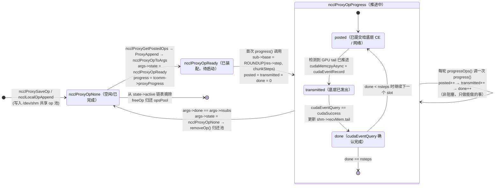

# 07 proxy 进度引擎：CPU 后台线程如何与 GPU kernel 协同

> 定位：本文回答"NCCL 里那个常驻的 proxy 线程到底在干嘛？单机 NVLink 场景下它到底参不参与搬数据？"
> 这是面试最容易答反的一题，本文用源码给出确定答案。

## 本文覆盖的源文件

| 文件 | 职责 | 本仓库状态 |
|---|---|---|
| [src/proxy.cc](../src/proxy.cc) | proxy service 线程、progress 线程、op 池、SaveOp/Start/Progress 全流程 | 生效 |
| [src/include/proxy.h](../src/include/proxy.h) | `ncclProxyOp` / `ncclProxyArgs` / `ncclProxySubArgs` / `ncclProxyState` / `ncclProxyProgressState` | 生效 |
| [src/include/transport.h](../src/include/transport.h) | `ncclTransportComm` 里的 6 个 proxy 回调（决定某传输"要不要 proxy"） | 生效 |
| [src/transport/p2p.cc](../src/transport/p2p.cc) | `p2pSendProxySetup/Connect/Free`、`p2pSendProxyProgress`（仅 CE memcpy 模式挂上） | 条件生效 |
| [src/transport/shm.cc](../src/transport/shm.cc) | shm 的 proxy 回调（只有 setup/free，**没有 progress**） | 生效 |
| [src/transport/net.cc](../src/transport/net.cc)、[coll_net.cc](../src/transport/coll_net.cc) | 唯一真正实现 `proxyProgress` 的传输 | **（本仓库未启用）** |
| [src/transport/profiler.cc](../src/transport/profiler.cc) | 借用 transport 框架创建 proxy op 轮询计数器 | 桩 |
| [src/os/linux.cc](../src/os/linux.cc) | `ncclOsShmOpen` / `ncclOsSetMutexCondShared`（跨进程 op 池） | 生效 |
| [src/os/linux_ipcsocket.cc](../src/os/linux_ipcsocket.cc) | UDS（Unix Domain Socket）传递 cuMem fd | 条件生效 |
| [src/include/alloc.h](../src/include/alloc.h) | `ncclCudaHostCalloc` → `cudaHostAlloc(cudaHostAllocMapped)` | 生效 |
| [src/device/prims_simple.h](../src/device/prims_simple.h) | 设备端 head/tail/step 协议（CPU 侧的对端） | 生效 |

---

## 主题一：proxy 线程为什么存在 —— device-side 与 proxy 的分界线

### ① 解决什么问题（场景）

CUDA kernel 里**不能**调用 `cudaMalloc`、`cudaIpcOpenMemHandle`、`socket send/recv`、
`ibv_post_send` 这类 CPU 侧 API，也不能阻塞等待网络事件。
但"把数据送到另一台机器"这件事，天然需要 CPU/网卡参与。
需要一个**跑在 CPU 上的后台线程**代为推进这些"GPU 干不了"的活。

### ② 一句话本质

**GPU kernel 只能做"显存到显存的非阻塞 load/store"；凡是需要 CPU 侧系统调用、阻塞等待、
或跨进程资源管理的动作，都下沉给 proxy 线程。**
而**能否全部留在 kernel 里，取决于所选传输的 `proxyProgress` 回调是不是 `NULL`**。

### ③ 代码链路

1. [transport.h:L126-L143](../src/include/transport.h#L126) — `ncclTransportComm` 的 10 个回调里，
   第 8 个是 `proxyProgress`，它就是"这条连接要不要 CPU 帮忙搬数据"的开关。
2. [p2p.cc:L1524-L1529](../src/transport/p2p.cc#L1524) — `p2pTransport` 的 `proxyProgress` 位置是 `NULL`。
3. [p2p.cc:L1531-L1541](../src/transport/p2p.cc#L1531) — 只有 `NCCL_P2P_USE_CUDA_MEMCPY=1` 时才把它填上。
4. [shm.cc:L474-L479](../src/transport/shm.cc#L474) — `shmTransport` 同样没有 `proxyProgress`。
5. [proxy.cc:L598-L618](../src/proxy.cc#L598) — `SaveProxy` 里的决定性判断：`proxyProgress == NULL` 直接返回。
6. [proxy.cc:L1586-L1590](../src/proxy.cc#L1586) — progress 线程**只在有 `proxyProgress` 时才被创建**。

### ④ 关键代码逐行解读

```c
// src/include/transport.h —— 决定命运的字段
struct ncclTransportComm {
  ncclResult_t (*setup)(...);
  ncclResult_t (*connect)(...);
  ncclResult_t (*free)(...);
  ncclResult_t (*proxySharedInit)(...);
  ncclResult_t (*proxySetup)(...);
  ncclResult_t (*proxyConnect)(...);
  ncclResult_t (*proxyFree)(...);
  ncclResult_t (*proxyProgress)(struct ncclProxyState* proxyState, struct ncclProxyArgs*);
  ncclResult_t (*proxyRegister)(...);
  ncclResult_t (*proxyDeregister)(...);
};
```

```c
// src/transport/p2p.cc —— 默认：P2P 不需要 proxy 搬数据
NCCL_PARAM(P2pUseCudaMemcpy, "P2P_USE_CUDA_MEMCPY", 0);
static int useMemcpy = 0;

struct ncclTransport p2pTransport = {"P2P",
                                     p2pCanConnect,
                                     {p2pSendSetup, p2pSendConnect, p2pSendFree, NULL, p2pSendProxySetup, NULL,
                                      p2pSendProxyFree, NULL, p2pProxyRegister, p2pProxyDeregister},
                                     {p2pRecvSetup, p2pRecvConnect, p2pRecvFree, NULL, p2pRecvProxySetup, NULL,
                                      p2pRecvProxyFree, NULL, p2pProxyRegister, p2pProxyDeregister}};

static void initCeOperation() {
  static int init = 0;
  if (!init) {
    useMemcpy = ncclParamP2pUseCudaMemcpy();
    if (useMemcpy) {
      p2pTransport.send.proxyConnect = p2pSendProxyConnect;
      p2pTransport.send.proxyProgress = p2pSendProxyProgress;
    }
    init = 1;
  }
}
```

- 数一下 `p2pTransport.send` 的 10 个槽位：`setup, connect, free, NULL(sharedInit),
  p2pSendProxySetup, NULL(proxyConnect), p2pSendProxyFree, NULL(proxyProgress), register, deregister`。
  **第 8 位是 `NULL`** —— 默认 P2P 的 `proxyProgress` 为空。
- 只有 `NCCL_P2P_USE_CUDA_MEMCPY=1` 时，`initCeOperation()` 才把
  `proxyConnect` / `proxyProgress` 换成 CE memcpy 版本。**默认是 0。**
- 注意 `p2pSendSetup` 里**仍然**调用 `ncclProxyConnect` + `ncclProxyCallBlocking(ncclProxyMsgSetup)`
  （[p2p.cc:L503-L512](../src/transport/p2p.cc#L503)）：
  proxy 在这里的作用是**代持资源**——让 `ncclSendMem`/`ncclRecvMem` 在 proxy 所属进程里分配，
  这样跨进程共享和生命周期管理才正确。
  这是"proxy 参与建链、不参与搬数据"的关键区分。

```c
// src/proxy.cc —— SaveProxy 的决定性判断
static ncclResult_t SaveProxy(struct ncclComm* comm, struct ncclChannel* channel, int type, int peer,
                              struct ncclProxyOp* op, int connIndex, bool* justInquire) {
  if (peer < 0) return ncclSuccess;
  struct ncclChannelPeer* peerComm = channel->peers[peer];
  struct ncclConnector* connector = type == proxyRecv ? peerComm->recv + connIndex : peerComm->send + connIndex;
  if (connector->transportComm == NULL) { ... return ncclInternalError; }
  if (connector->proxyConn.proxyProgress == NULL) return ncclSuccess;   // ← 关键
  if (justInquire) {
    *justInquire = true;
  } else {
    op->peer = peer;
    NCCLCHECK(ncclLocalOpAppend(comm, &connector->proxyConn, op));
  }
  return ncclSuccess;
}
```

- `connector->proxyConn.proxyProgress` 是在 `p2pSendConnect` / `shmSendConnect` 里
  从 `p2pTransport.send.proxyProgress` 拷下来的（[p2p.cc:L627](../src/transport/p2p.cc#L627)、
  [shm.cc:L180](../src/transport/shm.cc#L180)），默认值就是 `NULL`。
- 因此：**单机 NVLink / SHM 场景下，`ncclProxySaveOp` 一个 op 都不会入队**。

```c
// src/proxy.cc —— progress 线程的创建条件
static ncclResult_t proxyConnInit(struct ncclProxyLocalPeer* peer, struct ncclProxyConnectionPool* connectionPool,
                                  struct ncclProxyState* proxyState, ncclProxyInitReq* req, ncclProxyInitResp* resp,
                                  struct ncclProxyConnection** connection) {
  ...
  (*connection)->tcomm = (*connection)->send ? &ncclTransports[(*connection)->transport]->send :
                                               &ncclTransports[(*connection)->transport]->recv;
  // 如果需要 代理 推进进度，则分配操作结构体并启动线程
  if ((*connection)->tcomm->proxyProgress) {
    NCCLCHECK(proxyProgressInit(proxyState));
    struct ncclProxyProgressState* state = &proxyState->progressState;
    memcpy(resp->devShmPath, state->opsPoolShmSuffix, sizeof(resp->devShmPath));
  }
```

- **只有 `tcomm->proxyProgress != NULL` 才调 `proxyProgressInit`**，
  而 `proxyProgressInit` 才会创建 `/dev/shm` 上的 op 池并 `std::thread(ncclProxyProgress, ...)`
  （[proxy.cc:L1543](../src/proxy.cc#L1543)）。
- 结论：**单机 NVLink 场景下，proxy progress 线程根本不存在**。

### ⑤ 收益

- **数据面零 CPU 参与** → 一次 send/recv 的延迟 = 一次跨卡 store + 一次跨卡 load，
  没有任何线程唤醒、系统调用、条件变量的开销。
- **不占 CPU 核**：progress 线程是一个忙等/轮询线程，不创建它就省下一个核。
- **无 CUDA context 竞争**：proxy 线程要 `cudaSetDevice`，多一个线程就多一份上下文切换。

### ⑥ 面试考点（高频陷阱）

**Q1：NCCL 的 AllReduce 数据搬运一定经过 proxy 线程吗？**
A：**不一定，而且单机 NVLink 场景下不经过。**
判定依据是所选传输的 `ncclTransportComm::proxyProgress` 是否为 `NULL`：
P2P（默认）和 SHM 都是 `NULL`，数据面 100% 在 GPU kernel 里；
只有 NET / CollNet / 开启 `NCCL_P2P_USE_CUDA_MEMCPY` 的 P2P CE 模式才需要 proxy 搬数据。

**Q2：既然 P2P 不需要 proxy 搬数据，为什么 `p2pSendSetup` 里还要 `ncclProxyConnect`？**
A：为了**资源归属和生命周期**。让 sendMem/recvMem 在 proxy 所在进程（top-parent rank）里分配，
跨进程才能正确共享；且 comm 销毁时由 proxy 统一释放，避免进程提前退出导致悬空指针。
proxy 在这里扮演"资源管家"，不是"搬运工"。

**Q3：proxy 到底有几种线程？**
A：两种。
`ncclProxyService`（**总是创建**，[proxy.cc:L2140](../src/proxy.cc#L2140)）：处理建链/setup/connect/注册等控制消息；
`ncclProxyProgress`（**按需创建**）：只在某个传输有 `proxyProgress` 时才起。

**Q4：怎么验证我的环境里 proxy 有没有在搬数据？**
A：看 `ncclProxySaveOp` 是否被真正调用（`proxyProgress` 非 NULL），
或把 `NCCL_DEBUG_SUBSYS=PROXY` 打开看是否有 op 入队日志。
更直接：`NCCL_P2P_USE_CUDA_MEMCPY=0`（默认）时，P2P 路径**没有** op 入队。

---

## 主题二：proxy 的数据结构（op 池 / args / subs）

### ① 解决什么问题（场景）

enqueue 阶段（CPU 主线程、每次 collective 一次）产生的"搬运任务"，
要跨**线程**甚至跨**进程**交给 progress 线程。
而且一次 AllReduce 会同时涉及多个 channel（可达 `MAXCHANNELS=64`）、多个 peer，
如果每个都创建一个独立任务，调度开销会淹没小消息的收益。

### ② 一句话本质

**三层结构**：
`ncclProxyOp`（enqueue 侧的一次 append，存在 `/dev/shm` 的**共享 op 池**里）
→ `ncclProxyArgs`（progress 侧的一个"执行体"，可聚合多个 sub）
→ `ncclProxySubArgs`（一个 channel/peer 上的具体子任务，带 `posted/transmitted/done` 三个进度计数）。

### ③ 代码链路

1. [proxy.h:L82-L140](../src/include/proxy.h#L82) — `ncclProxyOp`。
2. [proxy.h:L149-L192](../src/include/proxy.h#L149) — `ncclProxySubArgs`（含 `base/posted/received/flushed/transmitted/done`）。
3. [proxy.h:L194-L229](../src/include/proxy.h#L194) — `ncclProxyArgs`（含 `subs[NCCL_PROXY_MAX_SUBS]`、`nsubs`、`done`、`state`）。
4. [proxy.h:L236-L245](../src/include/proxy.h#L236) — `MAX_OPS_PER_PEER` 与 `ncclProxyOpsPool`。
5. [proxy.h:L281-L295](../src/include/proxy.h#L281) — `ncclProxyProgressState`（`opsPool` / `active` / `pool` / `stop`）。
6. [proxy.h:L342-L391](../src/include/proxy.h#L342) — `ncclProxyState`（service 线程 + progressState + socket）。
7. [proxy.cc:L70-L74](../src/proxy.cc#L70) — `PROXYARGS_ALLOCATE_SIZE = NCCL_MAX_OPS (2048)`，`ncclProxyPool` 按批分配。
8. [proxy.cc:L1503-L1546](../src/proxy.cc#L1503) — `proxyProgressInit`：op 池建在 `/dev/shm`，含跨进程 mutex/cond。

### ④ 关键代码逐行解读

```c
// src/include/proxy.h
#define NCCL_PROXY_MAX_SUBS MAXCHANNELS          // 64
// 每个 p2p work 含 send+recv 两个代理操作，故 2x；再乘 2 是为了能存下"两整轮"操作
#define MAX_OPS_PER_PEER (2 * MAXCHANNELS * 2 * NCCL_MAX_DEV_WORK_P2P_PER_BATCH)

struct ncclProxyOpsPool {
  struct ncclProxyOp ops[MAX_OPS_PER_PEER * NCCL_MAX_LOCAL_RANKS];
  volatile int nextOps;
  volatile int nextOpsEnd;
  volatile int freeOps[NCCL_MAX_LOCAL_RANKS];
  std::mutex mutex;
  std::condition_variable cond;
};
```

- op 池是**数组 + 空闲链表**，不是队列：`ops[].next` 串成单链表，
  `freeOps[localRank]` 是各 rank 的空闲链头，`nextOps/nextOpsEnd` 是待处理链的头尾。
- 为什么"要能存两整轮"：否则后半轮没地方放，就无法腾出槽位给新 op，会自死锁。
- `std::mutex` / `std::condition_variable` 被 `ncclOsSetMutexCondShared()`
  （[proxy.cc:L1528](../src/proxy.cc#L1528)）设成 **PTHREAD_PROCESS_SHARED**，
  因为这个池在 `/dev/shm` 上、被多个进程共享。

```c
// src/include/proxy.h
struct ncclProxySubArgs {
  struct ncclProxyConnection* connection;
  int channelId;
  int nsteps;
  ...
  uint64_t base;
  uint64_t posted;
  uint64_t received;
  uint64_t flushed;
  uint64_t transmitted;
  uint64_t done;
  uint64_t end;
  ...
  void* requests[NCCL_STEPS];
};
```

- 六个计数器构成一个**流水线状态机**：
  - `posted`：已向底层（网络/CE）提交到第几 step；
  - `received`：底层报告"已收到"到第几 step（网络路径用）；
  - `flushed`：已刷盘/已确保对端可见（网络 + GDR 路径用）；
  - `transmitted`：已真正发出去；
  - `done`：已确认完成（event query 通过）；
  - `base`：本 sub 的起始 step（对设备上一次传输末尾做 `ROUNDUP` 对齐）。
- **`base` 与 `step` 的关系**：`sub->base = ROUNDUP(resources->step, args->chunkSteps)`
  （[p2p.cc:L902](../src/transport/p2p.cc#L902)），保证不同次 op 之间 step 不重叠、可比较。
- `requests[NCCL_STEPS]`：飞行中的底层请求句柄，长度就是流水线深度 8。

```c
// src/include/proxy.h
struct ncclProxyArgs {
  struct ncclProxySubArgs subs[NCCL_PROXY_MAX_SUBS];   // 内联数组，最多 64 个 sub
  proxyProgressFunc_t progress;
  int nsubs;
  int done;
  ...
  int state;
  int idle;
  struct ncclProxyArgs* next;
  struct ncclProxyArgs* nextPeer;
  struct ncclProxyArgs** proxyAppendPtr;
};
```

- `subs[]` 是**内联数组**（不是指针）：一个 `ncclProxyArgs` 很大，但换来的是**零额外分配**和良好局部性。
- `next` 串"所有活跃 args"，`nextPeer` 串"同一 connection 上的后续 args"
  （[removeOp](../src/proxy.cc#L791) 完成时用 `nextPeer` 顶替上来）。
- `idle` 是本轮是否"啥也没干成"的标志，供 progress 主循环决定是否让出 CPU。

### ⑤ 收益

- **聚合**：同一 `opCount` 的多个 channel 的 op 被合并进一个 `ncclProxyArgs` 的多个 `subs`
  （[ProxyAppend](../src/proxy.cc#L463)），一次 `progress()` 调用推进所有 channel，
  摊销了调度开销，也让底层可以做批量提交。
- **零分配数据面**：args 按 `NCCL_MAX_OPS=2048` 一批预分配成池，`allocateArgs` 只是从空闲链表摘一个
  （[proxy.cc:L228-L252](../src/proxy.cc#L228)）。
- **跨进程通信免序列化**：op 池在共享内存里，同机多进程直接读写结构体，没有 socket 拷贝。

### ⑥ 面试考点

**Q1：`ncclProxyOp` 和 `ncclProxyArgs` 有什么区别？**
A：`ncclProxyOp` 是**跨进程传递的"请求"**（存在 `/dev/shm` 的共享池里，由 enqueue 侧写）；
`ncclProxyArgs` 是 **progress 线程私有的"执行体"**（从本地 `ncclProxyPool` 分配，含运行时状态）。
一次转换见 `ncclProxyOpToArgs`（[proxy.cc:L389-L456](../src/proxy.cc#L389)）。

**Q2：为什么要 `subs` 聚合，一个 op 一个 args 不行吗？**
A：一次 AllReduce 会同时在几十个 channel 上跑。若每个 channel 一个 args，
progress 循环每轮要遍历几十个节点，且无法批量提交；聚合成一个 args + N 个 subs 后，
一次 `progress()` 就能推进全部 channel，并让底层有机会合并请求。

**Q3：`posted / transmitted / done` 三个计数为什么不合并成一个？**
A：它们代表**不同阶段的完成度**，且推进条件不同：
`posted` 由 CPU 主动推进（只要还有 slot 就能提交），
`transmitted` 依赖底层（网络/CE）的返回，
`done` 依赖 `cudaEventQuery` 之类的完成确认。
分开才能在非阻塞模型里精确地"每次只做能做的事"。

**Q4：`MAX_OPS_PER_PEER` 为什么是 `2 * MAXCHANNELS * 2 * BATCH`？**
A：`MAXCHANNELS` 是通道数，第一个 `2` 是 send+recv 两个方向，
第二个 `2` 是为了**能存放两整轮**操作——否则后半轮没槽位可放，无法腾出旧槽位，形成死锁。

---

## 主题三：生命周期 —— 从 enqueue 到完成

### ① 解决什么问题（场景）

enqueue 发生在**用户线程**（调用 `ncclAllReduce` 的线程），
而 progress 发生在**独立的后台线程**。
两者需要一套"提交 → 唤醒 → 轮询推进 → 完成回收"的完整协议，
且提交路径要尽可能短（不能阻塞用户线程）。

### ② 一句话本质

**`ncclProxySaveOp`（入队到共享池）→ `ncclProxyStart`（一次性 post + 唤醒）→
`ncclProxyGetPostedOps`（progress 侧取任务 + 聚合成 args）→
`progressOps`（逐个调 `op->progress`）→ `removeOp`（完成回收）。**

### ③ 代码链路

1. [proxy.cc:L625-L789](../src/proxy.cc#L625) — `ncclProxySaveOp`（按 pattern 分派）。
2. [proxy.cc:L509-L575](../src/proxy.cc#L509) — `ncclLocalOpAppend`（写入共享池、池满时提前提交）。
3. [proxy.cc:L1073-L1089](../src/proxy.cc#L1073) — `ncclProxyStart`（post + `cond.notify_one`）。
4. [proxy.cc:L497-L507](../src/proxy.cc#L497) — `ncclProxyPost`。
5. [proxy.cc:L876-L962](../src/proxy.cc#L876) — `ncclProxyGetPostedOps`（取任务 + 聚合 + 归还槽位）。
6. [proxy.cc:L458-L495](../src/proxy.cc#L458) — `ProxyAppend`（聚合逻辑）。
7. [proxy.cc:L835-L872](../src/proxy.cc#L835) — `progressOps`（调 progress、处理完成/出错）。
8. [proxy.cc:L791-L822](../src/proxy.cc#L791) — `removeOp`（从链表摘除、归还池）。

### ④ 关键代码逐行解读

```c
// src/proxy.cc —— 提交侧：先把 op 串到本地链，攒到一定量才 post
static ncclResult_t ncclLocalOpAppend(struct ncclComm* comm, struct ncclProxyConnector* proxyConn,
                                      struct ncclProxyOp* proxyOp) {
  int tpLocalRank = comm->topParentLocalRanks[comm->localRank];
  struct ncclProxyOps* proxyOps = comm->proxyState->proxyOps;
  proxyOps += proxyConn->tpLocalRank;
  struct ncclProxyOpsPool* pool = proxyOps->pool;

  int opIndex = proxyOps->freeOp;
  struct ncclProxyOp* op;
  if (opIndex != -1) {
    op = pool->ops + opIndex;
    proxyOps->freeOp = op->next;
  } else {
    // 读取 freeOps 的值并等待其不等于 -1。一旦不为 -1，就用 acquire 语义读取该值，重置为 -1
    int freeOp = -1;
    while (freeOp == -1) {
      freeOp = COMPILER_ATOMIC_EXCHANGE(&pool->freeOps[tpLocalRank], -1, std::memory_order_acquire);
      if (freeOp == -1) std::this_thread::yield();
    }
    opIndex = freeOp;
    op = pool->ops + opIndex;
    proxyOps->freeOp = op->next;
  }
  if (op->next != -1) COMPILER_PREFETCH(pool->ops + op->next); // Prefetch next free op
  memcpy(op, proxyOp, sizeof(struct ncclProxyOp));
  ...
  if (++proxyOps->count == MAX_OPS_PER_PEER) { /* 池满：截断链并提交前面那批 */ }
```

- `COMPILER_ATOMIC_EXCHANGE(&pool->freeOps[...], -1, acquire)`：
  一次原子交换**整条空闲链**搬到本地（`proxyOps->freeOp`），之后取 op 就不用再抢锁了。
  这是典型的"批量抢占"优化。
- `COMPILER_PREFETCH(pool->ops + op->next)`：op 池在共享内存里、大概率不在 cache 中，
  提前预取下一个能省一次 cache miss。
- 池满时**不在最后一个 opCount 处截断**（[proxy.cc:L546-L571](../src/proxy.cc#L546)）：
  同一 `opCount` 的 op 必须一起提交，否则聚合会被破坏。

```c
// src/proxy.cc —— 唤醒：ncclProxyStart 把攒下的链一次性 post 出去
ncclResult_t ncclProxyStart(struct ncclComm* comm) {
  struct ncclProxyOps* proxyOps = comm->proxyState->proxyOps;
  if (proxyOps == NULL) return ncclSuccess;      // ← 没有 proxyOps 说明没有需要 progress 的传输
  int peerArraySize = comm->proxyState->peerArraySize;
  for (int r = 0; r < peerArraySize; r++) {
    struct ncclProxyOps* ops = proxyOps + r;
    if (ops->pool == NULL || ops->nextOps == -1) continue;
    NCCLCHECK(ncclProxyPost(ops->pool, ops->nextOps, ops->nextOpsEnd));
    ops->nextOps = ops->nextOpsEnd = -1;
    ops->count = 0;
  }
  comm->opCount++;
  return ncclSuccess;
}

ncclResult_t ncclProxyPost(struct ncclProxyOpsPool* pool, int nextOps, int nextOpsEnd) {
  std::lock_guard<std::mutex> lock(pool->mutex);
  if (pool->nextOps == -1) {
    pool->nextOps = nextOps;
    pool->cond.notify_one();                     // 只在"从空到非空"时唤醒
  } else {
    pool->ops[pool->nextOpsEnd].next = nextOps;
  }
  pool->nextOpsEnd = nextOpsEnd;
  return ncclSuccess;
}
```

- `if (proxyOps == NULL) return ncclSuccess;` —— **这行就是"单机 NVLink 没有 proxy 任务"的直接证据**：
  `proxyOps` 只在 `ncclProxyConnect` 里、当 `tcomm->proxyProgress` 非空时才被分配
  （[proxy.cc:L1266-L1280](../src/proxy.cc#L1266)）。
- `notify_one()` 只在链从空变非空时发，避免每次 launch 都唤醒一次。

```c
// src/proxy.cc —— 取任务：绝不为取任务而阻塞已有传输
  {
    std::unique_lock<std::mutex> lock(pool->mutex, std::defer_lock);  // defer_lock：先不加锁
    // 有活可干 且 (没有新任务 或 抢锁失败) -> 立刻返回去干活
    if (state->active != NULL && (pool->nextOps == -1 || !lock.try_lock())) return ncclSuccess;
    if (state->active == NULL) {
      // 完全没活干了，这时才值得阻塞等待，避免空转浪费 CPU
      lock.lock();
      if (pool->nextOps == -1 && !state->stop) {
        pool->cond.wait(lock);
      }
    }
    state->nextOps = pool->nextOps;
    pool->nextOps = pool->nextOpsEnd = -1;
  }
```

- `try_lock()` + `defer_lock`：**取任务绝不阻塞**。
  如果手上还有活跃传输，抢不到锁就下一轮再来，优先保证已提交数据的推进。
- 只有 `state->active == NULL`（完全没事干）时才 `cond.wait(lock)` 真正睡觉，
  并且 wait 前**再检查一次** `nextOps`（双重检查），同时检查 `stop` 保证能唤醒退出。

```c
// src/proxy.cc —— 推进：非阻塞、一次一步
static ncclResult_t progressOps(struct ncclProxyState* proxyState, struct ncclProxyProgressState* state,
                                struct ncclProxyArgs* opStart, int* idle) {
  struct ncclProxyArgs* prevOp = NULL;
  struct ncclProxyArgs* op = opStart;
  ncclResult_t status = ncclSuccess;
  while (op) {
    if (op->state == ncclProxyOpNone) return ncclInternalError;
    ncclResult_t ret = op->progress(proxyState, op);
    if (op->idle) { TIME_STOP(1); TIME_CANCEL(0); } else { TIME_CANCEL(1); TIME_STOP(0); }
    *idle &= op->idle;
    if (op->state == ncclProxyOpNone || ret != ncclSuccess) {
      if (ret != ncclSuccess && status == ncclSuccess) status = ret;
      NCCLCHECK(removeOp(state, &op, &prevOp));   // removeOp 内部会前进 op
    } else {
      prevOp = op;
      op = op->next;
    }
  }
  return status;
}
```

- `op->progress()` **必须非阻塞**：只做当前能立刻做完的部分就返回。
  这是单线程能驱动成百上千并发传输的前提。
- `*idle &= op->idle`：只要有一个 op 有进展，整体就不算 idle。
- 状态归 `ncclProxyOpNone` 即表示完成（`p2pSendProxyProgress` 里 `args->done == args->nsubs` 时设置，
  见 [p2p.cc:L949-L951](../src/transport/p2p.cc#L949)）。

### ⑤ 收益

- **提交路径零阻塞**：用户线程只写共享内存、不进内核（除非池满需要唤醒）。
- **单线程高并发**：非阻塞 + 轮询，一个 progress 线程可驱动 `MAX_OPS_PER_PEER × NCCL_MAX_LOCAL_RANKS` 量级的在途 op。
- **批量抢占 + 批量归还**：空闲槽位用原子交换整链搬运，锁竞争被摊薄到"批"的粒度。

### ⑥ 面试考点

**Q1：`ncclProxySaveOp` 的 `justInquire` 参数是干嘛的？**
A："只查询不执行"。enqueue 阶段需要预先知道"这次 collective 到底要不要 proxy"
（决定要不要走某些慢路径/要不要预留资源），于是先用 `justInquire=true` 跑一遍，
只把 `*justInquire` 置位、不改任何状态（[proxy.cc:L611-L616](../src/proxy.cc#L611)）。

**Q2：`ncclProxyStart` 里的 `if (proxyOps == NULL) return ncclSuccess` 意味着什么？**
A：意味着这个 comm **没有任何需要 proxy 推进的传输**，即所有连接都是 P2P/SHM 这种 device-side 传输。
单机 NVLink 场景就走这条快速返回。

**Q3：取任务时为什么用 `try_lock` 而不是 `lock`？**
A：progress 线程的首要职责是**推进已在途的数据**。
如果为了取新任务而阻塞在锁上，已在途传输的延迟会直接被拉长。
宁可下一轮再来取，也不能让手上的活停下来。

**Q4：op 完成时为什么要用 `nextPeer` 顶替而不是直接删？**
A：同一个 connection 上可能有多个 args（不同 opCount），
`nextPeer` 链保存"这个 connection 的下一个任务"。直接删会把整条链断掉，
所以 `removeOp` 用 `nextPeer` 顶上当前位置（[proxy.cc:L797-L814](../src/proxy.cc#L797)）。

---

### proxy 状态机图



---

## 主题四：与 device 的握手协议（head / tail / step + fence）

### ① 解决什么问题（场景）

CPU（proxy）和 GPU（kernel）是两个**异步、无共享锁**的执行体。
它们要靠几个"两边都能看见的 64 位整数"来同步：
- GPU 告诉 CPU："第 N 步的数据已经写好了，你可以发了"；
- CPU 告诉 GPU："第 N 步已经发完了，槽位还给你"。

### ② 一句话本质

**一对单调递增的 `step` 计数器 + 系统级内存序保证**：
GPU 用 `fence_acq_rel_sys()` + `st.relaxed.sys` 发布 `tail`；
CPU 轮询（volatile 读）`tail`、完成后更新另一侧的 `tail`/`head`。
**除了 P2P CE memcpy 模式，本仓库的这条通道根本不会被启用。**

### ③ 代码链路

1. [prims_simple.h:L206-L215](../src/device/prims_simple.h#L206) — GPU 侧 `postPeer()`：`fence` + `st.relaxed.sys`。
2. [op128.h:L382-L406](../src/device/op128.h#L382) — `st_volatile_global` / `st_relaxed_sys_global` / `fence_acq_rel_sys` 的 PTX。
3. [prims_ll128.h:L95-L104](../src/device/prims_ll128.h#L95) — LL128 的 `postSend`：`__threadfence_system()`（sm90+）。
4. [p2p.cc:L612-L619](../src/transport/p2p.cc#L612) — CE 模式：GPU 的 `tail` 指向 **host pinned** 的 `ceRecvMem->tail`。
5. [p2p.cc:L641-L645](../src/transport/p2p.cc#L641) — CE 模式：对端 GPU 的 `tail`/`head` 指向 **shm** 段。
6. [p2p.cc:L896-L954](../src/transport/p2p.cc#L896) — `p2pSendProxyProgress`：CPU 侧完整的轮询-拷贝-完成流程。
7. [alloc.h:L156-L171](../src/include/alloc.h#L156) — `ncclCudaHostCalloc` → `cudaHostAlloc(cudaHostAllocMapped)`。

### ④ 关键代码逐行解读

```c
// src/device/prims_simple.h —— GPU 侧发布
  template <int Recv, int Send>
  inline __device__ void postPeer(bool dataStored) {
    if (flags & (Recv * RolePostRecv | Send * RolePostSend)) {
      step += StepPerSlice;
      if (Send && (flags & RolePostSend) && (dataStored || (flags & ConnFifoEnabled))) {
        fence_acq_rel_sys();
      }
      st_relaxed_sys_global(connStepPtr, step);
    }
  }
```

```c
// src/device/op128.h —— 对应的 PTX
__device__ __forceinline__ void st_relaxed_sys_global(uint64_t* ptr, uint64_t val) {
#if __CUDA_ARCH__ >= 700
  asm volatile("st.relaxed.sys.global.u64 [%0], %1;" ::"l"(cvta_to_global(ptr)), "l"(val) : "memory");
#else
  asm volatile("st.volatile.global.u64 [%0], %1;" ::"l"(cvta_to_global(ptr)), "l"(val) : "memory");
#endif
}
__device__ __forceinline__ void fence_acq_rel_sys() {
#if __CUDA_ARCH__ >= 700
  asm volatile("fence.acq_rel.sys;" ::: "memory");
#else
  asm volatile("membar.sys;" ::: "memory");
#endif
}
```

- `.sys` 作用域 = **系统级可见**（跨 GPU、跨 PCIe 根复合体），不是普通的 device scope。
  少了它，NVLink 对端可能看不到这次写。
- `fence_acq_rel_sys()` 在 store `tail` **之前**：保证"数据已落地" happens-before "tail 自增"。
- `relaxed` 而不是 `release`：因为 fence 已经显式做了，store 本身不需要再带序，省一点开销。
- LL128 协议用的是标准 CUDA 内建 `__threadfence_system()`
  （[prims_ll128.h:L98](../src/device/prims_ll128.h#L98)，sm90+；sm<90 退化成 `__threadfence()`）。

```c
// src/transport/p2p.cc —— CPU(proxy) 侧的完整握手（仅 NCCL_P2P_USE_CUDA_MEMCPY=1 时）
static ncclResult_t p2pSendProxyProgress(struct ncclProxyState* proxyState, struct ncclProxyArgs* args) {
  if (args->state == ncclProxyOpReady) {
    for (int s = 0; s < args->nsubs; s++) {
      struct ncclProxySubArgs* sub = args->subs + s;
      struct p2pShmProxyInfo* resources = (struct p2pShmProxyInfo*)(sub->connection->transportResources);
      sub->base = ROUNDUP(resources->step, args->chunkSteps);
      sub->posted = sub->transmitted = sub->done = 0;
    }
    args->state = ncclProxyOpProgress;
  }
  args->idle = 1;
  if (args->state == ncclProxyOpProgress) {
    int p = args->protocol;
    int stepSize = proxyState->buffSizes[p] / NCCL_STEPS;
    for (int s = 0; s < args->nsubs; s++) {
      struct ncclProxySubArgs* sub = args->subs + s;
      struct p2pShmProxyInfo* resources = (struct p2pShmProxyInfo*)(sub->connection->transportResources);
      if (p != NCCL_PROTO_SIMPLE) {                       // 仅 Simple 使用 cudaMemcpy
        resources->step = sub->base + sub->nsteps;
        args->done++;
        continue;
      }
      if (sub->transmitted < sub->done + NCCL_STEPS && sub->transmitted < sub->nsteps) {
        int buffSlot = (sub->base + sub->transmitted) % NCCL_STEPS;
        volatile struct ncclConnFifo* connFifo = resources->ceRecvMem->connFifo;
        volatile uint64_t* recvTail = &resources->ceRecvMem->tail;
        if ((*recvTail > sub->base + sub->transmitted)) {   // ← GPU 已经把数据写好了
          int size = connFifo[buffSlot].size;
          CUDACHECK(cudaMemcpyAsync(resources->recvFifo + buffSlot * stepSize,
                                    resources->ceDevBuff + buffSlot * stepSize, size,
                                    cudaMemcpyDeviceToDevice, resources->stream));
          CUDACHECK(cudaEventRecord(resources->events[buffSlot], resources->stream));
          sub->transmitted += args->sliceSteps;
        }
      }
      if (sub->done < sub->transmitted) {
        int buffSlot = (sub->base + sub->done) % NCCL_STEPS;
        cudaError_t res = CUDACLEARERROR(cudaEventQuery(resources->events[buffSlot]));
        if (res != cudaErrorNotReady) CUDACHECK(res);
        if (res == cudaSuccess) {
          sub->done += args->sliceSteps;
          resources->shm->recvMem.tail = sub->base + sub->done;   // ← 通知对端 GPU
        }
        if (sub->done == sub->nsteps) {
          resources->step = sub->base + sub->nsteps;
          args->done++;
        }
      }
    }
    if (args->done == args->nsubs) args->state = ncclProxyOpNone;
  }
  return ncclSuccess;
}
```

- **GPU → CPU 方向**：GPU 写 `connFifo[slot]`（长度/偏移）+ 递增 `ceRecvMem->tail`。
  `ceRecvMem` 是 `ncclCudaHostCalloc` 分配的 **host pinned 内存**（[p2p.cc:L752](../src/transport/p2p.cc#L752)），
  所以 CPU 可以直接 `volatile` 读——**不需要 cudaMemcpy 拿回主机**。
- **CPU → GPU（对端）方向**：拷贝完成后写 `resources->shm->recvMem.tail`，
  这块是 `/dev/shm` 上、被对端 `cudaHostRegister` 映射的段，对端 GPU 轮询它。
- **信用归还**：对端 GPU 消费后写 `devShm->sendMem.head`，本端 GPU 通过
  `send->conn.head = &resources->proxyInfo.devShm->sendMem.head`（[p2p.cc:L615](../src/transport/p2p.cc#L615)）看到。
- `volatile uint64_t* recvTail`：CPU 侧用 `volatile` 而不是 `std::atomic`——
  因为写方是 GPU，CPU 只需要"每次都真的去读内存、不被编译器优化掉"，
  不需要原子性（单次 64 位对齐读写在 x86 上本身是原子的）。
- `ROUNDUP(resources->step, args->chunkSteps)`：跨多次 kernel launch 保持 step 单调且对齐，
  这是"为什么用 step 而不是环形指针"的 CPU 侧体现——CPU 和 GPU 各自维护自己的 `step` 副本，
  靠**大小比较**推进，不靠"槽位号"，因此不需要处理回绕。

### ⑤ 收益 / 关键常量

| 常量 | 值 | 含义 |
|---|---|---|
| `NCCL_STEPS` | 8 | 流水线槽位数 = 信用窗口大小 |
| `stepSize` | `buffSizes[SIMPLE] / NCCL_STEPS` = 4 MiB / 8 = **512 KiB** | 每个 slot 的大小 |
| `CUDA_IPC_MIN` | 2 MiB | CUDA IPC 要求的最小对齐粒度 |
| `NCCL_PROXY_MAX_SUBS` | `MAXCHANNELS` = **64** | 一个 args 最多聚合 64 个 sub |
| `NCCL_MAX_OPS` | 2048 | args 池每批分配的元素数 |
| `NCCL_PROGRESS_APPENDOP_FREQ` | **8** | 忙时也每 8 轮取一次新任务 |
| `NCCL_PROXY_APPEND_BATCH_SIZE` | **16** | 单次最多取多少个"opCount/peer 段" |
| `NCCL_P2P_USE_CUDA_MEMCPY` | **0**（默认） | 关 = 纯 device-side；开 = 走 CE + proxy |

### ⑥ 面试考点

**Q1：为什么用单调递增的 `step` 而不用环形指针比较？**
A：(1) 环形指针 `head == tail` 空/满二义，需要额外标志位或牺牲一个槽位；
(2) 64 位单调几乎不回绕（1e9 step/s 也要 ~580 年），比较简单可靠；
(3) **CPU 和 GPU 各自保存自己的 `step` 副本并缓存上次读到的值**（`connStepCache`、`sub->base`），
    用"大小比较"推进而不用"槽位号相等"，天然支持跨 kernel launch 的延续，
    也支持 `ROUNDUP` 后精确归还信用（[prims_simple.h:L531](../src/device/prims_simple.h#L531)）。

**Q2：`fence_acq_rel_sys()` / `__threadfence_system()` 为什么必需？**
A：保证"数据写入" happens-before "tail 自增"。
少了它，对端（或 proxy）可能看到 tail 已推进但数据尚未落地 → 读到脏数据。
必须用 `.sys`（系统级）作用域而不是默认 device 作用域，因为要跨 GPU / 跨 PCIe 可见。

**Q3：本仓库的 host 内存用了 Write-Combining（WC）吗？需要 flush 吗？**
A：**没有用 WC**。`ncclCudaHostCalloc` 用的是
`cudaHostAlloc(ptr, size, cudaHostAllocMapped)`（[alloc.h:L162](../src/include/alloc.h#L162)），
即可缓存的锁页内存，所以 CPU 轮询 GPU 写入的 `tail` 时**不需要额外的 WC flush**。
`ncclRecvMem::flush` 字段（[comm.h:L83](../src/include/comm.h#L83)）与 `sub->flushed` 计数器
是为 **GDRCopy / 网络路径**准备的，本仓库 net 未启用，用不到。

**Q4：CPU 怎么"看到"GPU 写的 `tail`？需要 cudaMemcpy 吗？**
A：不需要。用于 CPU↔GPU 通信的 `ncclRecvMem`（CE 模式的 `ceRecvMem`）
是用 `cudaHostAlloc` 分配的**锁页主机内存**，GPU 直接写它、CPU 直接 `volatile` 读它，零拷贝。

---

## 主题五：proxy service 线程、IPC/UDS 与环境变量

### ① 解决什么问题（场景）

建链阶段要做的 `cudaIpcGetMemHandle` / `cuMemExportToShareableHandle` / shm 分配，
必须在**一个稳定的、长期存活的上下文**里执行，且要能被同机其它进程请求。
另外 cuMem 的句柄在某些形态下是**文件描述符（fd）**，fd 不能靠普通的 bootstrap socket 传递，
需要 Unix Domain Socket 的 `SCM_RIGHTS` 带外传递。

### ② 一句话本质

**`ncclProxyService` 是一个 `poll()` 驱动的控制面服务器**：
监听 socket 收 `ncclProxyMsgInit/Setup/Connect/Register/...`，在 proxy 自己的 CUDA context 里执行，
通过响应 socket 回传结果；`ncclProxyServiceUDS` 是它的 fd 传递专用孪生线程。

### ③ 代码链路

1. [proxy.cc:L2113-L2149](../src/proxy.cc#L2113) — `ncclProxyCreate`：起 service 线程 + UDS 线程。
2. [proxy.cc:L1772-L1828](../src/proxy.cc#L1772) — `ncclProxyService`：poll 循环骨架。
3. [proxy.cc:L1835](../src/proxy.cc#L1835) — `timeout = asyncOpCount ? 0 : 500`。
4. [proxy.cc:L1565-L1595](../src/proxy.cc#L1565) — `proxyConnInit`：处理 `ncclProxyMsgInit`。
5. [proxy.cc:L1639-L1713](../src/proxy.cc#L1639) — `proxyProgressAsync`：按消息类型分派到 transport 回调。
6. [proxy.cc:L1201-L1284](../src/proxy.cc#L1201) — `ncclProxyConnect`：客户端侧（连 socket + 映射 op 池）。
7. [proxy.cc:L1398-L1501](../src/proxy.cc#L1398) — `CallAsync` / `PollProxyResponse` / `CallBlocking`。
8. [proxy.cc:L2031-L2095](../src/proxy.cc#L2031) — `ncclProxyServiceUDS`。
9. [proxy.cc:L1287-L1336](../src/proxy.cc#L1287) — `ncclProxyCallBlockingUDS`（带 fd 的 RPC）。

### ④ 关键代码逐行解读

```c
// src/proxy.cc —— service 线程的 poll 循环
  while (stop == PROXY_RUNNING || npeers > 0) {
    if (COMPILER_ATOMIC_LOAD(proxyState->abortFlag, std::memory_order_acquire) != 0) stop = PROXY_ABORT;
    /* never let proxy service thread blocks in poll, or it cannot receive abortFlag. */
    int ret = 0;
    const int timeout = asyncOpCount ? 0 : 500;
    do {
      ret = poll(pollfds, maxProxyConnections + 1, timeout);
    } while (ret < 0 && errno == EINTR);
```

- `timeout = asyncOpCount ? 0 : 500`：**有未完成的异步 op 时超时为 0（纯忙轮询，低延迟）**；
  完全空闲时超时 500 ms（几乎不占 CPU）。这是 proxy 侧的"spin vs sleep"策略。
- 注释明确写了为什么不能无限阻塞：**否则收不到 `abortFlag`**，comm 销毁时会卡住。

```c
// src/proxy.cc —— 客户端：同步 RPC（发请求 + 轮询响应）
ncclResult_t ncclProxyCallBlocking(struct ncclComm* comm, struct ncclProxyConnector* proxyConn, int type,
                                   void* reqBuff, int reqSize, void* respBuff, int respSize) {
  void* opId = malloc(1);
  NCCLCHECKGOTO(ncclProxyCallAsync(comm, proxyConn, type, reqBuff, reqSize, respSize, opId), res, fail);
  do {
    res = ncclPollProxyResponse(comm, proxyConn, respBuff, opId);
  } while (res == ncclInProgress);
exit:
  free(opId);
  return res;
}
```

- `opId` 用 `malloc(1)` 得到的**唯一地址**当句柄，避免维护全局 ID。
- `ncclPollProxyResponse` 用**非阻塞** `ncclSocketProgress(NCCL_SOCKET_RECV, ...)` 试探：
  没数据就返回 `ncclInProgress`，调用方继续 spin。
- 如果收到的是**别人的**响应（`resp.opId != opId`），会 `malloc` 一块缓冲存起来
  （`expectedProxyResponseStore`），等真正的主人来取——支持乱序响应。

```c
// src/proxy.cc —— UDS：cuMem 句柄的 fd 传递
static ncclResult_t proxyGetFd(struct ncclProxyState* proxyState, int rank, void* opId, uint64_t handle) {
  CUmemAllocationHandleType type = CU_MEM_HANDLE_TYPE_POSIX_FILE_DESCRIPTOR;
  int fd = -1;
  CUCHECK(cuMemExportToShareableHandle(&fd, handle, type, 0));
  // 发送 后 the converted fd 使用 UDS
  NCCLCHECKGOTO(ncclIpcSocketInit(&ipcSock, proxyState->tpRank, hash ^ 1, proxyState->abortFlag), ret, error);
  NCCLCHECKGOTO(ncclIpcSocketSendFd(&ipcSock, fd, rank, hash), ret, error);
error:
  NCCLCHECK(ncclIpcSocketClose(&ipcSock));
  SYSCHECK(close(fd), "close");   // 我们可以 now safely close the exported fd
  return ret;
}
```

- `cuMemExportToShareableHandle(&fd, handle, CU_MEM_HANDLE_TYPE_POSIX_FILE_DESCRIPTOR)` 把 cuMem 句柄转成 fd。
- fd 通过 `ncclIpcSocketSendFd`（UDS + `SCM_RIGHTS`）传给对端进程——
  **fd 是进程私有的，只能这样跨进程传递**，普通 TCP/bootstrap socket 做不到。
- 传完立刻 `close(fd)`：对端已经拿到了自己那份。

### ⑤ 环境变量速查

| 环境变量 | 默认值 | 定义位置 | 作用 |
|---|---|---|---|
| `NCCL_PROXY_CPUSET` | 无 | [proxy.cc:L977](../src/proxy.cc#L977)（`ncclGetEnv`，非 `NCCL_PARAM`） | 把 proxy 线程绑到指定 CPU 核列表 |
| `NCCL_PROXY_APPEND_BATCH_SIZE` | **16** | [proxy.cc:L874](../src/proxy.cc#L874) | 单次 `ncclProxyGetPostedOps` 最多取多少个"opCount/peer 段" |
| `NCCL_PROGRESS_APPENDOP_FREQ` | **8** | [proxy.cc:L972](../src/proxy.cc#L972) | 忙时也每 N 轮取一次新任务，防止新任务饿死 |
| `NCCL_PROXY_DUMP_SIGNAL` | **-1**（关闭） | [proxy.cc:L971](../src/proxy.cc#L971) | 设成 `SIGUSR1`/`SIGUSR2`，挂死时发信号打印 proxy 内部状态 |
| `NCCL_P2P_USE_CUDA_MEMCPY` | **0** | [p2p.cc:L141](../src/transport/p2p.cc#L141) | 置 1 时 P2P 走 CE memcpy，才会挂上 `p2pSendProxyProgress` |

### ⑥ 面试考点

**Q1：proxy service 线程和 progress 线程的区别？**
A：service 线程是**控制面**，`poll()` 驱动，处理建链/setup/connect/注册/销毁消息，**总是创建**；
progress 线程是**数据面**，忙轮询驱动，调 `tcomm->proxyProgress` 搬数据，**按需创建**（有 `proxyProgress` 才有）。

**Q2：为什么需要单独的 UDS 线程？**
A：为了传递 cuMem 的**文件描述符**。fd 是进程私有的，只能通过 Unix Domain Socket 的
`SCM_RIGHTS` 带外传递（[linux_ipcsocket.cc](../src/os/linux_ipcsocket.cc)），
普通的 bootstrap TCP socket 做不到这件事。

**Q3：`NCCL_PROXY_CPUSET` 为什么值得设？**
A：proxy 线程（尤其 progress 线程）是忙轮询线程，会吃满一个核。
在大模型训练里，把这个核从计算线程的 CPU 亲和性里**摘出去**，
可以避免它抢占数据加载/通信辅助线程的 CPU 时间片。

**Q4：`ncclProxyCallBlocking` 是阻塞的还是轮询的？**
A：**轮询的**。它 `ncclProxyCallAsync` 发出请求后，循环调 `ncclPollProxyResponse`
（内部是非阻塞 socket recv），直到拿到自己的响应。
好处是轮询过程中可以顺便处理其它 opId 的乱序响应，也能及时检查 `abortFlag`。

---

## 主题六：性能视角 —— 轮询开销与"能不用 proxy 就不用"

### ① 解决什么问题（场景）

proxy progress 线程是一个**忙等线程**：为了低延迟，它不能睡太久；
但一直空转又会吃掉整个 CPU 核、并产生大量无谓的共享内存读。
需要在"延迟"和"CPU 占用"之间找平衡。

### ② 一句话本质

**三级降级：有活就忙轮询（timeout=0 / 不睡）→ 本轮无事可做就 `yield()` →
完全没活跃任务才 `cond.wait()` 真睡。**
而**最好的优化是根本不创建它**——单机 NVLink 走纯 device-side 就是这个思路。

### ③ 代码链路

1. [proxy.cc:L1029-L1069](../src/proxy.cc#L1029) — progress 主循环的三级降级逻辑。
2. [proxy.cc:L1052](../src/proxy.cc#L1052) — 取任务的三个时机。
3. [proxy.cc:L1064](../src/proxy.cc#L1064) — `std::this_thread::yield()`。
4. [proxy.cc:L888-L904](../src/proxy.cc#L888) — `try_lock` + `cond.wait`。
5. [proxy.cc:L1835](../src/proxy.cc#L1835) — service 线程的 `timeout = asyncOpCount ? 0 : 500`。

### ④ 关键代码逐行解读

```c
// src/proxy.cc —— progress 主循环
  do {
    int idle = 1;
    ncclResult_t ret = progressOps(proxyState, state, state->active, &idle);
    if (ret != ncclSuccess) { ...; break; }
    if ((lastIdle == 0 && idle == 1) || (lastIdle == 1 && idle == 0)) {
      /* 仅在"忙<->闲"翻转的瞬间记一次 profiler 事件，降低开销 */
    }
    // 在以下三种时机之一去取新任务：
    //   1) 空闲 2) 完全没有活跃任务 3) 计数器达到阈值
    if (idle || !state->active || (++proxyOpAppendCounter == ncclParamProgressAppendOpFreq())) {
      int added = 0;
      proxyOpAppendCounter = 0;
      ret = ncclProxyGetPostedOps(proxyState, &added);
      if (added == 0) {
        std::this_thread::yield(); // No request progressed. Let others run.
      }
    }
    lastIdle = idle;
  } while ((state->stop == 0 || (state->stop == 1 && state->active)) &&
           COMPILER_ATOMIC_LOAD(proxyState->abortFlag, std::memory_order_acquire) == 0);
```

- **时机 3（`++proxyOpAppendCounter == NCCL_PROGRESS_APPENDOP_FREQ`）是最容易被忽略的正确性保证**：
  即使一直很忙，也要每 8 轮去取一次新任务，否则新提交的 op 会**饿死**。
- 源码注释解释了为什么不能每轮都取（[proxy.cc:L1021-L1027](../src/proxy.cc#L1021)）：
  每次 `ncclProxyGetPostedOps` 都要争抢互斥锁，**小消息场景下锁竞争的开销会超过传输本身的耗时**。
- `std::this_thread::yield()` 而不是 `sleep`：取不到任务时只让出时间片，
  保持"随时能立刻响应"的状态，延迟远低于 `sleep(1ms)`。
- 退出条件 `state->stop == 1 && state->active`：`stop` 之后**还要把剩余的活跃任务跑完**，不能立即退出。

### ⑤ 收益（定量优先）

- **`NCCL_PROGRESS_APPENDOP_FREQ=8`**：取任务频率降到 1/8，锁竞争开销同比降低；
  空闲或没有活跃任务时**无视该计数器**立即取，所以不会增加新任务的等待延迟。
- **service 线程 timeout=500ms**：空闲时每 0.5 s 才醒一次，CPU 占用接近 0。
- **P2P CE 模式 vs device-side（本仓库默认）**：
  - device-side：一次 send 的同步 = 1 次跨卡 store + 1 次跨卡 load，**无线程唤醒、无系统调用、无锁**；
  - CE + proxy：GPU 写 host pinned tail → CPU 轮询发现 → `cudaMemcpyAsync` 入流 →
    `cudaEventRecord` → CPU 轮询 event → 更新 shm tail。
    链条上多了 **2 次 CPU 轮询 + 1 次 CE 任务提交 + 1 次 event 查询**，
    延迟至少增加数微秒量级，还要占用一个 CPU 核。
  - 这就是 `NCCL_P2P_USE_CUDA_MEMCPY` 默认 **0** 的原因。
- 实测对照：本仓库默认路径（纯 device-side P2P）在双卡 128 MB AllReduce 上达到 **≈281 GB/s bus bandwidth**。

### ⑥ 面试考点

**Q1：为什么 progress 线程要限制"取新任务"的频率？**
A：`ncclProxyGetPostedOps` 要抢共享 op 池的互斥锁。
小消息场景下，一次锁竞争的耗时可能和传输本身相当甚至更高，
所以默认每 8 轮才取一次（`NCCL_PROGRESS_APPENDOP_FREQ`）。
空闲或没有活跃任务时则立即取，兼顾了延迟。

**Q2：progress 线程是 spin 还是 sleep？**
A：**两者都有，按负载降级**——忙时纯 spin（`try_lock`，不阻塞）；
本轮无进展时 `yield()`（让出时间片但保持可运行）；
完全没有活跃任务时才 `cond.wait()` 真睡，由 `ncclProxyPost` 的 `notify_one()` 唤醒。

**Q3：单机 NVLink 场景为什么说"省掉 CPU 参与能降延迟"？**
A：因为 P2P/SHM 的 `proxyProgress` 都是 `NULL`，整个数据面在 GPU kernel 里完成：
不需要 CPU 轮询任何计数器、不需要提交 CE 任务、不需要线程唤醒。
一次同步就是两条跨卡访存指令，延迟从"微秒级（含 CPU 调度）"降到"亚微秒级"。

**Q4：`state->stop == 1 && state->active` 这个退出条件是什么意思？**
A：收到停止请求后，**必须把还在链表上的活跃任务跑完**才能退出，
否则对端会一直等一个永远不会到达的传输，造成挂死。

**Q5：如果我把 `NCCL_P2P_USE_CUDA_MEMCPY=1` 打开会发生什么？**
A：P2P transport 的 `proxyConnect`/`proxyProgress` 会被替换成 CE 版本
（[p2p.cc:L1531-L1541](../src/transport/p2p.cc#L1531)），
于是：会创建 progress 线程、会分配 `/dev/shm` op 池、`ncclProxySaveOp` 会真的入队、
数据改由 `cudaMemcpyAsync` 搬。这是一个常用的**对照实验**手段，可以量化 proxy 路径的开销。

---

## 与其他章节的衔接

| 章节 | 关系 |
|---|---|
| [01-bootstrap-and-comm-init.md](./01-bootstrap-and-comm-init.md) | proxy 的 socket 地址（`peerProxyAddresses`）与 UDS 地址哈希是在 bootstrap 建环阶段交换的；`ncclProxyInit` 就在 `bootstrapInit` 末尾被调用（[bootstrap.cc:L956](../src/bootstrap.cc#L956)）。 |
| [05-enqueue-plan-launch.md](./05-enqueue-plan-launch.md) | 上游：`ncclProxySaveOp` 是 enqueue 阶段调用的；它先用 `justInquire=true` 探测"要不要 proxy"，再在真正 launch 时入队。`ncclProxyStart` 与 kernel launch 的先后顺序也在这一章。 |
| [06-transport-p2p-shm.md](./06-transport-p2p-shm.md) | 兄弟篇：本文主题一的结论（`proxyProgress == NULL ⇒ 不走 proxy`）正源于那一章的 `p2pTransport` / `shmTransport` 函数表；head/tail/step 协议也在这里有完整展开。 |
| [09-primitives-simple.md](./09-primitives-simple.md) | 对端：本文主题四的 GPU 侧就是 `prims_simple.h` 的 `postPeer` / `waitPeer`；`fence_acq_rel_sys()` 与 `st_relaxed_sys_global` 的语义在那里有更细的解释。 |
| [12-memory-and-registration.md](./12-memory-and-registration.md) | 横切：用户 buffer 的 IPC 注册（`ipcRegisterBuffer` → `p2pProxyRegister`）走的就是本文的 proxy RPC 通道；cuMem 句柄的 fd 传递（UDS）也属于这一章关注的句柄机制。 |
