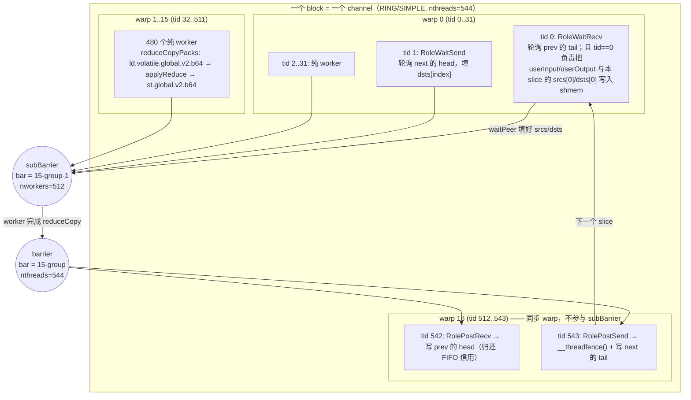
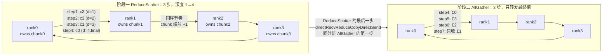

# 08 设备端 AllReduce kernel

> 本章讲清一件事：**主机侧把 `ncclDevWorkColl` 塞进 kernel 参数之后，GPU 上到底发生了什么。**
> 从 `__global__` 入口一路走到 `prims.directRecvReduceDirectSend(...)`，把 blockIdx→channel 的映射、
> block 内 warp 的角色分工、Ring 的 2(N-1) 步数据流、Tree 的线程分组流水、以及
> "为什么这些 kernel 是 Python 脚本生成的" 全部拆开。

---

## 本文覆盖的源文件

| 文件 | 行数 | 本章关注的内容 |
|---|---|---|
| [src/device/all_reduce.h](../src/device/all_reduce.h) | 914 | `runRing` / `runTreeUpDown` / `runTreeSplit`，以及 `RunWorkColl` 的 (ALGO × PROTO) 特化表 |
| [src/device/common.h](../src/device/common.h) | 459 | `ncclShmemData` 共享内存布局、`ncclKernelMain`、`RunWorkBatch`、`DEFINE_ncclDevKernel` 宏 |
| [src/device/common.cu](../src/device/common.cu) | 36 | `ncclShmem` 实体定义、`ncclDevKernel_Generic`、`ncclDevFunc_Nop` |
| [src/device/primitives.h](../src/device/primitives.h) | 183 | `ProtoSimple/ProtoLL/ProtoLL128` 协议常量类、`FanSymmetric/FanAsymmetric` |
| [src/device/prims_simple.h](../src/device/prims_simple.h) | 1000+ | Simple 协议下 `direct*` 原语到 `genericOp` 的模板参数映射、线程角色分配 |
| [src/device/generate.py](../src/device/generate.py) | 464 | (coll × redop × dtype × algo × proto) 实例化生成器 |
| [src/device/Makefile](../src/device/Makefile) | 105 | `ONLY_FUNCS` 过滤、gensrc 生成规则、`-dlink` 设备链接 |
| [src/include/device.h](../src/include/device.h) | — | `WARP_SIZE` / `NCCL_MAX_NTHREADS` / `ncclCollCbdPart` / `ncclShmemDynamicSize` 等常量与切分函数 |
| [src/include/collectives.h](../src/include/collectives.h) | — | `ALLREDUCE_CHUNKSTEPS` / `ALLREDUCE_SLICESTEPS` |
| [src/device/onerank.cu](../src/device/onerank.cu) | 118 | nRanks==1 的退化路径（不走 channel/算法） |

---

## 目录

1. [kernel 入口：从 `__global__` 到 `RunWorkColl`](#1-kernel-入口从-global-到-runworkcoll)
2. [block 内的线程分工（warp 角色）](#2-block-内的线程分工warp-角色)
3. [Ring AllReduce 设备侧实现：`runRing`](#3-ring-allreduce-设备侧实现runring)
4. [Tree AllReduce：`runTreeUpDown` 与 `runTreeSplit`](#4-tree-allreducerunTreeupdown-与-runtreesplit)
5. [`RunWorkColl` 特化表与各算法的启用状态](#5-runworkcoll-特化表与各算法的启用状态)
6. [kernel 代码生成机制：`generate.py` + `Makefile`](#6-kernel-代码生成机制generatepy--makefile)
7. [grid/block 配置与 SM 占用](#7-gridblock-配置与-sm-占用)
8. [与其他章节的衔接](#与其他章节的衔接)

---

## 1. kernel 入口：从 `__global__` 到 `RunWorkColl`

### ① 解决什么问题（场景）

主机侧 `ncclLaunchKernel` 只做一次 `cuLaunchKernelEx`，grid 维度是 channel 数、block 维度是线程数，
参数里只有一个 4KB 的 `ncclDevKernelArgs4K`。但一次 launch 可能要执行**多个** work（聚合的多个
AllReduce 调用），每个 block 只负责**其中一个 channel 的那一份**。于是设备端必须自己回答三个问题：

1. 我这个 block 对应哪个 channel？
2. 我要干的 work 描述在哪儿、怎么搬进 shared memory？
3. 这个 work 的 (algo, proto, redop, dtype) 组合对应哪份代码？

### ② 一句话本质

**`ncclKernelMain` = "把 comm/channel/workBatch 三块元数据用 3 组 warp 并行搬进 shmem，然后按 funcId 跳到编译期已经特化好的 `RunWorkBatch::run()`"。**

### ③ 代码链路

| 跳 | 位置 | 做什么 |
|---|---|---|
| 1 | [enqueue.cc:L1789-L1791](../src/enqueue.cc#L1789) | `grid={nChannels,1,1}`、`block={plan->threadPerBlock,1,1}`、`smem=ncclShmemDynamicSize()` |
| 2 | [common.h:L446-L449 `DEFINE_ncclDevKernel`](../src/device/common.h#L446) | 宏展开出 `__global__ void ncclDevKernel_<suffix>(ncclDevKernelArgs4K __grid_constant__ const args4K)` |
| 3 | [common.h:L363-L441 `ncclKernelMain`](../src/device/common.h#L363) | 拷 args 到 shmem → 算 channelId → 分 warp 加载 comm/channel/work → 循环执行 batch |
| 4 | [common.h:L427-L431](../src/device/common.h#L427) | `funcId == SpecializedFnId` 走内联的 `SpecializedRunWorkBatch()`，否则查 `ncclDevFuncTable[funcId]()` |
| 5 | [common.h:L291-L325 `RunWorkBatch::run`](../src/device/common.h#L291) | 遍历 `ncclShmem.nWorks`，取 `subtn = work->nWarps * WARP_SIZE`，调 `RunWorkColl<>().run(tid, subtn, work)` |
| 6 | [all_reduce.h:L347-L355](../src/device/all_reduce.h#L347) | `RunWorkColl<ncclFuncAllReduce, T, RedOp, RING, SIMPLE>::run` → `runRing<T,RedOp,ProtoSimple<2,2>>` |

### ④ 关键代码逐行解读

**(a) blockIdx → channelId：用 popcount 反查 channelMask 的第 n 个置位**

```cpp
  // To 映射 blockId to channelId, we 需要 the n'th 设置 位 of channelMask 该
  // is the inverse of counting 的数量 设置 位 在 ... 之中 第一个 n.
  if (tid < MAXCHANNELS && (args->channelMask & (1ull << tid))) {
    int n = __popcll(args->channelMask & ((1ull << tid) - 1));
    if (blockIdx.x == n) ncclShmem.channelId = tid;
  }
  __syncthreads(); // publish ncclShmem.{args, channelId}
```
[common.h:L375-L382](../src/device/common.h#L375)

- `channelMask` 是一个 64-bit 位图（`MAXCHANNELS` = 64，见 [device.h:L101](../src/include/device.h#L101)），标记本次 launch 用了哪些 channel。channel 编号**不保证连续**。
- grid 只开了 `countOneBits(channelMask)` 个 block，所以第 `b` 个 block 应该拿到 mask 中**第 b 个置位**的编号。
- PTX 有 `fns`（find n-th set）指令，但展开成的 SASS 很长。这里换了个思路：**让 64 个线程各自检查自己那一位**，线程 `tid` 若置位，就数一下它前面有多少个置位（`__popcll` 一条指令），得到自己是"第 n 个"，若 `n == blockIdx.x` 就写下答案。一次并行反查，代价是 1 条 popc + 1 次比较。
- 注意这一步**只有 `tid < 64` 参与**，且必须 `__syncthreads()` 才能让其他线程看到 `ncclShmem.channelId`。

**(b) 三组 warp 并行加载元数据**

```cpp
  // 使用 第一 2 线程束 to 加载 通信域 并且 通道, 并且 剩余的 加载 work batch.
  switch (tid / WARP_SIZE) {
  case 0:
    { void* dst = &ncclShmem.comm;
      void* src = ncclShmem.args.comm;
      int bytes = sizeof(ncclKernelComm);
      static_assert(sizeof(ncclKernelComm) <= 16 * WARP_SIZE, "...");
      copyToShmem16(tid, dst, src, bytes); }
    break;
  case 1:
    { void* dst = &ncclShmem.channel;
      void* src = &((ncclKernelCommAndChannels*)ncclShmem.args.comm)->channels[ncclShmem.channelId];
      int bytes = sizeof(ncclDevChannel);
      static_assert(sizeof(ncclDevChannel) <= 16 * WARP_SIZE, "...");
      copyToShmem16(tid - WARP_SIZE, dst, src, bytes); }
    break;
  default:
    { int subtid = tid - 2 * WARP_SIZE;
      int subtn  = tn  - 2 * WARP_SIZE;
      loadWorkBatchToShmem(subtid, subtn, args, /*batchIx=*/blockIdx.x); }
    break;
  }
  __syncthreads(); // publish ncclShmem
```
[common.h:L390-L423](../src/device/common.h#L390)

- **warp 0** 搬 `ncclKernelComm`（rank/nRanks/buffSizes/channels 指针…，[device.h:L448-L470](../src/include/device.h#L448)）。
- **warp 1** 搬本 channel 的 `ncclDevChannel`（ring/tree/collnetDirect/nvls 拓扑 + peers 指针，[device.h:L429-L438](../src/include/device.h#L429)）。注意注释：这里**直接算出 `&channels[channelId]` 的地址**，避免从 `ncclKernelComm::channels` 再做一次间接 load。
- **warp 2 及以后**搬 work batch。`batchIx = blockIdx.x` —— 每个 channel 的第一个 batch 就放在自己的 blockIdx 位置（[device.h:L489](../src/include/device.h#L489) 的注释确认了这个约定），后续 batch 通过 `nextJump` 串成链表。
- 两个 `static_assert` 保证一个 warp 用一条 `ld.v2.u64`（16B/线程 × 32 线程 = 512B）就能搬完整个结构；`copyToShmem16` 见 [common.h:L137-L145](../src/device/common.h#L137)。
- **为什么要搬进 shmem？** 注释写得很直白（[common.h:L368-L369](../src/device/common.h#L368)）：kernel 参数在 param space，不能被通用指针寻址；如果代码里出现"可能指向 param、也可能指向 global"的指针，nvcc 会把整个 4KB 参数结构 **spill 到每个线程的 local memory**，性能瞬间崩掉。`loadWorkBatchToShmem` 里 [common.h:L236-L243](../src/device/common.h#L236) 那段刻意写成 if/else 两份独立的 load，就是为了让编译器分别生成 `ld.param.v2.u64` 和 `ld.v2.u64`。

**(c) work 循环与按 warp 数分组**

```cpp
    NVCC_PRAGMA_UNROLL_DISABLED
    for (int w = 0; w < ncclShmem.nWorks; w++) {
      struct ncclDevWorkColl* work = (struct ncclDevWorkColl*)(ncclShmem.workStorage + w * ncclShmem.workSize);
      if (w != 0) {
        struct ncclDevWorkColl* workPrev =
          (struct ncclDevWorkColl*)(ncclShmem.workStorage + (w - 1) * ncclShmem.workSize);
        if (work->nWarps != workPrev->nWarps) __syncthreads();
      }
      int subtn = work->nWarps * WARP_SIZE;
      if (tid < subtn) RunWorkColl<Fn, T, RedOp, Algo, Proto>().run(tid, subtn, work);
    }
```
[common.h:L310-L323](../src/device/common.h#L310)

- 一个 batch 里可以有多个 work（聚合的多个集合通信）。**每个 work 自带 `nWarps`**（[device.h:L298](../src/include/device.h#L298)），所以同一个 block 里不同 work 可以用不同宽度的线程组；`tid >= subtn` 的线程直接跳过。
- 相邻两个 work 的 `nWarps` 不同时插一个 `__syncthreads()`：因为参与线程集合变了，必须让上一个 work 的所有参与者都退出，才能重新划分。
- `NVCC_PRAGMA_UNROLL_DISABLED`（= `#pragma unroll 1`，见 [nccl_device/utility.h:L77](../src/include/nccl_device/utility.h#L77)）禁止展开：`RunWorkColl::run` 是巨大的 `__forceinline__` 函数体，展开会让指令 cache 和寄存器双双爆掉。

**(d) 双路分发：特化 kernel vs 函数指针表**

```cpp
  while (ncclShmem.aborted == 0) {
    profiler(START);
    if (0 <= SpecializedFnId && ncclShmem.funcId == (unsigned)SpecializedFnId) {
      SpecializedRunWorkBatch().run();
    } else {
      ncclDevFuncTable[ncclShmem.funcId]();
    }
    if (ncclShmem.nextBatchIx == -1) break;
    int batchIx = ncclShmem.nextBatchIx;
    __syncthreads();
    profiler(STOP);
    loadWorkBatchToShmem(tid, tn, args, batchIx);
    __syncthreads();
  }
```
[common.h:L425-L439](../src/device/common.h#L425)

- 每个 `ncclDevKernel_XXX` 都带一个 `SpecializedFnId` 模板常量。若本 batch 的 `funcId` 恰好等于它，走**完全内联**的路径（零函数调用开销）；否则退化为**通过 `ncclDevFuncTable` 间接调用**。这是"少数热点组合特化、其余共享一个通用 kernel"的折中，避免 kernel 数量爆炸（详见第 6 节 `best_kernel`）。
- 一个 block 会沿 `nextBatchIx` 链表把本 channel 的所有 batch 跑完，中间只需重新加载 workBatch，**不需要重新 launch kernel**。
- `ncclShmem.aborted` 由 `checkAbort`（[primitives.h:L167-L177](../src/device/primitives.h#L167)）在自旋等待时置位，用于响应 `ncclCommAbort`。

### ⑤ 收益（定量优先）

- **一次 launch 干完所有 channel × 所有 work**：grid = nChannels（典型 8~32），block ≤ 640 线程；batch 链表让多个聚合 op 复用同一次 launch，省掉 N-1 次 kernel launch（每次约 3~5 µs）。
- **元数据加载并行化**：`sizeof(ncclKernelComm)` 与 `sizeof(ncclDevChannel)` 都被 `static_assert` 限制在 512B 以内 → 各 1 条向量化指令搬完；workBatch 每 batch 上限 `ncclMaxDevWorkBatchBytes()`（sm80: 8KB，sm90+: 16KB，见 [device.h:L395-L397](../src/include/device.h#L395)），由 `tn - 64` 个线程按 16B/线程并行搬。
- **避免 param spill**：如果写成"条件选择指针再 memcpy"，4KB 参数会 spill 到 local memory，代码注释直接写了 "decimate perf"（[common.h:L221-L223](../src/device/common.h#L221)）。

### ⑥ 面试考点

**Q1: NCCL 为什么不用 `blockIdx.x` 直接当 channelId？**
A: `channelMask` 里的 channel 编号可能不连续（比如只启用了 channel 2/5/7），而 grid 只开 `popcount(mask)` 个 block。必须做"第 n 个置位"的反查。实现上用 64 线程各自 `__popcll` 前缀计数，比 PTX `fns` 指令快（[common.h:L375-L381](../src/device/common.h#L375)）。

**Q2: 为什么 kernel 参数要先拷进 shared memory？**
A: CUDA 的 param space 不可通用寻址。一旦源码里出现"指针既可能指向 param 也可能指向 global"，编译器只能把整个参数结构 spill 到 local memory 再取地址，4KB × 每线程的 local 流量会彻底毁掉带宽。所以 `ncclKernelMain` 第一件事就是 `((uint32_t*)&ncclShmem.args)[tid] = ((uint32_t*)args)[tid]`（[common.h:L370-L372](../src/device/common.h#L370)），之后只读 shmem 副本。

**Q3: 同一个 block 内不同 work 的线程数不同，怎么保证正确性？**
A: `subtn = work->nWarps * WARP_SIZE`，`tid >= subtn` 的线程不进入 `RunWorkColl::run`。由于原语内部用的是 `barrier_sync(bar, nThreads)` 这种**带线程数的命名 barrier**（[common.h:L99-L105](../src/device/common.h#L99)）而非 `__syncthreads()`，所以部分线程不参与是合法的。切换 `nWarps` 时才需要一次全 block `__syncthreads()`。

**Q4: `SpecializedFnId` 是干什么的？**
A: 编译期常量。让"最热的那个 func"在 kernel 里被完全内联（`RunWorkBatch<...>().run()` 直接展开），其余 func 走 `ncclDevFuncTable` 间接调用。哪些组合被特化由 `generate.py` 的 `best_kernel()` 决定（[generate.py:L151-L162](../src/device/generate.py#L151)）。

---

## 2. block 内的线程分工（warp 角色）

### ① 解决什么问题（场景）

跨 GPU 搬数据要做两件本质上冲突的事：
- **搬运**：尽可能多的线程发 128-bit load/store，把 NVLink 打满；
- **同步**：等对端 FIFO 有数据/有空位，写 tail/head 计数器通知对端。

同步是**串行的、延迟敏感的、只需要极少线程**；搬运是**并行的、带宽敏感的**。如果让所有线程都去轮询同步变量，会产生大量远程原子/volatile load，把链路塞满。

### ② 一句话本质

**同一个 block 里，少数几个线程扮演 `Wait*/Post*` 角色专职做同步握手，其余线程作为 worker 只管 `reduceCopy`；两者用命名 barrier 解耦。**

### ③ 代码链路

| 跳 | 位置 | 说明 |
|---|---|---|
| 1 | [prims_simple.h:L62-L65](../src/device/prims_simple.h#L62) | 角色位定义：`RoleInput/RoleOutput/RoleWaitRecv/RoleWaitSend/RolePostSend/RolePostRecv/...` |
| 2 | [prims_simple.h:L630](../src/device/prims_simple.h#L630) | `nworkers = nthreads - (MaxSend>0 && nthreads >= 3*WARP_SIZE ? WARP_SIZE : 0)` |
| 3 | [prims_simple.h:L655-L670](../src/device/prims_simple.h#L655) | tid → 角色映射 |
| 4 | [prims_simple.h:L87-L100](../src/device/prims_simple.h#L87) | `barrier()`(全组) / `subBarrier()`(仅 worker)，barrier 名 = `15 - group` |
| 5 | [prims_simple.h:L270-L271, L320-L321](../src/device/prims_simple.h#L270) | `waitPeer → subBarrier → reduceCopy → barrier → postPeer` 的一轮 slice |

### ④ 关键代码逐行解读

```cpp
      // 对于发送操作，需要额外一个 线程束，以便让 threadfence 与数据拷贝相互重叠
      this->nworkers = nthreads - (MaxSend > 0 && nthreads >= NCCL_SIMPLE_EXTRA_GROUP_IF_NTHREADS_GE ? WARP_SIZE : 0);
      ...
      constexpr int ThreadPerSync =
        MaxSend >= 16 || MaxRecv >= 16 ? 32 :
        MaxSend >= 8  || MaxRecv >= 8  ? 16 : 8;
      static_assert(MaxSend <= ThreadPerSync && MaxRecv <= ThreadPerSync, "Not enough threads to cover all peers");
      assert(2 * (nrecv + nsend) <= nthreads); // Ensure no thread is assigned more than one role.
      if (tid < nrecv) {                      flags |= RoleWaitRecv; index = tid; }
      else if (tid < nrecv + nsend) {         flags |= RoleWaitSend; index = tid - nrecv; }
      else if (nthreads - nsend <= tid) {     flags |= RolePostSend; index = tid - (nthreads - nsend); }
      else if (nthreads - nrecv - nsend <= tid) { flags |= RolePostRecv; index = tid - (nthreads - nrecv - nsend); }
```
[prims_simple.h:L629-L670](../src/device/prims_simple.h#L629)

- **`nworkers` 比 `nthreads` 少一个 warp**（当有发送对端且 `nthreads >= 3*WARP_SIZE = 96`，见 [device.h:L106](../src/include/device.h#L106)）。这最后一个 warp 里包含 `RolePostSend/RolePostRecv` 线程：它们在 worker 还在拷贝时就可以准备 `__threadfence()` + 写 tail，**让 fence 延迟与拷贝重叠**。
- **角色布局是"两头夹"**：`Wait*` 在 tid 低端（0..nrecv+nsend-1），`Post*` 在 tid 高端（nthreads-…）。这样 `Wait*` 全在 warp 0（它们要参与 `subBarrier` 的 worker 集合），`Post*` 全在最后一个 warp（不参与 `subBarrier`）。
- **一个线程只有一个角色**：`assert(2*(nrecv+nsend) <= nthreads)`。ring 时 nrecv=nsend=1，只占 4 个线程；tree 上行最多 nrecv=3, nsend=1，占 8 个线程。
- 每个 `Wait*/Post*` 线程用 `index` 记住自己盯哪个对端（`peer = recvPeers[index]` / `sendPeers[index]`，[prims_simple.h:L672-L673](../src/device/prims_simple.h#L672)）。

**两级 barrier**：

```cpp
  __device__ void barrier() {
    if (nthreads == WARP_SIZE) __syncwarp();
    else { int bar = 15 - group; barrier_sync(bar, nthreads); }
  }
  __device__ void subBarrier() {
    if (nworkers == WARP_SIZE) __syncwarp();
    else { int bar = 15 - group - (nworkers != nthreads ? 1 : 0); barrier_sync(bar, nworkers); }
  }
```
[prims_simple.h:L87-L100](../src/device/prims_simple.h#L87)

- `barrier()` 同步整组（含 Post 线程），`subBarrier()` 只同步 worker。两者用**不同的 barrier 名**（差 1），所以互不干扰。
- barrier 名从 15 往下分配，注释说明 **0 号 barrier 保留给 kernel 结束的全局同步**；`NCCL_MAX_GROUPS = 16` 正好对应硬件命名 barrier 的数量（[device.h:L135-L136](../src/include/device.h#L135)）。
- `group` 由调用方传入，且以 `Proto::MaxGroupWidth` 为步长（Simple = 2，LL/LL128 = 1，见 [primitives.h:L56, L71, L86](../src/device/primitives.h#L56)）。Simple 的宽度是 2，正是因为它需要 `barrier` 和 `subBarrier` 两个名字。Tree 的上行组用 `0*MaxGroupWidth`、下行组用 `1*MaxGroupWidth`（[all_reduce.h:L295, L320](../src/device/all_reduce.h#L295)），从而拿到互不重叠的 barrier 编号。

### ⑤ 收益（定量优先）

以 **RING + SIMPLE、`nthreads = 544`（17 warps）** 为例（该数值的来历见第 7 节）：

| 角色 | 线程数 | 占比 |
|---|---|---|
| worker（跑 `reduceCopy`） | `nworkers = 544 - 32 = 512`（16 warps） | 94.1% |
| `RoleWaitRecv` / `RoleWaitSend` | 2（tid 0、1） | 0.37% |
| `RolePostSend` / `RolePostRecv` | 2（tid 543、542） | 0.37% |

- **同步开销被摊薄到 <1% 的线程**：远程 `ld.volatile.global.u64` 轮询只有 2 个线程在做，链路上不会出现 512 个线程同时轮询同一个 tail 的风暴。
- Wait 线程还会把读到的值缓存在 `connStepCache`（[prims_simple.h:L80, L149-L150](../src/device/prims_simple.h#L80)），只有缓存值不够时才重新发远程 load。

### ⑥ 面试考点

**Q1: 为什么发送侧要多留一个 warp（`nworkers = nthreads - 32`）？**
A: 发送完成后需要 `__threadfence()` 保证数据对对端可见，再写 tail。fence 是长延迟操作。把 Post 角色放到**不参与 `subBarrier`** 的独立 warp，就能让"上一个 slice 的 fence+post"与"当前 slice 的拷贝"重叠。代码注释：*"对于发送操作，需要额外一个 warp，以便让 threadfence 与数据拷贝相互重叠"*（[prims_simple.h:L629](../src/device/prims_simple.h#L629)）。

**Q2: `barrier_sync` 为什么不用 `__syncthreads()`？**
A: `__syncthreads()` 同步**整个 block**。但 Tree 的 split 模式下 block 被切成上行组/下行组，两组独立推进流水；ring 也有 worker/Post 两个子集。必须用 PTX 的 `barrier.sync.aligned %name, %nThreads`（[common.h:L99-L105](../src/device/common.h#L99)）指定"哪一批线程、多少个"。硬件提供 16 个命名 barrier，对应 `NCCL_MAX_GROUPS`。

**Q3: `nworkers == WARP_SIZE` 时为什么用 `__syncwarp()`？**
A: 单 warp 内 barrier 退化为 warp 级收敛，`__syncwarp()` 比命名 barrier 便宜（不需要占用 barrier 资源，也不需要跨 warp 调度）。

---

### kernel 内线程分工图



> 图中 `srcs[]/dsts[]` 是 `ncclShmem.groups[group].srcs/dsts`（[common.h:L47-L48](../src/device/common.h#L47)）：
> Wait 线程负责把"这一 slice 该从哪读、往哪写"的指针写进 shmem（[prims_simple.h:L163-L198](../src/device/prims_simple.h#L163)），
> `tid == 0` 额外负责本地 `sendbuff/recvbuff` 那一路（[prims_simple.h:L264-L269](../src/device/prims_simple.h#L264)、
> [L792-L798](../src/device/prims_simple.h#L792)），worker 线程读这些指针去搬数据。
> 这就是"同步线程与搬运线程之间的唯一接口"。
>
> 需要明确标注：`RoleInput`/`RoleOutput` 两个角色位在 `primsModeDefault`（AllReduce 走的路径）下
> **从不被置位**，只在 PAT 模式的构造分支里使用（[prims_simple.h:L717-L718](../src/device/prims_simple.h#L717)）；
> 而 PAT 算法在本仓库未启用（见第 5 节）。默认路径下"持有用户 buffer 指针"的工作由 `tid == 0` 承担。

---

## 3. Ring AllReduce 设备侧实现：`runRing`

### ① 解决什么问题（场景）

N 张卡各有一份长度 S 的数据，要让每张卡都得到"所有卡对应位置求和"的结果。
朴素做法（每张卡把自己的数据广播给其他所有卡，本地做 N 路归约）每卡要收 (N-1)·S 字节，
总流量随 N 线性增长，NVLink 上 8 卡时就已经不可接受。

Ring 算法把总流量压到 **2(N-1)/N · S ≈ 2S**，与 N 几乎无关——这是带宽最优的经典方案。

### ② 一句话本质

**把数据切成 N 个 chunk，让 chunk `i` 的归约任务"归属"rank `i`；数据沿环单向流动，
前 N-1 步边走边累加（ReduceScatter），后 N-1 步把已完成的结果再转一圈（AllGather）。**

### ③ 代码链路

| 跳 | 位置 | 说明 |
|---|---|---|
| 1 | [all_reduce.h:L348-L354](../src/device/all_reduce.h#L348) | `RunWorkColl<AllReduce, T, RedOp, RING, SIMPLE>::run` 定义 `Proto = ProtoSimple<ALLREDUCE_CHUNKSTEPS/ALLREDUCE_SLICESTEPS, ALLREDUCE_SLICESTEPS>` = `ProtoSimple<2,2>` |
| 2 | [all_reduce.h:L36-L39](../src/device/all_reduce.h#L36) | `runRing` 取 `ncclShmem.channel.ring`，读出 `index/prev/next` |
| 3 | [all_reduce.h:L47-L50](../src/device/all_reduce.h#L47) | `ncclCollCbdPart` 算出 `gridOffset/channelCount/chunkCount`；`loopCount = nranks * chunkCount` |
| 4 | [all_reduce.h:L62-L63](../src/device/all_reduce.h#L62) | 构造 `Primitives<T, RedOp, FanSymmetric<1>, /*Direct=*/1, Proto, 0>`，recvPeer=`&ring->prev`，sendPeer=`&ring->next` |
| 5 | [all_reduce.h:L66-L144](../src/device/all_reduce.h#L66) | 外层 loop（按 `loopCount` 步长）+ 内部 7 类原语调用 |
| 6 | [prims_simple.h:L905/L968/L981/L935/L915](../src/device/prims_simple.h#L905) | `directSend` / `directRecvReduceDirectSend` / `directRecvReduceCopyDirectSend` / `directRecvCopyDirectSend` / `directRecv` → `genericOp<...>` |

### ④ 关键代码逐行解读

**(a) 切分与循环边界**

```cpp
  ncclRing* ring = &ncclShmem.channel.ring;
  int ringIx = ring->index;                    // 本 rank 在这条环上的序号(0..nranks-1)
  const int nranks = ncclShmem.comm.nRanks;
  ssize_t gridOffset, channelCount, chunkCount;
  ncclCollCbdPart(work, ncclShmem.channelId, Proto::Id, sizeof(T), (ssize_t*)nullptr, &gridOffset, &channelCount,
                  &chunkCount);
  const ssize_t loopCount = nranks * chunkCount;
  ...
  Primitives<T, RedOp, FanSymmetric<1>, 1, Proto, 0> prims(tid, nthreads, &ring->prev, &ring->next, work->sendbuff,
                                                           work->recvbuff, work->redOpArg, 0, 0, 0, work);

  for (ssize_t elemOffset = 0; elemOffset < channelCount; elemOffset += loopCount) {
    ssize_t remCount = channelCount - elemOffset;
    ssize_t chunkOffset;
    if (remCount < loopCount) chunkCount = alignUp(divUp(remCount, nranks), 16 / sizeof(T));
    auto modRanks = [&] __device__(int r) -> int { return r - (r >= nranks ? nranks : 0); };
```
[all_reduce.h:L39-L76](../src/device/all_reduce.h#L39)

- `ncclCollCbdPart`（[device.h:L346-L371](../src/include/device.h#L346)）实现 **CBD（continuous byte distribution）**：主机侧只存了 `countLo/countMid/countHi` 三个数和三个 `chunkGrains`，设备侧根据自己是 lo/mid/hi 哪一档，算出本 channel 的 `partOffset`（= `gridOffset`）和 `partCount`（= `channelCount`）。`chunkCount = chunkGrains * (ncclProtoGrainSize(proto) / eltSize)`，Simple 的 grain 是 **512 字节**（[device.h:L338-L344](../src/include/device.h#L338)）。
- `loopCount = nranks * chunkCount`：**一轮完整流水处理 N 个 chunk**，因为每个 rank 各"负责"一个 chunk 的归约。
- 尾部不足一轮时重算 `chunkCount = alignUp(divUp(remCount, nranks), 16/sizeof(T))`：向上取整让 N 个 chunk 刚好覆盖剩余数据，再 **alignUp 到 16 字节**（`16/sizeof(T)` 个元素）—— 这一步是为了让第 11 章讲的 `BytePack<16>` 向量化访存在尾部依然对齐（否则 `reduceCopy` 里的对齐检测失败，退化到 `sizeof(T)` 逐元素路径，带宽掉一大截）。
- `modRanks` 用**减法代替取模**：入参最大 `2*nranks-1`，一次条件减法就够。取模在 GPU 上是多指令序列，环路里每步都要用，值得手工优化。
- `FanSymmetric<1>` = 1 收 1 发，正是环形拓扑；`Direct=1` 允许用 P2P 直连指针直接读写对端显存。

**(b) ReduceScatter 阶段：注水 → 滚动累加 → 收尾**

```cpp
    // 【第 0 步】把“上游第 1 个 块”原样发给下一个 GPU，为流水线注水。
    chunk = modRanks(ringIx + nranks - 1);
    chunkOffset = chunk * chunkCount;
    offset = gridOffset + elemOffset + chunkOffset;
    nelem = (int)min(chunkCount, remCount - chunkOffset);
    prims.directSend(offset, offset, nelem);

    // 【第 1 ~ k-2 步】ReduceScatter 主体：收 + 规约 + 转发。
    for (int j = 2; j < nranks; ++j) {
      chunk = modRanks(ringIx + nranks - j);
      chunkOffset = chunk * chunkCount;
      offset = gridOffset + elemOffset + chunkOffset;
      nelem = (int)min(chunkCount, remCount - chunkOffset);
      prims.directRecvReduceDirectSend(offset, offset, nelem);
    }

    // 【第 k-1 步】ReduceScatter 收尾：轮到本 rank “归属”的那个 块(编号 = ringIx)。
    chunk = ringIx + 0;
    chunkOffset = chunk * chunkCount;
    offset = gridOffset + elemOffset + chunkOffset;
    nelem = (int)min(chunkCount, remCount - chunkOffset);
    prims.directRecvReduceCopyDirectSend(offset, offset, nelem, /*postOp=*/true);
```
[all_reduce.h:L90-L123](../src/device/all_reduce.h#L90)

- **第 0 步选 `ringIx-1` 号 chunk**：它需要在环上走满 `nranks-1` 跳才能到达归属 rank `ringIx-1`… 更准确地说，本 rank 发出的第一个 chunk 编号是 `ringIx-1`，它下一跳到 `next`（其 `ringIx+1`），在那里作为"第 j=2 步"被累加，如此递推。只发不收，因为此刻还没有上游数据。
- **主体循环 `j` 从 2 递增、chunk 编号递减**：保证每一步处理的都是"再走 `nranks-j` 跳就到家"的那个 chunk。`directRecvReduceDirectSend` = 从 prev 收部分和 → 与本地 `sendbuff` 对应位置归约 → 发给 next。
- **收尾步 `chunk = ringIx`**：此时收到的部分和已累加了其余 `nranks-1` 个 rank，加上本地就是最终结果。`directRecvReduceCopyDirectSend` 一次做三件事：收+归约、**写入 `recvbuff`**（Copy）、发给 next（开启 AllGather）。
- **`postOp=true` 只在这一步为 true**：`Avg`（`FuncSumPostDiv`）需要除以 nranks，必须在累加完全部 rank 之后、且**全局只做一次**。这个 flag 一路传到 `reduceCopyPacks` 的 `applyPostOp`（[common_kernel.h:L148-L151](../src/device/common_kernel.h#L148)）。

**(c) AllGather 阶段：转发已完成的结果**

```cpp
    // 【全收集 阶段，共 k-2 步】此时环上流动的已经是最终结果，不需要再规约。
    for (int j = 1; j < nranks - 1; ++j) {
      chunk = modRanks(ringIx + nranks - j);
      chunkOffset = chunk * chunkCount;
      offset = gridOffset + elemOffset + chunkOffset;
      nelem = (int)min(chunkCount, remCount - chunkOffset);
      prims.directRecvCopyDirectSend(offset, offset, nelem);
    }

    // 【最后一步】收下环上传回的最后一个 块，只写入本地即可。
    chunk = modRanks(ringIx + 1);
    ...
    prims.directRecv(offset, nelem);
```
[all_reduce.h:L125-L143](../src/device/all_reduce.h#L125)

- `directRecvCopyDirectSend`：收 → 写 `recvbuff` → 原样转发。注意**没有 Reduce**（`SrcBuf = -1`，见下表），因为流动的已是最终值。
- **最后一步只收不发**：这个 chunk 的下一站正是它的归属 rank `ringIx+1`，那里早就有结果了，再发一次纯属浪费带宽。

**(d) 5 个原语的模板参数对照表**

`genericOp<DirectRecv, DirectSend, Recv, Send, SrcBuf, DstBuf>`（[prims_simple.h:L217-L222](../src/device/prims_simple.h#L217)）：

| `runRing` 调用 | 模板实参 | 含义 |
|---|---|---|
| `directSend(off,off,n)` | `<0,1,0,1,Input,-1>` [L905](../src/device/prims_simple.h#L905) | 读 `sendbuff`，直写 next；不收、不写本地 |
| `directRecvReduceDirectSend(off,off,n)` | `<1,1,1,1,Input,-1>` [L968](../src/device/prims_simple.h#L968) | 收 prev + 读 `sendbuff` → 归约 → 直写 next；不落 `recvbuff` |
| `directRecvReduceCopyDirectSend(off,off,n,true)` | `<1,1,1,1,Input,Output>` [L981](../src/device/prims_simple.h#L981) | 收 prev + 读 `sendbuff` → 归约 → 同时写 `recvbuff` 和 next |
| `directRecvCopyDirectSend(off,off,n)` | `<1,1,1,1,-1,Output>` [L935](../src/device/prims_simple.h#L935) | 收 prev → 写 `recvbuff` + 转发 next；**无本地 src，故不归约** |
| `directRecv(off,n)` | `<1,0,1,0,-1,Output>` [L915](../src/device/prims_simple.h#L915) | 收 prev → 只写 `recvbuff` |

- `SrcBuf/DstBuf` 为 `-1` 表示"不使用用户 buffer 作为该侧端点"。`Src = (SrcBuf != -1)`、`Dst = (DstBuf != -1)`（[prims_simple.h:L221-L222](../src/device/prims_simple.h#L221)），进而决定 `reduceCopy` 的源/目标数量：`Recv*fan.nrecv() + Src` 个源、`Send*fan.nsend() + Dst` 个目标（[prims_simple.h:L308-L312](../src/device/prims_simple.h#L308)）。
- 这解释了"为什么归约与拷贝是同一个函数"：`reduceCopy` 的语义就是 **n 个源做归约 → 写到 m 个目标**，源只有 1 个时就退化成纯拷贝。

### ⑤ 收益（定量优先）

**流量分析（每个 rank、每轮 loop）**

| 阶段 | 发送次数 | 接收次数 | 每次字节数 |
|---|---|---|---|
| ReduceScatter | `1 + (N-2) + 1 = N-1` | `(N-2) + 1 = N-1` | `chunkCount * sizeof(T)` |
| AllGather | `(N-2) + 1 = N-1` | `(N-2) + 1 = N-1` | 同上 |
| **合计** | **2(N-1)** | **2(N-1)** | — |

- 总流量 = `2(N-1) * S/N`，N=4 时 = 1.5·S，N=8 时 = 1.75·S，**上界 2S 且与 N 无关**（朴素广播法是 (N-1)·S）。
- 原语调用次数 = `1 + (N-2) + 1 + (N-2) + 1 = 2N-1`（N=2 时是 3 次，N=4 时是 7 次）。
- **本仓库实测配置**（RING/SIMPLE，`NCCL_BUFFSIZE` 默认 4 MiB、`NCCL_STEPS = 8`）：
  `stepSize = 4MiB/8 = 512 KiB`，`chunkSteps = ALLREDUCE_CHUNKSTEPS = NCCL_STEPS/2 = 4`
  → **`chunkSize = 512KiB × 4 = 2 MiB`**（[enqueue.cc:L2294-L2297](../src/enqueue.cc#L2294)）。
  设备侧交叉验证：`SlicePerChunk × StepPerSlice × stepSize = 2 × 2 × 512KiB = 2 MiB` ✅ 完全一致。
  对 fp32：`chunkCount = 2MiB/4 = 524,288` 元素，`loopCount = N × chunkCount`（N=4 时 2M 元素 = 8 MiB/loop/channel）。

### ⑥ 面试考点

**Q1: Ring AllReduce 的 2(N-1) 步是怎么来的？为什么代码里是 `2N-1` 次原语调用？**
A: 逻辑上 ReduceScatter 需要 N-1 步、AllGather 需要 N-1 步，共 2(N-1) 次"跨卡传输"。但代码把第一次"只发不收"（注水）和最后一次"只收不发"（排空）拆成了独立调用，中间 2N-3 次调用是"收+发"同时进行的流水节拍。统计**发送次数**恰好 2(N-1)，**接收次数**也是 2(N-1)。

**Q2: 为什么 `postOp` 只在 ReduceScatter 的最后一步为 true？**
A: `postOp` 对应 `Avg` 的除法（`FuncSumPostDiv`）或其他后处理。必须在**累加齐全部 N 个 rank 之后**做，且**只能做一次**。ReduceScatter 的收尾步（`chunk == ringIx`）正是"这个 chunk 第一次拿到完整和"的时刻；此后 AllGather 只做转发，若再 postOp 就会重复除。

**Q3: 尾部为什么要 `alignUp(..., 16/sizeof(T))`？**
A: 保证每个 chunk 的元素数是 16 字节的整数倍，从而 chunk 起始地址保持 16B 对齐。`reduceCopy` 会先检查所有 src/dst 是否按 `BigPackSize=16` 对齐（[common_kernel.h:L224-L231](../src/device/common_kernel.h#L224)），对齐才走 `ld/st.global.v2.b64` 的 128-bit 路径；不对齐就退化到 `BytePerPack = sizeof(T)`，指令数暴增 4~16 倍。

**Q4: `Direct=1` 具体省了什么？**
A: 不开 Direct 时，发送方把数据写到**自己（或对端）预分配的 FIFO 中转缓冲**，接收方再从 FIFO 读到 `recvbuff`，多一次显存往返。开 Direct 后，`waitPeer` 会把 `ptrs[index]` 直接设成 `directBuff + dstIx + offset`（[prims_simple.h:L177-L193](../src/device/prims_simple.h#L177)），即**对端的用户 buffer 地址**，`reduceCopy` 的 store 直接落到对端显存。对 AllGather 阶段还有个额外优化：`genericOp` 里 `DirectRecv && srcs[0] == dsts[0]` 时可以完全跳过一次拷贝（[prims_simple.h:L283-L293](../src/device/prims_simple.h#L283)）。

---

### Ring AllReduce 在 4 卡上的 2(N-1) 步数据流

**表格视角（以 rank 0 为例，`ringIx = 0`，`nranks = 4`，chunk 编号 0~3）**

记号：`P(c, d)` 表示 chunk `c` 的部分和，已累加了 `d` 个 rank 的数据；`Σc` = `P(c, 4)` 即最终结果。

| # | 循环位置 | 调用的原语 | 处理 chunk | 从 prev 收到 | 与本地 `sendbuff` 归约后发给 next | 写 `recvbuff`? |
|---|---|---|---|---|---|---|
| 1 | [L93-L97](../src/device/all_reduce.h#L93) | `directSend` | 3 | —（注水，只发不收） | `P(3, 1)` | 否 |
| 2 | [L103-L108](../src/device/all_reduce.h#L103) `j=2` | `directRecvReduceDirectSend` | 2 | `P(2, 1)` | `P(2, 2)` | 否 |
| 3 | [L103-L108](../src/device/all_reduce.h#L103) `j=3` | `directRecvReduceDirectSend` | 1 | `P(1, 2)` | `P(1, 3)` | 否 |
| 4 | [L119-L123](../src/device/all_reduce.h#L119) | `directRecvReduceCopyDirectSend`(**postOp**) | **0** | `P(0, 3)` | **`Σ0`** | ✅ chunk0 |
| 5 | [L127-L132](../src/device/all_reduce.h#L127) `j=1` | `directRecvCopyDirectSend` | 3 | **`Σ3`** | 原样转发 `Σ3`（不归约） | ✅ chunk3 |
| 6 | [L127-L132](../src/device/all_reduce.h#L127) `j=2` | `directRecvCopyDirectSend` | 2 | **`Σ2`** | 原样转发 `Σ2`（不归约） | ✅ chunk2 |
| 7 | [L138-L143](../src/device/all_reduce.h#L138) | `directRecv` | 1 | **`Σ1`** | —（排空，只收不发） | ✅ chunk1 |

**为什么"深度 = 步数"能自洽？** 每个 rank 在第 k 步（k = 1..4）处理 chunk `(ringIx - k + 4) mod 4`，
所有 rank 同步推进。rank r 在第 k 步收到的是 prev（其 `ringIx = r-1`）在第 k-1 步发出的、
同一个 chunk 编号 `(r-1) - (k-1) = r-k` 的数据，深度为 `k-1`；加上本地一份后变成深度 `k`。
第 4 步（k = nranks）处理的正好是 chunk `ringIx`（自己"归属"的那个），深度达到 4 = 全部 rank，
所以**只有这一步 `postOp=true`**。AllGather 阶段流动的已是 `Σ`，`SrcBuf = -1` 保证不会再次归约。

逐 rank 验证（第 4 步各 rank 处理的 chunk 编号）：rank0→chunk0、rank1→chunk1、rank2→chunk2、rank3→chunk3，
**恰好每个 chunk 由唯一一个 rank 完成最终归约**，无重复无遗漏。

**图视角（4 卡，chunk 归属与流动方向）**



**N = 2 的退化情形**（`nranks = 2`，环上 prev == next == 对端）：

| # | 原语 | chunk | 说明 |
|---|---|---|---|
| 1 | `directSend` [L97](../src/device/all_reduce.h#L97) | `(ringIx+1)%2` | 把对端"归属"的那个 chunk 发过去 |
| — | 主体 for 循环 `j=2; j<2` | — | **0 次迭代**（N=2 时 ReduceScatter 主体为空） |
| 2 | `directRecvReduceCopyDirectSend`(postOp) [L123](../src/device/all_reduce.h#L123) | `ringIx` | 收对端数据 + 本地归约 = 最终值，写 `recvbuff` 并回发 |
| — | AllGather for 循环 `j=1; j<1` | — | **0 次迭代** |
| 3 | `directRecv` [L143](../src/device/all_reduce.h#L143) | `(ringIx+1)%2` | 收对端算好的那半，写 `recvbuff` |

→ N=2 共 `2N-1 = 3` 次原语调用，发送 2 次 = `2(N-1)`，流量 `2·(S/2) = S`，正好是理论下界。

---

## 4. Tree AllReduce：`runTreeUpDown` 与 `runTreeSplit`

### ① 解决什么问题（场景）

Ring 的步数是 O(N)，每一步都要等上游数据到达。数据量很小时，**延迟**（步数 × 单跳延迟）而非带宽成为瓶颈。
Tree 把 rank 组织成（二叉）树，只需 O(log N) 层：上行 reduce 到根，下行 broadcast 回叶子。

### ② 一句话本质

**`runTreeUpDown` 是"先做完整个上行、再做整个下行"的朴素版；`runTreeSplit` 把 block 里的线程一分为二，
上行组与下行组同时运行，让两个阶段在时间上重叠 —— 这才是实际走的路径。**

### ③ 代码链路

| 跳 | 位置 | 说明 |
|---|---|---|
| 1 | [all_reduce.h:L358-L370](../src/device/all_reduce.h#L358) | `RunWorkColl<AllReduce,…,TREE,SIMPLE>`：默认 `runTreeSplit<T,RedOp,ProtoSimple<1,1>>` |
| 2 | [all_reduce.h:L364-L368](../src/device/all_reduce.h#L364) | `#if CUDART_VERSION >= 11020 && < 11040 && __CUDA_ARCH__ >= 800` 时退回 `runTreeUpDown`（规避编译器缺陷） |
| 3 | [all_reduce.h:L242-L263](../src/device/all_reduce.h#L242) | `runTreeSplit` 计算 `nthreadsSplit` |
| 4 | [all_reduce.h:L265-L276](../src/device/all_reduce.h#L265) | 根节点：不拆线程，`FanSymmetric<NCCL_MAX_TREE_ARITY_TOP>` 收发同一批子节点 |
| 5 | [all_reduce.h:L277-L310](../src/device/all_reduce.h#L277) | 上行组：`FanAsymmetric<NCCL_MAX_TREE_ARITY,1>`，group = `0*MaxGroupWidth` |
| 6 | [all_reduce.h:L311-L336](../src/device/all_reduce.h#L311) | 下行组：`FanAsymmetric<1,NCCL_MAX_TREE_ARITY>`，group = `1*MaxGroupWidth`，tid 重映射 |

### ④ 关键代码逐行解读

**(a) `runTreeUpDown`：两个阶段串行，三种角色**

```cpp
  { // 阶段一 Reduce(上行)
    Primitives<T, RedOp, FanAsymmetric<NCCL_MAX_TREE_ARITY, 1>, /*Direct=*/1, Proto, 0> prims(
      tid, nthreads, tree->down, &tree->up, work->sendbuff, work->recvbuff, work->redOpArg, 0, 0, 0, work);
    if (tree->up == -1) {                       // 角色①：根节点
      for (...) prims.directRecvReduceCopy(offset, offset, nelem, /*postOp=*/true);
    } else if (tree->down[0] == -1) {           // 角色②：叶子节点
      for (...) prims.directSend(offset, offset, nelem);
    } else {                                    // 角色③：中间节点
      for (...) prims.directRecvReduceDirectSend(offset, offset, nelem);
    }
  }
  { // 阶段二 Broadcast(下行)
    Primitives<T, RedOp, FanAsymmetric<1, NCCL_MAX_TREE_ARITY>, /*Direct=*/1, Proto, 0> prims(
      tid, nthreads, &tree->up, tree->down, work->sendbuff, work->recvbuff, work->redOpArg, 0, 0, 0, work);
    if (tree->up == -1)                 for (...) prims.directSendFromOutput(offset, nelem);
    else if (tree->down[0] == -1)       for (...) prims.directRecv(offset, nelem);
    else                                for (...) prims.directRecvCopyDirectSend(offset, offset, nelem);
  }
```
[all_reduce.h:L170-L227](../src/device/all_reduce.h#L170)（为便于对照做了压缩排版）

- **两个阶段的 Fan 模板参数正好反过来**：上行 `FanAsymmetric<ARITY,1>`（多收一发），下行 `FanAsymmetric<1,ARITY>`（一收多发）。`NCCL_MAX_TREE_ARITY = 3`（2 个子节点 + 1 个节点内节点，[device.h:L200-L202](../src/include/device.h#L200)）。
- **根节点的 postOp=true**：全局唯一的"数据齐全"时刻。
- **根节点下行用 `directSendFromOutput`**：上行阶段结果已在 `recvbuff`，所以从**输出**缓冲区发（`genericOp<0,1,0,1,Output,-1>`，[prims_simple.h:L908-L910](../src/device/prims_simple.h#L908)），而不是从 `sendbuff`。
- **致命缺陷**：`{...}` 两个作用域串行。上行阶段的最后一个 chunk 归约完成之前，下行阶段一个字节都不能开始搬 —— 树的深度越深、chunk 越多，气泡越大。

**(b) `runTreeSplit`：线程一分为二**

```cpp
  int nthreadsSplit;   // 分界线：tid < nthreadsSplit 的线程做 Reduce，其余做 Broadcast
  if (Proto::Id == NCCL_PROTO_SIMPLE) {
    // Simple 协议：上下行工作量相当，基本对半分。
    nthreadsSplit = nthreads / 2;
    if (nthreadsSplit >= 256) nthreadsSplit += 64;
  } else {
    // LL 与 LL128 协议：“从最多 3 个来源接收并规约”比“向 3 个目标发送”计算量大得多
    nthreadsSplit = (nthreads * 7 / (10 * WARP_SIZE)) * WARP_SIZE;
  }
```
[all_reduce.h:L251-L263](../src/device/all_reduce.h#L251)

- **Simple**：对半分，且当一半 ≥ 256 时给上行（reduce）组**再加 64 个线程（2 个 warp）**，因为归约端多做加法运算。
- **LL/LL128**：7:3 分配给 reduce:bcast。LL 协议收数据时要校验 flag 位、做数据重组，计算量远大于发送侧。结果**向下取整到 `WARP_SIZE` 的整数倍**，避免 warp 被切开导致 divergence。
- **`nthreads = 640` 时（Tree 恒定用满，见第 7 节）**：`640/2 = 320 ≥ 256` → `nthreadsSplit = 384`。
  - 上行组 384 线程（12 warps），其 `nworkers = 384 - 32 = 352`（11 warps 搬运）；
  - 下行组 `640 - 384 = 256` 线程（8 warps），其 `nworkers = 256 - 32 = 224`（7 warps 搬运）。

```cpp
  } else if (tid < nthreadsSplit) {
    /* 【上行组】... 为什么这里 Direct=1？
     * 答：即使这条路径实际上并不执行任何 direct 操作，构造函数也必须按 Direct 模式来初始化。
     *     因为对端(远程 rank)的构造函数可能是 Direct 模式的，双方在建连握手时需要**交换直连指针**；
     *     如果这边不按 Direct 走，握手信息对不上，就会导致双方互相等待而**挂死(hang)**。 */
    Primitives<T, RedOp, FanAsymmetric<NCCL_MAX_TREE_ARITY, 1>, /*Direct=*/1, Proto, 0> prims(
      tid, nthreadsSplit, tree->down, &tree->up, work->sendbuff, work->recvbuff, work->redOpArg,
      0 * Proto::MaxGroupWidth, 0, 0, work);
    ...
  } else {
    // 【下行组】
    Primitives<T, RedOp, FanAsymmetric<1, NCCL_MAX_TREE_ARITY>, /*Direct=*/1, Proto, 0> prims(
      tid - nthreadsSplit, nthreads - nthreadsSplit, &tree->up, tree->down, work->sendbuff, work->recvbuff,
      work->redOpArg, 1 * Proto::MaxGroupWidth, 0, 0, work);
```
[all_reduce.h:L277-L320](../src/device/all_reduce.h#L277)

- **`group` 参数是解耦的关键**：上行组 `0*MaxGroupWidth = 0`，下行组 `1*MaxGroupWidth = 2`（Simple 的 `MaxGroupWidth = 2`）。于是上行组用 barrier 15 / 14，下行组用 barrier 13 / 12 —— **两组的 barrier 完全不重叠**，可以各自独立推进流水，互不阻塞。
- **下行组的 tid 重映射**：传入 `tid - nthreadsSplit` 和 `nthreads - nthreadsSplit`，让原语内部看到的是一个"从 0 号线程开始、宽度为 256"的独立线程组。这样 `RoleWaitRecv` 依然落在该组的 tid 0，角色分配逻辑不用改。
- **注释里那段关于 `Direct=1` 的解释非常值得记**：即使这条分支不做 direct 操作，也必须用 Direct 模式构造，否则与对端的建连握手（交换直连指针）信息不匹配，双方互相等待 → **hang**。注释还给出了更干净的设计（拆成 `DirectRecv`/`DirectSend` 两个独立开关）。
- **根节点不拆线程**（[all_reduce.h:L265-L276](../src/device/all_reduce.h#L265)）：它既是上行终点又是下行起点，用 `FanSymmetric<NCCL_MAX_TREE_ARITY_TOP>`（收发对象都是同一批子节点）+ 全部 640 线程，一次 `directRecvReduceCopyDirectSend` 就把"收齐→归约→立刻发回"做完，本身没有串行气泡。

### ⑤ 收益（定量优先）

设树深 `D ≈ log2(N)`，本 channel 要处理 `C` 个 chunk，单 chunk 单跳时间 `t`：

| 版本 | 时间模型 | N=8（D=3）、C=16 时 |
|---|---|---|
| `runTreeUpDown` | `(C·t)_up + (C·t)_down = 2·C·t` | `32t` |
| `runTreeSplit` | `max(C·t_up, C·t_down) + 1 个 chunk 的填充 ≈ C·t + t` | `≈17t` |

- **理论上限接近 2×**，代价是搬运线程从"全部 640"变成"上行 352 + 下行 224"，每一路的瞬时带宽下降，所以实际收益低于 2×，但因为两路是**不同方向的链路**（上行占 up-link，下行占 down-link），NVLink 是全双工，两路带宽不冲突 —— 这是 split 能真正拿到收益的物理前提。
- Tree 的**步数** O(log N) vs Ring 的 O(N)：N=8 时 3 层 vs 14 步，小数据量下延迟优势明显。代价是每层搬的数据量是全量 S（Ring 是 S/N），所以大数据量时带宽不如 Ring。算法选择由 [tuning.cc](../src/graph/tuning.cc) 的代价模型决定（见 05 章）。

### ⑥ 面试考点

**Q1: 为什么 `runTreeSplit` 比 `runTreeUpDown` 快？**
A: `UpDown` 把上行和下行放在两个串行作用域里，下行必须等整个上行结束。`Split` 把 block 的线程拆成两组，**分配不同的 barrier group**（0 和 1×MaxGroupWidth），两组同时跑：上行组还在归约后面的 chunk 时，下行组已经在广播前面 chunk 的结果。NVLink 全双工，上下行占不同方向的链路，带宽不互相挤占。

**Q2: `nthreadsSplit >= 256` 时为什么 `+= 64`？**
A: 上行组要做**归约加法**（多路 `applyReduce`），下行组只做拷贝转发，前者算得更多。当线程数足够多（一半 ≥ 256）时，多给上行 2 个 warp 让两组的完成时间更接近，减少 split 流水的木桶效应。

**Q3: LL/LL128 为什么用 7:3 而不是对半？**
A: LL 协议在接收侧要逐个 8 字节数据元素校验 flag（判断数据是否已到达）、剥离 flag 重组数据，再做归约；发送侧只是打包写出。接收侧计算量显著更大，所以 70% 线程给 reduce。且结果必须 `(nthreads*7/(10*WARP_SIZE))*WARP_SIZE` 向下取整到 warp 边界，避免同一个 warp 里一半线程做上行一半做下行（那会导致严重的 warp divergence）。

**Q4: 明明不做 direct 操作，为什么还要 `Direct=1`？**
A: `Direct` 影响 `Primitives` **构造函数的建连握手协议**——Direct 模式下双方要交换直连指针（`ptrExchange`）。对端是不是 Direct 模式由对端的模板参数决定，本端无法感知。若本端用 `Direct=0` 而对端用 `Direct=1`，握手步骤对不上，双方各自等待对方，直接 hang。源码注释明确写了这一点并给出了更好的设计方向（[all_reduce.h:L280-L286](../src/device/all_reduce.h#L280)）。

---

## 5. `RunWorkColl` 特化表与各算法的启用状态

### ① 解决什么问题（场景）

`RunWorkColl` 是"(coll, T, RedOp, Algo, Proto) → 具体实现"的编译期分派表。基类是空实现
（[common.h:L273-L278](../src/device/common.h#L273)，注释 *"放置 不 IMPLEMENTED behavior here"*），
所有实际路径都靠**模板特化**注册进来。这样运行时**没有任何 if/switch 判断算法**。

### ② 一句话本质

**用 C++ 模板全特化替代运行时分支：`Algo`/`Proto` 是非类型模板参数，编译期就选定了唯一的代码路径。**

### ③ 代码链路

`common.h` 声明基类 → `all_reduce.h` 提供 8 个特化 → `generate.py` 用 `DEFINE_ncclDevFunc` 宏为每个
(redop × dtype × algo × proto) 组合实例化一个 `__device__` 函数 → `device_table.cu` 收集成
`ncclDevFuncTable[]`。

### ④ 关键代码逐行解读

**本仓库 `all_reduce.h` 中的全部 `RunWorkColl<ncclFuncAllReduce, ...>` 特化：**

| 行号 | ALGO | PROTO | 实现 | 设备端是否被编译出实例 |
|---|---|---|---|---|
| [L347-L355](../src/device/all_reduce.h#L347) | `RING` | `SIMPLE` | `runRing<T,RedOp,ProtoSimple<2,2>>` | ✅ **是**（默认大数据量路径） |
| [L358-L370](../src/device/all_reduce.h#L358) | `TREE` | `SIMPLE` | `runTreeSplit<T,RedOp,ProtoSimple<1,1>>`（CUDA 11.2~11.3 + sm80 时用 `runTreeUpDown`） | ✅ **是** |
| [L372-L512](../src/device/all_reduce.h#L372) | `COLLNET_DIRECT` | `SIMPLE` | scatter/gather/reduce/bcast 四路线程分工 | ❌ **否**（被 `ONLY_FUNCS` 过滤） |
| [L514-L649](../src/device/all_reduce.h#L514) | `NVLS` | `SIMPLE` | multimem scatter/gather/reduce | ❌ **否** |
| [L651-L760](../src/device/all_reduce.h#L651) | `NVLS_TREE` | `SIMPLE` | NVLS + 树形跨节点 | ❌ **否** |
| [L762-L885](../src/device/all_reduce.h#L762) | `COLLNET_CHAIN` | `SIMPLE` | 链式上行/下行 | ❌ **否** |
| [L887-L892](../src/device/all_reduce.h#L887) | `RING` | `LL` | `runRing<T,RedOp,ProtoLL>` | ✅ **是** |
| [L894-L899](../src/device/all_reduce.h#L894) | `TREE` | `LL` | `runTreeSplit<T,RedOp,ProtoLL>` | ✅ **是** |
| [L901-L906](../src/device/all_reduce.h#L901) | `RING` | `LL128` | `runRing<T,RedOp,ProtoLL128>` | ✅ **是** |
| [L908-L913](../src/device/all_reduce.h#L908) | `TREE` | `LL128` | `runTreeSplit<T,RedOp,ProtoLL128>` | ✅ **是** |

**启用状态的判定依据（三重过滤，必须一起看）：**

1. **`ONLY_FUNCS` 过滤**（本仓库最关键的一条）
   ```makefile
   # Only build AllReduce kernels (all redops/types) for RING/TREE algorithms
   # with all protocols (SIMPLE, LL, LL128).
   ONLY_FUNCS ?= AllReduce * * (RING|TREE) *
   ```
   [Makefile:L22-L24](../src/device/Makefile#L22)
   → 只有 `AllReduce × 任意 redop × 任意 dtype × (RING|TREE) × 任意 proto` 会被生成。

2. **`validate()` 把被过滤掉的行映射为 `Nop`**
   ```python
   def validate(coll, redop, ty, algo, proto):
     valid = required_cuda(coll, redop, ty, algo, proto)
     built = valid and func_filter(coll, redop, ty, algo, proto)
     if built: return (coll, redop, ty, algo, proto)
     if valid: return ("Nop", None, None, None, None)
     return None
   ```
   [generate.py:L190-L195](../src/device/generate.py#L190)
   → `COLLNET_DIRECT/COLLNET_CHAIN/NVLS/NVLS_TREE` 这些行在 `ncclDevFuncRowToId[]` 里指向
   `Nop` 的 id，其 `__device__` 实现就是 **`ncclDevFunc_Nop() {}`**（[common.cu:L35](../src/device/common.cu#L35)），什么也不做。

3. **`required_cuda()` 直接排除非法组合**
   ```python
   if proto!="SIMPLE" and algo not in ("RING","TREE"): return None
   ```
   [generate.py:L115](../src/device/generate.py#L115)
   → 例如 `NVLS + LL` 这种组合连行都不存在（`ncclDevFuncRowToId` 里是 `-1`）。

> **⚠️ 明确标注：** `all_reduce.h` 里 COLLNET_DIRECT / COLLNET_CHAIN / NVLS / NVLS_TREE 的**源码完整保留**
> （便于阅读学习），但在本仓库的默认构建中**没有生成任何设备函数实例**。
> 主机侧的调优代码（[tuning.cc](../src/graph/tuning.cc)、[enqueue.cc:L2029-L2039](../src/enqueue.cc#L2029)）也仍在，
> 它们靠 `collNetSupport`（依赖 `comm->config.collnetEnable` 与 `collNetSupportMatrix`，
> [enqueue.cc:L1991-L2007](../src/enqueue.cc#L1991)）和 `nvlsSupport`（[nvls.cc:L255-L288](../src/transport/nvls.cc#L255)，
> 默认 `nvlsSupport = 0`，只有硬件支持 multicast 且 `NCCL_NVLS_ENABLE` 允许时才置 1）来门控。
> **本仓库的目标场景是单机多卡、无 CollNet**（README 也标注 `nvls.cc` 为"禁用"），
> 因此实际可走的设备侧路径只有 **RING 与 TREE × (SIMPLE|LL|LL128) 共 6 种**。
> 另外，本仓库只保留 AllReduce：`Broadcast/Reduce/AllGather/AllGatherV/ReduceScatter/SendRecv`
> 的行同样被 `ONLY_FUNCS` 映射到 `Nop`。

### ⑤ 收益（定量优先）

- **零运行时分支**：`Algo`/`Proto` 是模板常量，`runRing` 里 `Proto::Id == NCCL_PROTO_SIMPLE` 这类判断在编译期折叠；`FanSymmetric<1>::nrecv()` 直接返回成员 `n`，`MaxRecv/MaxSend` 是 `constexpr`，循环 `for (int s = 1; s < MinSrcs; s++)` 在 `MinSrcs=2` 时完全展开。
- **`ONLY_FUNCS` 对编译产物的影响**：完整 NCCL 的 AllReduce 有 `5 redops × 12 dtypes × 6 algos × 3 protos = 1080` 组合（再乘上其他 6 个 coll）。本仓库砍到 `5 × 12 × 2 algos × 3 protos = 360` 个 primary 候选，再经 `equivalent_primary` 把有符号整数映射到无符号（[generate.py:L138-L146](../src/device/generate.py#L138)）进一步去重。这直接决定了 `libnccl.so` 的体积和编译时间。

### ⑥ 面试考点

**Q1: 为什么用模板特化而不是运行时 switch？**
A: 三个原因。① **常量传播**：`SlicePerChunk`/`StepPerSlice`/`Unroll`/`MinSrcs`/`MaxSrcs` 都是编译期常量，`#pragma unroll` 才能生效、地址计算才能被折叠。② **寄存器分配**：每个组合的寄存器压力不同，独立实例可以各自最优；如果所有分支挤在一个函数里，寄存器分配要按最坏分支来，occupancy 会被拉低。③ **避免动态分支**：GPU 上 warp 内分支会导致串行执行，而集合通信的内层循环极热。

**Q2: 如果主机侧选了一个设备端没编译的算法会怎样？**
A: `ncclDevFuncRowToId[]` 会把它指到 `Nop` 的 func id，kernel 跑 `ncclDevFunc_Nop()`（空函数），结果就是**数据没被搬动**。所以主机侧的门控（`collNetSupport`/`nvlsSupport`）与 `ONLY_FUNCS` 必须保持一致 —— 这也是裁剪 NCCL 时最容易踩的坑。

**Q3: `equivalent_primary` 为什么把有符号整数映射成无符号？**
A: 补码下**加法、乘法、按位运算的比特级结果与符号性无关**，`int32` 的 sum 和 `uint32` 的 sum 生成完全相同的指令。所以只需保留无符号版本，把有符号的行指向它，实例数直接减半（[generate.py:L138-L146](../src/device/generate.py#L138)）。MinMax 需要区分符号（用 `xormask` 处理，见第 11 章），但非 NVLS 场景也做了同样的合并（`FuncMinMax` 靠 `xormask` 把有符号比较转成无符号比较）。

---

## 6. kernel 代码生成机制：`generate.py` + `Makefile`

### ① 解决什么问题（场景）

AllReduce 的实现是 `runRing<T, RedOp, Proto>` 这样的模板。要让它可用，必须为每个
`(coll, redop, dtype, algo, proto)` 组合**显式实例化**一个 `__device__` 函数，并把它们的地址收进一张表，
供 kernel 按 `funcId` 间接调用。手写这些实例化代码 = 上千行纯样板；而且实例集合还要随
`ONLY_FUNCS`、CUDA 版本、`__CUDA_ARCH__` 变化。

### ② 一句话本质

**`generate.py` 在编译前生成 `<gensrc>/*.cu`（实例化）、`device_table.cu`（设备函数指针表）、
`host_table.cc`（主机侧 id 映射与 kernel 列表）、`rules.mk`（编译规则），把"组合爆炸"交给脚本管理。**

### ③ 代码链路

| 跳 | 位置 | 说明 |
|---|---|---|
| 1 | [Makefile:L60-L66](../src/device/Makefile#L60) | `$(OBJDIR)/gensrc: generate.py` → `./generate.py $@ "$(ONLY_FUNCS)"` |
| 2 | [generate.py:L165-L178 `enumerate_func_rows`](../src/device/generate.py#L165) | 按**固定顺序**枚举所有行（顺序必须与 `ncclDevFuncId()` 的公式一致） |
| 3 | [generate.py:L190-L198](../src/device/generate.py#L190) | `validate` 逐行判定 → `func_rows[]`（对应 `ncclDevFuncRowToId[]`） |
| 4 | [generate.py:L201-L206](../src/device/generate.py#L201) | `primary_funcs`（去重后的实际实现集合）、`kernel_funcs`（要特化的 kernel 集合） |
| 5 | [generate.py:L211-L252](../src/device/generate.py#L211) | 生成 `device_table.cu`：`ncclDevFuncTable[]` |
| 6 | [generate.py:L255-L331](../src/device/generate.py#L255) | 生成 `host_table.cc`：`ncclDevFuncRowToId[]`、`ncclDevKernelList[]`、`ncclDevKernelForFunc[]` |
| 7 | [generate.py:L417-L463](../src/device/generate.py#L417) | 生成每个 `all_reduce_<redop>_<ty>.cu`：`DEFINE_ncclDevKernel` + `DEFINE_ncclDevFunc` |
| 8 | [generate.py:L365-L383](../src/device/generate.py#L365) | 生成 `rules.mk`：`LIB_OBJS_GEN` 与每个 `.cu.o` 的编译规则 |
| 9 | [Makefile:L70-L77, L92-L97](../src/device/Makefile#L70) | `-include rules.mk` → 编译 → `-dlink` 成 `device_glue.o` → 写 manifest |

### ④ 关键代码逐行解读

**(a) 行枚举顺序必须与 `ncclDevFuncId()` 一致**

```python
# Order rows are enumerated must match formula of `ncclDevFuncId()`:
def enumerate_func_rows():
  yield ("SendRecv", None, None, None, None)
  for coll in ("AllGather", "Broadcast", "AllGatherV"):
    algos = algos_of_coll[coll]
    for algo in algos:
      for proto in all_protos:
        yield (coll, None, None, algo, proto)
  for coll in ("AllReduce", "Reduce", "ReduceScatter"):
    algos = algos_of_coll[coll]
    for redop in all_redops:
      for ty in all_tys:
        for algo in algos:
          for proto in all_protos:
            yield (coll, redop, ty, algo, proto)
```
[generate.py:L164-L178](../src/device/generate.py#L164)

- 主机侧用一个**算术公式**把 `(coll, redop, ty, algo, proto)` 直接算成行号，再查 `ncclDevFuncRowToId[]` 得到 func id。所以脚本的枚举顺序是**协议的一部分**，改动顺序会静默产生错误的分派。文件开头也强调了这点：*"Order of redops, tys, protos, algos must match src/include/device.h"*（[generate.py:L12-L17](../src/device/generate.py#L12)）。
- `algos_of_coll["AllReduce"] = ["TREE","RING","COLLNET_DIRECT","COLLNET_CHAIN","NVLS","NVLS_TREE"]`（[generate.py:L87](../src/device/generate.py#L87)）—— 注意 **TREE 在 RING 前面**，这也是顺序约定的一部分。

**(b) 三层去重：validate → equivalent_primary → best_kernel**

```python
# Corresponds to ncclDevFuncRowToId[]
func_rows = [validate(*fn) for fn in enumerate_func_rows()]
# Corresponds to ncclDevFuncTable[]
primary_funcs = sorted(set(equivalent_primary(*fn) for fn in func_rows if fn is not None))
# primary_to_index[primary_funcs[i]] == i
primary_to_index = {fn: i for (i,fn) in zip(range(len(primary_funcs)), primary_funcs)}
kernel_funcs = sorted(set(best_kernel(*fn) for fn in primary_funcs))
```
[generate.py:L197-L206](../src/device/generate.py#L197)

- **`func_rows`**：全部行，元素可能是原组合、`("Nop",…)` 或 `None`。→ `ncclDevFuncRowToId[]`。
- **`primary_funcs`**：去重后的**实际要生成 `__device__` 函数**的集合（有符号整数已折叠到无符号）。→ `ncclDevFuncTable[]` 的下标空间。
- **`kernel_funcs`**：要生成**独立 `__global__` kernel**（即 `SpecializedFnId` 会命中的那些）的集合：
  ```python
  def best(coll, redop, ty, algo, proto):
    if coll=="Nop": return ("Generic", None, None, None, None)
    if coll=="SendRecv": return ("SendRecv", None, None, None, None)
    if coll in ("AllGather","Broadcast","AllGatherV"): return (coll, None, None, "RING", "LL")
    return (coll, "Sum", ty, ("TREE" if algo=="TREE" else "RING"), "LL")
  ```
  [generate.py:L151-L162](../src/device/generate.py#L151)
  → 对 AllReduce，**只按 `dtype` 和 `TREE/非TREE` 建 kernel，redop 一律折叠成 `Sum`，proto 一律折叠成 `LL`**。
  所以 kernel 数量 ≈ `12 dtypes × 2` = 24 个，而不是几百个。其余组合共享这些 kernel（走 `ncclDevFuncTable` 间接调用）。
  **关键取舍**：kernel 是启动单位，数量直接影响二进制体积和 `cudaFuncGetAttributes` 开销；device func 是被调用单位，多一些无所谓。

**(c) 实例化宏与条件编译**

```python
      s = "DEFINE_ncclDevKernel({sym}, ncclFunc{coll}, {redop_cxx}, {ty_cxx}, NCCL_ALGO_{algo}, NCCL_PROTO_{proto}, {fn_id})\n"
      if (cudart, arch) != (0, 0):
        # Add conditional compilation logic around s. If CUDART_VERSION is satisfactory
        # we must compile a kernel regardless of __CUDA_ARCH__ since the host code has
        # to link against some stub.
        s = "#if CUDART_VERSION >= {cudart}\n" \
            "  #if __CUDA_ARCH__ < {arch}\n" \
            "    DEFINE_ncclDevKernel_nop({sym}, ...)\n" \
            "  #else\n" \
            "    " + s + \
            "  #endif\n" \
            "#endif\n"
```
[generate.py:L433-L449](../src/device/generate.py#L433)

- 这段注释点出一个易踩的坑：**主机侧必须能链接到某个符号**。若 `CUDART_VERSION` 够但当前 `__CUDA_ARCH__` 不够（比如 fp8 需要 sm90，正在编 sm80），不能直接不生成，否则链接失败 —— 于是生成一个**空 kernel** `DEFINE_ncclDevKernel_nop`（[common.h:L451-L452](../src/device/common.h#L451)）作为 stub。
- `required_cuda` 给出各组合的最低要求（[generate.py:L110-L134](../src/device/generate.py#L110)）：`bf16` 需 CUDART ≥ 11000；`fp8` 需 CUDART ≥ 11080 且 arch ≥ 900；`NVLS` 需 CUDART ≥ 12010 且 arch ≥ 900。
- 三个宏的定义在 [common.h:L446-L457](../src/device/common.h#L446)：
  - `DEFINE_ncclDevKernel(suffix, ...)` → `__global__ void ncclDevKernel_##suffix(...)` 调 `ncclKernelMain<specializedFnId, RunWorkBatch<...>>`
  - `DEFINE_ncclDevKernel_nop(...)` → 空 `__global__`
  - `DEFINE_ncclDevFunc(suffix, ...)` → `__device__ void ncclDevFunc_##suffix() { RunWorkBatch<...>().run(); }`

**(d) 文件划分与依赖扫描的小技巧**

```python
def impl_filename(coll, redop, ty, algo, proto):
  return "%s.cu" % paste("_", coll_camel_to_lower[coll], redop and redop.lower(), ty)
```
[generate.py:L336-L337](../src/device/generate.py#L336)

- 按 `<coll>_<redop>_<ty>.cu` 切分（如 `all_reduce_sum_f32.cu`），**每个文件里放该组合的所有 algo × proto**。这样 `make -j` 能并行编译几十个文件；同时避免单文件过大导致 nvcc 内存爆掉。
- [generate.py:L385-L389](../src/device/generate.py#L385) 还额外生成一个"后缀擦除"的 `all_reduce.cu`（不含任何实例化），**只用来做头文件依赖扫描**：`rules.mk` 里每个 `.o` 都依赖 `$(OBJDIR)/genobj/all_reduce.cu.d`（[generate.py:L378-L383](../src/device/generate.py#L378)）。这样 `all_reduce.h` 改动时所有实例都会重编，但依赖扫描只做一次而不是几十次。

### ⑤ 收益（定量优先）

- **代码量**：约 460 行 Python 替代了上千行手写实例化 + 3 张手工维护的表（`ncclDevFuncTable`、`ncclDevFuncRowToId`、`ncclDevKernelList`）。这三张表必须严格对齐，手工维护几乎必错。
- **kernel 数量压缩**：AllReduce 的 `kernel_funcs` ≈ `12 dtypes × {TREE, RING}` = 24 个 `__global__`，而 `primary_funcs` 有数百个 `__device__`。若每个 primary 都特化成 kernel，二进制会膨胀一个数量级。
- **`ONLY_FUNCS` 的开发价值**：`Makefile:L24` 的注释、`generate.py:L49-L64` 的用法示例都在说同一件事 —— 开发设备代码时用 `make ONLY_FUNCS="AllReduce Sum f32 RING SIMPLE"` 可以把编译时间从十几分钟压到几十秒。

### ⑥ 面试考点

**Q1: 为什么不用运行时分支代替代码生成？**
A: 见第 5 节 Q1（常量传播 / 寄存器分配 / 动态分支）。补充一点：`reduceCopyPacks` 里 `NVCC_PRAGMA_UNROLL(Unroll)` 要求 `Unroll` 是**整型常量表达式**（[nccl_device/utility.h:L66-L77](../src/include/nccl_device/utility.h#L66)）。运行时变量根本没法写这个 pragma。

**Q2: `ncclDevFuncTable` 和 `ncclDevKernelList` 有什么区别？**
A: `ncclDevFuncTable[]`（设备端，`device_table.cu`）是 `__device__` 函数指针数组，kernel 内部按 `funcId` 间接调用；`ncclDevKernelList[]`（主机端，`host_table.cc`）是 `__global__` kernel 的地址数组，供 `cudaLaunchKernel`/`cudaFuncSetAttribute` 使用。两者尺寸不同（前者数百、后者数十），通过 `ncclDevKernelForFunc[]`（[generate.py:L310-L320](../src/device/generate.py#L310)）建立"func id → 用哪个 kernel 启动"的映射。

**Q3: Windows 上为什么要多一层指针？**
A: `device_table.cu` 里有一段 `#if defined(NCCL_OS_WINDOWS)`：MSVC 不允许 `extern` 未知大小的数组（C2133），所以定义 `ncclDevFuncTableData[]` 再用 `ncclDevFuncTable` 指向它；Linux/GCC 直接命名数组，**省掉每次 kernel 分派时的一次设备内存间接访问**（[generate.py:L226-L248](../src/device/generate.py#L226)）。

**Q4: 生成的 `.cu` 为什么要按 `<coll>_<redop>_<ty>` 切文件？**
A: 编译并行度 + 单文件规模控制。同时 `impl_filename` 的唯一约束是"不同 coll 不能落到同一文件名"（源码注释），因为依赖扫描是按 coll 的头文件做的。

---

## 7. grid/block 配置与 SM 占用

### ① 解决什么问题（场景）

同一份 kernel，开 4 个 block 还是 32 个？每个 block 128 线程还是 640？
开太少喂不满 NVLink，开太多则同步开销、FIFO 竞争和 shmem 压力反而降低吞吐。
而且 NCCL kernel 的 shared memory 用量极大，occupancy 天然受限。

### ② 一句话本质

**grid = 启用的 channel 数（每 block 一个 channel），block = `max(work->nWarps) × 32`；
由于静态+动态 shmem 接近 100 KB，NCCL kernel 实质上是 **每 SM 1 个 block** 的"准 persistent kernel"。**

### ③ 代码链路

| 跳 | 位置 | 说明 |
|---|---|---|
| 1 | [tuning.cc:L261-L266](../src/graph/tuning.cc#L261) | `maxThreads[RING][SIMPLE] = 256 或 NCCL_SIMPLE_MAX_NTHREADS(512)`；`maxThreads[TREE][SIMPLE] = 512` |
| 2 | [enqueue.cc:L2127-L2168](../src/enqueue.cc#L2127) | 按 `nBytes < nc*nt*threadThreshold` 逐步削减 `nc`，再折半削减 `nt` |
| 3 | [enqueue.cc:L2169-L2178](../src/enqueue.cc#L2169) | Simple 协议加同步 warp：RING `+1 warp`，TREE `+4 warps`；最后 TREE 直接钉死 `NCCL_MAX_NTHREADS` |
| 4 | [enqueue.cc:L2180](../src/enqueue.cc#L2180) | `info->nWarps = nt / WARP_SIZE` |
| 5 | [enqueue.cc:L838, L234](../src/enqueue.cc#L838) | `plan->threadPerBlock = max(所有 work 的 nWarps*32, NCCL_MIN_NTHREADS=128)` |
| 6 | [enqueue.cc:L1789-L1791](../src/enqueue.cc#L1789) | `grid={nChannels,1,1}`、`block={threadPerBlock,1,1}`、`smem=ncclShmemDynamicSize(cudaArch)` |
| 7 | [common.h:L318](../src/device/common.h#L318) | 设备端 `subtn = work->nWarps * WARP_SIZE` |

### ④ 关键代码逐行解读

```cpp
  // 第四步：为 Simple 协议追加同步所需的额外线程
  if (info->protocol == NCCL_PROTO_SIMPLE) {
    if (info->algorithm == NCCL_ALGO_RING) nt += WARP_SIZE; // 额外增加一个 warp 专门负责同步
    // 树 采用了“线程分组(split)”模型：上行组与下行组各自需要同步 线程束，因此追加更多
    if (info->algorithm == NCCL_ALGO_TREE) nt += 4 * WARP_SIZE;
  }
  // 兜底：无论怎么削减，至少保证 3 个 线程束，否则连基本的收/发/同步分工都无法完成
  nt = nt / WARP_SIZE < 3 ? 3 * WARP_SIZE : nt;
  if (info->algorithm == NCCL_ALGO_TREE) nt = NCCL_MAX_NTHREADS; // Tree 现在恒定使用全部线程
  ...
  info->nWarps = nt / WARP_SIZE;
```
[enqueue.cc:L2169-L2180](../src/enqueue.cc#L2169)

- **RING + SIMPLE**：`nt = 512 + 32 = 544` → `nWarps = 17`。设备侧 `Primitives` 再扣掉 1 个 warp 作同步 → `nworkers = 512`（16 个搬运 warp）。**"512 个搬运线程 + 32 个同步线程"这个数字对得非常整齐，不是巧合。**
- **兜底 3 warps**：`NCCL_MIN_NTHREADS = 4*WARP_SIZE = 128`（[device.h:L104](../src/include/device.h#L104)）用于 plan 级下限，而这里的 3 warps 是算法级下限 —— 少于 3 个 warp 时 `nthreads < NCCL_SIMPLE_EXTRA_GROUP_IF_NTHREADS_GE(96)`，`nworkers` 就不再扣同步 warp（[prims_simple.h:L630](../src/device/prims_simple.h#L630)），角色会挤在同一个 warp 里。
- **TREE 恒定 640**：`NCCL_MAX_NTHREADS = 640`（[device.h:L103](../src/include/device.h#L103)）。因为 split 模式要养两组各自带同步 warp 的流水（上行 384 + 下行 256），线程越多分组越舒服。

**shared memory 用量（决定 occupancy 的关键）**

```cpp
// The amount of dynamic shmem 每个 线程束
__host__ __device__ constexpr int ncclShmemScratchWarpSize(int cudaArch = NCCL_CUDA_ARCH) {
  return (max_constexpr<int>(
            /*LL    */ 0,
            /*LL128 */ (NCCL_LL128_SHMEM_ELEMS_PER_THREAD * WARP_SIZE) * sizeof(uint64_t),
            /*SIMPLE*/ (ncclCollUnroll(cudaArch) * WARP_SIZE + 1) * 16,
            /*NVLS  */ WARP_SIZE * (cudaArch >= 900 ? ncclNvlsUnrollBytes(cudaArch) : 0) + 16) + 15) & -16;
}
// The amount of dynamic shmem 每个 块
__host__ __device__ constexpr int ncclShmemDynamicSize(int cudaArch = NCCL_CUDA_ARCH) {
  return cudaArch < 700 ? 0 : ncclShmemScratchWarpSize(cudaArch) * (NCCL_MAX_NTHREADS / WARP_SIZE);
}
```
[device.h:L561-L580](../src/include/device.h#L561)

**代入 sm80/sm90（`ncclCollUnroll() = 8`，[device.h:L545-L548](../src/include/device.h#L545)）：**

| 项 | 计算 | 结果 |
|---|---|---|
| LL128 分支 | `8 × 32 × 8` | 2,048 B |
| SIMPLE 分支 | `(8 × 32 + 1) × 16 = 257 × 16` | **4,112 B** ← 最大 |
| NVLS 分支（sm90） | `32 × 64 + 16` | 2,064 B |
| `ncclShmemScratchWarpSize` | `max(...) = 4112`，已是 16 的倍数 | **4,112 B / warp** |
| `ncclShmemDynamicSize` | `4112 × (640/32) = 4112 × 20` | **82,240 B ≈ 80.3 KiB** |

- 注意动态 shmem 是**按 `NCCL_MAX_NTHREADS/WARP_SIZE = 20` 个 warp 一次性预留**的，与实际 block 大小无关（LL128 的 `ncclShmemPerWarp` 按 warp 索引寻址，见 [common.h:L88-L90](../src/device/common.h#L88)）。
- 再加上**静态** `ncclShmemData`（[common.h:L56-L78](../src/device/common.h#L56)）：`comm` + `channel` + `groups[NCCL_MAX_GROUPS=16]` + `workStorage[ncclMaxDevWorkBatchBytes()]`。其中 `workStorage` 在 sm80 是 8 KiB、sm90+ 是 16 KiB（[device.h:L395-L397](../src/include/device.h#L395)）；`groups[16]` 每个含 `recvConns/sendConns[NCCL_MAX_ARITY]` + `srcs/dsts[NCCL_MAX_ARITY+1]` + `dstSizes` 等，`NCCL_MAX_ARITY` 在 sm90 是 32、否则 7（[device.h:L235-L239](../src/include/device.h#L235)），量级在 10~20 KiB。
- **合计：动态 80 KiB + 静态 30~40 KiB ≈ 110~120 KiB / block。** A100 每 SM 最大 164 KB、H100 每 SM 最大 228 KB 可配置 shared memory（硬件参数，非本仓库常量）→ **一个 SM 只能驻留 1 个 NCCL block。**

### ⑤ 收益（定量优先）

**RING/SIMPLE 的完整配置链（默认 4 MiB buffSize、fp32、N=4）：**

| 量 | 值 | 来源 |
|---|---|---|
| grid | `nChannels`（受 `nBytes < nc*nt*threadThreshold` 调节，典型 8~32） | [enqueue.cc:L1789](../src/enqueue.cc#L1789) / [L2152-L2156](../src/enqueue.cc#L2152) |
| block | `544` 线程 = 17 warps | `512 + WARP_SIZE` |
| `nworkers` | `512` 线程 = 16 warps | [prims_simple.h:L630](../src/device/prims_simple.h#L630) |
| 同步线程 | 4 个（WaitRecv/WaitSend/PostSend/PostRecv） | [prims_simple.h:L655-L670](../src/device/prims_simple.h#L655) |
| `stepSize` | `4 MiB / 8 = 512 KiB`（元素数 `/sizeof(T)`） | [prims_simple.h:L623](../src/device/prims_simple.h#L623) |
| `SlicePerChunk × StepPerSlice` | `2 × 2` | `ProtoSimple<ALLREDUCE_CHUNKSTEPS/ALLREDUCE_SLICESTEPS, ALLREDUCE_SLICESTEPS>` |
| `chunkSize` | `2 MiB` | `2 × 2 × 512 KiB` |
| `loopSize`（每 channel 每轮） | `N × chunkSize` = 8 MiB (N=4) | [all_reduce.h:L50](../src/device/all_reduce.h#L50) |
| 动态 shmem | `82,240 B` | `ncclShmemDynamicSize()` |
| occupancy | **1 block / SM** | shmem 约束 |

- **occupancy = 1 block/SM 是设计意图，不是缺陷**：NCCL 的 kernel 是**访存/链路受限**而非计算受限，靠"每线程 8 个在飞的 128-bit load"（`Unroll=8`）来隐藏延迟，而不是靠多个 block 交替调度。同时 1 block/SM 保证了 16 个命名 barrier 完全归本 block 独占。
- **所以 `nChannels` 的实际上限就是 SM 数量**：`MAXCHANNELS = 64`（[device.h:L101](../src/include/device.h#L101)）远大于典型 GPU 的 SM 数（A100 108 个），但 tuning 会把 `nChannels` 压到远小于 SM 数（典型 8~32），给用户的计算 kernel 留出 SM。

### ⑥ 面试考点

**Q1: 为什么 grid 维度就是 channel 数？**
A: 一个 channel = 一条独立的环/树 + 一套独立的 FIFO 连接 + 一份 `ncclDevChannel` 拓扑。把它映射到一个 block，block 内部就能用命名 barrier 做低成本同步，跨 channel 之间完全无需同步。这样"增加并行度"就等于"增加 channel"，而 channel 数由 tuning 按数据量选择（[enqueue.cc:L2152-L2156](../src/enqueue.cc#L2152)）。

**Q2: NCCL kernel 的 occupancy 只有 1 block/SM，为什么不优化？**
A: ① shmem 是硬约束：动态部分 80 KiB 是按 20 warps × 4112 B 预留的，静态部分含 16 KiB workStorage 和 16 个 group 结构。② 更重要的是**没必要**：延迟隐藏靠的是每线程 `Unroll=8` 条在飞的 128-bit 访存（每线程 128 B in-flight，512 线程 → 64 KiB/block 在飞），而不是靠 warp 级 TLP。③ 1 block/SM 让 barrier 资源、L1/shmem 分区都独占，行为可预测。

**Q3: `nt` 为什么要按 `nBytes < nc*nt*threadThreshold` 削减？**
A: 右边是"喂饱当前并行度所需的最小字节数"。数据量太小时每个线程分不到足够数据，启动/同步开销盖过传输收益，此时降并行度更快。注意削减 `nt` 时要求 `nt % 128 == 0`（[enqueue.cc:L2164-L2167](../src/enqueue.cc#L2164)），保证折半后仍是 warp 对齐的 128 倍数。

**Q4: TREE 为什么固定用 640 线程而不做削减？**
A: split 模式要维持两条独立流水，每条都要自带同步 warp（上行组 `nworkers=352`、下行组 `nworkers=224`）。线程一削减，两组都可能掉到 96 线程以下从而失去独立同步 warp，split 的重叠收益就没了。代码里先 `nt += 4*WARP_SIZE` 再直接 `nt = NCCL_MAX_NTHREADS`，注释是 *"Tree 现在恒定使用全部线程"*。

---

## 与其他章节的衔接

| 章节 | 衔接点 |
|---|---|
| [05-enqueue-plan-launch.md](./05-enqueue-plan-launch.md) | 本章的**输入**全部来自 05 章：`ncclDevWorkColl`（`channelLo/Hi`、`nWarps`、`cbd.countLo/Mid/Hi`、`chunkGrains*`、`redOpArg`、`sendbuff/recvbuff`）如何被 `calcCollChunking` / `addWorkToChannels` 填好并写进 kernel args；`funcId` 如何由 `ncclDevFuncRowToId[]` 查出；`grid/block/smem` 如何在 `ncclLaunchKernel` 里配置。第 7 节的 `nWarps`/`nChannels` 推导过程完整地在 05 章。 |
| [09-primitives-simple.md](./09-primitives-simple.md) | 本章把 `prims.directRecvReduceDirectSend(...)` 当黑盒。09 章展开黑盒：`genericOp` 的 slice 循环、`waitPeer`/`postPeer` 的 step 同步协议、`Direct` 模式下 `directBuff` 的来历、FIFO 的 `NCCL_STEPS=8` 槽位管理、以及第 2 节那 4 个同步线程具体在轮询什么。 |
| [10-primitives-ll-ll128.md](./10-primitives-ll-ll128.md) | 本章第 5 节列的 `RING/LL`、`TREE/LL`、`RING/LL128`、`TREE/LL128` 四个特化共用同样的 `runRing`/`runTreeSplit` 骨架，只换 `Proto`。10 章讲这两种协议为何能省掉一次同步握手（flag 内嵌在数据里）、以及第 4 节 `nthreadsSplit` 用 7:3 而非 5:5 的原因。 |
| [11-reduce-and-vectorization.md](./11-reduce-and-vectorization.md) | 本章反复出现的 `reduceCopy`/`applyReduce`/`postOp` 就是 11 章的主题：`FuncSum/FuncMinMax/FuncPreMulSum/FuncSumPostDiv` 的模板分层、`BytePack<16>` 与 128-bit 访存、`Unroll=COLL_UNROLL=8` 如何决定第 7 节算出的"每 warp 4096 B/迭代"。 |
| [13-bandwidth-saturation.md](./13-bandwidth-saturation.md) | 本章给出的所有配置常量（`nChannels`、`nworkers=512`、`chunkSize=2MiB`、`Unroll=8`、occupancy=1 block/SM、Ring 流量 `2(N-1)/N·S`）是 13 章带宽模型的输入；13 章回答"这些数字组合起来能不能打满 NVLink，瓶颈在哪一环"。 |
