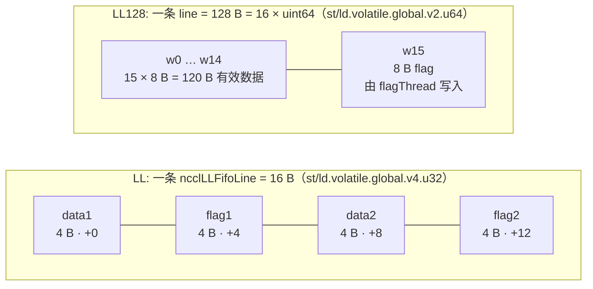

# 10 —— 通信原语：LL / LL128 协议

> 本文是 mini-nccl（从 NVIDIA NCCL 2.30.7 抽取的单机多卡最小通信库，只保留 AllReduce 全链路）的 feature 文档之一。
> 所有代码引用均指向本仓库源码，行号已逐条核对。
> 姊妹篇：[09-primitives-simple.md](./09-primitives-simple.md)（Simple 协议原语）。

## 本文覆盖的源文件

| 文件 | 作用 | 本文引用位置 |
| --- | --- | --- |
| [`src/device/prims_ll.h`](../src/device/prims_ll.h) | LL 协议的 `Primitives` 偏特化：`ncclLLFifoLine` 读写、flag spin、cleanup | 主题 1、2 |
| [`src/device/prims_ll128.h`](../src/device/prims_ll128.h) | LL128 协议的 `Primitives` 偏特化：128 B line、`flagThread`、寄存器 pipeline | 主题 3、4 |
| [`src/device/primitives.h`](../src/device/primitives.h) | `ProtoLL` / `ProtoLL128` 常量类、`PrimitivesWithoutDirect` | 主题 1、3、6 |
| [`src/device/op128.h`](../src/device/op128.h) | `load128`/`store128`（`ld/st.volatile.global.v2.u64`）、`fence_acq_rel_sys` | 主题 3、4 |
| [`src/include/device.h`](../src/include/device.h) | `union ncclLLFifoLine`、`NCCL_LL_*`、`NCCL_LL128_*` 全部常量 | 主题 1、2、3 |
| [`src/init.cc`](../src/init.cc) | `DEFAULT_LL_BUFFSIZE` / `DEFAULT_LL128_BUFFSIZE` 与 `NCCL_LL_BUFFSIZE` 等环境变量 | 主题 2、3 |
| [`src/graph/tuning.cc`](../src/graph/tuning.cc) | 三协议延迟/带宽建模、LL128 的启用条件 | 主题 5、6 |
| [`src/include/comm.h`](../src/include/comm.h) | `NCCL_LL128_THREAD_THRESHOLD` 等线程阈值 | 主题 6 |
| [`src/enqueue.cc`](../src/enqueue.cc) | 按协议折算 `chunkSize` | 主题 3、6 |
| [`src/transport/net.cc`](../src/transport/net.cc) | proxy 侧按 `NCCL_LL128_DATAELEMS` 位置校验 flag（网络路径） | 主题 3 |

---

## 主题 1：LL —— 把 flag 塞进数据里，用一次传输同时交付"数据"和"到达信号"

### ① 解决什么问题

Simple 协议的接收路径是**两段依赖**：先 spin 读对端的 `tail` 确认"数据就绪"（一次跨卡往返），再去读真正的数据（第二次跨卡往返）。对 4 KB 这种小消息，两次往返的固定延迟（NVLink 上约 0.6~3.4 µs，见 [`tuning.cc:176`](../src/graph/tuning.cc#L176)）完全主导了总时间，带宽根本用不上。

### ② 一句话本质

**LL（Low Latency）把 4 B 数据与 4 B flag 交替打包成 16 B 的 `ncclLLFifoLine`，用一条 `ld.volatile.global.v4.u32` 同时取回"数据 + flag"；接收方 spin 在同一个 16 B 单元上检查 `flag == 期望值`，于是"等信号"和"收数据"合并成一次跨卡事务 —— 代价是 16 B 里只有 8 B 是有效载荷，有效带宽 50%。**

### ③ 代码链路

1. 数据结构：[`device.h:85-98`](../src/include/device.h#L85) `union ncclLLFifoLine`。
2. 发送（一次 16 B 原子写）：[`prims_ll.h:162-166`](../src/device/prims_ll.h#L162) `storeLL` → `st.volatile.global.v4.u32`。
3. 接收（spin 同一 16 B）：[`prims_ll.h:116-130`](../src/device/prims_ll.h#L116) `readLL` → `ld.volatile.global.v4.u32`。
4. 期望 flag：[`prims_ll.h:64-69`](../src/device/prims_ll.h#L64) `recvFlag/sendFlag` → `NCCL_LL_FLAG(step + 1)`，[`device.h:109-116`](../src/include/device.h#L109)。
5. 主循环：[`prims_ll.h:252-324`](../src/device/prims_ll.h#L252) `LLGenericOp`。
6. 有效载荷比例：[`primitives.h:63-65`](../src/device/primitives.h#L63) `ProtoLL::calcBytePerStep()` 的 `/2 // Half is data`。

### ④ 关键代码逐行解读

[`device.h:85-98`](../src/include/device.h#L85)：

```cpp
union ncclLLFifoLine {
  /* Flags have to be *after* data, because otherwise, an incomplete receive
     from the network may receive the flag but not the data.
     Note this is assuming that either we receive contiguous chunks of data
     (sockets) or data is written with an atomicity of 8 bytes (IB/RDMA). */
  struct {
    uint32_t data1;
    uint32_t flag1;
    uint32_t data2;
    uint32_t flag2;
  };
  uint64_t v[2];
  int4 i4;
};
```

* 一条 line **16 B = 8 B 有效数据（`data1`+`data2`）+ 8 B flag（`flag1`+`flag2`）** —— 这就是"有效带宽 50%"的物理来源。
* **flag 必须放在 data 之后**：注释写得很清楚，网络路径下可能"flag 先到、数据后到"，如果 flag 在前面，接收方会误判为数据已完整。这是整个协议最关键的一条不变量。
* 之所以拆成 `data1/flag1/data2/flag2` 而不是 `data(8B)/flag(8B)`，是为了让**每个 8 B 字内部都自带校验**：一次 8 B 原子写保证 `data` 与 `flag` 同步到达（注释里的 "data is written with an atomicity of 8 bytes"）。

发送侧（[`prims_ll.h:162-166`](../src/device/prims_ll.h#L162)）：

```cpp
  __device__ void storeLL(union ncclLLFifoLine* dst, uint64_t val, uint32_t flag) {
    asm volatile("st.volatile.global.v4.u32 [%0], {%1,%2,%3,%4};" ::"l"(&dst->i4), "r"((uint32_t)val), "r"(flag),
                 "r"((uint32_t)(val >> 32)), "r"(flag)
                 : "memory");
  }
```

* `st.volatile.global.v4.u32` 是**一条指令写 16 B**（`v4.u32` = 4 个 32 位寄存器）。用单条宽指令而非 4 条 32 位写，是为了避免"写了 8 B、flag 还没写"的中间态被对端观察到。
* 参数顺序 `%1=val低32位, %2=flag, %3=val高32位, %4=flag` —— **两个 flag 写的是同一个值**，因为一条 line 的两个 8 B 字是同一次传输的两个部分，它们共享同一个 flag。
* `volatile` 保证绕过 L1、直接落到对端可见的存储层次。

接收侧（[`prims_ll.h:116-130`](../src/device/prims_ll.h#L116)）：

```cpp
  __device__ uint64_t readLL(int offset, int i) {
    union ncclLLFifoLine* src = recvPtr(i) + offset;
    uint32_t flag = recvFlag(i);
    uint32_t data1, flag1, data2, flag2;
    int spins = 0;
    do {
      asm volatile("ld.volatile.global.v4.u32 {%0,%1,%2,%3}, [%4];"
                   : "=r"(data1), "=r"(flag1), "=r"(data2), "=r"(flag2)
                   : "l"(&src->i4)
                   : "memory");
      if (checkAbort(abort, 1, spins)) break;
    } while ((flag1 != flag) || (flag2 != flag));
    uint64_t val64 = data1 + (((uint64_t)data2) << 32);
    return val64;
  }
```

* **注意这里没有任何 `tail`/`head` 等待**！接收方直接 spin 在数据本身上。`while ((flag1 != flag) || (flag2 != flag))` 就是全部的"同步"。
* `recvFlag(i) = NCCL_LL_FLAG(recvStep[i] + 1)`（[`prims_ll.h:64-66`](../src/device/prims_ll.h#L64)）：期望值是"当前步号 + 1"，每做一次 op 就 +1。
* 读到的 `data1/data2` 直接拼成 8 B 结果返回 —— **数据和信号在同一次 16 B 事务里到达**。

对比 Simple（[09](./09-primitives-simple.md) 主题 3）：Simple 是 `while (connStepCache < step + StepPerSlice)` 然后**另外**去 `connEltsFifo + (step%8)*stepSize` 读数据；LL 把这两步合成一步。

### LL 与 LL128 的线上布局



（LL 的 flag 在 data **之后**；LL128 的 flag 是每条 128 B line 的**最后一个** 8 B 字，同样遵循"flag 在 data 后"的不变量。）

### ⑤ 收益（定量）

* **延迟**：NVLink 上 ring 的硬件延迟建模值 LL = **0.6 µs**，LL128 = 1.9 µs，Simple = **3.4 µs**（[`tuning.cc:176`](../src/graph/tuning.cc#L176) `/* Tree (LL/LL128/Simple), Ring (LL/LL128/Simple)*/`）。Tree 上是 0.6 / 1.25 / 4.0 µs。LL 相比 Simple 快约 **5.7×**（ring）。PCI 上是 1.0 / 2.5 / 5.7 µs（[`tuning.cc:182`](../src/graph/tuning.cc#L182)），跨节点 NET 上 2.7 / 4.0 / 14.0 µs（[`tuning.cc:188`](../src/graph/tuning.cc#L188)）。
* **带宽代价**：`ProtoLL::calcBytePerStep()` 要 `/2`（[`primitives.h:63-65`](../src/device/primitives.h#L63)），且调优模型对 LL ring 直接 `busBw * .5` 并用 `llMaxBw` 封顶（[`tuning.cc:344`](../src/graph/tuning.cc#L344)）；`llMaxBw` 在 Hopper-N1 上只有 **141 GB/s**，Blackwell-N1 是 282 GB/s（[`tuning.cc:198-199`](../src/graph/tuning.cc#L198)）。tree 上更狠：`busBw * 1.0/3.8`（[`tuning.cc:349`](../src/graph/tuning.cc#L349)）。
* **结论**：LL 只在"延迟项主导"的小消息上赢；消息一大，50% 的带宽损失和 `llMaxBw` 封顶立刻让它输给 Simple。

### ⑥ 面试考点

**Q1：LL 为什么能做到低延迟？**
A：Simple 的接收是"先 poll 对端 tail（一次跨卡往返）→ 再读数据（第二次往返）"两段串行依赖。LL 把 flag 与数据打包进同一个 16 B 单元，接收方 spin 的就是数据本身（[`prims_ll.h:121-127`](../src/device/prims_ll.h#L121)），"等信号"和"取数据"合并成一次跨卡事务，省掉一整次往返。

**Q2：为什么 flag 必须在 data 之后？**
A：[`device.h:86-88`](../src/include/device.h#L86) 的注释：网络传输可能只交付一部分字节（socket 是连续字节流、IB/RDMA 保证 8 B 原子写）。如果 flag 在 data 前面，可能出现"flag 已到、数据未到"的窗口，接收方会读到半截数据。LL128 把 flag 放在 128 B line 的最后一个 8 B 字（[`prims_ll128.h:287`](../src/device/prims_ll128.h#L287)），遵循同一原则。

**Q3：为什么用 `v4.u32`（16 B）而不是两次 8 B 写？**
A：一次 `st.volatile.global.v4.u32` 是单条指令，对端不会观察到"只写了前 8 B"的中间态。拆成两次写虽然各自是 8 B 原子的，但两次写之间没有顺序保证，可能先看到第二个 flag 后看到第一个 data。

**Q4：LL 的有效带宽为什么恰好是 50%？**
A：一条 `ncclLLFifoLine` 16 B 里，`data1`(4 B) + `data2`(4 B) = 8 B 有效数据，`flag1`(4 B) + `flag2`(4 B) = 8 B flag（[`device.h:90-95`](../src/include/device.h#L90)）。见 `ProtoLL::calcBytePerStep()` 的 `/2 // Half is data`（[`primitives.h:63-65`](../src/device/primitives.h#L63)）与 `calcBytePerGrain()` 的注释 "One 16-byte line has 8-bytes of data"（[`primitives.h:67-69`](../src/device/primitives.h#L67)）。

**Q5：LL 下接收方完全不需要 head/tail 吗？**
A：不是完全不需要，而是**它们不在数据交付的关键路径上**。数据可用性完全由 in-band flag 决定（所以延迟低）；`head`/`tail` 仍然承担 FIFO 槽位信用（发送方 `waitSend` 里的 `sendConnHeadCache + NCCL_STEPS < sendConnHead + 1`，[`prims_ll.h:81-97`](../src/device/prims_ll.h#L81)）与 proxy 侧的 `connFifo.size` 同步。因为槽位数有 `NCCL_STEPS = 8`，这个信用往返是深度流水的。

---

## 主题 2：LL 的 flag 递增、cleanup 与缓冲区常量

### ① 解决什么问题

flag 只有 32 位，而通信是长跑（`step` 单调递增到 2^64）。如果 flag 取固定值（0/1 翻转），接收方无法区分"这是新数据的 flag"还是"上一轮残留的 flag" —— 经典的 ABA 问题。同时 flag 绕回时可能撞上 buffer 里残留的旧 flag 值。

### ② 一句话本质

**flag 取 `step + 1`（单调递增，永不重复，彻底消除 ABA）；当 `sendStep` 的低位即将绕回时（`& NCCL_LL_CLEAN_MASK == NCCL_LL_CLEAN_MASK`），插入一次 cleanup，把整片 slice 的 flag 全部重写一遍，防止残留旧值被误判为新数据。**

### ③ 代码链路

1. flag 计算：[`prims_ll.h:64-69`](../src/device/prims_ll.h#L64) + [`device.h:109-116`](../src/include/device.h#L109)。
2. cleanup：[`prims_ll.h:107-114`](../src/device/prims_ll.h#L107) `incSend`。
3. mask 常量与 `static_assert`：[`device.h:109-118`](../src/include/device.h#L109)。
4. 缓冲区大小：[`init.cc:824-830`](../src/init.cc#L824) + [`init.cc:836-843`](../src/init.cc#L836)。
5. `stepLines` 计算：[`prims_ll.h:358`](../src/device/prims_ll.h#L358)。

### ④ 关键代码逐行解读

[`device.h:107-118`](../src/include/device.h#L107)：

```cpp
#define NCCL_LL_MAX_NTHREADS 512
#define NCCL_LL_LINES_PER_THREAD 8
#ifdef TEST_LL_CLEANUP
#define NCCL_LL_CLEAN_MASK 0x078 // Set to 0x100 to disable cleanup
#define NCCL_LL_FLAG_MAX 0x100
#define NCCL_LL_FLAG(a) ((uint32_t)((a) % NCCL_LL_FLAG_MAX))
#else
#define NCCL_LL_CLEAN_MASK 0x7ffffff8
#define NCCL_LL_FLAG(a) ((uint32_t)(a))
#endif
// 确保该 clean mask 将持续 至少 NCCL_NSTEPS
static_assert(NCCL_LL_CLEAN_MASK % NCCL_STEPS == 0, "Invalid NCCL_LL_CLEAN_MASK value");
```

* 默认（非测试）路径下 `NCCL_LL_FLAG(a) = (uint32_t)a`，即 flag 就是 `step+1` 的低 32 位 —— **单调递增，2^32 次 op 内不重复**，不存在 ABA。
* `NCCL_LL_CLEAN_MASK = 0x7ffffff8`（低 3 位为 0）：当 `sendStep` 的低 31 位全部为 1（即将在第 32 位绕回）时触发 cleanup。
* `static_assert(NCCL_LL_CLEAN_MASK % NCCL_STEPS == 0)`：保证 cleanup 的触发点对齐到 slot 边界，不会在一个 chunk 中间触发。
* `TEST_LL_CLEANUP` 是人为把 flag 空间压到 0x100 的测试开关，用来强制验证 cleanup 逻辑。

[`prims_ll.h:107-114`](../src/device/prims_ll.h#L107)：

```cpp
  inline __device__ void incSend(int i, int offset) {
    // LL Cleanup : 写入 所有 标志 在 ... 中 slice to 确保 we don't have
    // 数据 corruption 当 标志 循环 over.
    if ((sendStep[i] & NCCL_LL_CLEAN_MASK) == NCCL_LL_CLEAN_MASK) {
      for (int o = offset; o < stepLines; o += nthreads) storeLL(sendPtr(i) + o, 0, sendFlag(i));
    }
    sendStep[i]++;
  }
```

* 触发时**把本 slice 剩余的所有 line 都写一遍**（数据填 0，flag 写当前值）。这样做的效果是：这些位置被写入了当前 flag，而接收方期望的是 `flag+1`，所以它们不会被误判为"已到达"。
* `o += nthreads` 让所有线程并行清理。
* 注意 cleanup 写的数据是 0，但**不会污染正常数据**：cleanup 只发生在 flag 空间绕回的那一次，而这些 line 在下一次真正写入前不会被读取（因为 flag 不匹配）。

缓冲区常量（[`init.cc:824-843`](../src/init.cc#L824)）：

```cpp
#define DEFAULT_LL_BUFFSIZE \
  (NCCL_LL_LINES_PER_THREAD * NCCL_LL_MAX_NTHREADS * NCCL_STEPS * sizeof(union ncclLLFifoLine))
#define DEFAULT_LL128_BUFFSIZE (NCCL_LL128_ELEMS_PER_THREAD * NCCL_LL128_MAX_NTHREADS * NCCL_STEPS * sizeof(uint64_t))
#define DEFAULT_BUFFSIZE (1 << 22) /* 4MiB */
NCCL_PARAM(BuffSize, "BUFFSIZE", -2);
NCCL_PARAM(LlBuffSize, "LL_BUFFSIZE", -2);
NCCL_PARAM(Ll128BuffSize, "LL128_BUFFSIZE", -2);
...
static ncclResult_t computeBuffSizes(struct ncclComm* comm) {
  int64_t envs[NCCL_NUM_PROTOCOLS] = {ncclParamLlBuffSize(), ncclParamLl128BuffSize(), ncclParamBuffSize()};
  int defaults[NCCL_NUM_PROTOCOLS] = {DEFAULT_LL_BUFFSIZE, DEFAULT_LL128_BUFFSIZE, DEFAULT_BUFFSIZE};

  for (int p = 0; p < NCCL_NUM_PROTOCOLS; p++) {
    comm->buffSizes[p] = envs[p] != -2 ? envs[p] : defaults[p];
  }
```

（数组下标对应 `NCCL_PROTO_LL=0, NCCL_PROTO_LL128=1, NCCL_PROTO_SIMPLE=2`，见 [`nccl_tuner.h:43-46`](../src/include/plugin/nccl_tuner.h#L43)。）

| 常量 | 表达式 | 数值 |
| --- | --- | --- |
| `DEFAULT_LL_BUFFSIZE` | `8 × 512 × 8 × 16 B` | **512 KiB** |
| `DEFAULT_LL128_BUFFSIZE` | `120 × 640 × 8 × 8 B` | **4,915,200 B ≈ 4.69 MiB** |
| `DEFAULT_BUFFSIZE`（Simple） | `1 << 22` | **4 MiB** |

LL 的每 step 容量（[`prims_ll.h:358`](../src/device/prims_ll.h#L358)）：

```cpp
      stepLines(ncclShmem.comm.buffSizes[NCCL_PROTO_LL] / NCCL_STEPS / sizeof(ncclLLFifoLine)) {
```

= 512 KiB / 8 / 16 B = **4096 条 line / step**，即 **64 KiB 线上字节 = 32 KiB 有效数据 / step**。
恰好 `NCCL_LL_LINES_PER_THREAD(8) × NCCL_LL_MAX_NTHREADS(512) = 4096` —— **一个 step 的 line 数正好是最大线程数 × 每线程 line 数**，这不是巧合：`DEFAULT_LL_BUFFSIZE` 就是这么倒推出来的，保证满线程时一次 op 恰好吃完一个 step。

### ⑤ 收益

* flag 单调递增使 ABA 在 2^32 次 op 内不可能发生，无需额外的"代际（generation）"字段。
* cleanup 只在每 2^31 次 op 触发一次，成本可忽略，却彻底堵住了 flag 绕回时的误判。
* buffer 大小与最大线程数精确匹配，避免"线程吃不完一个 step"或"一个 step 不够线程分"的浪费。

### ⑥ 面试考点

**Q1：LL 的 flag 为什么是 `step + 1` 而不是 0/1 翻转？**
A：0/1 翻转会在"接收方还没读走上一轮数据、发送方已经写了新一轮"时产生 ABA（新旧 flag 相同，接收方误判为新数据）。取 `step+1`（[`prims_ll.h:64-66`](../src/device/prims_ll.h#L64)、[`device.h:115`](../src/include/device.h#L115)）后，每次 op 的 flag 都不同，任何残留的旧 flag 都不可能等于期望值。

**Q2：`NCCL_LL_CLEAN_MASK` 解决什么问题？**
A：flag 是 32 位，`step` 是 64 位，`NCCL_LL_FLAG(a)` 取低 32 位。当 `sendStep` 绕回到与 2^31 步之前相同的低 32 位时，buffer 里可能残留着那个旧 flag 值。cleanup 在绕回前把整片 slice 的 flag 重写成当前值（[`prims_ll.h:110-112`](../src/device/prims_ll.h#L110)），使残留值不再等于"下一步的期望值"。

**Q3：`static_assert(NCCL_LL_CLEAN_MASK % NCCL_STEPS == 0)` 为什么必要？**
A：cleanup 必须发生在 slot 边界上。如果 mask 不是 `NCCL_STEPS = 8` 的倍数，cleanup 可能在一个 chunk 的半途触发，导致同一批数据里一部分 line 被 cleanup 写 0 而另一部分已经写了真数据。

**Q4：LL 的 buffer 为什么要按 `LINES_PER_THREAD × MAX_NTHREADS × STEPS` 倒推？**
A：保证"满线程时一次 op 恰好消耗一个 step 的全部 line"。若 buffer 更大，一次 op 需要多轮循环且 slot 利用率不均；若更小，多余线程会空转。LL128 的 `NCCL_LL128_ELEMS_PER_THREAD=120 × NCCL_LL128_MAX_NTHREADS=640` 同理（[`device.h:124-126`](../src/include/device.h#L124)）。

**Q5：LL 的 `waitSend` 里为什么有 `NCCL_LL_CLEAN_MASK` 的特殊分支？**
A：[`prims_ll.h:88-93`](../src/device/prims_ll.h#L88)：cleanup 时要把 `connFifo[].size` 设为**整个 slice 的字节数**（`stepLines * sizeof(ncclLLFifoLine)`）而不是本次的实际 `nbytes`，因为 cleanup 会写入本 slice 的全部 line，proxy 必须按全量去发送，否则对端收不齐。

---

## 主题 3：LL128 —— 用 128 B 事务粒度换取 93.75% 有效带宽

### ① 解决什么问题

LL 的 50% 有效带宽在小消息上无所谓（延迟主导），但一旦消息超过几十 KB，带宽损失就变成主要矛盾。需要一种"仍然靠 in-band flag 保持低延迟，但 flag 占比小得多"的协议。

### ② 一句话本质

**LL128 把 flag 的粒度从"每 8 B 数据配 8 B flag"放大到"每 120 B 数据配 8 B flag"：一条 128 B 的 line 由 16 个 `uint64` 组成，前 15 个是数据、最后 1 个是 flag；有效带宽 15/16 = 93.75%。**

### ③ 代码链路

1. 常量：[`device.h:120-128`](../src/include/device.h#L120)。
2. 128 B 原子访存：[`op128.h:20-26`](../src/device/op128.h#L20) `load128/store128`（`ld/st.volatile.global.v2.u64`）。
3. flag 线程判定：[`prims_ll128.h:381`](../src/device/prims_ll128.h#L381) `flagThread((tid % 8) == 7)`。
4. 每 warp/每线程粒度：[`prims_ll128.h:300-302`](../src/device/prims_ll128.h#L300)。
5. 发送时替换 flag 字：[`prims_ll128.h:279-296`](../src/device/prims_ll128.h#L279)。
6. 有效载荷比例：[`primitives.h:78-80`](../src/device/primitives.h#L78)。
7. host 侧折算：[`enqueue.cc:2299`](../src/enqueue.cc#L2299)、[`enqueue.h:25`](../src/include/enqueue.h#L25)。

### ④ 关键代码逐行解读

[`device.h:120-128`](../src/include/device.h#L120)：

```cpp
#define NCCL_LL128_LINESIZE 128
#define NCCL_LL128_LINEELEMS (NCCL_LL128_LINESIZE / sizeof(uint64_t))
#define NCCL_LL128_DATAELEMS (NCCL_LL128_LINEELEMS - 1)

#define NCCL_LL128_MAX_NTHREADS 640
#define NCCL_LL128_ELEMS_PER_THREAD 120

#define NCCL_LL128_SHMEM_ELEMS_PER_THREAD 8
#define NCCL_LL128_SHMEM_SIZE (NCCL_LL128_SHMEM_ELEMS_PER_THREAD * NCCL_LL128_MAX_NTHREADS)
```

* `NCCL_LL128_LINEELEMS = 128 / 8 = 16` 个 `uint64`；`NCCL_LL128_DATAELEMS = 15`。
* **120 B 数据 + 8 B flag = 128 B**，有效带宽 `15/16 = 93.75%`。
* `NCCL_LL128_ELEMS_PER_THREAD = 120`（不是 128）：每个线程"名义上"负责 120 个 `uint64`，也就是 15/16 的比例同样体现在 buffer 预算里（[`init.cc:826`](../src/init.cc#L826)）。

flag 线程（[`prims_ll128.h:376-382`](../src/device/prims_ll128.h#L376)）：

```cpp
    : redOp(redOpArg), tid(tid), nthreads(nthreads), wid(tid % WARP_SIZE), warp(tid / WARP_SIZE),
      warpInBlock(threadIdx.x / WARP_SIZE), flagThread((tid % 8) == 7), group(group),
      stepSize(ncclShmem.comm.buffSizes[NCCL_PROTO_LL128] / NCCL_STEPS / sizeof(uint64_t)) {
```

* `flagThread = (tid % 8) == 7`：每个 warp 里第 7、15、23、31 号 lane 是 flag 线程，**每 8 个 lane 负责一条 128 B line**。
* 为什么是每 8 个 lane：每个线程用 `load128/store128` 处理 **16 B（2 个 `uint64`）**，8 lane × 16 B = **128 B 恰好一条 line**。
* 一次 `recvReduceSendCopy` 里 `u = 0,2,4,6` 四轮，每轮覆盖 `WARP_SIZE × 16 B = 512 B`，所以**一个 warp 覆盖 4 × 512 B = 2048 B = 16 条 128 B line**；4 个 flag 线程 × 4 轮 = 16 个 flag 字，正好一条 line 一个。
* flag 线程落在每条 line 的**最后 16 B** 上；`store128(ptr, v[u], flagThread ? flag : v[u+1])` 把**第二个 8 B 字**（即 offset +120 处的 `w15`）替换成 flag —— 这与 LL 的"flag 在 data 之后"完全同构。
* 注：[`prims_ll128.h:18`](../src/device/prims_ll128.h#L18) 还保留了 `#define NCCL_LL128_FLAGTHREAD (NCCL_LL128_LINEELEMS - 1)`（= 15），本版本中它只是历史遗留的定义，实际判定用的是上面的 `(tid % 8) == 7`。

发送侧（[`prims_ll128.h:279-296`](../src/device/prims_ll128.h#L279)）：

```cpp
    /************************ Send **************************/
    if (SEND) {
      for (int i = 1; i < MaxSend && i < fan.nsend(); i++) {
        uint64_t flag = sendFlag(i);
        uint64_t* ptr = sendPtr(i) + ll128Offset;
        NVCC_PRAGMA_UNROLL_AUTO
        for (int u = 0; u < ELEMS_PER_THREAD; u += 2) {
          store128(ptr + u * WARP_SIZE, v[u], flagThread ? flag : v[u + 1]);
        }
      }
      uint64_t flag = sendFlag(0);
      uint64_t* ptr = sendPtr(0) + ll128Offset;
      NVCC_PRAGMA_UNROLL_AUTO
      for (int u = 0; u < ELEMS_PER_THREAD; u += 2) {
        store128(ptr + u * WARP_SIZE, v[u], flagThread ? flag : v[u + 1]);
      }
    }
```

* `sendFlag(i) = sendStep[i] + 1`（[`prims_ll128.h:68-70`](../src/device/prims_ll128.h#L68)）—— **LL128 的 flag 是 64 位且直接等于 step+1，连 32 位绕回都不用考虑**，所以 LL128 不需要 LL 那套 `NCCL_LL_CLEAN_MASK` cleanup。
* `ptr + u * WARP_SIZE`：`u` 每次 +2（一对 `uint64` = 16 B），`u * WARP_SIZE` 个 `uint64` = `u * 32 * 8 = u * 256` 字节，即每轮覆盖一整段 512 B；`u = 0,2,4,6` 四轮共覆盖 **2048 B**，正好等于 `WireWordPerSlice(256) × 8 B`。再叠加 `2*wid` 的 16 B 基址偏移（`wireOffset = WireWordPerSlice * warp + 2 * wid`，[`prims_ll128.h:310`](../src/device/prims_ll128.h#L310)）。

接收侧的 spin（[`prims_ll128.h:203-214`](../src/device/prims_ll128.h#L203)）：

```cpp
      do {
        needReload = false;
        NVCC_PRAGMA_UNROLL_AUTO
        for (int u = 0; u < ELEMS_PER_THREAD; u += 2) {
          load128(ptr + u * WARP_SIZE, vr[u], vr[u + 1]);
          needReload |= flagThread && (vr[u + 1] != flag);
        }
        needReload &= (0 == checkAbort(abort, 1, spins));
      } while (__any_sync(WARP_MASK, needReload));

      NVCC_PRAGMA_UNROLL_AUTO
      for (int u = 0; u < ELEMS_PER_THREAD; u += 2) load128(ptr + u * WARP_SIZE, vr[u], vr[u + 1]);
```

* **只有 flag 线程检查 flag**（`flagThread &&`），然后用 `__any_sync(WARP_MASK, needReload)` 在 warp 内做一次归约 —— 一个 warp 只要有一条 line 没到，整个 warp 就重来。这比"每个线程都查"省了 3/4 的 flag 比较，也比"每个线程各查各的"避免了 warp 内发散。
* 退出循环后**再无条件重载一次**：因为 `needReload` 是在上一轮加载的数据上判断的，退出时寄存器里的数据正是"flag 已匹配"的那一轮，语义上是正确的；但为了覆盖"循环内部最后一次 load 之后 flag 才更新"的边界，源码选择再读一遍确保拿到最新数据。
* 这里的 `flag` 是 64 位完整比较（`vr[u+1] != flag`），不存在 LL 的 32 位回绕问题。

每 warp / 每线程的数据量（[`prims_ll128.h:300-302`](../src/device/prims_ll128.h#L300)）：

```cpp
  static constexpr int WireWordPerSlice = WARP_SIZE * NCCL_LL128_SHMEM_ELEMS_PER_THREAD;
  static constexpr int DataEltPerSlice =
    (WireWordPerSlice - WireWordPerSlice / NCCL_LL128_LINEELEMS) * (sizeof(uint64_t) / sizeof(T));
```

* `WireWordPerSlice = 32 × 8 = 256` 个 `uint64` = **2048 B 线上字节 / warp-slice**。
* `DataEltPerSlice = (256 - 256/16) × (8/sizeof(T)) = 240 × (8/sizeof(T))`：
  * `T = float`（4 B）→ 480 个元素 = 1920 B；
  * `T = double` / `uint64`（8 B）→ 240 个元素 = 1920 B。
  * 两种情况下有效载荷都是 **1920 B / 2048 B = 93.75%**。
* host 侧 `NCCL_LL128_ALIGNMENT_PER_WARP 480`（[`enqueue.h:25`](../src/include/enqueue.h#L25)）正是 `T=float` 时的 `DataEltPerSlice`。

host 侧的 chunk 折算（[`enqueue.cc:2299`](../src/enqueue.cc#L2299)）：

```cpp
  if (info->protocol == NCCL_PROTO_LL128) chunkSize = (chunkSize / NCCL_LL128_LINEELEMS) * NCCL_LL128_DATAELEMS;
```

网络路径上 proxy 也按同样规则校验 flag（[`net.cc:1382-1386`](../src/transport/net.cc#L1382)）：

```cpp
              int nFifoLines = DIVUP(connFifo[buffSlot].size, sizeof(uint64_t) * NCCL_LL128_LINEELEMS);
                if (lines[i * NCCL_LL128_LINEELEMS + NCCL_LL128_DATAELEMS] != flag) {
```

即每条 line 的第 `NCCL_LL128_DATAELEMS`（=15）个 `uint64` 就是 flag —— **与 device 侧的 `flagThread` 写入位置完全一致**。

### ⑤ 收益（定量）

| 指标 | LL | LL128 |
| --- | --- | --- |
| line 大小 | 16 B | 128 B |
| 有效数据 / line | 8 B | 120 B |
| 理论有效带宽 | **50%** | **15/16 = 93.75%** |
| flag 位宽 | 32 bit（有回绕，需 cleanup） | 64 bit（`step+1`，无回绕） |
| 检查 flag 的线程 | 全部线程（每人查自己的 line） | 每 8 lane 一个 `flagThread`（1/8 的线程） |
| 调优模型带宽系数 | `× 0.5` 且 `llMaxBw` 封顶（ring，[`tuning.cc:344`](../src/graph/tuning.cc#L344)）；tree `× 1/3.8`（[`tuning.cc:349`](../src/graph/tuning.cc#L349)） | `× 0.92`（ring，[`tuning.cc:345-346`](../src/graph/tuning.cc#L345)）；tree 单机 `× 7/9`、跨机 `× 120/128`（[`tuning.cc:350-352`](../src/graph/tuning.cc#L350)） |
| NVLink ring 延迟 | 0.6 µs | 1.9 µs |
| per-channel 带宽上限 | — | Volta/Ampere 20.0，Hopper 36.7，Blackwell 40.0 GB/s（[`tuning.cc:201-207`](../src/graph/tuning.cc#L201)） |

注意：理论 15/16 = 93.75%，但调优模型对 ring 取的是经验值 **0.92**（[`tuning.cc:346`](../src/graph/tuning.cc#L346) 注释写的就是 `0.92 /*120.0/128.0*/`），另外 LL128 还有一个**每 channel 带宽上限** `perChMaxRingLL128Bws`，这在多 channel 场景下才是真正的瓶颈。

### ⑥ 面试考点

**Q1：LL128 的 "128" 和 "128" 分别指什么？**
A：`NCCL_LL128_LINESIZE = 128` 字节（[`device.h:120`](../src/include/device.h#L120)）是**一条 line 的大小**，也就是 flag 的粒度：每 128 B 配 8 B flag。它同时也是一个 warp 用 4 条 `store128`（每条 16 B × 8 lane）覆盖的典型事务块。

**Q2：为什么是 120 B 数据而不是 124 B 或 127 B？**
A：因为 line 被定义为 16 个 `uint64`（`NCCL_LL128_LINEELEMS = 128/8 = 16`，[`device.h:121`](../src/include/device.h#L121)），flag 必须占整一个 8 B 字才能保证"flag 的写入是原子的、且不撕裂数据字"。取走 1 个完整的 `uint64` 剩 15 个 = 120 B。

**Q3：flagThread 为什么是 `(tid % 8) == 7`？**
A：每个线程用 `load128/store128` 处理 16 B；8 个 lane × 16 B = 128 B = 一条 line。取 `tid % 8 == 7`（每条 line 的**最后一个** lane）正好让 flag 落在 line 的**最后 8 B**，满足"flag 在 data 之后"的不变量。

**Q4：LL128 为什么不需要 LL 的 cleanup？**
A：LL128 的 flag 是 `uint64` 类型、直接等于 `step + 1`（[`prims_ll128.h:65-70`](../src/device/prims_ll128.h#L65)），64 位单调递增，在可预见的时间尺度内不存在回绕，因此不需要 `NCCL_LL_CLEAN_MASK` 那套机制。源码里 `NCCL_LL128_*` 也确实没有对应的 clean mask 常量。

**Q5：`__any_sync(WARP_MASK, needReload)` 的作用？**
A：只有 flag 线程（`tid%8==7`）会置 `needReload`，但整个 warp 需要知道"是否还要重读"。`__any_sync` 在 warp 内做一次 OR 归约并同步，保证 warp 内所有 lane 对"是否退出"达成一致，避免 warp 发散（[`prims_ll128.h:211`](../src/device/prims_ll128.h#L211)）。

---

## 主题 4：LL128 的 `recvReduceSendCopy` —— 寄存器 pipeline 与 shmem 中转

### ① 解决什么问题

LL128 一次要搬 120 B 数据 + 8 B flag，如果像 LL 那样"读一条 → 规约 → 写一条"，寄存器里同时要放源数据、对端数据、结果，压力很大；而且用户 buffer 不一定 16 B 对齐，无法直接用 `load128`。

### ② 一句话本质

**每个线程把 `NCCL_LL128_SHMEM_ELEMS_PER_THREAD = 8` 个 `uint64`（64 B）直接放进寄存器数组 `regs[]`，全程在寄存器里完成"读取对端 → 规约 → 写出"，不经过 FIFO 中转；地址不对齐时才借 warp 专属的 shared memory scratch 做一次 16 B 对齐中转。**

### ③ 代码链路

1. 主函数：[`prims_ll128.h:191-298`](../src/device/prims_ll128.h#L191) `recvReduceSendCopy`。
2. 源数据入寄存器：[`prims_ll128.h:106-150`](../src/device/prims_ll128.h#L106) `loadRegsBegin`（对齐路径 / shmem 中转路径）。
3. 寄存器洗牌：[`prims_ll128.h:152-159`](../src/device/prims_ll128.h#L152) `loadRegsFinish`。
4. 写回：[`prims_ll128.h:161-187`](../src/device/prims_ll128.h#L161) `storeRegs`。
5. 外层按 slice 循环：[`prims_ll128.h:304-341`](../src/device/prims_ll128.h#L304) `GenericOp`。
6. scratch 分配：[`device.h:562-568`](../src/include/device.h#L562) `ncclShmemScratchWarpSize`、[`common.h:88-90`](../src/device/common.h#L88) `ncclScratchForWarp`。

### ④ 关键代码逐行解读

[`prims_ll128.h:106-122`](../src/device/prims_ll128.h#L106)（对齐路径，直接进寄存器）：

```cpp
  template <int WordPerThread>
  __device__ __forceinline__ void loadRegsBegin(uint64_t (&regs)[WordPerThread], T const* src, int eltN) {
    constexpr int EltPer16B = 16 / sizeof(T);
    if (reinterpret_cast<uintptr_t>(src) % 16 == 0) {
      /* We are aligned to 16 bytes, so load directly to registers no shmem.
       * Flag threads load half as much data which gets shuffled to the even
       * registers during Finish. The point of splitting into two phases is to
       * defer that shuffle, which incurs a dependency stall, until after other
       * memops are launched by the caller.
       */
      NVCC_PRAGMA_UNROLL_AUTO
      for (int g = 0; g < WordPerThread / 2; g++) {
        int ix = g * WARP_SIZE - 4 * (g / 2) + wid - (g % 2) * (wid / 8);
        if (!flagThread || g % 2 == 0) {
          if (ix * EltPer16B < eltN) load128((uint64_t*)(src + ix * EltPer16B), regs[2 * g + 0], regs[2 * g + 1]);
        }
      }
    } else {
```

* `if (!flagThread || g % 2 == 0)`：**flag 线程只装一半数据**（偶数 `g`），因为它负责的那 16 B 里有一个字要被 flag 覆盖，装进来也没用。
* `ix = g * WARP_SIZE - 4 * (g / 2) + wid - (g % 2) * (wid / 8)`：这个下标公式是在做"**跳过 flag 字的重排**"—— 让 8 个 lane 的连续 16 B 中，第 8 个（flag 字的后半）不被当成数据取用。
* 注释点明了**两阶段的关键原因**：把寄存器洗牌（`Finish` 里的 `regs[2g] = regs[2g-1]`）推迟到"其他 memops 已经发出之后"，从而把这次依赖停顿（dependency stall）藏在访存延迟里。

[`prims_ll128.h:152-159`](../src/device/prims_ll128.h#L152)：

```cpp
  template <int WordPerThread>
  __device__ __forceinline__ void loadRegsFinish(uint64_t (&regs)[WordPerThread]) {
    // Move 数据 脱离 标志 寄存器 入到 vacant 寄存器.
    NVCC_PRAGMA_UNROLL_AUTO
    for (int g = 1; g < WordPerThread / 2; g += 2) {
      if (flagThread) regs[2 * g] = regs[2 * g - 1];
    }
  }
```

* 把 flag 线程寄存器里"被 flag 位置挤占"的数据搬到空出来的寄存器 —— 这是在**寄存器内部**完成的，零访存开销。

`GenericOp` 的调度顺序（[`prims_ll128.h:319-330`](../src/device/prims_ll128.h#L319)）：

```cpp
    while (nelem > 0) {
      const int eltInSlice = min(nelem, DataEltPerSlice);
      uint64_t regs[NCCL_LL128_SHMEM_ELEMS_PER_THREAD];
      if (SRC) loadRegsBegin(regs, srcPtr, eltInSlice);
      recvReduceSendCopy<NCCL_LL128_SHMEM_ELEMS_PER_THREAD, RECV, SEND, SrcBuf, DstBuf>(regs, wireOffset, postOp);
      if (DST) storeRegs(dstPtr, regs, eltInSlice);

      wireOffset += WireWordPerSlice * nwarps;
      srcPtr += DataEltPerSlice * nwarps;
      dstPtr += DataEltPerSlice * nwarps;
      nelem -= DataEltPerSlice * nwarps;
    }
```

* `wireOffset = WireWordPerSlice * warp + 2 * wid`（[`prims_ll128.h:310`](../src/device/prims_ll128.h#L310)）：**wire 侧按 `uint64` 计数（含 flag 位置），用户侧按 `T` 计数**。这就是线上 2048 B 与用户侧 1920 B 之间 15/16 差额的具体体现。
* `srcPtr += DataEltPerSlice * nwarps`：用户指针按"有效元素"前进；`wireOffset` 按"线上字"前进。两者步调不同，正是 flag 开销的记账方式。
* 在 `recvReduceSendCopy` 内部（[`prims_ll128.h:218-229`](../src/device/prims_ll128.h#L218)）`loadRegsFinish(v)` 被**故意推迟到第一个对端数据 spin 之后**，注释写明："By deferring 寄存器 shuffle 这里've overlapped spinning on 第一 对等端's 数据 with 内存 loads of 源 数据."

shmem 中转路径（[`prims_ll128.h:123-149`](../src/device/prims_ll128.h#L123)）：

```cpp
    } else {
      // 不 已对齐. Stage the smallest 16 字节 已对齐 区域 subsuming the
      // 缓冲区 into shmem.
      int misalignment = reinterpret_cast<uintptr_t>(src) % 16;
      uint64_t* src8 = reinterpret_cast<uint64_t*>(reinterpret_cast<uintptr_t>(src) & -uintptr_t(16));
      uint64_t* shm8 = shmemCvtPtr((uint64_t*)ncclScratchForWarp(warpInBlock));
      NVCC_PRAGMA_UNROLL_AUTO
      for (int g = 0; g < WordPerThread / 2; g++)
        if ((g * WARP_SIZE + wid) * 16 < misalignment + eltN * sizeof(T))
          load128(src8 + 2 * (g * WARP_SIZE + wid), regs[2 * g + 0], regs[2 * g + 1]);
      NVCC_PRAGMA_UNROLL_AUTO
      for (int g = 0; g < WordPerThread / 2; g++)
        storeShmem128(shm8 + 2 * (g * WARP_SIZE + wid), regs[2 * g + 0], regs[2 * g + 1]);
      __syncwarp();
      // Now 加载 from shmem stage to regs. Preserve 相同 前-shuffled 布局
      T* shm = (T*)shm8 + misalignment / sizeof(T);
      ...
    }
```

* 未对齐时：先把覆盖整块数据的最小 16 B 对齐区域用 `load128` 搬进寄存器，再 `storeShmem128` 落到 warp 专属 scratch（`ncclScratchForWarp(warpInBlock)`，[`common.h:88-90`](../src/device/common.h#L88)），`__syncwarp()` 后从 shmem 按元素重新装载。
* scratch 大小由 `ncclShmemScratchWarpSize()` 预留，其中 LL128 需要 `NCCL_LL128_SHMEM_ELEMS_PER_THREAD * WARP_SIZE * sizeof(uint64_t) = 8 × 32 × 8 = 2048 B`（[`device.h:562-568`](../src/include/device.h#L562)）—— 正好是一个 warp-slice 的线上字节数。

`storeRegs`（[`prims_ll128.h:161-187`](../src/device/prims_ll128.h#L161)）是 `loadRegsBegin` 的逆操作：先反洗牌，能 16 B 对齐就用 `store128` 直写，否则先落 shmem 再由 `dst[i] = shm[i]` 逐元素写出（[`prims_ll128.h:186`](../src/device/prims_ll128.h#L186)）。

### ⑤ 收益

* 全程寄存器搬运：**没有 FIFO 中转、没有第二次跨卡写**，数据在 `regs[]` 里完成 `reduce` 后直接 `store128` 到对端。
* 寄存器预算精确：`NCCL_LL128_SHMEM_ELEMS_PER_THREAD = 8` 个 `uint64` = 64 B / 线程 = 16 个 32 位寄存器，加上洗牌用的临时量仍在合理范围。
* 两阶段加载把"洗牌停顿"藏进"spin 等对端数据"的时间窗里，是典型的**延迟隐藏**手法，源码注释（[`prims_ll128.h:219-220`](../src/device/prims_ll128.h#L219)）明确点出。
* flag 线程只装一半数据，省下 1/8 的加载带宽。

### ⑥ 面试考点

**Q1：`wireOffset` 和用户侧指针为什么步进不一样？**
A：`wireOffset` 以 `uint64` 为单位，走的是"含 flag 位"的线上布局（每 warp-slice 256 字 = 2048 B）；用户指针以 `T` 为单位，只覆盖有效数据（每 slice 240 字 = 1920 B）。见 [`prims_ll128.h:310`](../src/device/prims_ll128.h#L310) 与 [`prims_ll128.h:326-329`](../src/device/prims_ll128.h#L326)。这个"两个步调"就是 15/16 有效带宽的记账方式。

**Q2：为什么要拆成 `loadRegsBegin` / `loadRegsFinish` 两阶段？**
A：`Finish` 里的寄存器洗牌（`regs[2g] = regs[2g-1]`）是一条**依赖停顿**：后一条指令必须等前一条写回。把它推迟到调用方已经发出"spin 等对端数据"的访存之后，就可以把这个停顿藏在对端数据到达的等待时间里（[`prims_ll128.h:112-115`](../src/device/prims_ll128.h#L112) 与 [`prims_ll128.h:219-220`](../src/device/prims_ll128.h#L219) 两处注释）。

**Q3：flag 线程为什么只装一半数据？**
A：它负责的 16 B 中，第二个 8 B 字的位置会被 flag 覆盖（`store128(ptr+u*WARP_SIZE, v[u], flagThread ? flag : v[u+1])`，[`prims_ll128.h:287`](../src/device/prims_ll128.h#L287)）。装进来也会被冲掉，索性不装，省 1/8 的加载带宽和寄存器。

**Q4：地址不对齐时为什么要绕 shared memory？**
A：`load128/store128` 是 `ld/st.volatile.global.v2.u64`，要求 16 B 对齐。不对齐时先按 16 B 对齐把整块（含边缘）读进寄存器、写进 warp scratch，同步后从 scratch 按元素偏移取出（[`prims_ll128.h:123-149`](../src/device/prims_ll128.h#L123)）。scratch 按 warp 划分（`ncclScratchForWarp(warpInBlock)`），无跨 warp 竞争。

**Q5：LL128 的 `postSend` 为什么用 `__threadfence_system()`？**
A：[`prims_ll128.h:95-104`](../src/device/prims_ll128.h#L95)。LL128 的发送是把数据 + flag 一起写到对端可见内存，必须保证"数据写先于 flag 写可见"。这里用的是 CUDA 的 `__threadfence_system()`（sm_90+）/`__threadfence()`，比 Simple 的 `fence.acq_rel.sys` 更保守，因为 LL128 的 flag 与数据在**同一次 128 B 传输**里，更需要严格的系统级保序。

---

## 主题 5：LL128 的硬件前提与可用性判定

### ① 解决什么问题

LL128 的正确性依赖一个**硬件保证**：当接收方看到某个 8 B flag 字更新时，同一条 128 B line 里前 120 B 的数据必须已经全部可见。如果互连（PCIe、跨节点的 NIC、某些 PxN 复合链路）会把一次 128 B 写拆成多个更小的事务并且可能重排，就会出现"flag 到了、数据没到"。

### ② 一句话本质

**本仓库没有名为 `canUseLL128` 的函数；LL128 的可用性判定全部集中在 `ncclTopoTuneModel` 的 `protoEnable` 段：默认给 LL128 打上特殊值 `2`，然后按"互连类型 + 计算能力 + CUDA 版本"逐条与（AND）成一组条件，任何一条不满足就把该 (func, algo, LL128) 组合的带宽置 0 从而永不选中。**

### ③ 代码链路

1. 特殊标记：`protoEnable[...] = p == NCCL_PROTO_LL128 ? 2 : 1` —— [`tuning.cc:461-468`](../src/graph/tuning.cc#L461)。
2. 逐条门控：[`tuning.cc:531-553`](../src/graph/tuning.cc#L531)。
3. 生效：`if (pEnable == 0) comm->bandwidths[c][a][p] = 0;` —— [`tuning.cc:554`](../src/graph/tuning.cc#L554)。
4. 开关参数 `NCCL_LL128_C2C` —— [`tuning.cc:252`](../src/graph/tuning.cc#L252)。
5. 相关线程数参数 —— [`tuning.cc:270-274`](../src/graph/tuning.cc#L270)、[`tuning.cc:32`](../src/graph/tuning.cc#L32)。

### ④ 关键代码逐行解读

[`tuning.cc:457-468`](../src/graph/tuning.cc#L457)：

```cpp
  // 协议/算法的启用与禁用，以及用户的显式覆盖设置。
  // 默认全部启用，唯独 LL128 只在特定条件下才默认开启。
  int protoEnable[NCCL_NUM_FUNCTIONS * NCCL_NUM_PROTOCOLS];
  int algoEnable[NCCL_NUM_FUNCTIONS * NCCL_NUM_ALGORITHMS];
  for (int f = 0; f < NCCL_NUM_FUNCTIONS; f++) {
    for (int p = 0; p < NCCL_NUM_PROTOCOLS; p++) {
      protoEnable[f * NCCL_NUM_PROTOCOLS + p] = p == NCCL_PROTO_LL128 ? 2 : 1;
    }
    for (int a = 0; a < NCCL_NUM_ALGORITHMS; a++) {
      algoEnable[f * NCCL_NUM_ALGORITHMS + a] = 1;
    }
  }
```

值 `2` 是 LL128 专属的"待定"标记：`1` = 用户/默认启用，`0` = 禁用，`2` = "由下面的拓扑条件决定"。

[`tuning.cc:531-553`](../src/graph/tuning.cc#L531)：

```cpp
  for (int c = 0; c < NCCL_NUM_FUNCTIONS; c++) {
    for (int a = 0; a < NCCL_NUM_ALGORITHMS; a++) {
      for (int p = 0; p < NCCL_NUM_PROTOCOLS; p++) {
        int pEnable = protoEnable[c * NCCL_NUM_PROTOCOLS + p];
        if (pEnable == 2 && p == NCCL_PROTO_LL128) {
          pEnable = 1;
          if (ncclParamLl128C2c() && minCompCap >= 90) {
            // 仅在 Hopper/Blackwell 架构上默认启用 LL128，且连接类型不超过 P2C 与 PXN。
            pEnable &= (graphs[a]->typeInter <= PATH_PXN);
          } else {
            // 只在 PXB 及以内启用 LL128。不要在 PxN 上启用，因为 PxN 可能内含 PxB 或 P2C 链路(可靠性无法保证)。
            pEnable &= (graphs[a]->typeInter <= PATH_PXB);
            if (!ncclParamLl128C2c() && minCompCap >= 90) {
              INFO(NCCL_GRAPH, "Disabling LL128 over all PxN connections (PXB and C2C). This ensures that no C2C link "
                               "will be used by LL128.");
            }
          }
          pEnable &= (graphs[a]->typeIntra <= PATH_NVB);
          // 为不同计算能力(Hopper 及以上)的 GPU 之间的互操作启用 LL128
          pEnable &= (minCompCap == maxCompCap || minCompCap >= 90);
          pEnable &= !(minCompCap < 70 || (minCompCap == 90 && CUDART_VERSION == 11080 && c == ncclFuncAllReduce &&
                                           a == NCCL_ALGO_RING && comm->nRanks == 2));
        }
        if (pEnable == 0) comm->bandwidths[c][a][p] = 0;
        if (algoEnable[c * NCCL_NUM_ALGORITHMS + a] == 0) comm->bandwidths[c][a][p] = 0;
      }
    }
  }
```

逐条解释（这就是 LL128 的完整"硬件要求"清单）：

| 条件 | 代码 | 含义 |
| --- | --- | --- |
| 节点内互连 | `typeIntra <= PATH_NVB` | **必须是 NVLink（NVB 及更近）**。PCIe/其他互连不保证 128 B 写的原子性与不重排 |
| 节点间互连（Hopper+ 且 `LL128_C2C=1`） | `typeInter <= PATH_PXN` | 允许跨 PCIe 交换机但不跨节点（PXN 及以内） |
| 节点间互连（其他情况） | `typeInter <= PATH_PXB` | 只允许同一 PCIe switch 之下。**注释明确说：PxN 可能内含 PxB 或 P2C 链路，可靠性无法保证** |
| 计算能力一致性 | `minCompCap == maxCompCap \|\| minCompCap >= 90` | 混合架构时，只有最低端也是 Hopper（sm_90）以上才启用 —— 保证所有参与者都有相同的 128 B 写行为 |
| 最低架构 | `!(minCompCap < 70)` | Volta（sm_70）以下不支持 |
| 已知 bug 规避 | `!(minCompCap == 90 && CUDART_VERSION == 11080 && AllReduce && RING && nRanks == 2)` | 针对 CUDA 11.8 + sm_90 + 2 rank ring AllReduce 的特定缺陷 |

参数开关（[`tuning.cc:252`](../src/graph/tuning.cc#L252)、[`tuning.cc:32`](../src/graph/tuning.cc#L32)、[`init.cc:830`](../src/init.cc#L830)）：

```cpp
NCCL_PARAM(Ll128C2c, "LL128_C2C", 1);
NCCL_PARAM(Ll128Nthreads, "LL128_NTHREADS", -2);
NCCL_PARAM(Ll128BuffSize, "LL128_BUFFSIZE", -2);
```

* `NCCL_LL128_C2C=0`（默认 1）：在 Hopper+ 上彻底排除 C2C（chip-to-chip）与 PXB 链路，源码注释说明这是为了确保 LL128 不使用任何 C2C 链路。
* `NCCL_LL128_NTHREADS`：LL128 的线程数，范围 `[NCCL_LL128_MAX_NTHREADS/4, 640]`，默认 640（[`tuning.cc:272-274`](../src/graph/tuning.cc#L272)）。

### ⑤ 收益

* 用一份纯 host 侧的判定表，把"LL128 需要 128 B 原子写"这个硬件契约表达成拓扑 + 架构的可检查条件，device 侧代码（[`prims_ll128.h`](../src/device/prims_ll128.h)）完全不需要运行时分支。
* 判定结果是直接把 `comm->bandwidths[c][a][LL128]` 置 0（[`tuning.cc:554`](../src/graph/tuning.cc#L554)），与性能建模天然融合：不合法的 LL128 就是"带宽 0"，自然不会被选中。
* 留有 `NCCL_PROTO` 环境变量覆盖（[`tuning.cc:470-474`](../src/graph/tuning.cc#L470)）与 `NCCL_LL128_C2C` 细粒度开关。

### ⑥ 面试考点

**Q1：LL128 到底要求硬件保证什么？**
A：接收方只检查每条 128 B line 最后一个 8 B 的 flag。这要求"flag 可见 ⇒ 前 120 B 数据也已可见"，也就是**一次 128 B 的写不会被互连拆成更小的、会乱序到达的事务**。NVLink/NVSwitch 在同一 PCIe 域内提供这个保证；跨 PCIe switch（PXB 之外）或跨节点网络不提供。

**Q2：为什么 `typeIntra <= PATH_NVB` 这一条最关键？**
A：LL128 的主要使用场景就是节点内多卡，节点内互连必须是 NVLink。若节点内是 PCIe（`PATH_PIX` 等更远的路径），128 B 写可能被拆成多个 32/64 B 事务，flag 可能先到，直接破坏正确性。

**Q3：`minCompCap == maxCompCap || minCompCap >= 90` 为什么要这么写？**
A：混合架构（例如一张 A100 + 一张 H100）时，无法保证所有 GPU 的 128 B 写行为一致，所以默认禁用；但只要最低的那张也是 Hopper（sm_90）以上，就认为行为一致，允许不同架构互操作（[`tuning.cc:549-550`](../src/graph/tuning.cc#L549) 注释："为不同计算能力(Hopper 及以上)的 GPU 之间的互操作启用 LL128"）。

**Q4：`typeInter <= PATH_PXB` 的注释为什么说 PxN 不可靠？**
A：PxN 表示"经过 N 跳 PCIe"，它内部可能混有 PxB（PCIe switch）甚至 P2C（chip-to-chip，如 Grace-Hopper 的 C2C）链路，中间设备的写合并/拆分行为不可控，所以保守起见只允许 PXB 及以内（[`tuning.cc:541-542`](../src/graph/tuning.cc#L541)）。

**Q5：这个判定是在 host 还是 device 做的？**
A：纯 host 侧，在 `ncclTopoTuneModel` 里（[`tuning.cc:531-558`](../src/graph/tuning.cc#L531)），结果写进 `comm->bandwidths[func][algo][proto]`，再由 enqueue 阶段选协议。device 侧的 `Primitives<..., ProtoLL128, ...>` 只在被选中时才被实例化（[`all_reduce.h:901-913`](../src/device/all_reduce.h#L901)），运行时零开销。

---

## 主题 6：三协议横向对比

### ① 解决什么问题

读完了三份 `prims_*.h`，需要一个统一的坐标系把它们放在一起比较，并回答"什么情况下该用哪个"。

### ② 一句话本质

**Simple / LL / LL128 的本质区别只有一件事：把"数据到达"这个信号放在哪里 —— 放在独立的 head/tail 计数器里（Simple，0% 开销但多一次往返）、每 8 B 配一个 flag（LL，50% 开销但零额外往返）、还是每 120 B 配一个 flag（LL128，6.25% 开销且零额外往返）。**

### ③ 代码链路

* 三份实现：[`prims_simple.h:38-41`](../src/device/prims_simple.h#L38)、[`prims_ll.h:16-18`](../src/device/prims_ll.h#L16)、[`prims_ll128.h:20-22`](../src/device/prims_ll128.h#L20)。
* 三个协议常量类：[`primitives.h:37-57`](../src/device/primitives.h#L37)、[`primitives.h:59-72`](../src/device/primitives.h#L59)、[`primitives.h:74-87`](../src/device/primitives.h#L74)。
* 分派表：[`all_reduce.h:887-913`](../src/device/all_reduce.h#L887)。
* 建模：[`tuning.cc:173-193`](../src/graph/tuning.cc#L173)（延迟）、[`tuning.cc:344-354`](../src/graph/tuning.cc#L344)（带宽）。

### ④ 对比表

| 维度 | Simple | LL | LL128 |
| --- | --- | --- | --- |
| **flag 机制** | 独立 64 位 `tail`/`head` 计数器，与数据分离 | 16 B line 内 `data1/flag1/data2/flag2`，**8 B flag / 16 B** | 128 B line 的最后 1 个 `uint64`，**8 B flag / 128 B** |
| flag 位宽 / 递增 | 无 flag，用 `step` 单调计数 | 32 bit，`NCCL_LL_FLAG(step+1)`，需 cleanup | 64 bit，`step+1`，无需 cleanup |
| **单次收数据的同步往返** | **2 次**（先 poll `tail` 确认就绪，再读数据） | **1 次**（spin 的 16 B 里就含数据） | **1 次**（spin 的 128 B 里就含数据） |
| **有效带宽** | **100%**（`calcBytePerStep()` 不打折，[`primitives.h:48-50`](../src/device/primitives.h#L48)） | **50%**（`/2 // Half is data`，[`primitives.h:63-65`](../src/device/primitives.h#L63)） | **15/16 = 93.75%**（`× DATAELEMS/LINEELEMS`，[`primitives.h:78-80`](../src/device/primitives.h#L78)） |
| 调优模型的带宽系数 | 不打折 | ring `×0.5` 且 `llMaxBw` 封顶（[`tuning.cc:344`](../src/graph/tuning.cc#L344)）；tree `×1/3.8`（[`tuning.cc:349`](../src/graph/tuning.cc#L349)） | ring `×0.92`（[`tuning.cc:345-346`](../src/graph/tuning.cc#L345)）；tree 单机 `×7/9`、跨机 `×120/128`（[`tuning.cc:350-352`](../src/graph/tuning.cc#L350)） |
| **延迟（NVLink ring，建模值）** | 3.4 µs | **0.6 µs** | 1.9 µs |
| **延迟（NVLink tree，建模值）** | 4.0 µs | **0.6 µs** | 1.25 µs |
| 延迟（PCI ring / tree） | 5.7 / 4.0 µs | **1.0 / 1.0 µs** | 2.5 / 1.9 µs |
| 延迟（NET ring / tree） | 14.0 / 14 µs | **2.7 / 5.0 µs** | 4.0 / 8.5 µs |
| **默认 buffer 总大小** | 4 MiB（`DEFAULT_BUFFSIZE`，[`init.cc:827`](../src/init.cc#L827)） | **512 KiB**（`DEFAULT_LL_BUFFSIZE`，[`init.cc:824-825`](../src/init.cc#L824)） | **4,915,200 B ≈ 4.69 MiB**（`DEFAULT_LL128_BUFFSIZE`，[`init.cc:826`](../src/init.cc#L826)） |
| 每 step 容量 | 512 KiB 全有效 | 64 KiB 线上 = **32 KiB 有效**（4096 line，[`prims_ll.h:358`](../src/device/prims_ll.h#L358)） | 614,400 B 线上 = **576,000 B 有效** |
| 最大线程数 | `NCCL_SIMPLE_MAX_NTHREADS` 512（[`device.h:105`](../src/include/device.h#L105)） | `NCCL_LL_MAX_NTHREADS` 512（[`device.h:107`](../src/include/device.h#L107)） | `NCCL_LL128_MAX_NTHREADS` **640**（[`device.h:124`](../src/include/device.h#L124)） |
| 线程阈值（增线程的门槛） | `NCCL_SIMPLE_THREAD_THRESHOLD` 64（[`comm.h:61`](../src/include/comm.h#L61)） | `NCCL_LL_THREAD_THRESHOLD` 8（[`comm.h:59`](../src/include/comm.h#L59)），ring 再 `× nRanks`（[`tuning.cc:610`](../src/graph/tuning.cc#L610)） | `NCCL_LL128_THREAD_THRESHOLD` 8（[`comm.h:60`](../src/include/comm.h#L60)） |
| **同步线程组织** | `Role*` 位掩码，头尾各若干线程；`nworkers = nthreads - WARP_SIZE`（[`prims_simple.h:630`](../src/device/prims_simple.h#L630)） | 前 `nsend` 个线程管 send 信用，最后一个 warp 管 recv（[`prims_ll.h:331-350`](../src/device/prims_ll.h#L331)） | 同 LL，另加最后 warp 的 tail 发布（[`prims_ll128.h:360-373`](../src/device/prims_ll128.h#L360)） |
| Direct（零拷贝） | **支持**（`setDataPtrs` + `ptrExchange`，[`prims_simple.h:792-890`](../src/device/prims_simple.h#L792)） | 不支持（`PrimitivesWithoutDirect` 降级，[`primitives.h:133-165`](../src/device/primitives.h#L133)） | 不支持（同上） |
| chunk/slice 分层 | `ALLREDUCE_CHUNKSTEPS/SLICESTEPS = 4/2`（[`collectives.h:27-28`](../src/include/collectives.h#L27)） | 恒 1/1（[`enqueue.cc:2295-2296`](../src/enqueue.cc#L2295)） | 恒 1/1 |
| **硬件要求** | 无特殊要求 | 8 B 原子写（几乎所有互连都满足） | **128 B 写不被拆分/重排**；NVLink 节点内 + PXB/PXN 节点间 + sm_70+（[`tuning.cc:531-553`](../src/graph/tuning.cc#L531)） |
| **适用消息大小** | **大消息**（延迟被 512 KiB/slot 摊薄） | **小消息**（延迟 0.6 µs 主导，带宽损失无所谓） | **中等消息**（延迟接近 LL，带宽接近 Simple） |
| 源码入口 | [`prims_simple.h`](../src/device/prims_simple.h) | [`prims_ll.h`](../src/device/prims_ll.h) | [`prims_ll128.h`](../src/device/prims_ll128.h) |

### ⑤ 收益

选型规则可以从上表直接读出：NCCL 的模型是 `time = latency(algo, proto) + bytes / bandwidth(algo, proto)`，其中 `latency` 与 `bandwidth` 都取自 [`tuning.cc`](../src/graph/tuning.cc) 的建模表。因此：

* 极小消息 → **LL**（0.6 µs 的延迟优势无法被 50% 带宽损失抵消）；
* 中等消息 → **LL128**（延迟 1.9 µs 已足够低，93.75% 的带宽开始占优）；
* 大消息 → **Simple**（3.4 µs 延迟被摊薄，100% 带宽 + 8 slot 深流水 + slice 重叠取胜）；
* LL128 不可用的拓扑（无 NVLink、跨节点、sm_70 以下）→ 退化为 LL / Simple 二选一。

### ⑥ 面试考点

**Q1：一句话说清三协议的区别？**
A：就是"数据到达信号"的存放位置与代价：Simple 放在独立计数器（0% 带宽开销，多一次往返），LL 每 8 B 配 8 B flag（50% 开销，零额外往返），LL128 每 120 B 配 8 B flag（6.25% 开销，零额外往返）。

**Q2：LL 的延迟比 LL128 还低，为什么还需要 LL128？**
A：LL 的有效带宽只有 50%，且调优模型还额外用 `llMaxBw` 给它封顶（Hopper-N1 才 141 GB/s，[`tuning.cc:198`](../src/graph/tuning.cc#L198)）。消息一旦超过几 KB，带宽项就超过延迟项，LL 会明显慢于 LL128。LL128 用 6.25% 的开销换到接近 Simple 的带宽，同时保持 LL 的"单次往返"延迟结构。

**Q3：为什么 LL / LL128 都不支持 Direct（零拷贝）？**
A：Direct 要求把数据直接写到对端的**用户 buffer**，但用户 buffer 里没有 flag 位；LL/LL128 的数据单元必须与 flag 在同一块专用 FIFO 内存里配对。所以 `PrimitivesWithoutDirect`（[`primitives.h:133-165`](../src/device/primitives.h#L133)）把 LL/LL128 的 `direct*` 调用直接降级转发成普通 `send/recv`，只为保持接口统一。

**Q4：为什么 LL128 的每 step buffer（≈4.69 MiB）比 Simple（4 MiB）还大？**
A：因为它的"线上"容量要按 16/15 放大才能装下同样的有效数据，而且 `NCCL_LL128_MAX_NTHREADS = 640`、`ELEMS_PER_THREAD = 120` 都比其他协议大（`DEFAULT_LL128_BUFFSIZE = 120 × 640 × 8 × 8`，[`init.cc:826`](../src/init.cc#L826)）。

**Q5：LL 的 per-step 有效数据只有 32 KiB，而 Simple 是 512 KiB，这对小消息意味着什么？**
A：意味着 LL 的一个 step 很小，小消息（例如 8 KiB）不会被"填满一个 512 KiB slot 才能发"的粒度拖累，配合 0.6 µs 的延迟，端到端时间几乎就是一次跨卡往返。这正是 LL 名字里 "Low Latency" 的含义。

**Q6：如果想强制用某个协议调试，怎么做？**
A：设 `NCCL_PROTO` 环境变量（解析逻辑在 [`tuning.cc:470-474`](../src/graph/tuning.cc#L470)，语法如 `NCCL_PROTO="LL,Simple;AllReduce:^LL"`）。
需要特别注意它的**优先级高于拓扑门控**：`parseList` 会直接把 `protoEnable[...]` 写成 `1`（而不是"待定"的 `2`），于是 [`tuning.cc:535`](../src/graph/tuning.cc#L535) 的 `if (pEnable == 2 && p == NCCL_PROTO_LL128)` 分支根本不会进入，[`tuning.cc:531-553`](../src/graph/tuning.cc#L531) 的那一整套 NVLink / 架构 / CUDA 版本检查被全部跳过。也就是说显式指定 `NCCL_PROTO=LL128` **可以**在拓扑不支持的机器上强行启用 LL128 —— 此时正确性由使用者自己负责。

---

## 与其他章节的衔接

| 章节 | 关系 |
| --- | --- |
| [06-transport-p2p-shm.md](./06-transport-p2p-shm.md) | 本文主题 2/3 里 `buffSizes[NCCL_PROTO_LL]` / `buffSizes[NCCL_PROTO_LL128]` 指向的那块内存，由 transport 层在 `p2pSendConnect`/`p2pRecvConnect` 里映射为对端可见（[`p2p.cc:599-609`](../src/transport/p2p.cc#L599)）。LL/LL128 的 `head`/`tail` 也走同一套映射。 |
| [08-device-kernel-allreduce.md](./08-device-kernel-allreduce.md) | `runRing`/`runTreeSplit` 对三协议是同一份代码（[`all_reduce.h:887-913`](../src/device/all_reduce.h#L887)），本文讲的是 `ProtoLL` / `ProtoLL128` 被选中时，那些 `prims.recvReduceSend(...)` 调用内部走的是哪条路。 |
| [09-primitives-simple.md](./09-primitives-simple.md) | 姊妹篇。建议对照看：09 主题 3 的"两段式依赖"（poll tail → 读数据）正是本文主题 1 要消除的东西；两者的 `Primitives` 类结构、模板参数含义完全相同，只有 `Proto` 不同。 |
| [11-reduce-and-vectorization.md](./11-reduce-and-vectorization.md) | LL 的 `applyReduce` 在 8 B 粒度上做（[`prims_ll.h:287`](../src/device/prims_ll.h#L287)），LL128 在寄存器里的 `v[u]`/`v[u+1]` 上做（[`prims_ll128.h:236-238`](../src/device/prims_ll128.h#L236)）；`EltPerLine = sizeof(uint64_t)/sizeof(T)`（[`prims_ll.h:168`](../src/device/prims_ll.h#L168)）决定了 LL 的向量化宽度只有 8 B，这也是它带宽上不去的另一个原因。 |
| [13-bandwidth-saturation.md](./13-bandwidth-saturation.md) | 本文主题 3/6 给出 LL128 的两个带宽天花板（理论 93.75%、模型 0.92、per-channel 20~40 GB/s）；13 会从实测角度讲如何判断瓶颈落在协议上还是落在 channel 数/线程数上。 |
| [14-latency-optimization.md](./14-latency-optimization.md) | 本文主题 1/3 的延迟数字（0.6 / 1.9 / 3.4 µs）与主题 5 的 LL128 门控条件，是 14 讲"小消息怎么压延迟"的直接依据；14 还会展开 `NCCL_PROTO` / `NCCL_LL128_C2C` 等调参手段。 |
