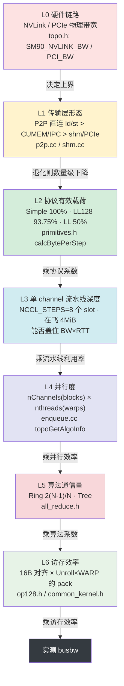

# 如何把带宽打满 —— NCCL 的十个杠杆

> 本文回答一个问题：**为什么 `all_reduce_perf` 跑不出硬件峰值，以及按什么顺序去查。**
> 所有结论都给出源码位置；数字要么直接来自源码常量/README，要么明确标注为"量级估算"。

---

## 本文覆盖的源文件

| 文件 | 在本文中的作用 |
|---|---|
| [src/device/all_reduce.h](../src/device/all_reduce.h) | Ring/Tree 的 GPU 算法骨架、`chunkCount` 尾部收缩、协议×算法分派 |
| [src/device/prims_simple.h](../src/device/prims_simple.h) | Simple 原语：FIFO step 流水线、warp 角色划分、direct 指针 |
| [src/device/primitives.h](../src/device/primitives.h) | 三种协议的"每 step 有效载荷"定义（协议开销的出处） |
| [src/device/op128.h](../src/device/op128.h) | 128-bit(16B) 打包 load/store 与 `BytePack<16>` |
| [src/device/common_kernel.h](../src/device/common_kernel.h) | `reduceCopyPacks`：unroll × pack 的访存内核 |
| [src/device/common.h](../src/device/common.h) | `COLL_UNROLL` 宏 |
| [src/include/device.h](../src/include/device.h) | `NCCL_STEPS`、`NCCL_*_NTHREADS`、`MAXCHANNELS`、`ncclCollUnroll` |
| [src/include/collectives.h](../src/include/collectives.h) | `ALLREDUCE_CHUNKSTEPS` / `ALLREDUCE_SLICESTEPS` |
| [src/include/comm.h](../src/include/comm.h) | `NCCL_*_THREAD_THRESHOLD` |
| [src/graph/tuning.cc](../src/graph/tuning.cc) | 带宽/延迟模型、协议打折系数、`threadThresholds`、算法选择耗时公式 |
| [src/graph/connect.cc](../src/graph/connect.cc) | `NCCL_MIN/MAX_NCHANNELS`、channel 数最终钳制 |
| [src/graph/topo.h](../src/graph/topo.h) | `SM90_NVLINK_BW` / `PCI_BW` 等链路带宽常量 |
| [src/init.cc](../src/init.cc) | `NCCL_BUFFSIZE`、`comm->nChannels` 的最终确定 |
| [src/enqueue.cc](../src/enqueue.cc) | `nChannels`/`nthreads` 按 size 收缩、`calcCollChunking`、kernel launch 的 grid/block |
| [src/transport/p2p.cc](../src/transport/p2p.cc) | P2P 直连的四种形态、copy engine 开关 |
| [src/transport/shm.cc](../src/transport/shm.cc) | 退化路径（共享内存） |
| [src/register/coll_reg.cc](../src/register/coll_reg.cc) | 用户 buffer 注册 → direct 路径开关 |
| [tests/src/all_reduce.cu](../tests/src/all_reduce.cu) | `busbw` 的实际计算公式 |
| [tests/doc/PERFORMANCE.md](../tests/doc/PERFORMANCE.md) | `2(N-1)/N` 系数的官方推导 |

---

## 0. 先定义"打满"：bus bandwidth 与 2(N-1)/N

**问题**：`all_reduce_perf` 输出两列带宽 —— `algbw` 与 `busbw`，到底该看哪个？

**做法**：`algbw = S/t`（数据量 / 时间），它随 rank 数变化，无法和硬件峰值比较。
`busbw` 是把"算法本身 unavoidable 的通信量放大"折算掉之后、**可以和硬件峰值直接比较**的数：

```81:87:tests/src/all_reduce.cu
void AllReduceGetBw(size_t count, size_t typesize, double sec, double* algBw, double* busBw, int nranks) {
  double baseBw = (double)(count * typesize) / 1.0E9 / sec;

  *algBw = baseBw;
  double factor = ((double)(2*(nranks - 1)))/((double)nranks);
  *busBw = baseBw * factor;
}
```

推导（nccl-tests 官方文档，本仓库内）：

- 每个输出元素 `o_0 = ... = o_{n-1} = i_0 + ... + i_{n-1}`，**无论用 ring 还是 tree**，都需要 `n-1` 次加法 + `n` 次赋值 → **2(n-1) 次点到点传输**（[PERFORMANCE.md:49-50](../tests/doc/PERFORMANCE.md#L49)）。
- n 张卡各有带宽 B，则 `t = S·2(n-1) / (n·B)` = `(S/B)·2(n-1)/n`（[PERFORMANCE.md:52-59](../tests/doc/PERFORMANCE.md#L52)）。
- 反解 B：`B = S/t · 2(n-1)/n = algbw · 2(n-1)/n`（[PERFORMANCE.md:61-63](../tests/doc/PERFORMANCE.md#L61)）。

NCCL 自己的调优模型里用的是同一个 ratio（[tuning.cc:394-399](../src/graph/tuning.cc#L394)）：
`nsteps = 2*(nRanks-1)`（[tuning.cc:306](../src/graph/tuning.cc#L306)），`ratio = nRanks / nsteps`。

**定量收益**：

| nRanks | 2(n-1)/n | 含义 |
|---|---|---|
| 2 | 1.00 | 2 卡时 busbw == algbw |
| 4 | 1.50 | algbw 要乘 1.5 才对标硬件 |
| 8 | 1.75 | algbw 要乘 1.75 |
| ∞ | → 2.0 | 上界 |

**本仓库基线**（README）：2 卡 H20、128MB 档，`busbw ≈ 281 GB/s`。后续所有杠杆都拿这个数当"满速基线"。

**调错方向**：拿 `algbw` 去和 NVLink 峰值比（会"永远打不满"）；或者反过来用 `busbw` 去估算"业务一次 allreduce 要多久"（会低估，应该用 `algbw = S/t`）。

---

## 带宽瓶颈层级图



排查顺序原则：**从下往上查（L1→L6），因为下层是乘性瓶颈**——L1 掉到 shm，上面 6 层做得再好也补不回来。

---

## 杠杆 1：算法层——Ring 的 2(N-1)/N 已经接近理论下界

**问题**：Ring AllReduce 每卡收发 `2(N-1)/N · S` 字节，这是不是最优？

**做法**：Ring 把 AllReduce 拆成 ReduceScatter（前 N-1 步）+ AllGather（后 N-1 步），每步只在环上和 prev/next 交换一个 chunk（[all_reduce.h:79-88](../src/device/all_reduce.h#L79) 的注释与 [L93-L143](../src/device/all_reduce.h#L93) 的 5 段实现）：

1. 第 0 步：`directSend` 给流水注第一块水（[L97](../src/device/all_reduce.h#L97)）
2. 第 1~N-2 步：`directRecvReduceDirectSend`（收+规约+转发，[L108](../src/device/all_reduce.h#L108)）
3. 第 N-1 步：`directRecvReduceCopyDirectSend`（归属 chunk 完成，写回 recvbuff 并转发，[L123](../src/device/all_reduce.h#L123)）
4. AllGather N-2 步：`directRecvCopyDirectSend`（[L132](../src/device/all_reduce.h#L132)）
5. 收尾：`directRecv`（只收不发，[L143](../src/device/all_reduce.h#L143)）

**定量收益**：每卡总收发 `2(N-1)/N · S`，**与 N 无关地逼近下界**（N→∞ 时 → 2S）；朴素做法（每个 rank 广播全量）是 `O(N·S)`。

**调错方向**：以为"换 Tree 能提高大消息带宽"。Tree 每步搬运量更大、且节点内 Tree 每 chunk 只有 1 次上行 + 1 次下行（[all_reduce.h:277-336](../src/device/all_reduce.h#L277)），**大消息带宽不如 Ring**；Tree 的价值在延迟（见 14 章）。另外注意本仓库调优模型对 Tree 还额外打了折：`busBw *= .92`（[tuning.cc:347-348](../src/graph/tuning.cc#L347)）。

---

## 杠杆 2：多 channel 并行——channel 数 = CUDA block 数

**问题**：单 block 只能占住有限的链路端口和 copy engine，怎么横向扩展到多条 NVLink？

**做法**：

- **1 channel = 1 CUDA block**，在 launch 处直接可见：

```1784:1791:src/enqueue.cc
ncclResult_t ncclLaunchKernel(struct ncclComm* comm, struct ncclKernelPlan* plan) {
  ncclResult_t ret = ncclSuccess;
  struct ncclKernelPlanner* planner = &comm->planner;
  int nChannels = countOneBits(plan->channelMask);
  void* sym = plan->kernelFn;
  dim3 grid = {(unsigned)nChannels, 1, 1};
  dim3 block = {(unsigned)plan->threadPerBlock, 1, 1};
```

- **nChannels 的确定**：拓扑搜索时 ring 的上界是 `MAXCHANNELS/2 = 32`（[init.cc:1205-1206](../src/init.cc#L1205)），最终取 `min(treeGraph, ringGraph)`（[init.cc:1309](../src/init.cc#L1309)、[init.cc:1488](../src/init.cc#L1488)）。
- **用户强制钳制**：`NCCL_MIN_NCHANNELS` / `NCCL_MAX_NCHANNELS`（旧名 `NCCL_MIN/MAX_NRINGS`），定义在 [connect.cc:382-387](../src/graph/connect.cc#L382)，作用于 [connect.cc:558-571](../src/graph/connect.cc#L558)；另一组是 comm config 的 `minCTAs/maxCTAs`，对应 `NCCL_MIN_CTAS` / `NCCL_MAX_CTAS`（[init.cc:1754-1755](../src/init.cc#L1754)、[init.cc:2042-2064](../src/init.cc#L2042)）。
- **运行时按 size 收缩**（小消息自动减少 block，见杠杆 6 与 14 章）：[enqueue.cc:2151-2157](../src/enqueue.cc#L2151)。

**定量收益**：

- `MAXCHANNELS = 64`（[device.h:101](../src/include/device.h#L101)），ring 搜索上界 32。
- 每多一条 channel = 多一个 block = 多一路独立的 NVLink 流量 + 一份独立的 FIFO。

**调错方向（两头都会错）**：

| 现象 | 原因 |
|---|---|
| channel 太少 | 单 block 的 512 线程无法产生足够的 outstanding load/store，填不满多条 NVLink |
| channel 太多 | ① block 数超过 SM 数，SM 上多个 block 分时复用，barrier 相互拖慢；② **显存暴涨**——每 (channel × peer × 收发方向) 都要一份 `Σ buffSizes[p]` |
| | 默认 `Simple 4MiB + LL 0.5MiB + LL128 ≈4.69MiB ≈ 9.19 MiB`（由 [init.cc:824-841](../src/init.cc#L824) 的常量算出：LL = `8×512×8×16`，LL128 = `120×640×8×8`） |

---

## 杠杆 3：每 channel 的流水线深度——NCCL_STEPS 个 slot 的环形 FIFO

**问题**：跨卡一次往返有微秒级延迟，如果"发完等回执再发下一块"，链路大部分时间是空的。

**做法**：FIFO 切成 `NCCL_STEPS = 8` 个 slot（[device.h:36](../src/include/device.h#L36)），发送方**最多领先接收方 8 步**，用一个单调递增的 `step` 计数器做信用：

```149:156:src/device/prims_simple.h
      while (connStepCache + (isSendNotRecv ? NCCL_STEPS : 0) < step + StepPerSlice) {
        connStepCache = loadStepValue(connStepPtr);
        if (checkAbort(flags, Aborted, spins)) break;
```

`stepSize = buffSizes[SIMPLE] / NCCL_STEPS`（[prims_simple.h:623](../src/device/prims_simple.h#L623)），默认 `4MiB / 8 = 512 KiB`。

chunk 内部再切 slice，让"收 / 算 / 发"三段重叠：

- `ALLREDUCE_CHUNKSTEPS = NCCL_STEPS/2 = 4`，`ALLREDUCE_SLICESTEPS = NCCL_STEPS/4 = 2`（[collectives.h:27-28](../src/include/collectives.h#L27)）
- Ring+Simple 实例化成 `ProtoSimple<CHUNKSTEPS/SLICESTEPS, SLICESTEPS>` = `ProtoSimple<2, 2>`（[all_reduce.h:352](../src/device/all_reduce.h#L352)）
- 每次原语调用处理 `SlicePerChunk = 2` 个 slice，slice 大小 `stepSize × StepPerSlice = 512KiB × 2 = 1MiB`，并且会按元素数自适应缩小（[prims_simple.h:226](../src/device/prims_simple.h#L226)）：

```225:226:src/device/prims_simple.h
    int sliceSize = stepSize * StepPerSlice;
    sliceSize = max(divUp(nelem, 16 * SlicePerChunk) * 16, sliceSize / 32);
```

- 一个原语调用内部的三段流水：`waitPeer`（等信用）→ `subBarrier` → `reduceCopy`（收+算+发，全员）→ `barrier` → `postPeer`（还信用），见 [prims_simple.h:262-326](../src/device/prims_simple.h#L262)。

**定量收益**：

- 单向"在飞"数据量 = `NCCL_STEPS × stepSize = 8 × 512KiB = 4 MiB`，正好等于 `NCCL_BUFFSIZE`（[init.cc:827](../src/init.cc#L827)）。
- 需要覆盖的带宽-延迟积 BDP ≈ `BW × RTT`；按基线 281 GB/s 与微秒级 RTT 估算，BDP 约在 **0.3~1 MB 量级**（量级估算），4 MiB 的在飞窗口**远大于**需求 → 大消息下流水线足以掩盖延迟。

**调错方向**：

- `NCCL_BUFFSIZE` 设太小（如 64KiB）→ 在飞窗口 64KiB ≪ BDP，链路长期空闲，busbw 断崖式下跌。
- 设太大 → ① 显存按 `×2(收发) × nRanks × nChannels` 放大（见杠杆 2 表格）；② 首包要等一个 slice 攒够才 post，首包延迟上升；③ L2/共享内存局部性变差。
- 相关环境变量：`NCCL_BUFFSIZE` / `NCCL_LL_BUFFSIZE` / `NCCL_LL128_BUFFSIZE`（[init.cc:828-830](../src/init.cc#L828)）。

---

## 杠杆 4：chunkSize / loopSize 的自适应

**问题**：chunk 太大 → 大量线程空转；chunk 太小 → 每步同步开销占比过高。

**做法（主机侧）**：`calcCollChunking`（[enqueue.cc:2254](../src/enqueue.cc#L2254)）：

```2294:2301:src/enqueue.cc
  int nstepsPerLoop, nchunksPerLoop;
  size_t loopOffset = 0;
  int stepSize = comm->buffSizes[info->protocol] / NCCL_STEPS;
  int chunkSteps = (info->protocol == NCCL_PROTO_SIMPLE && info->algorithm == NCCL_ALGO_RING) ? info->chunkSteps : 1;
  int sliceSteps = (info->protocol == NCCL_PROTO_SIMPLE && info->algorithm == NCCL_ALGO_RING) ? info->sliceSteps : 1;
  int chunkSize = stepSize * chunkSteps;
  if (info->protocol == NCCL_PROTO_LL) chunkSize /= 2;
  if (info->protocol == NCCL_PROTO_LL128) chunkSize = (chunkSize / NCCL_LL128_LINEELEMS) * NCCL_LL128_DATAELEMS;
  // 基于缓冲区的上限；插件可以把 块 大小提高到此上限。
  int bufferMaxChunkSize = chunkSize;
```

Ring+Simple 时 `chunkSteps=4` → `chunkSize = 512KiB × 4 = 2 MiB`；最后按协议粒度对齐（Simple 的 `grainSize = 512 B`，[device.h:342](../src/include/device.h#L342)）：

```2393:2393:src/enqueue.cc
  chunkSize = chunkSize / grainSize * grainSize; // align chunkSize to multiple grainSize
```

一轮环能处理的量（[enqueue.cc:2433](../src/enqueue.cc#L2433)）：

```
loopSize = nChannels × nchunksPerLoop × chunkSize      // nchunksPerLoop = nRanks，见 enqueue.cc:2421
```

**做法（设备侧尾部收缩）**：最后一轮数据不足时缩小 chunk，并且**对齐到 16B** 以保住向量化（[all_reduce.h:72](../src/device/all_reduce.h#L72)）：

```66:72:src/device/all_reduce.h
  for (ssize_t elemOffset = 0; elemOffset < channelCount; elemOffset += loopCount) {
    ssize_t remCount = channelCount - elemOffset;   // 本轮还剩多少元素没处理
    ssize_t chunkOffset;                            // chunk 在本轮内部的元素偏移

    // 最后一轮数据不足一整轮时，缩小 chunkCount 让 nranks 个 块 刚好覆盖剩余数据；
    // alignUp 到 16 字节边界是为了保证向量化访存(128-位 加载/存储)仍然对齐。
    if (remCount < loopCount) chunkCount = alignUp(divUp(remCount, nranks), 16 / sizeof(T));
```

**定量收益**（假设 ring 搜索出 `nChannels = 32`）：

| 项 | 值 |
|---|---|
| `chunkSize`（Ring+Simple） | 2 MiB |
| `nchunksPerLoop` | nRanks = 2 |
| `loopSize` | 32 × 2 × 2 MiB = **128 MiB** |
| README 的 128MB 档 | 正好一轮打满，**不触发尾部收缩** |

**调错方向**：

- chunk 太大而 size 小 → `nelem` 被裁到很小（`min(chunkCount, remCount - chunkOffset)`），大部分线程在 `reduceCopyPacks` 里空转 → 同步开销占比飙升。
- chunk 太小 → 每个 chunk 都要一次完整的 `waitPeer/subBarrier/reduceCopy/barrier/postPeer`，同步次数 ∝ size/chunkSize。
- 集合通信的 chunkSize 只能靠 **tuner plugin 的 `getChunkSize`** 覆盖，且会被 `bufferMaxChunkSize` 夹住（[enqueue.cc:2380-2390](../src/enqueue.cc#L2380)）。注意 `NCCL_CHUNK_SIZE`（[enqueue.cc:885](../src/enqueue.cc#L885)）**只作用于 P2P 路径**（[enqueue.cc:923](../src/enqueue.cc#L923)），对 AllReduce 无效——这是个常见的误用。

---

## 杠杆 5：协议开销——100% / 93.75% / 50% 的来源

**问题**：为什么大消息不能用 LL？

**做法**：三种协议每 step 的**有效数据字节**在 `primitives.h` 里写死：

| 协议 | 每 step 有效载荷 | 源码 |
|---|---|---|
| Simple | `buffSizes[SIMPLE] / NCCL_STEPS` → **100%** | [primitives.h:48-50](../src/device/primitives.h#L48) |
| LL | `... / NCCL_STEPS / 2` → **50%**（注释直接写 "Half is data"） | [primitives.h:63-65](../src/device/primitives.h#L63) |
| LL128 | `... × NCCL_LL128_DATAELEMS / NCCL_LL128_LINEELEMS` = `15/16` → **93.75%** | [primitives.h:78-80](../src/device/primitives.h#L78) |

LL 50% 的物理原因：一个 16B 的 `ncclLLFifoLine` 是 `data1(4B) + flag1(4B) + data2(4B) + flag2(4B)`（[device.h:85-98](../src/include/device.h#L85)），**数据和 flag 各占一半**。
LL128 的物理原因：128B 一行 = 16 个 `uint64`，其中 15 个是数据、1 个是 flag（`NCCL_LL128_LINEELEMS=16`、`NCCL_LL128_DATAELEMS=15`，[device.h:120-122](../src/include/device.h#L120)）。

调优模型里对应的打折（[tuning.cc:344-352](../src/graph/tuning.cc#L344)）：

```344:352:src/graph/tuning.cc
        if (a == NCCL_ALGO_RING && p == NCCL_PROTO_LL) busBw = std::min(llMaxBw, busBw * .5);
        if (a == NCCL_ALGO_RING && p == NCCL_PROTO_LL128)
          busBw = std::min(busBw * (0.92 /*120.0/128.0*/), graphs[a]->nChannels * perChMaxRingLL128Bw);
        if (a == NCCL_ALGO_TREE && coll == ncclFuncAllReduce)
          busBw = std::min(busBw * .92, graphs[a]->nChannels * perChMaxTreeBw);
        if (a == NCCL_ALGO_TREE && p == NCCL_PROTO_LL) busBw = std::min(busBw * 1.0 / 3.8, llMaxBw);
        if (a == NCCL_ALGO_TREE && p == NCCL_PROTO_LL128)
          busBw =
            std::min(busBw * (nNodes == 1 ? 7.0 / 9.0 : 120.0 / 128.0), graphs[a]->nChannels * perChMaxTreeLL128Bw);
```

注意源码里 LL128 用的是 **0.92**（注释标 120.0/128.0，实际 120/128 = 0.9375，模型取值更保守一点）；LL128 还有**每 channel 带宽上限**——Hopper 上 Ring 是 36.7（[tuning.cc:201-207](../src/graph/tuning.cc#L201)）。

**定量收益**：

| 协议 | 有效带宽上限 | 大消息推荐度 |
|---|---|---|
| Simple | 100% | **首选** |
| LL128 | 93.75%（模型 0.92，且受 `perChMaxRingLL128Bw` 限制） | 次选（Hopper 上通常仍不如 Simple） |
| LL | 50% | **禁用**（Tree+LL 更只有 1/3.8） |

**调错方向**：`NCCL_PROTO=LL` 跑 128MB → busbw 直接腰斩；`NCCL_ALGO=Tree NCCL_PROTO=LL` → 掉到约 1/3.8。

---

## 杠杆 6：向量化与访存——16B 对齐 + unroll

**问题**：每个 warp 怎么才能达到峰值访存吞吐？

**做法**：

1. **16B 打包类型**：`BytePack<16>` 显式 `alignas(16)`（[op128.h:131-142](../src/device/op128.h#L131)）。
2. **16B load/store 用 PTX 的 `v2.b64`**（[op128.h:302-326](../src/device/op128.h#L302)），单条指令搬 16B。
3. **`reduceCopyPacks` 的 hunk 粒度**：

```48:49:src/device/common_kernel.h
  constexpr int BytePerHunk = Unroll * WARP_SIZE * BytePerPack;
  int nWarps = nThreads / WARP_SIZE;
```

`Unroll = COLL_UNROLL = ncclCollUnroll()`（[common.h:25](../src/device/common.h#L25)），sm_80+ 为 **8**（[device.h:545-548](../src/include/device.h#L545)）。
H20 是 sm_90 → `Unroll = 8`，`BytePerPack = 16` → **每个 warp 每次循环迭代搬 `8 × 32 × 16 = 4096 B`**；512 线程 = 16 warps → 一个完整 wave 覆盖 64 KiB。

4. **只有全 warp 都 16B 对齐才走大 pack**：

```224:242:src/device/common_kernel.h
  if NCCL_IF_CONSTEXPR (BigPackSize > sizeof(T)) {
    // 检查所有指针是否都已按 BigPackSize 对齐。
    int lane = thread % WARP_SIZE;
    bool aligned = true;
    if (lane < nSrcs) aligned &= 0 == cvta_to_global(srcPtrFn(lane)) % (BigPackSize + !BigPackSize);
    if (lane < nDsts) aligned &= 0 == cvta_to_global(dstPtrFn(lane)) % (BigPackSize + !BigPackSize);
    aligned = __all_sync(~0u, aligned);
    if (aligned) {
      reduceCopyPacks<RedFn, T, Unroll, BigPackSize, ...>(...);
      if (nBytesAhead == 0) return;
      reduceCopyPacks<RedFn, T, /*Unroll=*/1, BigPackSize, ...>(...);
      if (nBytesAhead == 0) return;
    }
  }
```

不对齐就只能退化到 `BytePerPack = sizeof(T)`（[common_kernel.h:244-251](../src/device/common_kernel.h#L244)）。

**定量收益 / 代价**：

- 对齐路径：每线程每 hunk 8 次 16B 访问，地址计算与循环分支被摊薄到 1/8。
- 不对齐路径：`float`（4B）时每线程每次只搬 4B，**访存指令条数 ×4**（量级估算），且 `__all_sync` 的对齐判定失败后直接跳过所有大 pack 分支。
- 尾部保护：`chunkCount` 被 `alignUp(..., 16/sizeof(T))` 拉齐（[all_reduce.h:72](../src/device/all_reduce.h#L72)），保证**最后一个 chunk 也不破坏 16B 对齐**。

**调错方向**：把用户 buffer 故意偏移几个字节（非 16B 对齐的 sendbuff/recvbuff），Ring 的每一步都会掉到标量路径 → busbw 显著下降。这也是 `runRing` 尾部要 `alignUp` 到 16B 的原因。

---

## 杠杆 7：线程 / warp 配置——少量 warp 做同步，大量 warp 搬数

**问题**：同步（spin 等信用）和搬数（load/store）如果抢同一批线程，链路就会空闲。

**做法**：

- **上限常量**（[device.h:103-107](../src/include/device.h#L103)）：`NCCL_MAX_NTHREADS 640`、`NCCL_MIN_NTHREADS 128`、`NCCL_SIMPLE_MAX_NTHREADS 512`、`NCCL_LL_MAX_NTHREADS 512`；LL128 是 640（[device.h:124](../src/include/device.h#L124)）。
- **默认线程数**（[tuning.cc:261-274](../src/graph/tuning.cc#L261)）：Ring+Simple 默认 512，但当 `bwIntra × nChannels <= PCI_BW(12.0)` 时降到 256（`PCI_BW` 见 [topo.h:34](../src/graph/topo.h#L34)）；LL 512；LL128 640。可用 `NCCL_NTHREADS` / `NCCL_LL128_NTHREADS` 覆盖（[tuning.cc:31-32](../src/graph/tuning.cc#L31)）。
- **warp 专职化**：同步 warp 从搬数线程里"扣"出来：

```630:630:src/device/prims_simple.h
      this->nworkers = nthreads - (MaxSend > 0 && nthreads >= NCCL_SIMPLE_EXTRA_GROUP_IF_NTHREADS_GE ? WARP_SIZE : 0);
```

  角色按 tid 分段分配（[prims_simple.h:655-670](../src/device/prims_simple.h#L655)）：`tid < nrecv` 做 `RoleWaitRecv`，接着 `nsend` 个做 `RoleWaitSend`，**末尾** `nsend` 个做 `RolePostSend`、再往前的 `nrecv` 个做 `RolePostRecv`，中间的全部是纯搬数 worker。
- **Simple 额外追加同步 warp**（[enqueue.cc:2170-2174](../src/enqueue.cc#L2170)）：Ring +1 warp，Tree +4 warps（Tree 有上下行两个同步组）；下限 3 warps（[enqueue.cc:2176](../src/enqueue.cc#L2176)）。

**定量收益**：512 线程 = 16 warps，扣 1 个同步 warp → 15 warps 搬数，同步开销的理论占比约 **1/16 ≈ 6%**（量级估算）。同步 warp 在 `waitPeer` 里 spin 时，其余 15 warps 仍在 `reduceCopy` 中——两者通过 `subBarrier`/`barrier` 解耦（[prims_simple.h:87-100](../src/device/prims_simple.h#L87)）。

**调错方向**：

- `NCCL_NTHREADS` 设太小（如 128）→ 只有 4 warps，其中还要分出 wait/post，搬数线程太少、无法产生足够 MLP。
- 设太大（>512）→ 寄存器与 shared memory 压力上升，且每个 block 的尾部 warp 因 `nBytes` 不足而空转（这也是为什么有杠杆 2/14 的"按 size 收缩"）。

---

## 杠杆 8：零拷贝 / direct——用户 buffer 注册后直接对写

**问题**：非 direct 路径下，一份数据要过"用户 buffer → 本地 FIFO → 对端 FIFO → 对端用户 buffer"，共 2 读 2 写。

**做法**：

- Ring 的原语以 `Direct=1` 实例化（[all_reduce.h:62](../src/device/all_reduce.h#L62)）。
- 但 **direct 只有在用户 buffer 注册后才真正生效**：`ipcRegFlag` 来自 `collWork->regUsed`（[prims_simple.h:687-688](../src/device/prims_simple.h#L687)），`setDataPtrs` 里 `if (Direct && ipcReg)` 才走指针交换（[prims_simple.h:800](../src/device/prims_simple.h#L800)）。
- 指针交换通过 `conn->ptrExchange` 完成（[prims_simple.h:806-888](../src/device/prims_simple.h#L806)）：一端是 provider（把本地 recvbuff 地址挂上去），另一端是 acceptor（取下来当 `directBuff`）。
- 真正搬运时，dst 指针直接指向对端显存（[prims_simple.h:177-192](../src/device/prims_simple.h#L177)）：

```177:184:src/device/prims_simple.h
      } else if (isSendNotRecv && DirectSend) {
        if (flags & DirectWrite) {
          ptrs[index] = directBuff + dstIx + offset;
        } else if (flags & DirectRead) {
          // 空发送(无数据可发)
          ptrs[index] = nullptr;
        } else {
          ptrs[index] = connEltsFifo + (step % NCCL_STEPS) * connStepSize;
        }
```

- 注册入口：`ncclIpcLocalRegisterBuffer` / `ncclIpcGraphRegisterBuffer`（[coll_reg.cc:264-281](../src/register/coll_reg.cc#L264)、[coll_reg.cc:389-402](../src/register/coll_reg.cc#L389)），CUDA Graph 场景下由 `NCCL_GRAPH_REGISTER`（默认 1，[enqueue.cc:308](../src/enqueue.cc#L308)）自动触发。

**定量收益**：direct 路径 = 1 次读（本地 sendbuff）+ 1 次写（对端 recvbuff）；非 direct = 2 读 + 2 写。**省掉了一整轮 staging 读 + staging 写**（每次都是 16B 粒度的跨卡/本地访问），显存流量理论上减半（量级估算）。

**调错方向**：用户 buffer 没注册 → `regUsed = 0` → 走 `connEltsFifo` 中转；或者用 `NCCL_P2P_DIRECT_DISABLE=1`（[p2p.cc:366](../src/transport/p2p.cc#L366)）直接关掉直连指针。

---

## 杠杆 9：P2P 直连而非 copy engine memcpy

**问题**：同机两卡之间，字节到底怎么过去？

**做法**：默认（`NCCL_P2P_USE_CUDA_MEMCPY = 0`，[p2p.cc:141-142](../src/transport/p2p.cc#L141)）**完全不用 copy engine**，由 GPU SM 用 `ld/st` 直接读写对端显存：

- 四种 P2P 形态（[p2p.cc:38-43](../src/transport/p2p.cc#L38)）：
  - `P2P_DIRECT`：同进程 + 未禁用 + 非 CE → 直接用对端指针（[p2p.cc:464-467](../src/transport/p2p.cc#L464)）
  - `P2P_CUMEM` / `P2P_IPC`：跨进程，用 cuMem 虚拟内存映射或传统 CUDA IPC（[p2p.cc:468-481](../src/transport/p2p.cc#L468)）
  - `P2P_INTERMEDIATE`：不能直连时找中转 rank
- 连接建立后，`send->conn.buffs[p]` 指向**对端显存**（[p2p.cc:606](../src/transport/p2p.cc#L606)），`head/tail/ptrExchange` 也都在对端/本地显存里（[p2p.cc:620-624](../src/transport/p2p.cc#L620)）。
- **write vs read**：`NCCL_P2P_READ_ENABLE`（默认 -2 = 交给拓扑决定，[p2p.cc:364](../src/transport/p2p.cc#L364)）。源码注释解释得很清楚（[p2p.cc:358-362](../src/transport/p2p.cc#L358)）：write 是 fire-and-forget 延迟低，read 在 Ampere+NVLink 上带宽利用率更高。
- **CE 路径的代价**：`useMemcpy=1` 时要额外准备 `ceDevBuff`、`connFifo`、`NCCL_STEPS` 个 CUDA event，并把 SIMPLE buffer 交给 proxy（[p2p.cc:612-619](../src/transport/p2p.cc#L612)、[p2p.cc:846](../src/transport/p2p.cc#L846)）。

**定量收益**：

- 默认路径（SM ld/st）：**proxy 完全不在数据通路上**——`p2pTransport.send.proxyProgress` 只有在 `useMemcpy` 时才被挂上（[p2p.cc:1531-1541](../src/transport/p2p.cc#L1531)）：

```1534:1538:src/transport/p2p.cc
    useMemcpy = ncclParamP2pUseCudaMemcpy();
    if (useMemcpy) {
      p2pTransport.send.proxyConnect = p2pSendProxyConnect;
      p2pTransport.send.proxyProgress = p2pSendProxyProgress;
    }
```

  也就是说，CE 路径每次传输都要经过"GPU 写 FIFO → proxy 线程看到 → 提交 cudaMemcpy → event 完成 → 推进 tail"，多一次 CPU 参与 + 一次事件同步；而 SM 直写路径只有 GPU 内部的 spin。
- CE 的相对劣势主要体现在**中小消息**（固定提交开销占比高）；大块时 CE 峰值接近 SM 但通常仍不占优（量级估算，本仓库未含 benchmark 对比数据）。

**调错方向**：以为"用 copy engine 能解放 SM"而开 `NCCL_P2P_USE_CUDA_MEMCPY=1`——这会把纯 device-side 的同步变成 GPU↔CPU 的往返，中小消息延迟明显变差。

---

## 杠杆 10：避免退化路径——确认真的走了 NVLink P2P

**问题**：什么时候会掉到 shm / PCIe，掉了之后带宽掉到多少？

**做法**：先看**会不会**掉：

- `p2pCanConnect` 要求同一台主机（[p2p.cc:171](../src/transport/p2p.cc#L171)）；`cudaDeviceCanAccessPeer` 返回 0 就直接不可用（[p2p.cc:201](../src/transport/p2p.cc#L201)）。
- **WSL 特例**：`cudaDeviceCanAccessPeer` 在 WSL 下会误报可用，所以源码会真的申请一次 IPC 句柄来确认（[p2p.cc:218-231](../src/transport/p2p.cc#L218)）。
- shm 的准入条件：同 hostHash + 同 shmDev（[shm.cc:79-85](../src/transport/shm.cc#L79)），`NCCL_SHM_DISABLE=1` 可关（[shm.cc:62](../src/transport/shm.cc#L62)）。

**定量收益 / 代价**：

| 判据 | NVLink | PCIe/shm |
|---|---|---|
| 链路带宽常量 | `SM90_NVLINK_BW = 20.6` | `PCI_BW = 12.0`（PCIe Gen3 x16） |
| 出处 | [topo.h:31-34](../src/graph/topo.h#L31) | 同上 |
| 模型选哪套 hwLatency | `typeIntra == LINK_NVL → NCCL_HW_NVLINK`（[tuning.cc:302](../src/graph/tuning.cc#L302)） | 否则 `NCCL_HW_PCI` |
| Ring+Simple 每步延迟 | **3.4** | **5.7**（[tuning.cc:176 vs 182](../src/graph/tuning.cc#L176)） |

注意：上表是 NCCL 的**内部模型常量**（每条链路的标称值），实际总带宽还要乘以链路条数（[topo.cc:861](../src/graph/topo.cc#L861) 会按 `count × nvlBw` 累加），不是实测 GB/s。真实的 H20 NVLink 与 PCIe 差距远大于 20.6 : 12.0 这个比值（外部硬件规格，非本仓库数据）。

**怎么确认走了 NVLink P2P**（三条日志都要看）：

```bash
NCCL_DEBUG=INFO NCCL_DEBUG_SUBSYS=INIT,GRAPH,P2P \
  LD_LIBRARY_PATH=build/lib ./tests/build/all_reduce_perf -b 128M -e 128M -f 2 -g 2
```

| 你想确认的事 | 看哪行日志 | 源码 |
|---|---|---|
| 拓扑搜索认为链路是 NVLink | `Pattern ... nChannels N, bw ..., type PATH_NVL/...` | [search.cc:1328-1330](../src/graph/search.cc#L1328) |
| 传输层真的建了 P2P | `Channel 00/0 : 0[0] -> 1[1] via P2P/direct pointer` / `via P2P/IPC` / `via P2P/CUMEM` | [p2p.cc:466-480](../src/transport/p2p.cc#L466) |
| **没**退化到 shm | 不应出现 `via SHM/direct` | [shm.cc:123-124](../src/transport/shm.cc#L123) |
| 最终选了什么算法/协议/通道 | `AllReduce: ... Bytes -> Algo RING proto Simple channel{Lo..Hi}={0..31}` | [enqueue.cc:846-849](../src/enqueue.cc#L846) |
| 完整的延迟/带宽模型表 | `NCCL INFO ... Tree/Ring ... 6.8/xx` 那张 `lat/bw` 表 | [tuning.cc:589-600](../src/graph/tuning.cc#L589) |

子系统位掩码定义见 [nccl_common.h:43-56](../src/include/nccl_common.h#L43)（`INIT/COLL/P2P/SHM/NET/GRAPH/TUNING/ENV/...`）。

**调错方向**：只 grep 到 `via P2P/IPC` 就以为万事大吉——`P2P/IPC` 说明**跨进程**走了 IPC 句柄（合法且能跑满），但如果两个 rank 在同一进程内，你应该看到的是 `via P2P/direct pointer`（少一次句柄导入）。反过来，如果看到 `via SHM/direct` 或 `via NET/...`，说明已经退化。

---

## 性能自检清单 + 可执行验证命令

### 清单（按瓶颈层级，从上到下逐条打勾）

| # | 检查项 | 通过标准 | 相关杠杆 |
|---|---|---|---|
| 1 | 传输层形态 | 日志里是 `via P2P/direct pointer` 或 `via P2P/IPC`，**没有** `SHM`/`NET` | 杠杆 10 |
| 2 | 协议 | 大消息（≥1MB）日志里 `proto Simple` | 杠杆 5 |
| 3 | 算法 | 大消息 `Algo RING` | 杠杆 1 |
| 4 | channel 数 | `channel{Lo..Hi}` 覆盖足够宽；128MB 档不应被收缩 | 杠杆 2 |
| 5 | 线程数 | `Max NThreads` 表 + `NCCL_TUNING` 里没出现意外收缩 | 杠杆 7 |
| 6 | 缓冲区 | 用默认 `NCCL_BUFFSIZE`（4MiB）先跑基线，再单独扫 | 杠杆 3 |
| 7 | 对齐 | sendbuff/recvbuff 都是 16B 对齐（`cudaMalloc` 天然满足） | 杠杆 6 |
| 8 | direct | 批量重复跑同一 buffer 时注册（`ncclCommRegister` 或 CUDA Graph capture） | 杠杆 8 |
| 9 | CE | `NCCL_P2P_USE_CUDA_MEMCPY` 保持默认 0 | 杠杆 9 |
| 10 | 基线对比 | 128MB 档 busbw 是否接近 README 的 **281 GB/s** | — |

### 命令

```bash
# 0) 编译（H20 = sm_90）
make -j$(nproc) lib CUDA_HOME=/usr/local/cuda NVCC_GENCODE="-gencode=arch=compute_90,code=sm_90"

# 1) 基线：README 的验收命令（128MB 档 ≈ 281 GB/s）
make test
# 等价于：LD_LIBRARY_PATH=build/lib ./tests/build/all_reduce_perf -b 8 -e 128M -f 2 -g 2

# 2) 定位：看拓扑/传输/算法选择
NCCL_DEBUG=INFO NCCL_DEBUG_SUBSYS=INIT,GRAPH,P2P \
  LD_LIBRARY_PATH=build/lib ./tests/build/all_reduce_perf -b 128M -e 128M -f 2 -g 2

# 3) 看调优模型选了哪条路径（打印 lat/bw 表 + 每次的 Algo/proto）
NCCL_DEBUG=INFO NCCL_DEBUG_SUBSYS=TUNING,COLL \
  LD_LIBRARY_PATH=build/lib ./tests/build/all_reduce_perf -b 128M -e 128M -f 2 -g 2
```

### 对照实验（每次只动一个变量）

| 实验 | 命令 | 期望看到的结论 |
|---|---|---|
| 协议开销 | `NCCL_PROTO=LL ... -e 128M` | busbw ≈ 基线的一半（模型里 `×0.5`，杠杆 5） |
| 协议开销 | `NCCL_PROTO=LL128 ... -e 128M` | ≈ 0.92 倍，且被 `perChMaxRingLL128Bw` 夹住 |
| 算法 | `NCCL_ALGO=Tree ... -e 128M` | 大消息带宽低于 Ring |
| channel 数 | `NCCL_MAX_NCHANNELS=1 ... -e 128M` | busbw 明显下降（单 block 压不满） |
| channel 数 | `NCCL_MIN_NCHANNELS=32 ... -e 8K` | 小消息反而变慢（启动一堆空转 block） |
| 线程数 | `NCCL_NTHREADS=128 ... -e 128M` | 搬数 warp 不足，带宽下降 |
| 缓冲区 | `NCCL_BUFFSIZE=65536 ... -e 128M` | 在飞窗口 64KiB ≪ BDP，带宽崩 |
| 线程阈值 | `NCCL_THREAD_THRESHOLDS="64 64 64 64 64 64"` | 改变"何时开始收缩 nc/nt"的门槛 |
| direct | `NCCL_P2P_DIRECT_DISABLE=1 ... -e 128M` | 走中转 FIFO，多一次读+一次写 |
| CE | `NCCL_P2P_USE_CUDA_MEMCPY=1 ... -e 128M` | 数据通路引入 proxy + event |

环境变量的源码出处：`NCCL_PROTO`/`NCCL_ALGO` [tuning.cc:470-479](../src/graph/tuning.cc#L470)；`NCCL_MIN/MAX_NCHANNELS` [connect.cc:386-387](../src/graph/connect.cc#L386)；`NCCL_MIN/MAX_CTAS` [init.cc:1754-1755](../src/init.cc#L1754)；`NCCL_NTHREADS`/`NCCL_LL128_NTHREADS` [tuning.cc:31-32](../src/graph/tuning.cc#L31)；`NCCL_THREAD_THRESHOLDS` [tuning.cc:615](../src/graph/tuning.cc#L615)；`NCCL_BUFFSIZE` [init.cc:828](../src/init.cc#L828)；`NCCL_P2P_DIRECT_DISABLE` [p2p.cc:366](../src/transport/p2p.cc#L366)；`NCCL_P2P_USE_CUDA_MEMCPY` [p2p.cc:141](../src/transport/p2p.cc#L141)；`NCCL_P2P_READ_ENABLE` [p2p.cc:364](../src/transport/p2p.cc#L364)；`NCCL_SHM_DISABLE` [shm.cc:62](../src/transport/shm.cc#L62)。

---

## 面试时怎么回答"带宽没打满怎么排查"

**30 秒版本（分层排查，从乘性瓶颈的最底层往上）**：

1. **先确认 wire 上的东西对不对**。开 `NCCL_DEBUG=INFO NCCL_DEBUG_SUBSYS=INIT,GRAPH,P2P`，看三行：链路类型是不是 `PATH_NVL`、传输是不是 `via P2P/...`、有没有退化成 `SHM`/`NET`。只要掉到 PCIe/shm，上面全白做。
2. **再看协议和算法**。大消息必须是 `RING + Simple`。看到 `proto LL` 就解释了"为什么只有一半带宽"（LL 的 16B 里 8B 是 flag）；看到 `LL128` 解释 0.92 倍。
3. **看并行度有没有被收缩**。`NCCL_TUNING` 那行 `channel{Lo..Hi}` 和 `Max NThreads` 表：如果 128MB 的 channel 数只有个位数，八成是 `nBytes < nc × nt × threadThreshold`（Simple 阈值 64B）被砍，或者 `NCCL_MAX_NCHANNELS`/`maxCTAs` 被设小了。
4. **看流水线和缓冲区**。`NCCL_STEPS=8`、默认 4MiB，在飞窗口 4MiB；`NCCL_BUFFSIZE` 被改小就会让链路饿死。
5. **看访存是否退化**。用户 buffer 是否 16B 对齐、是否注册（direct）。非对齐会掉到 `sizeof(T)` 粒度；未注册会多一次 staging 读写。
6. **最后才是"换算法"**。而且大消息换 Tree 通常是变慢的，Tree 的优势在延迟不在带宽。

**可以顺手抛出的源码级细节（加分项）**：

- `busbw = algbw × 2(n-1)/n` 不是拍脑袋，是 `t = S·2(n-1)/(n·B)` 反解出来的（[PERFORMANCE.md:52-63](../tests/doc/PERFORMANCE.md#L52)、[all_reduce.cu:81-87](../tests/src/all_reduce.cu#L81)）。
- "打满"的本质是让 `NCCL_STEPS` 个 slot 的在飞数据量 ≥ `BW × RTT`；NCCL 用 `connStepCache + NCCL_STEPS < step + StepPerSlice` 这一个 spin 条件同时表达了"流控"和"流水深度"（[prims_simple.h:149](../src/device/prims_simple.h#L149)）。
- 同步不是免费的：NCCL 会从线程里"扣"出一整个 warp 专门 spin，剩下的 15 个 warp 纯搬数（[prims_simple.h:630](../src/device/prims_simple.h#L630)）——这就是"少量线程做同步、大量线程做搬运"的代价分摊。
- 单机 NVLink 上 proxy **不在**数据通路（`proxyProgress = NULL`，[p2p.cc:1534-1538](../src/transport/p2p.cc#L1534)），所以同机 allreduce 是纯 device-side 的，没有 CPU 往返。

**常见追问与答案**

| 追问 | 答 |
|---|---|
| 2 卡 128MB 能到 281 GB/s，8 卡会是多少？ | 看 busbw，理想情况与 2 卡同量级（busbw 已折算 rank 数）；如果 busbw 掉很多，说明并行度或访存退化，而不是"算法系数变了" |
| 为什么 algbw 随卡数下降？ | 因为 AllReduce 的 algbw 天然随 n 变化，`2(n-1)/n` 越接近 2；这是算法性质，不是实现问题 |
| 能不能靠加大 `NCCL_BUFFSIZE` 无限提带宽？ | 不能。在飞窗口超过 BDP 之后就没有收益，只有显存代价（×2 × nRanks × nChannels） |
| 上 CUDA Graph 能提带宽吗？ | 主要提**延迟**（省 launch），对大消息带宽影响很小 |

---

## 与其他章节的衔接

| 章节 | 关系 |
|---|---|
| [03-channel-ring-tree.md](./03-channel-ring-tree.md) | 本文杠杆 2/4 的"channel 与 ring/tree 拓扑是怎么来的"在那里展开（`comm->nChannels`、`ncclTopoGraph.intra[]`、ring/tree 邻居的填充） |
| [04-algo-protocol-tuning.md](./04-algo-protocol-tuning.md) | 本文杠杆 1/5 的"算法×协议怎么选"的完整决策链在那里（`ncclTopoGetAlgoTime`、cost table、环境变量解析） |
| [08-device-kernel-allreduce.md](./08-device-kernel-allreduce.md) | 本文杠杆 1/4 的 `runRing`/`runTreeSplit` 逐行解读，以及 kernel 入口到 `RunWorkColl` 特化表的分派 |
| [09-primitives-simple.md](./09-primitives-simple.md) | 本文杠杆 3/6/7 的 Simple 原语细节：FIFO step 语义、warp 角色、direct 指针、`reduceCopy` |
| [10-primitives-ll-ll128.md](./10-primitives-ll-ll128.md) | 本文杠杆 5 的协议开销在那里给出 LL/LL128 的 flag 布局与免同步收发的完整实现 |
| [14-latency-optimization.md](./14-latency-optimization.md) | 本文讲"大消息怎么把带宽打满"，那一章讲"小消息怎么把延迟压下去"；杠杆 2/4/7 的"按 size 收缩"在两章各看一面 |
