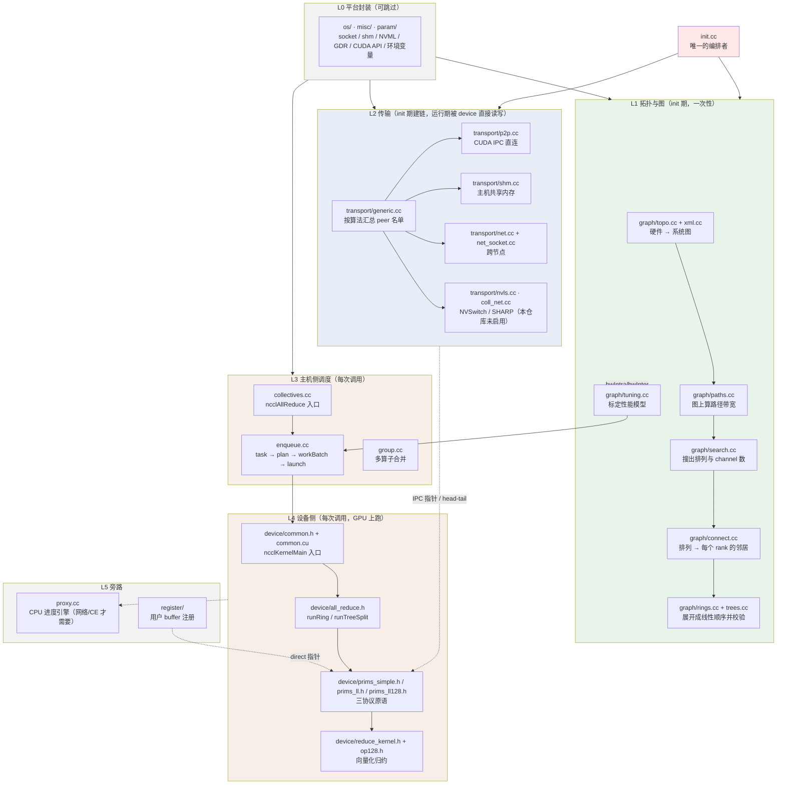
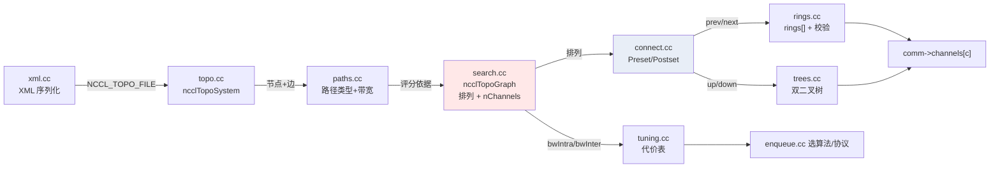

# 15 · 源码地图：`src/` 每个目录与重点文件在做什么

> **这一章解决什么问题**：前面 14 章都是"沿着一次 AllReduce 往下钻"，读者知道**流程**，
> 但打开 `src/` 会看到 290 个文件，不知道**哪个文件该看、哪个可以跳过、它们之间谁依赖谁**。
> 本章是一份**静态地图**：按目录 → 文件 → 相互关系三个粒度讲清楚每个文件的职责。
>
> 一句话概括分层：**`graph/` 决定"跟谁通信"，`transport/` 决定"怎么通信"，
> `device/` 决定"具体搬哪几个字节"，其余全是这三层的支撑件。**

---

## ① 顶层分层：一眼看清全局



---

## ② 顶层目录速查

| 目录 / 文件 | 干什么 | 重要性 |
|---|---|---|
| `src/graph/` | **拓扑探测 + 构图 + 展开校验**。回答"跟谁通信、用几条通道" | ⭐⭐⭐ 主线 |
| `src/transport/` | **建链**。回答"这两个 rank 之间怎么把字节送过去" | ⭐⭐⭐ 主线 |
| `src/device/` | **GPU kernel 与通信原语**。真正搬字节的地方 | ⭐⭐⭐ 主线 |
| `src/init.cc` | **总编排**：按固定顺序调用上面三层完成 `ncclComm` | ⭐⭐⭐ 主线 |
| `src/enqueue.cc` | 每次 `ncclAllReduce` 的主机侧规划与 kernel 下发 | ⭐⭐⭐ 主线 |
| `src/include/` | 全部头文件 + 三方头（`nvtx3`、`plugin`、`mlx5`、`compiler`…） | ⭐⭐ 查定义 |
| `src/include/nccl_device/` | 设备侧运行时头文件（`core.h`/`comm.h`/`impl/`） | ⭐⭐ |
| `src/misc/` | 平台/库封装：socket、shm、NVML、GDR、CUDA API 动态加载 | ⭐ 可跳过 |
| `src/os/` | OS 抽象层与兜底桩（`linux_stubs.cc`） | ⭐ 可跳过 |
| `src/param/` | `NCCL_*` 环境变量的注册表与 C API | ⭐ 可跳过 |
| `src/register/` | 用户 buffer 注册（零拷贝） | ⭐⭐ 专题 12 |
| `src/scheduler/` | AllGatherV / symmetric 的设备侧调度 | ⭐ 本仓库裁剪 |
| `src/devcomm/` | 各 CUDA 版本对应的 device comm 布局（ABI 兼容） | ⭐ 可跳过 |
| `src/nccl_device/` | 设备侧运行时核心的几个 `.cc` | ⭐ 可跳过 |
| `src/ce_coll.cc` | copy engine（CE）做归约的备选路径 | ⭐ 本仓库未启用 |
| `src/sym_kernels.cc` | 对称内存 kernel（`AllGatherV` 等），配合 `scheduler/` | ⭐ 本仓库裁剪 |
| `src/dev_runtime*.cc` | 跨 CUDA 版本的 kernel 启动兼容层 | ⭐ 可跳过 |
| `src/mnnvl.cc` | 多节点 NVLink（NVL72）支持 | ⭐ 本仓库裁剪 |
| `src/init_nvtx.cc` | NVTX 打点 | ⭐ 可跳过 |
| `src/enhcompat.cc` | 老版本 API 兼容桩 | ⭐ 可跳过 |
| `src/allocator.cc` / `mem_manager.cc` | 通信 buffer 的分配与池化管理 | ⭐⭐ 专题 12 |
| `src/channel.cc` | 创建/销毁 `ncclChannel`，绑定设备侧资源 | ⭐⭐ |
| `src/proxy.cc` | CPU 进度引擎（网络/CE 传输才需要，纯 NVLink 不走） | ⭐⭐ 专题 07 |
| `src/bootstrap.cc` | init 期用 TCP 让所有 rank 互通、做 AllGather | ⭐⭐ 专题 01 |
| `src/group.cc` | `ncclGroupStart/End`：合并多次调用为一次 launch | ⭐⭐ 专题 05 |
| `src/collectives.cc` | `ncclAllReduce` 等 API 入口 + 参数校验 | ⭐⭐ |
| `src/debug.cc` | `NCCL_DEBUG` 日志子系统 | ⭐ 调试时看 |
| `src/transport.cc` | 传输层**总调度**（`P2pSetup` 的分轮次握手） | ⭐⭐ 专题 06 |

---

## ③ `src/graph/` —— 重点目录，逐文件讲

这一层是"**从硬件到通信图**"，也是本仓库最值得读的部分之一。

| 文件 | 干什么（一句话） |
|---|---|
| `xml.cc` / `xml.h` | 拓扑的**序列化格式**。把探测结果写成 XML、或从 `NCCL_TOPO_FILE` / `NCCL_GRAPH_FILE` 读回来。是"软件自定义拓扑"的入口 |
| `topo.cc` / `topo.h` | **系统图的增删改查**。建 `ncclTopoSystem`（GPU/CPU/PCI/NIC/NVS 节点）、裁剪不可达设备、rank↔index 换算、打印。**最大的工具箱，被所有人调用** |
| `paths.cc` | 在系统图上做**路径搜索**，算出任意两个设备之间走什么路（`PATH_NVL`/`PIX`/`PXB`/`PHB`/`SYS`/`NET`）和多宽。是搜索的评分依据 |
| `search.cc` | **真正"构图"的地方**。给定 pattern（RING / TREE / SPLIT_TREE / NVLS / COLLNET_*），递归搜索出一条带宽最高的 GPU 排列，并决定用几条 channel |
| `connect.cc` | **图的翻译层**。把"一条排列"翻译成每个 rank 视角的 `ringPrev/Next`、`treeToParent/Child`。分 `ncclTopoPreset`（AllGather 前，本地）和 `ncclTopoPostset`（AllGather 后，全局拼接）两次 |
| `rings.cc` / `rings.h` | 把 `next` 邻接表**展开成线性数组** `rings[]`，并校验是闭合的哈密顿环 |
| `trees.cc` | 生成二叉树 / 双二叉树的具体 `up`/`down` 编号（`ncclGetBtree` / `ncclGetDtree`） |
| `tuning.cc` | **不在构图链上**。消费 `bwIntra/bwInter/typeIntra/typeInter`，产出 `算法×协议` 的带宽/延迟表，供 `enqueue.cc` 选路 |

### 相互关系



**三个易混点**：

1. **`topo.cc` 和 `paths.cc` 不是一回事**：前者是"图的数据结构"（节点是什么、边是什么），后者是"图上的算法"（两点之间怎么走、多快）。
2. **`search.cc` 才是构图**：`rings.cc` / `trees.cc` 只是把搜出来的结果换个表示形式并做校验（详见 [03](./03-channel-ring-tree.md)）。
3. **`tuning.cc` 不在构图链上**：它在建链之后才被调用（`init.cc:L1673`），产出的是性能模型，供运行期选算法，不影响拓扑本身。

---

## ④ `src/transport/` —— 重点目录，逐文件讲

这一层回答"**两个 rank 之间字节怎么过去**"。

| 文件 | 干什么 |
|---|---|
| `generic.cc` | **按算法汇总 peer 名单**：`ncclTransportRingConnect`（ring 的 prev/next）、`ncclTransportTreeConnect`（tree 的 up/down）、`ncclTransportPatConnect`（二项式树）。它只负责"告诉下面要连谁" |
| `p2p.cc` | **GPU 直连**：CUDA IPC（`cudaIpcGetMemHandle`）或 cuMem 映射对端显存。本仓库 2×H20 走的就是它 |
| `shm.cc` | **主机侧共享内存** transport：同机但不满足 P2P 时的退路 |
| `net.cc` | **网络 transport 通用封装**：send/recv 连接、proxy 驱动接口（单节点不走） |
| `net_socket.cc` | `net` 的一个具体实现：TCP socket 插件 |
| `nvls.cc` | NVSwitch 多播（NVLS）transport |
| `coll_net.cc` | SHARP / CollNet 相关 transport |
| `profiler.cc` | 把采样点挂进 proxy 队列，收集传输层性能数据 |

### 相互关系

```
generic.cc（名单）
    │  ncclTransportP2pConnect(comm, c, nrecv, recvPeers, nsend, sendPeers)
    ▼
transport.cc（调度：分轮次握手，避免 socket 数爆炸）
    │  ncclTransportP2pSetup
    ▼
p2p.cc / shm.cc / net.cc / nvls.cc / coll_net.cc（按对端距离选一种，真正建连接）
    │
    ▼
comm->channels[c].peers[peer]->send/recv   ← device kernel 直接读写这里
```

**关键点**：`generic.cc` 拿到的是**拓扑层给的 peer 编号**，它自己不建任何连接；真正建连在 `p2p.cc` 等具体实现里，产物是 `channel->peers[peer]` 里的 `ncclConnInfo`（远端 buffer 指针、FIFO、`head/tail`）。详见 [06](./06-transport-p2p-shm.md)。

---

## ⑤ `src/device/` —— 重点目录，逐文件讲

这一层是**GPU 上真正干活的代码**，全是头文件（模板 + `__device__`），被 `common.cu` 实例化。

| 文件 | 干什么 |
|---|---|
| `common.h` | kernel 入口 `ncclKernelMain`：`ncclShmem` 加载、work 解析、分发到具体算法 |
| `common.cu` | 唯一的 `.cu`，把所有模板组合**实例化**成真正的内核符号 |
| `common_kernel.h` | 所有 kernel 共用的设备侧工具函数（barrier、warp 原语等） |
| `all_reduce.h` | **主角**：`runRing`（`2(N-1)` 步）与 `runTreeSplit`（双二叉树上下行） |
| `primitives.h` | 模板**分发器**：按 `Proto` 选 Simple / LL / LL128 的原语实现 |
| `prims_simple.h` | Simple 协议：环形 FIFO 流控、`genericOp` 模板统一所有收发原语 |
| `prims_ll.h` | LL 协议：8 字节（数据+flag）粒度，低延迟 |
| `prims_ll128.h` | LL128 协议：128 字节粒度，有效带宽 93.75% |
| `reduce_kernel.h` | 归约/拷贝的 kernel 实现（`reduceCopyPacks` 等） |
| `op128.h` | 128-bit 向量化 load/store 的 PTX 内联封装 |
| `generate.py` | **代码生成器**：把 `(func × algo × proto × redop × dtype)` 的组合批量展开成 `.cu`，运行期零分支 |
| `onerank.cu` | `nranks == 1` 的快路径 kernel（直接本地拷贝） |
| `network/unpack/` | 网络接收侧的解包逻辑（本仓库裁剪） |
| `symmetric/` | 对称内存（GIN scratch）相关（本仓库裁剪） |

### 相互关系

```
common.cu ──(include)──> common.h ──> all_reduce.h ──> primitives.h
                                                            │
                              ┌─────────────────────────────┼─────────────────────────────┐
                              ▼                             ▼                             ▼
                        prims_simple.h               prims_ll.h                     prims_ll128.h
                              └─────────────────────────────┼─────────────────────────────┘
                                                            ▼
                                        reduce_kernel.h + op128.h（真正搬字节 / 做加法）
```

**依赖方向很干净**：上层依赖下层，**下层完全不知道上层存在**。原语只知道"给个 peer 编号、给个偏移量搬 N 字节"，不知道自己是在 Ring 还是 Tree 里。这正是模板分发设计的收益。详见 [08](./08-device-kernel-allreduce.md)、[09](./09-primitives-simple.md)、[10](./10-primitives-ll-ll128.md)。

---

## ⑥ `src/` 根上的几个关键 `.cc`

| 文件 | 干什么 | 与谁配合 |
|---|---|---|
| `init.cc` | **唯一编排者**。按固定顺序调 `graph/*` 和 `transport/*`，把 `ncclComm` 从无到有搭出来 | 调所有人 |
| `enqueue.cc` | 每次 `ncclAllReduce` 的规划：选算法/协议/nChannels/nWarps → 填 `ncclDevWorkColl` → launch | 消费 `tuning.cc` 的代价表 |
| `collectives.cc` | `ncclAllReduce` 的 API 入口、参数检查、转交 `enqueue` | → `enqueue.cc` |
| `group.cc` | `ncclGroupStart/End`：把多个 collective 攒成一次 launch | 包住 `enqueue.cc` |
| `channel.cc` | `initChannel` / `freeChannel`：给一个 channel 分配 ring/tree/nvls 的邻居数组与设备侧资源 | 被 `init.cc` 调 |
| `proxy.cc` | CPU 后台进度线程。**纯 NVLink 不走它**，只有 net/CE 传输才需要 | 与 `device/*` 靠 `head/tail` 握手 |
| `transport.cc` | 传输层总调度：`ncclTransportP2pSetup` 的分轮次握手，避免资源峰值 | 调 `transport/*.cc` |
| `bootstrap.cc` | init 期的 TCP 引导环 + AllGather，让所有 rank 互通 | 被 `init.cc` 调 |
| `allocator.cc` / `mem_manager.cc` | 通信 buffer 的分配、池化、回收 | 被 `channel.cc` 调 |
| `debug.cc` | `NCCL_DEBUG` 日志与环境变量解析 | 所有人 |

---

## ⑦ 谁依赖谁（包级依赖图）

```
                       ┌──────────────┐
                       │   init.cc    │  ← 唯一编排者
                       └──────┬───────┘
              ┌───────────────┼────────────────┐
              ▼               ▼                ▼
        ┌──────────┐   ┌───────────┐   ┌─────────────┐
        │ graph/   │   │transport/ │   │  channel.cc │
        └────┬─────┘   └─────┬─────┘   └──────┬──────┘
             │               │                │
             │           ┌───┴────┐           │
             │           ▼        ▼           │
             │      transport.cc  p2p/shm/net │
             │                                │
             └───────────► comm ◄─────────────┘
                            │
        ┌───────────────────┼───────────────────┐
        ▼                   ▼                   ▼
   ┌─────────┐        ┌──────────┐        ┌──────────┐
   │tuning.cc│───────►│enqueue.cc│───────►│ device/  │
   └─────────┘ 代价表 └────┬─────┘ launch └────┬─────┘
                           ▲                   │
                     ┌─────┴─────┐             ▼
                     │collectives│        proxy.cc（旁路）
                     └───────────┘        register/（旁路）
```

**依赖铁律**（读代码时很有用）：

1. `device/` **不依赖** `graph/`。kernel 只看到 `ring.prev/next`、`tree.up/down` 这几个 `int`，完全不知道这些数字是怎么搜出来的。
2. `graph/` **不依赖** `transport/`。它只决定"跟谁通信"，不关心"怎么通信"。
3. `transport/` **依赖** `graph/` 的结果（peer 名单来自 `graph/`）。
4. `init.cc` 依赖所有人，但**没人依赖 `init.cc`** —— 这也是为什么它是理解全局的最佳入口。

---

## ⑧ 建议的阅读顺序

| 阶段 | 读什么 | 配合哪一章 |
|---|---|---|
| 1 | `init.cc:L994` `initTransportsRank` 通读一遍（只看它调了谁、不看实现） | [01](./01-bootstrap-and-comm-init.md) |
| 2 | `graph/topo.cc` → `paths.cc` → `search.cc` | [02](./02-topology-detection.md)、[03](./03-channel-ring-tree.md) |
| 3 | `graph/connect.cc` → `rings.cc` / `trees.cc` | [03](./03-channel-ring-tree.md) |
| 4 | `transport/generic.cc` → `transport.cc` → `p2p.cc` | [06](./06-transport-p2p-shm.md) |
| 5 | `enqueue.cc` | [05](./05-enqueue-plan-launch.md)、[04](./04-algo-protocol-tuning.md) |
| 6 | `device/all_reduce.h` → `prims_simple.h` | [08](./08-device-kernel-allreduce.md)、[09](./09-primitives-simple.md) |
| 7 | `proxy.cc` / `register/`（按需） | [07](./07-proxy-progress-engine.md)、[12](./12-memory-and-registration.md) |

**可以整块跳过的目录**：`os/`、`misc/`、`param/`、`devcomm/`、`nccl_device/`、`include/` 下的 `nvtx3/`、`plugin/`、`mlx5/`、`compiler/`。这些是平台封装和第三方头，对理解 AllReduce 链路没有贡献。

---

## ⑨ 一句话记忆

> **`graph/` 选路，`transport/` 修路，`device/` 跑车，`init.cc` 是总指挥，`enqueue.cc` 是每次发车前的调度员。**
