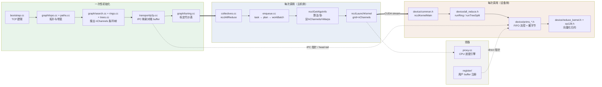

# mini-nccl 深度解析 · feature_docs

> **目标读者**：准备 GPU 通信 / 分布式训练基础设施 / HPC 岗位面试的人。
> **方法**：不做 API 教程，直接沿着**一次真实的 `ncclAllReduce`** 把 NCCL 的每个
> 设计决策拆开 —— 它为什么存在、代码在哪、做了什么、带来了什么收益。
>
> 本仓库是从 **NVIDIA NCCL 2.30.7** 抽取的**单机多卡最小通信库**，只保留 AllReduce
> 全链路。正因为只有一个算子，所以能把这条链路从 API 一路啃到 PTX 内联汇编。
> 实测：2×H20 NVLink，128MB 档 bus bandwidth ≈ **281 GB/s**。

---

## 怎么用这份文档

**所有代码引用都是可点击的相对链接**，形如 `[enqueue.cc:L1784](../src/enqueue.cc#L1784)`，
在 VSCode / Cursor 里点击会直接跳到源文件对应行。建议**左边开文档、右边开源码**对着看。

### 三条阅读路线

| 你的处境 | 建议路线 |
|---|---|
| **只有 2 小时，明天面试** | [00 总览](./00-overview-allreduce-lifecycle.md) → [99 面试速查](./99-interview-qa.md) → [13 打满带宽](./13-bandwidth-saturation.md) |
| **想真正搞懂 NCCL（推荐）** | 按编号 00 → 14 顺序读，每章末尾都有"与其他章节的衔接" |
| **只关心某个点** | 用下面的**索引表**或**问题速查表**直接跳 |

---

## 文档索引

### 主线（按执行顺序）

| # | 文档 | 讲什么 | 关键词 |
|---|---|---|---|
| 00 | [一次 AllReduce 的完整生命周期](./00-overview-allreduce-lifecycle.md) | **脊椎**：API → 入队 → plan → launch → kernel → 原语，每跳带链接 | 全链路、职责边界、异步语义 |
| 01 | [建联与 comm 初始化](./01-bootstrap-and-comm-init.md) | uniqueId、TCP 建环、AllGather 交换 peerInfo、commInitRank 各阶段 | bootstrap、peerInfo、socket |
| 02 | [拓扑检测](./02-topology-detection.md) | sysfs/NVML → XML → 拓扑图、路径 BFS、带宽估算、P2P 可用性判定 | XML、PATH_NVL/PIX/SYS、亲和性 |
| 03 | [channel 与 ring/tree 构建](./03-channel-ring-tree.md) | channel 到底是什么、为什么要多个、环/双二叉树怎么搜出来 | nChannels、search、double binary tree |
| 04 | [算法/协议选择与 tuning 模型](./04-algo-protocol-tuning.md) | 代价表怎么算、阈值怎么来、Ring vs Tree、Simple vs LL vs LL128 | latency+size/bw 模型、NCCL_ALGO |
| 05 | [入队、plan 与 kernel 下发](./05-enqueue-plan-launch.md) | task→plan→workBatch、kernel 参数编码、CUDA Graph capture | ncclDevWorkColl、cuLaunchKernelEx |
| 06 | [传输层：P2P 与 SHM](./06-transport-p2p-shm.md) | 连接三段式握手、IPC 显存映射、head/tail 共享内存布局 | cudaIpc、ncclSendMem/RecvMem |
| 07 | [Proxy 进度引擎](./07-proxy-progress-engine.md) | CPU 后台线程为什么存在、状态机、与 device 的握手协议 | proxyOp、progress、fence |
| 08 | [设备侧 AllReduce kernel](./08-device-kernel-allreduce.md) | `runRing` 的 2(N-1) 步、Tree 的 up/down、warp 分工、代码生成 | RunWorkColl、generate.py |
| 09 | [Simple 协议原语](./09-primitives-simple.md) | 环形 FIFO 流控、`genericOp` 模板统一所有原语、slice 流水、direct 模式 | waitPeer/postPeer、barrier |
| 10 | [LL / LL128 协议](./10-primitives-ll-ll128.md) | 8B(data+flag) 与 128B 布局、免同步往返、有效带宽 50% vs 93.75% | flag、原子写粒度 |
| 11 | [归约与向量化访存](./11-reduce-and-vectorization.md) | FuncSum 模板、half2 打包归约、128-bit PTX load/store、unroll | op128.h、reduceCopyPacks |
| 12 | [内存管理与 buffer 注册](./12-memory-and-registration.md) | 通信 buffer 从哪来、用户 buffer 注册如何实现零拷贝 | NCCL_BUFFSIZE、user buffer reg |

### 专题（跨模块，面试最爱问）

| # | 文档 | 讲什么 |
|---|---|---|
| 13 | [如何把带宽打满](./13-bandwidth-saturation.md) | 把"打满带宽"拆成一组可枚举的杠杆，每条都有源码证据 + 定量收益 + 排查方向 |
| 14 | [小消息延迟优化](./14-latency-optimization.md) | 延迟组成拆解、LL/Tree/CUDA Graph/绕过 proxy，以及为什么还是有几微秒 |
| 15 | [源码地图](./15-source-code-map.md) | `src/` 每个目录与重点文件在做什么、谁依赖谁、哪些可以跳过 |
| 99 | [面试速查与高频问答](./99-interview-qa.md) | 可直接复述的答案模板、必背数字、公式推导 |

---

## 问题速查表

直接用问题找章节：

| 你想回答的问题 | 去哪 |
|---|---|
| `ncclAllReduce` 返回时数据搬完了吗？ | [00 §5](./00-overview-allreduce-lifecycle.md#5-主机侧--设备侧的职责边界最容易被追问的地方) |
| channel 到底是什么？为什么要多个？ | [03](./03-channel-ring-tree.md)、[13](./13-bandwidth-saturation.md) |
| Ring AllReduce 为什么是最优的？通信量怎么算？ | [04](./04-algo-protocol-tuning.md)、[08](./08-device-kernel-allreduce.md) |
| `busbw = algbw × 2(N-1)/N` 是怎么来的？ | [13](./13-bandwidth-saturation.md)、[99](./99-interview-qa.md) |
| 什么时候走 Ring、什么时候走 Tree？谁决定的？ | [04](./04-algo-protocol-tuning.md) |
| LL / LL128 / Simple 有什么区别？为什么 LL 只有一半带宽？ | [10](./10-primitives-ll-ll128.md) |
| 两张卡之间的字节到底怎么过去的？走 memcpy 吗？ | [06](./06-transport-p2p-shm.md)、[09](./09-primitives-simple.md) |
| Proxy 线程是干什么的？单机 NVLink 需要它吗？ | [07](./07-proxy-progress-engine.md) |
| kernel 里怎么保证不读到对端还没写完的数据？ | [09](./09-primitives-simple.md)、[07](./07-proxy-progress-engine.md) |
| 为什么必须 16 字节对齐？不对齐会怎样？ | [11](./11-reduce-and-vectorization.md)、[13](./13-bandwidth-saturation.md) |
| 用户 buffer 注册（zero-copy）省了什么？ | [12](./12-memory-and-registration.md) |
| 带宽没打满，怎么排查？ | [13](./13-bandwidth-saturation.md) |
| 小消息延迟怎么降？CUDA Graph 有用吗？ | [14](./14-latency-optimization.md) |
| 多个 collective 能合并成一次 launch 吗？ | [05](./05-enqueue-plan-launch.md) |

---

## 全景图



---

## 一分钟建立正确的心智模型

如果只能记住 6 句话：

1. **NCCL 把贵的事全部前置到 init**：拓扑探测、通道搜索、连接建立、性能模型标定。
   运行期的 `ncclAllReduce` 只是"查表 + 填参数 + launch kernel"。
2. **channel = 一条独立的通信流水线，一对一映射到一个 CUDA block**
   （`gridDim.x == nChannels`，[enqueue.cc:L1789](../src/enqueue.cc#L1789)）。
   多 channel 是打满聚合带宽的主要手段。
3. **算法决定通信量，协议决定同步开销**。Ring 把每 rank 通信量压到
   `2(N-1)/N × S`；Simple/LL/LL128 决定这些字节里有多少是 flag 开销。
4. **单机 NVLink 上没有"发送"这个动作**：GPU 的 SM 直接对对端显存做
   128-bit load/store，同步靠共享的 `head/tail` 单调计数器，CPU 完全不参与数据面。
5. **一切并行度都是数据量的函数**：数据喂不饱就减 channel、再减线程
   （[enqueue.cc:L2153-L2168](../src/enqueue.cc#L2153)），因为同步开销会盖过传输收益。
6. **大量性能来自编译期**：`(func, algo, proto, redop, dtype)` 的每个组合都生成独立
   kernel（[generate.py](../src/device/generate.py)），运行期零分支；原语用模板 bool
   参数在编译期裁掉不需要的收发路径。

---

## 环境与验证

```bash
cd /home/leo/mini-nccl
bash setup_mini_nccl.sh          # 一键：环境 + 编译 + 跑通

# 或手动（H20 = sm_90）
make -j$(nproc) lib CUDA_HOME=/usr/local/cuda \
     NVCC_GENCODE="-gencode=arch=compute_90,code=sm_90"
make test                        # 期望：Out of bounds values : 0 OK，128MB 档 busbw ≈ 281 GB/s
```

观察内部决策：

```bash
NCCL_DEBUG=INFO NCCL_DEBUG_SUBSYS=INIT,GRAPH,COLL,TUNING \
  LD_LIBRARY_PATH=build/lib ./tests/build/all_reduce_perf -b 64M -e 64M -g 2
```

各章末尾都有对应的**可执行对照实验**（改 `NCCL_ALGO` / `NCCL_PROTO` /
`NCCL_MIN_NCHANNELS` 等，看 busbw 怎么变）。**把这些实验跑一遍，比读十遍文档有用。**

---

## 文档约定

- 代码引用格式：`[文件名:L起-L止](../相对路径#L起)`，行号均对源码核对过。
- 每个 feature 统一 6 段结构：**① 解决什么问题 → ② 一句话本质 → ③ 代码链路 →
  ④ 关键代码逐行解读 → ⑤ 收益 → ⑥ 面试考点**。
- 本仓库为裁剪版，`net` / `collNet` / `NVLS` / `symmetric` 等路径被禁用或仅留桩，
  文中凡涉及都会明确标注，避免把"读到的代码"误当成"跑到的代码"。
